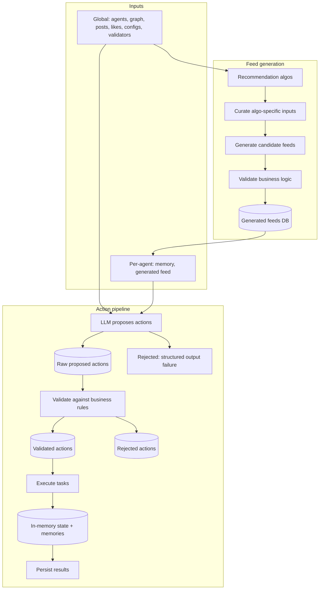
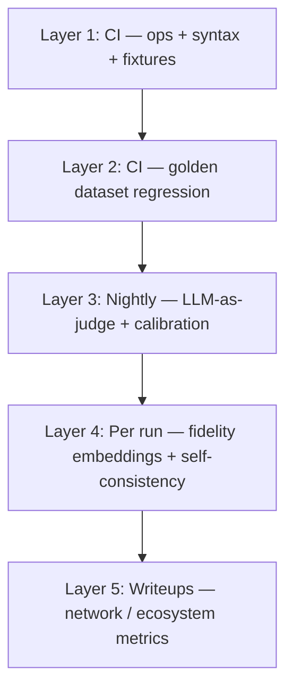
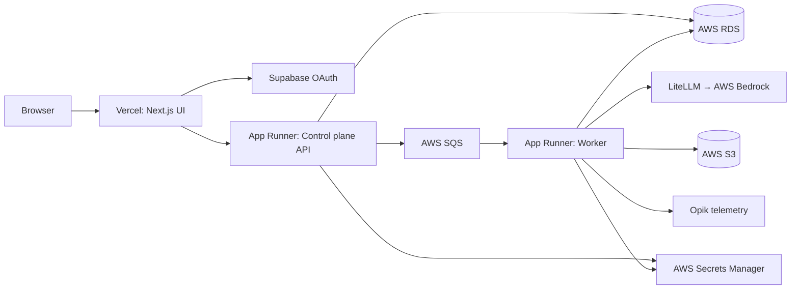

# AI Agent Simulation Engine — Architecture

Composable platform for running config-driven social-network experiments with hundreds of LLM agents. A **run** loops **turns**; each turn is self-contained below. **Cloud deployment** covers how runs are queued, executed, and observed in production.

Related: [story bank](./ai_agent_simulation_engine.md) · Source diagram: [Simulation Engine.tldr](./Simulation%20Engine.tldr)

---

## Turn-level design

### Overview

One **turn** simulates a single timestep of the mock social network: every agent gets a personalized feed, proposes actions via the LLM, passes validation, executes accepted actions, updates memories, and persists append-only state to the database.

### Turn inputs

**Global inputs** (shared across agents in the turn):

- List of agents and their profiles
- Cumulative follow graph (init data plus prior turns)
- Cumulative posts and comments
- Likes (which posts are liked, by whom)
- Run/turn identifiers
- Validators and experiment configs (LLM, feed algo, hyperparameters)

**Per-agent inputs:**

- Agent memory (preferences, episodic, personalized, social relationship)
- Generated feed for that agent

**Inputs to a turn** (detailed):

| Category | Contents |
|----------|----------|
| Network state | Agents (+ profiles), who follows whom, posts/comments, likes |
| Memory | Agent-level preferences; episodic (recent actions); personalized (interests, style, mood); social relationships (opinions of other agents) |
| Validators | Platform rules passed via config (e.g. YAML). Library of validators: no self-likes, no duplicate follows, etc. |
| Experiment config | Seed, run ID, turn ID; LLM config (model, temperature, prompts, versioning); feed algorithm choice; action noise probabilities |

**Action noise:** Even when the LLM proposes an action, execution can be gated by configurable probabilities (e.g. `p_follow`) so agents do not always act on every proposal—mirroring real engagement sparsity.

### Feed generation

**Supported ranking algorithms:**

- Reverse chronological
- Most-liked
- Basic engagement (weighted sum of likes, comments, recency, in-network signal)
- Two-tower model (out of scope for runtime; train offline, score via embedding cosine similarity at serving time)

**Feed pipeline:**

1. **Curate** algorithm-specific inputs (e.g. engagement metrics for most-liked)
2. **Generate** candidate feeds
3. **Validate** with business logic (deduplication, remove previously seen posts, etc.)
4. **Return** generated, validated feeds and persist to DB

### Action pipeline

| Stage | Responsibility |
|-------|----------------|
| **Task creation** | LLM proposes actions (like, write post, follow, comment) using Pydantic structured outputs |
| **Schema validation** | Failures → rejected actions (`rejection_stage` = LLM schema) |
| **Task validation** | Business rules → validated or rejected (`rejection_stage` = business rules) |
| **Execute tasks** | Apply validated actions; update temporary in-memory experiment state |
| **Persist results** | Merge temp outputs into persistent experiment state; append-only DB updates |

**In-memory storage** during execute: updated likes, posts, follows, and memories before persistence.

### Memory updates

| Memory type | Update path |
|-------------|-------------|
| Episodic | `update_episodic_memory` → `EpisodicMemoryDiff` |
| Personalized | `update_personalized_memory` → `PersonalizedMemoryDiff` |
| Social relationship | `update_social_relationship_memory` → `SocialRelationshipMemoryDiff` |

Network **inputs** (posts, likes, follows, etc.) are updated via **append-only** writes to the main DB.

### Data model reference

#### Core entities (inputs)

**Agent / user**

- `user_id`, `created_at`, `profile`

**Action entities**

| Entity | Key fields |
|--------|------------|
| Post | `post_id`, `author_id`, `text`, `created_at`, `metadata` (includes `created_at_turn`, `run_id`) |
| Like | `like_id`, `post_id`, `author_id`, `created_at`, `metadata` |
| Comment | `comment_id`, `parent_post_id`, `text`, `created_at`, `metadata` |
| Follow | `follower_id`, `followee_id`, `created_at`, `metadata` |

**Memory**

- `AgentMemory`: `user_id`, `preferences`, `episodic`, `personalized`, `social`
- `AgentPreferences`: seed profile content defined at agent creation
- Each memory slice: `user_id`, `content`

**Validator**

- `ValidatorFunction`: `validator_id` (PK), `fn` (callable), `reason` (human-readable)

#### LLM structured outputs (Pydantic)

| Model | Fields |
|-------|--------|
| `LlmLikePostModel` | `post_ids: list[str]` |
| `LlmWritePostModel` | `content: str` |
| `LlmFollowUsersModel` | `user_ids: list[str]` |
| `LlmCommentModel` | `parent_post_id: str`, `content: str` |

#### Generations and proposed actions

**Generation** (one row per LLM call)

- `generation_id` (PK)
- `metadata` (turn ID, run ID, user ID, job ID)
- `action_type` (like / write / follow / comment)
- `parsed_response_json`
- `created_at`

**LlmProposedAction** (raw LLM output)

- `llm_proposed_action_id` (PK), `generation_id` (FK)
- `metadata`, `action_type`, `target_type`, `target_id`, `target_content`

**ProposedAction** (append-only; distinguished by `record_kind`)

- `action_id` (PK), `record_kind` (validated / rejected)
- `metadata`, `action_type`, `target_type`, `target_id`, `target_content`
- `generation_id` (FK)
- `filter_id`, `filter_reason`, `rejection_stage` (schema vs. business rules)

#### Generated feeds

- `feed_id` (PK)
- `metadata` (turn ID, run ID, user ID, job ID)
- `feed_post_ids: list[str]`
- `feed_posts: list[FeedPostView]` (hydrated)
- `created_at`

#### Diffs (persist step)

**Action diffs:** `PostDiff`, `LikeDiff`, `CommentDiff`, `FollowDiff` — same core fields as entities plus `created_at_turn` in metadata.

**Memory diffs:** `EpisodicMemoryDiff`, `PersonalizedMemoryDiff`, `SocialRelationshipMemoryDiff` — `user_id`, `content`.

### Throughput, cost, and latency

| Benchmark | Value |
|-----------|-------|
| Agents per run | 500 |
| Starting posts / connections per agent | 10 / 10 |
| Turns per benchmark run | 20 |
| Wall clock (benchmark) | ~30 minutes |
| LLM calls per turn (order of magnitude) | ~1,500 (~3 prompts × 500 agents) |
| Target throughput | 50–100 requests/min (safe); up to 200/min possible |
| OpenAI concurrency cap | ~40 concurrent requests |

**Cost (experimental):**

- Latest small run: 10 users × 3 turns ≈ **$0.07**
- Extrapolated 500-agent × 20-turn run ≈ **$25** (conservative; excludes extra memory prompts)
- With doubled prompts for memory updates ≈ **$40–50**

### Open questions

- Functional and nonfunctional requirements (explicit list TBD in diagram TODO)
- Two-tower feed ranking: training pipeline and serving contract
- Details of basic engagement algorithm weights

---

## Evals

### Overview

Evals are organized as a **pyramid**: deterministic CI gates at the base, richer semantic and research metrics higher up. This separates **functional** metrics (is the platform working?) from **research** metrics (does the simulation support the hypothesis?).

**How to describe it:** CI gates are as deterministic as possible and can hard-stop merges. Nightly jobs add semantic checks, LLM-as-judge samples, and calibration—judgment calls, not automatic deploy blocks. After each lab run, measure fidelity against real behavior. For papers and reports, run heavier network-level metrics that are not needed during day-to-day development.

### Metric categories

#### LLM evals

| Metric | Question |
|--------|----------|
| Structured output reliability | How often does each prompt fail to produce valid structured output? |
| Cost / latency | Token use, cost, and latency per action and per turn |

#### Action-level evals

| Metric | Question |
|--------|----------|
| Invalid action proposal rate | How often does the model propose actions validators discard? |
| Constraint violations | Hard invariants: e.g. Democrat persona posting MAGA content, following someone they dislike |
| Negative actions | When users do nothing, does the model respect silence vs. hallucinate actions? |

Constraint checks can use hardcoded rules (same as runtime validators), keyword filters, NER, or **LLM-as-a-judge** (most flexible).

#### Simulation fidelity evals

| Dimension | Question |
|-----------|----------|
| Likes | Given profile, memory, and feed, are likes plausible vs. metric-chasing? (e.g. relevant post with 1 like vs. irrelevant post with 10k likes) |
| Follows | Is the proposed follow plausible for this user? |
| Posts / comments | Grounded in feed and memory, or generic / off-topic? |

**Measurement approaches:**

- **Embedding similarity:** e.g. compare embedding of liked post to user's history vs. population baseline
- **LLM-as-a-judge:** sample posts from user vs. population; ask which set the action resembles (cheaper, easier at scale; lower performance than embeddings)
- **User self-consistency over time:** drift in content, feeds, memory per turn beyond a threshold
- **Content diversity:** post diversity; lexical reading level; LLM-generated vs. real post comparisons

Calibration is hard (e.g. what does cosine similarity 0.8 mean practically); good for directional fidelity. At scale (1k users × 10 turns), sample rather than score everything.

#### Golden dataset (regression)

Labeled cases: `{user, feed, memory}` → `expected_like_ids`, `expected_follow_ids`, `expected_write_topic`

| Metric | Use |
|--------|-----|
| Precision / recall / F1 | Likes, follows, topics |
| Parity with prod | Same input as production—did behavior change? |

Narrow **single-turn** evals for now; multi-turn golden sets are a future consideration. Risk of overfitting if the set is stale; real user data (e.g. Bluesky) can refresh labels.

#### Ablations

- **Memory:** Does injecting episodic / profile / relationship memory materially improve agent decisions?

### When each layer runs

| When | Layer | What runs |
|------|-------|-----------|
| **Every PR (CI)** | 1 | Hard ops + syntax on fixtures; structured output reliability; invalid proposal rate; cost/latency budgets |
| **Every PR (CI)** | 2 | Golden dataset: P/R/F1 on likes/follows; negative-action accuracy; parity vs. prod; constraint violations; keyword/topic checks. Can hard-stop (e.g. F1 &lt; 0.7) |
| **Nightly (cron)** | 3 | LLM-as-judge fidelity samples; judge–human calibration (warn if proxy quality drops) |
| **Each completed lab run** | 4 | Embedding-based fidelity (costlier); user self-consistency over time |
| **Experiment writeups** | 5 | Network metrics: clustering, information propagation, edge changes, etc. |

### Relationship to runtime validators

Runtime **task validation** and eval **action-level** metrics share the same rules: invalid proposals are rejected in the turn pipeline and counted in evals. CI Layer 2 golden sets catch regressions before deploy; Layer 4+ measures whether accepted actions still look human-plausible.

---

## Cloud deployment architecture

### System context

**Summary:** Next.js on Vercel with Supabase OAuth; FastAPI control plane on App Runner enqueues runs to SQS; worker on App Runner executes turns with ~40-way LLM concurrency through LiteLLM to Bedrock, writes scratch results to S3, persists to RDS with job-level idempotency, exports cost/latency to Opik.

### Three core layers

| Layer | Components | Role |
|-------|------------|------|
| **Control plane** | FastAPI + RDS | Ground truth for runs, turns, actions, datasets; API surface |
| **Dispatch** | SQS | Queue between API and worker |
| **Execution plane** | Worker | Runs turn logic, writes records, acks SQS |

### Services

**Service 1: Control plane API** (AWS App Runner)

- `POST /runs` — create run, enqueue work
- `GET /runs/{id}` — status and metadata
- Dataset upload URLs

**Service 2: Worker node** (AWS App Runner)

- Polls SQS in a `while True` loop
- Runs run/turn logic
- LLM calls via AWS Bedrock (primary) and LiteLLM (secondary)
- ~40-way LLM concurrency
- Opik for LLM telemetry

**Client**

- Browser → Vercel UI → polls RDS for run/turn progress (no direct SQS or worker access)

### Storage and secrets

| System | Contents |
|--------|----------|
| **AWS RDS** | Runs, turns, datasets, users, posts/likes/follows/comments, metrics |
| **AWS S3** | Datasets, temp scratch, exports (e.g. `exports/run_id=.../summary.json`) |
| **AWS Secrets Manager** | All credentials |
| **SQS** | Job messages; control plane enqueues, worker dequeues |

### End-to-end run lifecycle

1. User clicks **Start run**
2. `POST /runs` → API creates RDS record (`status=queued`) → message to SQS → **202** to UI
3. Worker (idle polling) receives SQS message
4. Worker → RDS: `status=running`, `started_at=now()`
5. Worker loads dataset from S3 (`s3://sim-lab/datasets/ds_abc123/...`)
6. Worker initializes state (users, likes, posts, etc.) and starts the run
7. **Each turn:** worker executes turn-level pipeline, updates RDS (+ S3 scratch), updates turn-level status
8. Run complete:
   - RDS: `status=completed`, `finished_at=now()`
   - S3: optional `exports/run_id=.../summary.json`
   - SQS: `DeleteMessage` (ack success)

### UI updates

UI **polls RDS** for latest run/turn status. Worker writes per-turn progress to RDS; UI never talks to SQS or the worker directly.

### Idempotency and SQS reliability

SQS is **at-least-once**. Guards:

- RDS run status machine: `queued` → `running` → `completed`
- Unique `run_id` per run
- Worker checks heartbeat / latest status in RDS before duplicate work

**Visibility timeout options:**

| Approach | Tradeoff |
|----------|----------|
| Fixed timeout (e.g. 45 min) | Simple; must guess duration for long runs |
| Heartbeat via `ChangeMessageVisibility` | Modest initial timeout (e.g. 5 min); worker extends every 2–3 min until done; jobs reclaim if worker dies |
| RDS heartbeat timestamp | Complements SQS visibility for observability |

---

## Diagram source

This document was derived from the tldraw pages **Turn-level design**, **Evals**, and **Cloud deployment architecture** in `Simulation Engine.tldr`. Run-level design is intentionally omitted (covered implicitly by turn loop × N and cloud run lifecycle).
