# Database schema (Alembic migrations @ head)

## Mermaid Diagram

```mermaid
erDiagram
  agent {
    TEXT agent_id PK
    TEXT handle
    TEXT persona_source
    TEXT display_name
    TEXT created_at
    TEXT updated_at
  }
  agent_bios {
    TEXT handle PK
    TEXT generated_bio
    TEXT created_at
  }
  agent_follow_edges {
    TEXT agent_follow_edge_id PK
    TEXT follower_agent_id FK
    TEXT target_agent_id FK
    TEXT created_at
  }
  agent_persona_bios {
    TEXT id PK
    TEXT agent_id FK
    TEXT persona_bio
    TEXT persona_bio_source
    TEXT created_at
    TEXT updated_at
  }
  agent_post_comments {
    TEXT agent_post_comment_id PK
    TEXT agent_post_id FK
    TEXT author_agent_id FK
    TEXT body_text
    TEXT published_at
    TEXT created_at
    TEXT updated_at
  }
  agent_post_likes {
    TEXT agent_post_like_id PK
    TEXT agent_post_id FK
    TEXT liker_agent_id FK
    TEXT created_at
  }
  agent_posts {
    TEXT agent_post_id PK
    TEXT agent_id FK
    TEXT body_text
    TEXT published_at
    TEXT created_at
    TEXT updated_at
    TEXT source_post_id
    TEXT source
    TEXT source_uri
    TEXT imported_author_handle
    TEXT imported_author_display_name
    TEXT import_metadata_json
  }
  app_users {
    TEXT id PK
    TEXT auth_provider_id
    TEXT email
    TEXT display_name
    TEXT created_at
    TEXT last_seen_at
  }
  bluesky_profiles {
    TEXT handle PK
    TEXT did
    TEXT display_name
    TEXT bio
    INTEGER followers_count
    INTEGER follows_count
    INTEGER posts_count
  }
  comments {
    TEXT comment_id PK
    TEXT run_id FK
    INTEGER turn_number
    TEXT agent_handle
    TEXT post_id
    TEXT text
    TEXT created_at
    TEXT explanation
    TEXT model_used
    TEXT generation_metadata_json
    TEXT generation_created_at
  }
  feed_posts {
    TEXT post_id PK
    TEXT source
    TEXT uri
    TEXT author_display_name
    TEXT author_handle
    TEXT text
    INTEGER bookmark_count
    INTEGER like_count
    INTEGER quote_count
    INTEGER reply_count
    INTEGER repost_count
    TEXT created_at
  }
  follows {
    TEXT follow_id PK
    TEXT run_id FK
    INTEGER turn_number
    TEXT agent_handle
    TEXT user_id
    TEXT created_at
    TEXT explanation
    TEXT model_used
    TEXT generation_metadata_json
    TEXT generation_created_at
  }
  generated_feeds {
    TEXT feed_id
    TEXT run_id PK, FK
    INTEGER turn_number PK
    TEXT agent_handle PK
    TEXT post_ids
    TEXT created_at
  }
  likes {
    TEXT like_id PK
    TEXT run_id FK
    INTEGER turn_number
    TEXT agent_handle
    TEXT post_id
    TEXT created_at
    TEXT explanation
    TEXT model_used
    TEXT generation_metadata_json
    TEXT generation_created_at
  }
  run_agents {
    TEXT run_id PK, FK
    TEXT agent_id PK, FK
    INTEGER selection_order
    TEXT handle_at_start
    TEXT display_name_at_start
    TEXT persona_bio_at_start
    INTEGER followers_count_at_start
    INTEGER follows_count_at_start
    INTEGER posts_count_at_start
    TEXT created_at
  }
  run_follow_edges {
    TEXT run_id PK, FK
    TEXT follower_agent_id PK, FK
    TEXT target_agent_id PK, FK
    TEXT created_at
  }
  run_metrics {
    TEXT run_id PK, FK
    TEXT metrics
    TEXT created_at
  }
  run_post_comments {
    TEXT run_post_comment_id PK
    TEXT run_id FK
    TEXT run_post_id FK
    TEXT author_agent_id FK
    TEXT author_handle_at_start
    TEXT author_display_name_at_start
    TEXT body_text_at_start
    TEXT published_at_start
    TEXT created_at
  }
  run_post_likes {
    TEXT run_post_like_id PK
    TEXT run_id FK
    TEXT run_post_id FK
    TEXT liker_agent_id FK
    TEXT liker_handle_at_start
    TEXT liker_display_name_at_start
    TEXT created_at
  }
  run_posts {
    TEXT run_post_id PK
    TEXT run_id FK
    TEXT agent_post_id
    TEXT author_agent_id FK
    TEXT author_handle_at_start
    TEXT author_display_name_at_start
    TEXT body_text_at_start
    TEXT published_at_start
    TEXT source_post_id_at_start
    TEXT source_at_start
    TEXT source_uri_at_start
    TEXT created_at
  }
  runs {
    TEXT run_id PK
    TEXT created_at
    INTEGER total_turns
    INTEGER total_agents
    TEXT started_at
    TEXT status
    TEXT completed_at
    TEXT feed_algorithm
    TEXT metric_keys
    TEXT app_user_id
  }
  turn_metadata {
    TEXT run_id PK, FK
    INTEGER turn_number PK
    TEXT total_actions
    TEXT created_at
  }
  turn_metrics {
    TEXT run_id PK, FK
    INTEGER turn_number PK
    TEXT metrics
    TEXT created_at
  }
  user_agent_profile_metadata {
    TEXT id PK
    TEXT agent_id FK
    INTEGER followers_count
    INTEGER follows_count
    INTEGER posts_count
    TEXT created_at
    TEXT updated_at
  }
  agent ||--o{ agent_follow_edges : "fk_agent_follow_edges_follower_agent_id (follower_agent_id)"
  agent ||--o{ agent_follow_edges : "fk_agent_follow_edges_target_agent_id (target_agent_id)"
  agent ||--o{ agent_persona_bios : "fk_agent_persona_bios_agent_id (agent_id)"
  agent ||--o{ agent_post_comments : "fk_agent_post_comments_author_agent_id (author_agent_id)"
  agent ||--o{ agent_post_likes : "fk_agent_post_likes_liker_agent_id (liker_agent_id)"
  agent ||--o{ agent_posts : "fk_agent_posts_agent_id (agent_id)"
  agent ||--o{ run_agents : "fk_run_agents_agent_id (agent_id)"
  agent ||--o{ user_agent_profile_metadata : "fk_user_agent_profile_metadata_agent_id (agent_id)"
  agent_posts ||--o{ agent_post_comments : "fk_agent_post_comments_agent_post_id (agent_post_id)"
  agent_posts ||--o{ agent_post_likes : "fk_agent_post_likes_agent_post_id (agent_post_id)"
  run_agents ||--o{ run_follow_edges : "fk_run_follow_edges_follower_run_agent (run_id, follower_agent_id)"
  run_agents ||--o{ run_follow_edges : "fk_run_follow_edges_target_run_agent (run_id, target_agent_id)"
  run_agents ||--o{ run_post_comments : "fk_run_post_comments_run_author (run_id, author_agent_id)"
  run_agents ||--o{ run_post_likes : "fk_run_post_likes_run_liker (run_id, liker_agent_id)"
  run_agents ||--o{ run_posts : "fk_run_posts_run_author (run_id, author_agent_id)"
  run_posts ||--o{ run_post_comments : "fk_run_post_comments_run_post (run_id, run_post_id)"
  run_posts ||--o{ run_post_comments : "fk_run_post_comments_run_post_id (run_post_id)"
  run_posts ||--o{ run_post_likes : "fk_run_post_likes_run_post_id (run_post_id)"
  runs ||--o{ comments : "fk_comments_run_id (run_id)"
  runs ||--o{ follows : "fk_follows_run_id (run_id)"
  runs ||--o{ generated_feeds : "fk_generated_feeds_run_id (run_id)"
  runs ||--o{ likes : "fk_likes_run_id (run_id)"
  runs ||--o{ run_agents : "fk_run_agents_run_id (run_id)"
  runs ||--o{ run_follow_edges : "fk_run_follow_edges_run_id (run_id)"
  runs ||--o{ run_metrics : "fk_run_metrics_run_id (run_id)"
  runs ||--o{ run_post_comments : "fk_run_post_comments_run_id (run_id)"
  runs ||--o{ run_post_likes : "fk_run_post_likes_run_id (run_id)"
  runs ||--o{ run_posts : "fk_run_posts_run_id (run_id)"
  runs ||--o{ turn_metadata : "fk_turn_metadata_run_id (run_id)"
  runs ||--o{ turn_metrics : "fk_turn_metrics_run_id (run_id)"
```

This documentation is generated from a fresh SQLite database after applying Alembic migrations to `head`.

## `agent`

### Columns (`agent`)

| name | type | nullable | default | pk |
| --- | --- | --- | --- | --- |
| `agent_id` | `TEXT` | no | `` | `1` |
| `handle` | `TEXT` | no | `` | `` |
| `persona_source` | `TEXT` | no | `` | `` |
| `display_name` | `TEXT` | no | `` | `` |
| `created_at` | `TEXT` | no | `` | `` |
| `updated_at` | `TEXT` | no | `` | `` |

### Primary key (`agent`)

- Name: `pk_agent`
- Columns: `agent_id`

### Unique constraints (`agent`)

- `uq_agent_handle`: `handle`

### Referenced by (`agent`)

- `agent_follow_edges` `fk_agent_follow_edges_follower_agent_id`: `follower_agent_id` → `agent_id`
- `agent_follow_edges` `fk_agent_follow_edges_target_agent_id`: `target_agent_id` → `agent_id`
- `agent_persona_bios` `fk_agent_persona_bios_agent_id`: `agent_id` → `agent_id`
- `agent_post_comments` `fk_agent_post_comments_author_agent_id`: `author_agent_id` → `agent_id`
- `agent_post_likes` `fk_agent_post_likes_liker_agent_id`: `liker_agent_id` → `agent_id`
- `agent_posts` `fk_agent_posts_agent_id`: `agent_id` → `agent_id`
- `run_agents` `fk_run_agents_agent_id`: `agent_id` → `agent_id`
- `user_agent_profile_metadata` `fk_user_agent_profile_metadata_agent_id`: `agent_id` → `agent_id`

## `agent_bios`

### Columns (`agent_bios`)

| name | type | nullable | default | pk |
| --- | --- | --- | --- | --- |
| `handle` | `TEXT` | no | `` | `1` |
| `generated_bio` | `TEXT` | no | `` | `` |
| `created_at` | `TEXT` | no | `` | `` |

### Primary key (`agent_bios`)

- Name: (none)
- Columns: `handle`

## `agent_follow_edges`

### Columns (`agent_follow_edges`)

| name | type | nullable | default | pk |
| --- | --- | --- | --- | --- |
| `agent_follow_edge_id` | `TEXT` | no | `` | `1` |
| `follower_agent_id` | `TEXT` | no | `` | `` |
| `target_agent_id` | `TEXT` | no | `` | `` |
| `created_at` | `TEXT` | no | `` | `` |

### Primary key (`agent_follow_edges`)

- Name: `pk_agent_follow_edges`
- Columns: `agent_follow_edge_id`

### Foreign keys (`agent_follow_edges`)

- `fk_agent_follow_edges_follower_agent_id`: `follower_agent_id` → `agent(agent_id)`
- `fk_agent_follow_edges_target_agent_id`: `target_agent_id` → `agent(agent_id)`

### Unique constraints (`agent_follow_edges`)

- `uq_agent_follow_edges_follower_target`: `follower_agent_id`, `target_agent_id`

### Indexes (`agent_follow_edges`)

- `idx_agent_follow_edges_follower_agent_id`: `follower_agent_id`
- `idx_agent_follow_edges_target_agent_id`: `target_agent_id`

### Check constraints (`agent_follow_edges`)

- `ck_agent_follow_edges_no_self_follow`: `follower_agent_id != target_agent_id`

## `agent_persona_bios`

### Columns (`agent_persona_bios`)

| name | type | nullable | default | pk |
| --- | --- | --- | --- | --- |
| `id` | `TEXT` | no | `` | `1` |
| `agent_id` | `TEXT` | no | `` | `` |
| `persona_bio` | `TEXT` | no | `` | `` |
| `persona_bio_source` | `TEXT` | no | `` | `` |
| `created_at` | `TEXT` | no | `` | `` |
| `updated_at` | `TEXT` | no | `` | `` |

### Primary key (`agent_persona_bios`)

- Name: `pk_agent_persona_bios`
- Columns: `id`

### Foreign keys (`agent_persona_bios`)

- `fk_agent_persona_bios_agent_id`: `agent_id` → `agent(agent_id)`

### Indexes (`agent_persona_bios`)

- `idx_agent_persona_bios_agent_id_created_at`: `agent_id`, `created_at`

## `agent_post_comments`

### Columns (`agent_post_comments`)

| name | type | nullable | default | pk |
| --- | --- | --- | --- | --- |
| `agent_post_comment_id` | `TEXT` | no | `` | `1` |
| `agent_post_id` | `TEXT` | no | `` | `` |
| `author_agent_id` | `TEXT` | no | `` | `` |
| `body_text` | `TEXT` | no | `` | `` |
| `published_at` | `TEXT` | no | `` | `` |
| `created_at` | `TEXT` | no | `` | `` |
| `updated_at` | `TEXT` | no | `` | `` |

### Primary key (`agent_post_comments`)

- Name: `pk_agent_post_comments`
- Columns: `agent_post_comment_id`

### Foreign keys (`agent_post_comments`)

- `fk_agent_post_comments_author_agent_id`: `author_agent_id` → `agent(agent_id)`
- `fk_agent_post_comments_agent_post_id`: `agent_post_id` → `agent_posts(agent_post_id)`

### Indexes (`agent_post_comments`)

- `idx_agent_post_comments_author_published`: `author_agent_id`, `published_at`
- `idx_agent_post_comments_post_published`: `agent_post_id`, `published_at`

## `agent_post_likes`

### Columns (`agent_post_likes`)

| name | type | nullable | default | pk |
| --- | --- | --- | --- | --- |
| `agent_post_like_id` | `TEXT` | no | `` | `1` |
| `agent_post_id` | `TEXT` | no | `` | `` |
| `liker_agent_id` | `TEXT` | no | `` | `` |
| `created_at` | `TEXT` | no | `` | `` |

### Primary key (`agent_post_likes`)

- Name: `pk_agent_post_likes`
- Columns: `agent_post_like_id`

### Foreign keys (`agent_post_likes`)

- `fk_agent_post_likes_liker_agent_id`: `liker_agent_id` → `agent(agent_id)`
- `fk_agent_post_likes_agent_post_id`: `agent_post_id` → `agent_posts(agent_post_id)`

### Unique constraints (`agent_post_likes`)

- `uq_agent_post_likes_liker_agent_post`: `liker_agent_id`, `agent_post_id`

### Indexes (`agent_post_likes`)

- `idx_agent_post_likes_post_id`: `agent_post_id`

## `agent_posts`

### Columns (`agent_posts`)

| name | type | nullable | default | pk |
| --- | --- | --- | --- | --- |
| `agent_post_id` | `TEXT` | no | `` | `1` |
| `agent_id` | `TEXT` | no | `` | `` |
| `body_text` | `TEXT` | no | `` | `` |
| `published_at` | `TEXT` | no | `` | `` |
| `created_at` | `TEXT` | no | `` | `` |
| `updated_at` | `TEXT` | no | `` | `` |
| `source_post_id` | `TEXT` | yes | `` | `` |
| `source` | `TEXT` | yes | `` | `` |
| `source_uri` | `TEXT` | yes | `` | `` |
| `imported_author_handle` | `TEXT` | yes | `` | `` |
| `imported_author_display_name` | `TEXT` | yes | `` | `` |
| `import_metadata_json` | `TEXT` | yes | `` | `` |

### Primary key (`agent_posts`)

- Name: `pk_agent_posts`
- Columns: `agent_post_id`

### Foreign keys (`agent_posts`)

- `fk_agent_posts_agent_id`: `agent_id` → `agent(agent_id)`

### Unique constraints (`agent_posts`)

- `uq_agent_posts_source_source_post_id`: `source`, `source_post_id`

### Indexes (`agent_posts`)

- `idx_agent_posts_agent_id_published_at`: `agent_id`, `published_at`

### Check constraints (`agent_posts`)

- `ck_agent_posts_source_pair`: `(source IS NULL AND source_post_id IS NULL) OR (source IS NOT NULL AND source_post_id IS NOT NULL)`

### Referenced by (`agent_posts`)

- `agent_post_comments` `fk_agent_post_comments_agent_post_id`: `agent_post_id` → `agent_post_id`
- `agent_post_likes` `fk_agent_post_likes_agent_post_id`: `agent_post_id` → `agent_post_id`

## `app_users`

### Columns (`app_users`)

| name | type | nullable | default | pk |
| --- | --- | --- | --- | --- |
| `id` | `TEXT` | no | `` | `1` |
| `auth_provider_id` | `TEXT` | no | `` | `` |
| `email` | `TEXT` | no | `` | `` |
| `display_name` | `TEXT` | no | `` | `` |
| `created_at` | `TEXT` | no | `` | `` |
| `last_seen_at` | `TEXT` | no | `` | `` |

### Primary key (`app_users`)

- Name: (none)
- Columns: `id`

### Indexes (`app_users`)

- `idx_app_users_auth_provider_id`: unique `auth_provider_id`

## `bluesky_profiles`

### Columns (`bluesky_profiles`)

| name | type | nullable | default | pk |
| --- | --- | --- | --- | --- |
| `handle` | `TEXT` | no | `` | `1` |
| `did` | `TEXT` | no | `` | `` |
| `display_name` | `TEXT` | no | `` | `` |
| `bio` | `TEXT` | no | `` | `` |
| `followers_count` | `INTEGER` | no | `` | `` |
| `follows_count` | `INTEGER` | no | `` | `` |
| `posts_count` | `INTEGER` | no | `` | `` |

### Primary key (`bluesky_profiles`)

- Name: (none)
- Columns: `handle`

## `comments`

### Columns (`comments`)

| name | type | nullable | default | pk |
| --- | --- | --- | --- | --- |
| `comment_id` | `TEXT` | no | `` | `1` |
| `run_id` | `TEXT` | no | `` | `` |
| `turn_number` | `INTEGER` | no | `` | `` |
| `agent_handle` | `TEXT` | no | `` | `` |
| `post_id` | `TEXT` | no | `` | `` |
| `text` | `TEXT` | no | `` | `` |
| `created_at` | `TEXT` | no | `` | `` |
| `explanation` | `TEXT` | yes | `` | `` |
| `model_used` | `TEXT` | yes | `` | `` |
| `generation_metadata_json` | `TEXT` | yes | `` | `` |
| `generation_created_at` | `TEXT` | yes | `` | `` |

### Primary key (`comments`)

- Name: `pk_comments`
- Columns: `comment_id`

### Foreign keys (`comments`)

- `fk_comments_run_id`: `run_id` → `runs(run_id)`

### Unique constraints (`comments`)

- `uq_comments_run_turn_agent_post`: `run_id`, `turn_number`, `agent_handle`, `post_id`

### Indexes (`comments`)

- `idx_comments_run_turn_agent`: `run_id`, `turn_number`, `agent_handle`

### Check constraints (`comments`)

- `ck_comments_turn_number_gte_0`: `turn_number >= 0`

## `feed_posts`

### Columns (`feed_posts`)

| name | type | nullable | default | pk |
| --- | --- | --- | --- | --- |
| `post_id` | `TEXT` | no | `` | `1` |
| `source` | `TEXT` | no | `` | `` |
| `uri` | `TEXT` | no | `` | `` |
| `author_display_name` | `TEXT` | no | `` | `` |
| `author_handle` | `TEXT` | no | `` | `` |
| `text` | `TEXT` | no | `` | `` |
| `bookmark_count` | `INTEGER` | no | `` | `` |
| `like_count` | `INTEGER` | no | `` | `` |
| `quote_count` | `INTEGER` | no | `` | `` |
| `reply_count` | `INTEGER` | no | `` | `` |
| `repost_count` | `INTEGER` | no | `` | `` |
| `created_at` | `TEXT` | no | `` | `` |

### Primary key (`feed_posts`)

- Name: (none)
- Columns: `post_id`

### Indexes (`feed_posts`)

- `idx_feed_posts_author_handle`: `author_handle`

## `follows`

### Columns (`follows`)

| name | type | nullable | default | pk |
| --- | --- | --- | --- | --- |
| `follow_id` | `TEXT` | no | `` | `1` |
| `run_id` | `TEXT` | no | `` | `` |
| `turn_number` | `INTEGER` | no | `` | `` |
| `agent_handle` | `TEXT` | no | `` | `` |
| `user_id` | `TEXT` | no | `` | `` |
| `created_at` | `TEXT` | no | `` | `` |
| `explanation` | `TEXT` | yes | `` | `` |
| `model_used` | `TEXT` | yes | `` | `` |
| `generation_metadata_json` | `TEXT` | yes | `` | `` |
| `generation_created_at` | `TEXT` | yes | `` | `` |

### Primary key (`follows`)

- Name: `pk_follows`
- Columns: `follow_id`

### Foreign keys (`follows`)

- `fk_follows_run_id`: `run_id` → `runs(run_id)`

### Unique constraints (`follows`)

- `uq_follows_run_turn_agent_user`: `run_id`, `turn_number`, `agent_handle`, `user_id`

### Indexes (`follows`)

- `idx_follows_run_turn_agent`: `run_id`, `turn_number`, `agent_handle`

### Check constraints (`follows`)

- `ck_follows_turn_number_gte_0`: `turn_number >= 0`

## `generated_feeds`

### Columns (`generated_feeds`)

| name | type | nullable | default | pk |
| --- | --- | --- | --- | --- |
| `feed_id` | `TEXT` | no | `` | `` |
| `run_id` | `TEXT` | no | `` | `2` |
| `turn_number` | `INTEGER` | no | `` | `3` |
| `agent_handle` | `TEXT` | no | `` | `1` |
| `post_ids` | `TEXT` | no | `` | `` |
| `created_at` | `TEXT` | no | `` | `` |

### Primary key (`generated_feeds`)

- Name: `pk_generated_feeds`
- Columns: `agent_handle`, `run_id`, `turn_number`

### Foreign keys (`generated_feeds`)

- `fk_generated_feeds_run_id`: `run_id` → `runs(run_id)`

## `likes`

### Columns (`likes`)

| name | type | nullable | default | pk |
| --- | --- | --- | --- | --- |
| `like_id` | `TEXT` | no | `` | `1` |
| `run_id` | `TEXT` | no | `` | `` |
| `turn_number` | `INTEGER` | no | `` | `` |
| `agent_handle` | `TEXT` | no | `` | `` |
| `post_id` | `TEXT` | no | `` | `` |
| `created_at` | `TEXT` | no | `` | `` |
| `explanation` | `TEXT` | yes | `` | `` |
| `model_used` | `TEXT` | yes | `` | `` |
| `generation_metadata_json` | `TEXT` | yes | `` | `` |
| `generation_created_at` | `TEXT` | yes | `` | `` |

### Primary key (`likes`)

- Name: `pk_likes`
- Columns: `like_id`

### Foreign keys (`likes`)

- `fk_likes_run_id`: `run_id` → `runs(run_id)`

### Unique constraints (`likes`)

- `uq_likes_run_turn_agent_post`: `run_id`, `turn_number`, `agent_handle`, `post_id`

### Indexes (`likes`)

- `idx_likes_run_turn_agent`: `run_id`, `turn_number`, `agent_handle`

### Check constraints (`likes`)

- `ck_likes_turn_number_gte_0`: `turn_number >= 0`

## `run_agents`

### Columns (`run_agents`)

| name | type | nullable | default | pk |
| --- | --- | --- | --- | --- |
| `run_id` | `TEXT` | no | `` | `1` |
| `agent_id` | `TEXT` | no | `` | `2` |
| `selection_order` | `INTEGER` | no | `` | `` |
| `handle_at_start` | `TEXT` | no | `` | `` |
| `display_name_at_start` | `TEXT` | no | `` | `` |
| `persona_bio_at_start` | `TEXT` | no | `` | `` |
| `followers_count_at_start` | `INTEGER` | no | `` | `` |
| `follows_count_at_start` | `INTEGER` | no | `` | `` |
| `posts_count_at_start` | `INTEGER` | no | `` | `` |
| `created_at` | `TEXT` | no | `` | `` |

### Primary key (`run_agents`)

- Name: `pk_run_agents`
- Columns: `run_id`, `agent_id`

### Foreign keys (`run_agents`)

- `fk_run_agents_agent_id`: `agent_id` → `agent(agent_id)`
- `fk_run_agents_run_id`: `run_id` → `runs(run_id)`

### Unique constraints (`run_agents`)

- `uq_run_agents_run_selection_order`: `run_id`, `selection_order`

### Indexes (`run_agents`)

- `idx_run_agents_run_id`: `run_id`

### Referenced by (`run_agents`)

- `run_follow_edges` `fk_run_follow_edges_follower_run_agent`: `run_id`, `follower_agent_id` → `run_id`, `agent_id`
- `run_follow_edges` `fk_run_follow_edges_target_run_agent`: `run_id`, `target_agent_id` → `run_id`, `agent_id`
- `run_post_comments` `fk_run_post_comments_run_author`: `run_id`, `author_agent_id` → `run_id`, `agent_id`
- `run_post_likes` `fk_run_post_likes_run_liker`: `run_id`, `liker_agent_id` → `run_id`, `agent_id`
- `run_posts` `fk_run_posts_run_author`: `run_id`, `author_agent_id` → `run_id`, `agent_id`

## `run_follow_edges`

### Columns (`run_follow_edges`)

| name | type | nullable | default | pk |
| --- | --- | --- | --- | --- |
| `run_id` | `TEXT` | no | `` | `1` |
| `follower_agent_id` | `TEXT` | no | `` | `2` |
| `target_agent_id` | `TEXT` | no | `` | `3` |
| `created_at` | `TEXT` | no | `` | `` |

### Primary key (`run_follow_edges`)

- Name: `pk_run_follow_edges`
- Columns: `run_id`, `follower_agent_id`, `target_agent_id`

### Foreign keys (`run_follow_edges`)

- `fk_run_follow_edges_follower_run_agent`: `run_id`, `follower_agent_id` → `run_agents(run_id, agent_id)`
- `fk_run_follow_edges_target_run_agent`: `run_id`, `target_agent_id` → `run_agents(run_id, agent_id)`
- `fk_run_follow_edges_run_id`: `run_id` → `runs(run_id)`

### Indexes (`run_follow_edges`)

- `idx_run_follow_edges_run_follower`: `run_id`, `follower_agent_id`
- `idx_run_follow_edges_run_id`: `run_id`
- `idx_run_follow_edges_run_target`: `run_id`, `target_agent_id`

### Check constraints (`run_follow_edges`)

- `ck_run_follow_edges_no_self_follow`: `follower_agent_id != target_agent_id`

## `run_metrics`

### Columns (`run_metrics`)

| name | type | nullable | default | pk |
| --- | --- | --- | --- | --- |
| `run_id` | `TEXT` | no | `` | `1` |
| `metrics` | `TEXT` | no | `` | `` |
| `created_at` | `TEXT` | no | `` | `` |

### Primary key (`run_metrics`)

- Name: `pk_run_metrics`
- Columns: `run_id`

### Foreign keys (`run_metrics`)

- `fk_run_metrics_run_id`: `run_id` → `runs(run_id)`

## `run_post_comments`

### Columns (`run_post_comments`)

| name | type | nullable | default | pk |
| --- | --- | --- | --- | --- |
| `run_post_comment_id` | `TEXT` | no | `` | `1` |
| `run_id` | `TEXT` | no | `` | `` |
| `run_post_id` | `TEXT` | no | `` | `` |
| `author_agent_id` | `TEXT` | no | `` | `` |
| `author_handle_at_start` | `TEXT` | no | `` | `` |
| `author_display_name_at_start` | `TEXT` | no | `` | `` |
| `body_text_at_start` | `TEXT` | no | `` | `` |
| `published_at_start` | `TEXT` | no | `` | `` |
| `created_at` | `TEXT` | no | `` | `` |

### Primary key (`run_post_comments`)

- Name: `pk_run_post_comments`
- Columns: `run_post_comment_id`

### Foreign keys (`run_post_comments`)

- `fk_run_post_comments_run_author`: `run_id`, `author_agent_id` → `run_agents(run_id, agent_id)`
- `fk_run_post_comments_run_post`: `run_id`, `run_post_id` → `run_posts(run_id, run_post_id)`
- `fk_run_post_comments_run_post_id`: `run_post_id` → `run_posts(run_post_id)`
- `fk_run_post_comments_run_id`: `run_id` → `runs(run_id)`

### Indexes (`run_post_comments`)

- `idx_run_post_comments_run_author_published`: `run_id`, `author_agent_id`, `published_at_start`
- `idx_run_post_comments_run_post_published`: `run_id`, `run_post_id`, `published_at_start`

## `run_post_likes`

### Columns (`run_post_likes`)

| name | type | nullable | default | pk |
| --- | --- | --- | --- | --- |
| `run_post_like_id` | `TEXT` | no | `` | `1` |
| `run_id` | `TEXT` | no | `` | `` |
| `run_post_id` | `TEXT` | no | `` | `` |
| `liker_agent_id` | `TEXT` | no | `` | `` |
| `liker_handle_at_start` | `TEXT` | no | `` | `` |
| `liker_display_name_at_start` | `TEXT` | no | `` | `` |
| `created_at` | `TEXT` | no | `` | `` |

### Primary key (`run_post_likes`)

- Name: `pk_run_post_likes`
- Columns: `run_post_like_id`

### Foreign keys (`run_post_likes`)

- `fk_run_post_likes_run_liker`: `run_id`, `liker_agent_id` → `run_agents(run_id, agent_id)`
- `fk_run_post_likes_run_post_id`: `run_post_id` → `run_posts(run_post_id)`
- `fk_run_post_likes_run_id`: `run_id` → `runs(run_id)`

### Unique constraints (`run_post_likes`)

- `uq_run_post_likes_run_liker_post`: `run_id`, `liker_agent_id`, `run_post_id`

### Indexes (`run_post_likes`)

- `idx_run_post_likes_run_liker`: `run_id`, `liker_agent_id`
- `idx_run_post_likes_run_post`: `run_id`, `run_post_id`

## `run_posts`

### Columns (`run_posts`)

| name | type | nullable | default | pk |
| --- | --- | --- | --- | --- |
| `run_post_id` | `TEXT` | no | `` | `1` |
| `run_id` | `TEXT` | no | `` | `` |
| `agent_post_id` | `TEXT` | no | `` | `` |
| `author_agent_id` | `TEXT` | no | `` | `` |
| `author_handle_at_start` | `TEXT` | no | `` | `` |
| `author_display_name_at_start` | `TEXT` | no | `` | `` |
| `body_text_at_start` | `TEXT` | no | `` | `` |
| `published_at_start` | `TEXT` | no | `` | `` |
| `source_post_id_at_start` | `TEXT` | yes | `` | `` |
| `source_at_start` | `TEXT` | yes | `` | `` |
| `source_uri_at_start` | `TEXT` | yes | `` | `` |
| `created_at` | `TEXT` | no | `` | `` |

### Primary key (`run_posts`)

- Name: `pk_run_posts`
- Columns: `run_post_id`

### Foreign keys (`run_posts`)

- `fk_run_posts_run_author`: `run_id`, `author_agent_id` → `run_agents(run_id, agent_id)`
- `fk_run_posts_run_id`: `run_id` → `runs(run_id)`

### Unique constraints (`run_posts`)

- `uq_run_posts_run_agent_post`: `run_id`, `agent_post_id`
- `uq_run_posts_run_post`: `run_id`, `run_post_id`

### Indexes (`run_posts`)

- `idx_run_posts_run_author_published`: `run_id`, `author_agent_id`, `published_at_start`
- `idx_run_posts_run_id`: `run_id`

### Referenced by (`run_posts`)

- `run_post_comments` `fk_run_post_comments_run_post`: `run_id`, `run_post_id` → `run_id`, `run_post_id`
- `run_post_comments` `fk_run_post_comments_run_post_id`: `run_post_id` → `run_post_id`
- `run_post_likes` `fk_run_post_likes_run_post_id`: `run_post_id` → `run_post_id`

## `runs`

### Columns (`runs`)

| name | type | nullable | default | pk |
| --- | --- | --- | --- | --- |
| `run_id` | `TEXT` | no | `` | `1` |
| `created_at` | `TEXT` | no | `` | `` |
| `total_turns` | `INTEGER` | no | `` | `` |
| `total_agents` | `INTEGER` | no | `` | `` |
| `started_at` | `TEXT` | no | `` | `` |
| `status` | `TEXT` | no | `` | `` |
| `completed_at` | `TEXT` | yes | `` | `` |
| `feed_algorithm` | `TEXT` | no | `'chronological'` | `` |
| `metric_keys` | `TEXT` | yes | `` | `` |
| `app_user_id` | `TEXT` | yes | `` | `` |

### Primary key (`runs`)

- Name: (none)
- Columns: `run_id`

### Indexes (`runs`)

- `idx_runs_app_user_id`: `app_user_id`
- `idx_runs_created_at`: `created_at`
- `idx_runs_status`: `status`

### Check constraints (`runs`)

- `ck_runs_completed_at_consistent`: `((status = 'completed' AND completed_at IS NOT NULL AND completed_at >= started_at) OR (status != 'completed' AND completed_at IS NULL))`
- `ck_runs_status_valid`: `status IN ('running', 'completed', 'failed')`
- `ck_runs_total_agents_gt_0`: `total_agents > 0`
- `ck_runs_total_turns_gt_0`: `total_turns > 0`

### Referenced by (`runs`)

- `comments` `fk_comments_run_id`: `run_id` → `run_id`
- `follows` `fk_follows_run_id`: `run_id` → `run_id`
- `generated_feeds` `fk_generated_feeds_run_id`: `run_id` → `run_id`
- `likes` `fk_likes_run_id`: `run_id` → `run_id`
- `run_agents` `fk_run_agents_run_id`: `run_id` → `run_id`
- `run_follow_edges` `fk_run_follow_edges_run_id`: `run_id` → `run_id`
- `run_metrics` `fk_run_metrics_run_id`: `run_id` → `run_id`
- `run_post_comments` `fk_run_post_comments_run_id`: `run_id` → `run_id`
- `run_post_likes` `fk_run_post_likes_run_id`: `run_id` → `run_id`
- `run_posts` `fk_run_posts_run_id`: `run_id` → `run_id`
- `turn_metadata` `fk_turn_metadata_run_id`: `run_id` → `run_id`
- `turn_metrics` `fk_turn_metrics_run_id`: `run_id` → `run_id`

## `turn_metadata`

### Columns (`turn_metadata`)

| name | type | nullable | default | pk |
| --- | --- | --- | --- | --- |
| `run_id` | `TEXT` | no | `` | `1` |
| `turn_number` | `INTEGER` | no | `` | `2` |
| `total_actions` | `TEXT` | no | `` | `` |
| `created_at` | `TEXT` | no | `` | `` |

### Primary key (`turn_metadata`)

- Name: `pk_turn_metadata`
- Columns: `run_id`, `turn_number`

### Foreign keys (`turn_metadata`)

- `fk_turn_metadata_run_id`: `run_id` → `runs(run_id)`

### Indexes (`turn_metadata`)

- `idx_turn_metadata_run_id`: `run_id`

### Check constraints (`turn_metadata`)

- `ck_turn_metadata_turn_number_gte_0`: `turn_number >= 0`

## `turn_metrics`

### Columns (`turn_metrics`)

| name | type | nullable | default | pk |
| --- | --- | --- | --- | --- |
| `run_id` | `TEXT` | no | `` | `1` |
| `turn_number` | `INTEGER` | no | `` | `2` |
| `metrics` | `TEXT` | no | `` | `` |
| `created_at` | `TEXT` | no | `` | `` |

### Primary key (`turn_metrics`)

- Name: `pk_turn_metrics`
- Columns: `run_id`, `turn_number`

### Foreign keys (`turn_metrics`)

- `fk_turn_metrics_run_id`: `run_id` → `runs(run_id)`

### Indexes (`turn_metrics`)

- `idx_turn_metrics_run_id`: `run_id`

### Check constraints (`turn_metrics`)

- `ck_turn_metrics_turn_number_gte_0`: `turn_number >= 0`

## `user_agent_profile_metadata`

### Columns (`user_agent_profile_metadata`)

| name | type | nullable | default | pk |
| --- | --- | --- | --- | --- |
| `id` | `TEXT` | no | `` | `1` |
| `agent_id` | `TEXT` | no | `` | `` |
| `followers_count` | `INTEGER` | no | `` | `` |
| `follows_count` | `INTEGER` | no | `` | `` |
| `posts_count` | `INTEGER` | no | `` | `` |
| `created_at` | `TEXT` | no | `` | `` |
| `updated_at` | `TEXT` | no | `` | `` |

### Primary key (`user_agent_profile_metadata`)

- Name: `pk_user_agent_profile_metadata`
- Columns: `id`

### Foreign keys (`user_agent_profile_metadata`)

- `fk_user_agent_profile_metadata_agent_id`: `agent_id` → `agent(agent_id)`

### Unique constraints (`user_agent_profile_metadata`)

- `uq_user_agent_profile_metadata_agent_id`: `agent_id`
