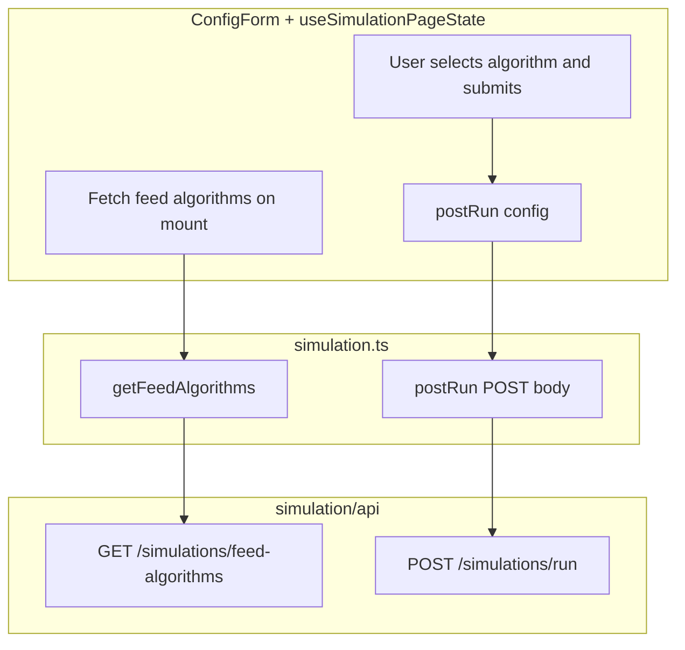

# Unit 2: Feed Algorithm Selection (Frontend)

## Remember

- Exact file paths always
- Exact commands with expected output
- DRY, YAGNI, TDD, frequent commits

---

## Current Status (Unit 1 Complete)

Unit 1 ([PR #92](https://github.com/METResearchGroup/social_agent_simulation_platform/pull/92)) is merged. The following are **already implemented**:

**Backend – registry and algorithms**

- [feeds/algorithms/registry.py](feeds/algorithms/registry.py): `get_registered_algorithms()` → `list[tuple[str, FeedAlgorithmMetadata]]`, `get_feed_generator(algorithm)` → `FeedAlgorithm`
- [feeds/algorithms/implementations/chronological.py](feeds/algorithms/implementations/chronological.py): `ChronologicalFeedAlgorithm` with METADATA `display_name="Chronological"`, `description="Posts sorted by creation time, newest first."`

**Backend – API**

- **GET /v1/simulations/feed-algorithms**: Returns `list[FeedAlgorithmSchema]`. Route in [simulation/api/routes/simulation.py](simulation/api/routes/simulation.py), uses `_get_feed_algorithms_list()` → `get_registered_algorithms()`.
- **Response shape**: `[{ id, display_name, description, config_schema }]` (e.g. `id: "chronological"`, `config_schema: null`).
- **FeedAlgorithmSchema**: In [simulation/api/schemas/simulation.py](simulation/api/schemas/simulation.py), subclasses `FeedAlgorithmMetadata`, adds `id`.
- **POST /v1/simulations/run**: `RunRequest` has `feed_algorithm: str | None = None`; validated via `validate_feed_algorithm`.
- **RunResponse**: `run_id`, `status`, `num_agents`, `num_turns`, `turns`, `run_metrics`, `error`.
- **GET /v1/simulations/config/default**: Returns `DefaultConfigSchema` (`num_agents`, `num_turns`). Does **not** include `feed_algorithm`; frontend will default to `"chronological"`.

**Frontend – current state**

- [ui/lib/api/simulation.ts](ui/lib/api/simulation.ts): Has `getDefaultConfig()`, `getRuns()`, `getAgents()`, `getPosts()`, `getTurnsForRun()`. No `getFeedAlgorithms()` or `postRun()`.
- [ui/types/index.ts](ui/types/index.ts): `RunConfig` has `numAgents`, `numTurns` only; no `feedAlgorithm`, no `FeedAlgorithm` type.
- [ui/components/form/ConfigForm.tsx](ui/components/form/ConfigForm.tsx): Only `numAgents`, `numTurns`; no feed algorithm select.
- [ui/hooks/useSimulationPageState.ts](ui/hooks/useSimulationPageState.ts): `handleConfigSubmit` creates a dummy run locally; does not call the backend.

---

## Overview

Add feed algorithm selection to the simulation start flow: ConfigForm fetches algorithms from the existing `GET /v1/simulations/feed-algorithms` endpoint and displays them in a select; RunConfig includes `feedAlgorithm` (default `"chronological"`); on submit, the flow calls `POST /v1/simulations/run` with `num_agents`, `num_turns`, and `feed_algorithm` instead of creating a dummy run locally.

---

## Happy Flow

1. User loads the simulation page. ConfigForm (or its parent) fetches feed algorithms on mount via `getFeedAlgorithms()` from [ui/lib/api/simulation.ts](ui/lib/api/simulation.ts).
2. API client sends `GET /v1/simulations/feed-algorithms`. Backend (already implemented) returns `[{ id, display_name, description, config_schema }]` via `_get_feed_algorithms_list()` → `get_registered_algorithms()`.
3. Frontend populates a select with `display_name`, `description` as helper text. Default selection: `"chronological"`.
4. User selects feed algorithm, sets numAgents/numTurns, submits. ConfigForm calls `onSubmit({ numAgents, numTurns, feedAlgorithm })`.
5. `handleConfigSubmit` in [ui/hooks/useSimulationPageState.ts](ui/hooks/useSimulationPageState.ts) calls `postRun(config)` instead of creating a dummy run.
6. API client sends `POST /v1/simulations/run` with `{ num_agents, num_turns, feed_algorithm }`. Backend executes simulation and returns `RunResponse`.
7. Hook maps response to `Run`, stores config with `feedAlgorithm`, selects the new run and shows the run detail view.

---

## Data Flow




---

## Implementation Steps

### 1. Before screenshots (UI work – first todo)

Capture the current Start/ConfigForm UI to `docs/plans/2026-02-19_feed_algorithm_frontend/images/before/`. Ensure the dev server is running and the start screen is visible.

### 2. API client and types

- Add `FeedAlgorithm` interface to [ui/types/index.ts](ui/types/index.ts):

```typescript
export interface FeedAlgorithm {
  id: string;
  displayName: string;
  description: string;
  configSchema: Record<string, unknown> | null;
}
```

- Add `feedAlgorithm?: string` to `RunConfig` in [ui/types/index.ts](ui/types/index.ts). Default `"chronological"` at call sites when omitted.
- Add to [ui/lib/api/simulation.ts](ui/lib/api/simulation.ts):
  - `getFeedAlgorithms(): Promise<FeedAlgorithm[]>` – `GET /simulations/feed-algorithms` (full URL: `http://localhost:8000/v1/simulations/feed-algorithms` via `buildApiUrl`), map snake_case to camelCase (`display_name` → `displayName`, etc.).
  - `postRun(config: RunConfig): Promise<RunResponse>` – `POST /simulations/run` with `{ num_agents, num_turns, feed_algorithm }`. Use `fetch` with `method: 'POST'`, `body: JSON.stringify(...)`. Map response to `Run`-compatible shape: `run_id` → `runId`, `status` (backend uses `"completed"` | `"failed"`; `Run.status` expects `'running' | 'completed' | 'failed'` – map completed run as `'completed'`).
- Add `RunResponse` (or equivalent) type matching backend: `run_id`, `status`, `num_agents`, `num_turns`, `turns`, `run_metrics`, `error`.

### 3. ConfigForm changes

- Add `feedAlgorithm` state in [ui/components/form/ConfigForm.tsx](ui/components/form/ConfigForm.tsx), default `defaultConfig.feedAlgorithm ?? "chronological"`.
- Add `useEffect` to fetch `getFeedAlgorithms()` on mount. Use request-id guard per [docs/RULES.md](docs/RULES.md) (Frontend — Async effects) to avoid stale responses.
- Add a `<select>` for feed algorithm; options from fetched algorithms, `value={feedAlgorithm}`, `onChange` updates state. Show `description` as helper text or tooltip.
- Include `feedAlgorithm` in `onSubmit({ numAgents, numTurns, feedAlgorithm })`.

### 4. Default config and StartView

- The page uses [getDefaultConfig()](ui/lib/api/simulation.ts) from `GET /simulations/config/default`; [page.tsx](ui/app/page.tsx) has `FALLBACK_DEFAULT_CONFIG = { numAgents: 5, numTurns: 10 }`. Backend `DefaultConfigSchema` returns only `num_agents`, `num_turns`. Add `feedAlgorithm: "chronological"` client-side: in `getDefaultConfig()` mapping, return `{ numAgents, numTurns, feedAlgorithm: "chronological" }`. Update `FALLBACK_DEFAULT_CONFIG` to include `feedAlgorithm: "chronological"`. No backend changes required.
- [StartView](ui/components/start/StartView.tsx) passes `defaultConfig` to ConfigForm; `RunConfig` must include `feedAlgorithm`.

### 5. handleConfigSubmit flow

- In [ui/hooks/useSimulationPageState.ts](ui/hooks/useSimulationPageState.ts), replace the dummy run creation with:
  - Call `postRun(config)`.
  - On success: map response to `Run` (`run_id` → `runId`, `createdAt: new Date().toISOString()` since RunResponse has no created_at, `totalTurns`/`totalAgents` from response), `setRuns([newRun, ...])`, `setRunConfigs({ ...prev, [runId]: config })`, `setSelectedRunId(runId)`.
  - On error: set `runsError` (or equivalent) so the UI can show a retry or error message; do not add a fake run.
- Ensure `config` passed to `handleConfigSubmit` includes `feedAlgorithm`. If omitted, default to `"chronological"` before calling `postRun`.
- **Note**: Backend [RunResponse](simulation/api/schemas/simulation.py) does not include `created_at`; [Run](ui/types/index.ts) requires `createdAt`. For runs from `postRun`, derive `createdAt` as `new Date().toISOString()` (run was just created). [RunListItem](simulation/api/schemas/simulation.py) (from GET /runs) includes `created_at`; only `postRun`-created runs need the derived value.

### 6. RunConfig storage

- `runConfigs` stores full config including `feedAlgorithm`. Backend `RunConfigDetail` has `feed_algorithm`. No backend changes needed.

### 7. After screenshots (UI work – last todo)

Capture the new ConfigForm with feed algorithm select to `docs/plans/2026-02-19_feed_algorithm_frontend/images/after/`.

---

## Manual Verification

1. Start backend: `PYTHONPATH=. uv run uvicorn simulation.api.main:app --reload --port 8000`
2. Start frontend: `cd ui && npm run dev`
3. Open `http://localhost:3000` (or configured dev URL)
4. **Feed algorithms fetch**: Open DevTools Network tab; verify `GET /v1/simulations/feed-algorithms` returns `200` with `[{ id: "chronological", display_name: "Chronological", description: "Posts sorted by creation time, newest first.", config_schema: null }]`
5. **ConfigForm**: Confirm the feed algorithm select is visible with at least "Chronological"; description shown as helper text
6. **Submit flow**: Select algorithm, set numAgents/numTurns, click "Start Simulation". Verify `POST /v1/simulations/run` is sent with `num_agents`, `num_turns`, `feed_algorithm`
7. **Run creation**: New run appears in RunHistorySidebar; selecting it shows correct config (including feed algorithm if displayed)
8. **Tests**: Run `uv run pytest tests/api/ tests/feeds/ -v` and `cd ui && npm run lint`

---

## Alternative Approaches

- **Keep dummy run flow**: Could keep local dummy runs and only add `feedAlgorithm` to config for future wiring. The spec asks to wire to the real backend, so we switch to `postRun`.
- **config_schema dynamic fields**: Deferred per MIGRATE_ALGOS; current algorithms have `config_schema: null`.

---

## Plan Asset Storage

All assets in:

```text
docs/plans/2026-02-19_feed_algorithm_frontend/
├── images/
│   ├── before/
│   └── after/
```
