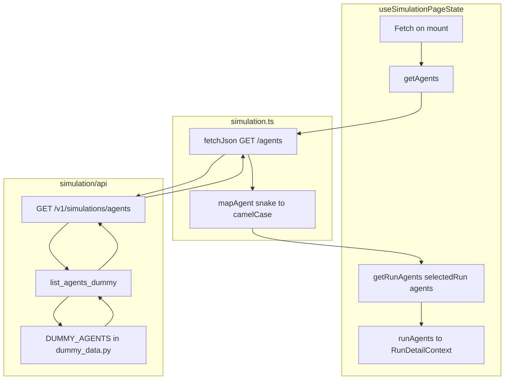

# Migrate Agents to Backend

## Remember

- Exact file paths always
- Exact commands with expected output
- DRY, YAGNI, TDD, frequent commits

---

## Overview

Move `DUMMY_AGENTS` and remove dead `getAgentByHandle` from [ui/lib/dummy-data.ts](ui/lib/dummy-data.ts) to the backend. Add `GET /v1/simulations/agents` and wire [useSimulationPageState](ui/hooks/useSimulationPageState.ts) to fetch agents via the API. This plan has **no overlap** with [migrate_posts_backend_55f90767.plan.md](migrate_posts_backend_55f90767.plan.md): we do not touch posts, DetailsPanel post resolution, PostSchema, or DUMMY_POSTS. We only remove `DUMMY_AGENTS` and `getAgentByHandle` from dummy-data.ts.

---

## Happy Flow

1. User loads the simulation page. [useSimulationPageState](ui/hooks/useSimulationPageState.ts) fetches agents on mount via `getAgents()` from [ui/lib/api/simulation.ts](ui/lib/api/simulation.ts).
2. API client sends `GET /v1/simulations/agents` to the backend.
3. [simulation/api/routes/simulation.py](simulation/api/routes/simulation.py) route delegates to `list_agents_dummy()` in [simulation/api/services/agent_query_service.py](simulation/api/services/agent_query_service.py).
4. Service returns `DUMMY_AGENTS` from [simulation/api/dummy_data.py](simulation/api/dummy_data.py) as `list[AgentSchema]` sorted by handle (deterministic).
5. API client maps snake_case to camelCase, returns `Agent[]`.
6. `getRunAgents(selectedRun, agents)` receives API-fetched agents; DetailsPanel and RunSummary render `runAgents` correctly.

---

## Data Flow

---

## Implementation Steps

### 1. Backend: Add AgentSchema

**File:** [simulation/api/schemas/simulation.py](simulation/api/schemas/simulation.py)

Add `AgentSchema` with fields matching frontend [Agent](ui/types/index.ts):

- `handle`, `name`, `bio`, `generated_bio`, `followers`, `following`, `posts_count`

Use snake_case for API contract; frontend client maps to camelCase.

### 2. Backend: Add DUMMY_AGENTS to dummy_data.py

**File:** [simulation/api/dummy_data.py](simulation/api/dummy_data.py)

- Add `AgentSchema` import.
- Add `DUMMY_AGENTS: list[AgentSchema]` with the same 8 agents as in [ui/lib/dummy-data.ts](ui/lib/dummy-data.ts) (lines 3–78). Match handles exactly to `_DUMMY_AGENT_HANDLES`.
- Define as file-level constant with explicit type.

### 3. Backend: Add agent_query_service

**File:** `simulation/api/services/agent_query_service.py` (new)

- Import `DUMMY_AGENTS` from dummy_data, `AgentSchema` from schemas.
- Add `list_agents_dummy() -> list[AgentSchema]`:
  - Return `DUMMY_AGENTS` sorted by `handle` for deterministic ordering (per [docs/RULES.md](docs/RULES.md)).

### 4. Backend: Add GET /v1/simulations/agents route

**File:** [simulation/api/routes/simulation.py](simulation/api/routes/simulation.py)

- Add route constant `SIMULATION_AGENTS_ROUTE: str = "GET /v1/simulations/agents"`.
- Add `@router.get("/simulations/agents", response_model=list[AgentSchema], ...)`.
- Thin route: call `_execute_get_simulation_agents(request)` which uses `asyncio.to_thread(list_agents_dummy)` and `@timed`.
- Reuse existing `_error_response`, `log_route_completion` pattern.
- Import `AgentSchema` and `list_agents_dummy`.

### 5. Backend: Add API tests

**File:** `tests/api/test_simulation_agents.py` (new)

Add tests:

- `test_get_simulations_agents_returns_list` — `GET /v1/simulations/agents` returns 200, list of agents, count matches DUMMY_AGENTS.
- `test_get_simulations_agents_ordering_deterministic` — Result sorted by `handle`.
- `test_get_simulations_agents_fields_present` — Each agent has handle, name, bio, generated_bio, followers, following, posts_count.

### 6. Frontend: Add getAgents and mapAgent to API client

**File:** [ui/lib/api/simulation.ts](ui/lib/api/simulation.ts)

- Add `ApiAgent` interface (snake_case fields matching `AgentSchema`).
- Add `mapAgent(apiAgent: ApiAgent): Agent` (camelCase mapping).
- Add `getAgents(): Promise<Agent[]>`: call `fetchJson<ApiAgent[]>(buildApiUrl('/simulations/agents'))`, map to `Agent[]`, return.
- Import `Agent` from `@/types`.

### 7. Frontend: Update useSimulationPageState to fetch agents

**File:** [ui/hooks/useSimulationPageState.ts](ui/hooks/useSimulationPageState.ts)

- Remove import of `DUMMY_AGENTS` from `@/lib/dummy-data`.
- Add state: `agents: Agent[]`, `agentsLoading: boolean`, `agentsError: Error | null`.
- Add `useEffect` to fetch agents on mount (similar to runs): call `getAgents()`, set agents/loading/error.
- Add retry: `handleRetryAgents` or include in existing retry flow if appropriate.
- Update `runAgents` useMemo: use `getRunAgents(selectedRun, agents)` instead of `getRunAgents(selectedRun, DUMMY_AGENTS)`.
- Update return type: `runAgents: Agent[]` (no longer `typeof DUMMY_AGENTS`).
- Return `agentsLoading`, `agentsError` if callers need them (e.g. for loading/error UI); otherwise keep minimal.
- Handle empty agents: while loading or on error, `runAgents` may be empty; ensure RunSummary and DetailsPanel degrade gracefully.

### 8. Frontend: Remove DUMMY_AGENTS and getAgentByHandle from dummy-data.ts

**File:** [ui/lib/dummy-data.ts](ui/lib/dummy-data.ts)

- Remove `DUMMY_AGENTS` constant.
- Remove `getAgentByHandle` function.
- Remove `Agent` from imports if no longer used in this file.
- **Do not touch** `DUMMY_POSTS`, `getPostByUri`, `DEFAULT_CONFIG` — those are out of scope (posts migration and default config are separate plans).

---

## Manual Verification Checklist

Prerequisites: Backend at `http://localhost:8000`, UI at `http://localhost:3000`. CORS enabled.

1. **Backend tests**
  - Run: `uv run pytest tests/api/test_simulation_agents.py -v`
  - Expected: All tests pass.
2. **API endpoint**
  - Run: `curl -s "http://localhost:8000/v1/simulations/agents" | head -c 500`
  - Expected: JSON array of agent objects with `handle`, `name`, `bio`, `generated_bio`, `followers`, `following`, `posts_count`.
3. **UI happy flow**
  - Start backend and UI. Open `http://localhost:3000`.
  - Select a run from Run History sidebar.
  - Run Summary and turn details show agents (names, handles) correctly.
  - Verify agent list matches dummy data (e.g. Alice Chen, Bob Martinez).
4. **Pre-commit**
  - Run: `uv run pre-commit run --all-files`
  - Expected: All hooks pass.
5. **CI**
  - Run: `uv run ruff check .`, `uv run ruff format --check .`, `uv run pyright .`, `uv run pytest`
  - Expected: No errors.

---

## Plan Asset Storage

- **Path:** `docs/plans/2026-02-19_migrate_agents_backend/`
- **Before screenshots:** `docs/plans/2026-02-19_migrate_agents_backend/images/before/` (Run Summary / turn detail with agents)
- **After screenshots:** `docs/plans/2026-02-19_migrate_agents_backend/images/after/` (same flow after migration)

---

## Avoiding Overlap with Posts Migration

This plan does **not** modify:

- [ui/components/details/DetailsPanel.tsx](ui/components/details/DetailsPanel.tsx) — post resolution remains in posts plan
- PostSchema, DUMMY_POSTS, get_posts_by_uris, GET /simulations/posts
- Any post-related imports or logic in dummy-data.ts

Shared files that both plans touch:

- [ui/lib/api/simulation.ts](ui/lib/api/simulation.ts) — we add `getAgents`; posts plan adds `getPosts`. Merge when combining.
- [ui/lib/dummy-data.ts](ui/lib/dummy-data.ts) — we remove only `DUMMY_AGENTS` and `getAgentByHandle`; posts plan removes only `DUMMY_POSTS` and `getPostByUri`. Edits are independent; merge when combining.

---

## Alternative Approaches

- **Run-scoped vs global agents:** Chose global `GET /v1/simulations/agents`; run slicing via `run.totalAgents` stays in frontend (`getRunAgents`).
- **Extend run_query_service vs new agent_query_service:** New module keeps concerns separate; mirrors potential future post_query_service pattern.

---

## References

- [MIGRATIONS.md](MIGRATIONS.md) — source spec (Migration 2: Agents)
- [docs/RULES.md](docs/RULES.md) — API design, domain purity, thin routes
- [migrate_posts_backend_55f90767.plan.md](migrate_posts_backend_55f90767.plan.md) — separate plan; no overlap
