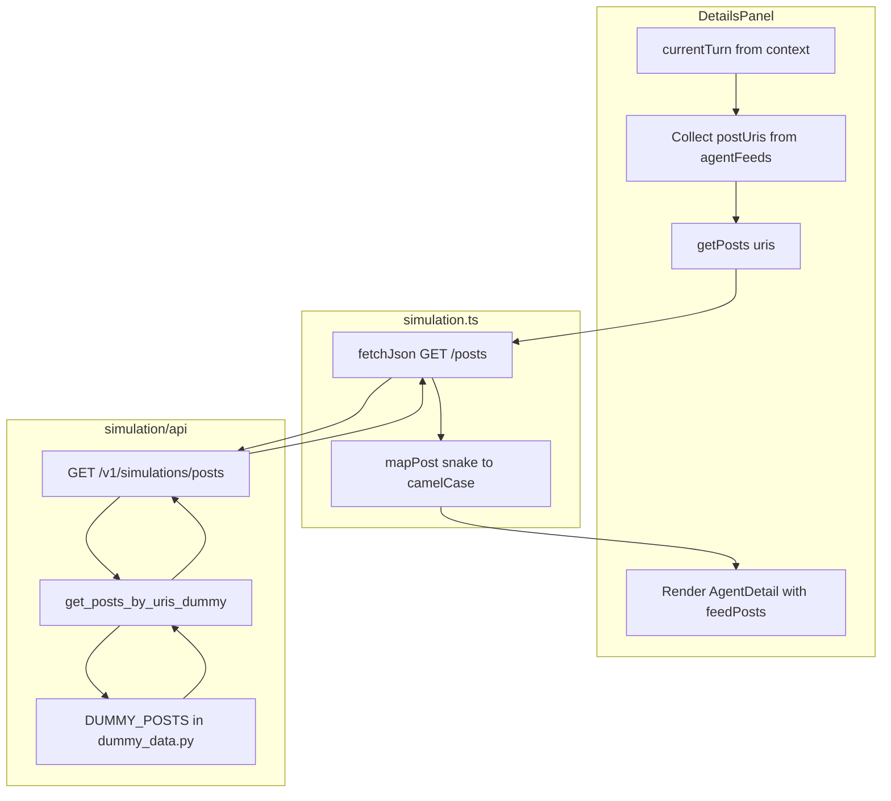

# Migrate Posts to Backend

## Remember

- Exact file paths always
- Exact commands with expected output
- DRY, YAGNI, TDD, frequent commits

---

## Overview

Move `DUMMY_POSTS` and `getPostByUri` from [ui/lib/dummy-data.ts](ui/lib/dummy-data.ts) to the backend. Add `GET /v1/simulations/posts?uris=...` and a frontend API client. [DetailsPanel](ui/components/details/DetailsPanel.tsx) currently resolves `post_uris` from turn feeds via `getPostByUri(uri)`; it will instead fetch posts from the API. Per [MIGRATIONS.md](MIGRATIONS.md), batch lookup is preferred: the client knows URIs from turns and requests only those.

---

## Happy Flow

1. User selects a run, then a turn number. [RunDetailContext](ui/components/run-detail/RunDetailContext.tsx) provides `currentTurn` with `agentFeeds` containing `postUris`.
2. [DetailsPanel](ui/components/details/DetailsPanel.tsx) collects unique URIs from `currentTurn.agentFeeds`, calls `getPosts(uris)` from [ui/lib/api/simulation.ts](ui/lib/api/simulation.ts).
3. API client sends `GET /v1/simulations/posts?uris=uri1&uris=uri2&...` to the backend.
4. [simulation/api/routes/simulation.py](simulation/api/routes/simulation.py) route delegates to `get_posts_by_uris_dummy(uris)` in [simulation/api/services/run_query_service.py](simulation/api/services/run_query_service.py).
5. Service looks up posts from `DUMMY_POSTS` in [simulation/api/dummy_data.py](simulation/api/dummy_data.py), returns list of `PostSchema` ordered by `uri`.
6. API client maps snake_case to camelCase, builds `Record<string, Post>` keyed by `uri`.
7. DetailsPanel renders feed posts and `allPosts` using the fetched data instead of `getPostByUri`.

---

## Data Flow

---

## Implementation Steps

### 1. Backend: Add PostSchema

**File:** [simulation/api/schemas/simulation.py](simulation/api/schemas/simulation.py)

Add `PostSchema` with fields matching frontend [Post](ui/types/index.ts):

- `uri`, `author_display_name`, `author_handle`, `text`
- `bookmark_count`, `like_count`, `quote_count`, `reply_count`, `repost_count`
- `created_at`

Use snake_case for API contract; frontend client maps to camelCase.

### 2. Backend: Add DUMMY_POSTS to dummy_data.py

**File:** [simulation/api/dummy_data.py](simulation/api/dummy_data.py)

- Add `PostSchema` import.
- Add `DUMMY_POSTS: list[PostSchema]` with the same 10 posts as in [ui/lib/dummy-data.ts](ui/lib/dummy-data.ts) (lines 78–200). Match URIs exactly to `_DUMMY_POST_URIS` so turns reference valid posts.
- Define as file-level constant with explicit type.

### 3. Backend: Add get_posts_by_uris_dummy service

**File:** [simulation/api/services/run_query_service.py](simulation/api/services/run_query_service.py)

- Import `DUMMY_POSTS`, `PostSchema` from dummy_data and schemas.
- Add `get_posts_by_uris_dummy(*, uris: list[str] | None = None) -> list[PostSchema]`:
  - If `uris` is None or empty, return all posts from `DUMMY_POSTS`.
  - Otherwise, filter `DUMMY_POSTS` to those whose `uri` is in `uris`.
  - Sort result by `uri` for deterministic ordering (per [docs/RULES.md](docs/RULES.md) determinism).
  - Return list (not dict); client builds lookup map.

### 4. Backend: Add GET /v1/simulations/posts route

**File:** [simulation/api/routes/simulation.py](simulation/api/routes/simulation.py)

- Add route constant `SIMULATION_POSTS_ROUTE: str = "GET /v1/simulations/posts"`.
- Add `@router.get("/simulations/posts", response_model=list[PostSchema], ...)`.
- Use query param `uris: list[str] | None = Query(default=None)` (FastAPI accepts repeated `?uris=x&uris=y`).
- Thin route: call `_execute_get_simulation_posts(request, uris)` which uses `asyncio.to_thread(get_posts_by_uris_dummy, uris=uris)` and `@timed`.
- Reuse existing `_error_response`, `log_route_completion` pattern. On exception, return 500 with `INTERNAL_ERROR`.
- Import `PostSchema` and `get_posts_by_uris_dummy`.

### 5. Backend: Add API tests

**File:** [tests/api/test_simulation_run.py](tests/api/test_simulation_run.py) (or new `tests/api/test_simulation_posts.py`)

Add tests:

- `test_get_simulations_posts_returns_all_when_no_uris` — `GET /v1/simulations/posts` returns 200, list of posts, count matches `DUMMY_POSTS`.
- `test_get_simulations_posts_returns_filtered_by_uris` — `GET /v1/simulations/posts?uris=at://did:plc:example1/post1&uris=at://did:plc:example2/post2` returns 200, exactly 2 posts, correct URIs.
- `test_get_simulations_posts_ordering_deterministic` — Result sorted by `uri`.

Use `simulation_client` fixture. Import `DUMMY_POSTS` (or `PostSchema`) for assertions.

### 6. Frontend: Add getPosts and mapPost to API client

**File:** [ui/lib/api/simulation.ts](ui/lib/api/simulation.ts)

- Add `ApiPost` interface (snake_case fields matching `PostSchema`).
- Add `mapPost(apiPost: ApiPost): Post` (camelCase mapping).
- Add `getPosts(uris?: string[]): Promise<Post[]>`:
  - Build URL: if `uris` present and non-empty, append `?uris=${uris.map(encodeURIComponent).join('&uris=')}`.
  - Call `fetchJson<ApiPost[]>(url)`.
  - Map to `Post[]` and return.
- Import `Post` from `@/types`.

### 7. Frontend: Add usePostsByUris hook (optional but recommended)

**File:** `ui/hooks/usePostsByUris.ts` (new)

- `usePostsByUris(uris: string[] | null): { postsByUri: Record<string, Post>, loading: boolean, error: Error | null }`
- When `uris` is null or empty, return `{ postsByUri: {}, loading: false, error: null }`.
- Otherwise `useEffect` to call `getPosts(uris)`, build `postsByUri` keyed by `uri`, track loading/error.
- Ensures single fetch per URIs set; avoids refetch on unrelated re-renders.

Alternative: inline the fetch logic in DetailsPanel if a separate hook feels like overkill. Per YAGNI, start with inline; extract to hook if reuse appears.

### 8. Frontend: Update DetailsPanel to use API

**File:** [ui/components/details/DetailsPanel.tsx](ui/components/details/DetailsPanel.tsx)

- Remove import of `getPostByUri` from `@/lib/dummy-data`.
- Add `usePostsByUris` (or inline fetch) with URIs derived from `currentTurn.agentFeeds` when `currentTurn` is set and `selectedTurn !== 'summary'`.
- Replace `getPostByUri(uri)` with `postsByUri[uri]` in `getAllPostsForTurn` and in the per-agent feed mapping.
- Add loading state: while posts load, show `LoadingSpinner` and "Loading posts…" in the turn detail area.
- Add error state: on posts fetch error, show message and optional Retry (or degrade gracefully).

Update `getAllPostsForTurn` signature to accept `postsByUri: Record<string, Post>` instead of calling `getPostByUri`. Or keep helper and pass `postsByUri`; the helper becomes `getAllPostsForTurn(turn, postsByUri)` returning `Post[]` by resolving each URI from the map.

### 9. Frontend: Remove DUMMY_POSTS and getPostByUri from dummy-data.ts

**File:** [ui/lib/dummy-data.ts](ui/lib/dummy-data.ts)

- Remove `DUMMY_POSTS` constant.
- Remove `getPostByUri` function.
- Remove `Post` from imports if no longer used in this file.
- Keep `DUMMY_AGENTS`, `DEFAULT_CONFIG`, `getAgentByHandle` unchanged (out of scope).

---

## Manual Verification Checklist

Prerequisites: Backend at `http://localhost:8000`, UI at `http://localhost:3000`. CORS enabled.

1. **Backend tests**
  - Run: `uv run pytest tests/api/test_simulation_run.py tests/api/test_simulation_posts.py -v`
  - Expected: All tests pass.
2. **API endpoint**
  - Run: `curl -s "http://localhost:8000/v1/simulations/posts" | head -c 500`
  - Expected: JSON array of post objects with `uri`, `author_display_name`, `text`, etc.
  - Run: `curl -s "http://localhost:8000/v1/simulations/posts?uris=at://did:plc:example1/post1" | head -c 500`
  - Expected: JSON array with one post, `uri` = `at://did:plc:example1/post1`.
3. **UI happy flow**
  - Start backend and UI. Open `http://localhost:3000`.
  - Select a run from Run History sidebar.
  - Select a turn number (e.g. 0 or 1) in Turn History.
  - DetailsPanel shows agents with feed posts (author, text, counts).
  - Verify post content matches dummy data (e.g. Alice Chen's transformer paper post).
4. **UI loading/error**
  - With backend running, select run and turn; briefly see "Loading posts…" if network is slow.
  - Stop backend, select run and turn; verify posts error state (message, optional Retry).
5. **Pre-commit**
  - Run: `uv run pre-commit run --all-files`
  - Expected: All hooks pass.
6. **CI**
  - Run: `uv run ruff check .`, `uv run ruff format --check .`, `uv run pyright .`, `uv run pytest`
  - Expected: No errors.

---

## Verification Results (2026-02-19)

| Step | Status | Notes |
| --- | --- | --- |
| Backend tests | Passed | 13 tests (runs + posts) |
| API endpoint (all posts) | Passed | Returns JSON array with uri, author_display_name, text, etc. |
| API endpoint (filtered) | Passed | Returns single post for `?uris=at://did:plc:example1/post1` |
| UI happy flow | Passed | Run selected, turn selected, DetailsPanel shows agents with feed posts |
| Pre-commit | Passed | ruff, pyright, oxlint, React Doctor |
| CI | Passed | ruff, format, pyright, pytest |

Screenshots: `images/after/02-turn-detail-with-posts.png` (DetailsPanel turn view with posts from API)

---

## Plan Asset Storage

- **Path:** `docs/plans/2026-02-19_migrate_posts_backend/`
- **Before screenshots:** `docs/plans/2026-02-19_migrate_posts_backend/images/before/` (current DetailsPanel turn view with posts)
- **After screenshots:** `docs/plans/2026-02-19_migrate_posts_backend/images/after/` (same flow after migration)

---

## Alternative Approaches

- **Return-all vs batch:** Return-all `GET /v1/simulations/posts` would simplify the API but force the client to filter. MIGRATIONS.md recommends batch lookup; we adopt `?uris=...`.
- **Embed posts in turns response:** Could add full post objects to `TurnSchema` instead of just `post_uris`. That would duplicate posts across turns and bloat the response; separate endpoint keeps turns lean and allows independent post caching.
- **Post query service module:** Could add `simulation/api/services/post_query_service.py` instead of extending `run_query_service`. For dummy data, a single service module is acceptable; RULES prefer minimal public APIs. We add `get_posts_by_uris_dummy` to `run_query_service` for consistency with `list_runs_dummy` and `get_turns_for_run_dummy`.

---

## File Summary

| File                                                                                         | Changes                                                  |
| -------------------------------------------------------------------------------------------- | -------------------------------------------------------- |
| [simulation/api/schemas/simulation.py](simulation/api/schemas/simulation.py)                 | Add `PostSchema`                                         |
| [simulation/api/dummy_data.py](simulation/api/dummy_data.py)                                 | Add `DUMMY_POSTS`                                        |
| [simulation/api/services/run_query_service.py](simulation/api/services/run_query_service.py) | Add `get_posts_by_uris_dummy`                            |
| [simulation/api/routes/simulation.py](simulation/api/routes/simulation.py)                   | Add `GET /simulations/posts` route                       |
| `tests/api/test_simulation_posts.py` (new)                                                   | Tests for posts endpoint                                 |
| [ui/lib/api/simulation.ts](ui/lib/api/simulation.ts)                                         | Add `ApiPost`, `mapPost`, `getPosts`                     |
| `ui/hooks/usePostsByUris.ts` (new, optional)                                                 | Hook for fetching posts by URIs                          |
| [ui/components/details/DetailsPanel.tsx](ui/components/details/DetailsPanel.tsx)             | Replace `getPostByUri` with API fetch, add loading/error |
| [ui/lib/dummy-data.ts](ui/lib/dummy-data.ts)                                                 | Remove `DUMMY_POSTS`, `getPostByUri`                     |
