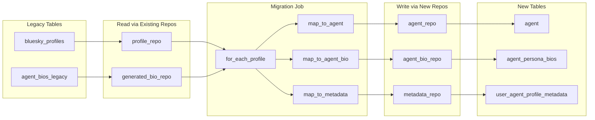

# User-Created Agents: Schema, Repositories, and Migration Job

## Remember

- Exact file paths always
- Exact commands with expected output
- DRY, YAGNI, TDD, frequent commits

---

## Overview

Introduce a new agent data model with three tables: `agent`, `agent_persona_bios`, and `user_agent_profile_metadata`. Use the existing repository + adapter pattern ([db/repositories/profile_repository.py](db/repositories/profile_repository.py), [db/adapters/sqlite/profile_adapter.py](db/adapters/sqlite/profile_adapter.py)). Add a one-off job that reads from `bluesky_profiles` and `agent_bios` (legacy) via existing repositories, transforms data, and writes to the new tables via new repositories. Do **not** modify `GET /v1/simulations/agents` or wire it to the new tables in this plan; that is a follow-up.

---

## Happy Flow

1. Developer runs `uv run alembic upgrade head`; new tables `agent`, `agent_persona_bios`, `user_agent_profile_metadata` are created.
2. Developer runs `uv run python jobs/migrate_agents_to_new_schema.py`.
3. Job creates `ProfileRepository`, `GeneratedBioRepository` (existing) for reads; creates `AgentRepository`, `AgentBioRepository`, `UserAgentProfileMetadataRepository` (new) for writes.
4. For each profile from `profile_repo.list_profiles()`: create `Agent`, insert via `agent_repo`; create `AgentBio` from `generated_bio_repo.get_generated_bio(handle)` or fallback to `profile.bio`; insert via `agent_bio_repo`; create `UserAgentProfileMetadata` with follower/follows/posts counts; insert via `metadata_repo`.
5. Job logs count of migrated agents and exits.

---

## Data Flow

---

## Schema Design

`**agent**`

| Column         | Type   | Notes                                       |
| -------------- | ------ | ------------------------------------------- |
| agent_id       | PK     | Bluesky DID for sync_bluesky; UUID for user |
| handle         | unique |                                             |
| persona_source | text   | "user_generated" or "sync_bluesky"          |
| display_name   | text   |                                             |
| created_at     | text   | ISO or YYYY_MM_DD-HH:MM:SS                  |
| updated_at     | text   |                                             |

`**agent_persona_bios**` (new table; legacy `agent_bios` remains)

| Column             | Type | Notes                             |
| ------------------ | ---- | --------------------------------- |
| id                 | PK   | UUID                              |
| agent_id           | FK   | -> agent.agent_id                 |
| persona_bio        | text |                                   |
| persona_bio_source | text | "ai_generated" or "user_provided" |
| created_at         | text |                                   |
| updated_at         | text |                                   |

`**user_agent_profile_metadata**`

| Column          | Type | Notes      |
| --------------- | ---- | ---------- |
| id              | PK   | UUID       |
| agent_id        | FK   | unique 1:1 |
| followers_count | int  |            |
| follows_count   | int  |            |
| posts_count     | int  |            |
| created_at      | text |            |
| updated_at      | text |            |

---

## Implementation Steps

### 1. Domain Models

**File:** [simulation/core/models/agent.py](simulation/core/models/agent.py) (new)

- `PersonaSource` str enum: `USER_GENERATED`, `SYNC_BLUESKY`
- `Agent` Pydantic: `agent_id`, `handle`, `persona_source`, `display_name`, `created_at`, `updated_at`
- Domain purity: stdlib + pydantic only
- Use [lib/validation_utils.py](lib/validation_utils.py) validators via `@field_validator`

**File:** [simulation/core/models/agent_bio.py](simulation/core/models/agent_bio.py) (new)

- `PersonaBioSource` str enum: `AI_GENERATED`, `USER_PROVIDED`
- `AgentBio` Pydantic: `id`, `agent_id`, `persona_bio`, `persona_bio_source`, `created_at`, `updated_at`

**File:** [simulation/core/models/user_agent_profile_metadata.py](simulation/core/models/user_agent_profile_metadata.py) (new)

- `UserAgentProfileMetadata` Pydantic: `id`, `agent_id`, `followers_count`, `follows_count`, `posts_count`, `created_at`, `updated_at`
- Non-negative validators for counts

### 2. db/schema.py

- Add `agent` table definition
- Add `agent_persona_bios` table (FK to agent)
- Add `user_agent_profile_metadata` table (FK to agent)
- Do **not** modify existing `bluesky_profiles` or `agent_bios`

### 3. Alembic Migration

**File:** `db/migrations/versions/xxxx_create_agent_tables.py`

- `op.create_table("agent", ...)` with columns above
- `op.create_table("agent_persona_bios", ...)` with FK
- `op.create_table("user_agent_profile_metadata", ...)` with FK
- Index on `agent_persona_bios(agent_id, created_at DESC)` for latest-bio queries
- Unique constraint on `user_agent_profile_metadata.agent_id`

### 4. Base Adapters (db/adapters/base.py)

- `AgentDatabaseAdapter`: `write_agent`, `read_agent`, `read_agent_by_handle`, `read_all_agents`
- `AgentBioDatabaseAdapter`: `write_agent_bio`, `read_latest_agent_bio`, `read_agent_bios_by_agent_id`
- `UserAgentProfileMetadataDatabaseAdapter`: `write_user_agent_profile_metadata`, `read_by_agent_id`
- Document idempotency (e.g. INSERT OR REPLACE) where applicable

### 5. SQLite Adapters

**File:** [db/adapters/sqlite/agent_adapter.py](db/adapters/sqlite/agent_adapter.py) (new)

- `SQLiteAgentAdapter` implementing `AgentDatabaseAdapter`
- Use [db/adapters/sqlite/schema_utils.py](db/adapters/sqlite/schema_utils.py) for column names
- Use [db/adapters/sqlite/sqlite.py](db/adapters/sqlite/sqlite.py) `get_connection()`
- Follow [db/adapters/sqlite/profile_adapter.py](db/adapters/sqlite/profile_adapter.py) patterns

**File:** [db/adapters/sqlite/agent_bio_adapter.py](db/adapters/sqlite/agent_bio_adapter.py) (new)

- `SQLiteAgentBioAdapter` for `agent_persona_bios` table
- `read_latest_agent_bio`: `ORDER BY created_at DESC LIMIT 1`

**File:** [db/adapters/sqlite/user_agent_profile_metadata_adapter.py](db/adapters/sqlite/user_agent_profile_metadata_adapter.py) (new)

- `SQLiteUserAgentProfileMetadataAdapter`
- `write`: INSERT OR REPLACE for idempotency

**File:** [db/adapters/sqlite/**init**.py](db/adapters/sqlite/__init__.py)

- Export new adapters

### 6. Repository Interfaces (db/repositories/interfaces.py)

- `AgentRepository`: `create_or_update_agent`, `get_agent`, `get_agent_by_handle`, `list_all_agents`
- `AgentBioRepository`: `create_agent_bio`, `get_latest_agent_bio`, `list_agent_bios`
- `UserAgentProfileMetadataRepository`: `create_or_update_metadata`, `get_by_agent_id`

### 7. Repository Implementations

**File:** [db/repositories/agent_repository.py](db/repositories/agent_repository.py) (new)

- `SQLiteAgentRepository(AgentDatabaseAdapter)`
- `create_sqlite_agent_repository()` factory

**File:** [db/repositories/agent_bio_repository.py](db/repositories/agent_bio_repository.py) (new)

- `SQLiteAgentBioRepository(AgentBioDatabaseAdapter)`

**File:** [db/repositories/user_agent_profile_metadata_repository.py](db/repositories/user_agent_profile_metadata_repository.py) (new)

- `SQLiteUserAgentProfileMetadataRepository`

**File:** [db/repositories/**init**.py](db/repositories/__init__.py)

- Export new repositories and factories

### 8. Migration Job

**File:** [jobs/migrate_agents_to_new_schema.py](jobs/migrate_agents_to_new_schema.py) (new)

- Call `db.adapters.sqlite.sqlite.initialize_database()`
- Create repos: `create_sqlite_profile_repository()`, `create_sqlite_generated_bio_repository()`, `create_sqlite_agent_repository()`, `create_sqlite_agent_bio_repository()`, `create_sqlite_user_agent_profile_metadata_repository()`
- `profiles = profile_repo.list_profiles()`
- `generated_bios = {b.handle: b for b in generated_bio_repo.list_all_generated_bios()}`
- For each profile: build `Agent` (agent_id=profile.did, persona_source=SYNC_BLUESKY), `AgentBio` (from generated_bios or profile.bio), `UserAgentProfileMetadata`; call create methods
- Use [lib/timestamp_utils.py](lib/timestamp_utils.py) `get_current_timestamp()`
- Use `uuid.uuid4().hex` for new IDs
- Idempotent: `create_or_update_agent` and `create_or_update_metadata` allow re-runs
- `create_agent_bio` is additive; re-running will add duplicate bios. Either skip if agent already has a bio, or document one-off run. Prefer: check `agent_bio_repo.get_latest_agent_bio(agent_id)` and skip insert if exists for this migration.
- Print: `f"Migrated {len(profiles)} agents."`

### 9. Tests

**File:** `tests/db/repositories/test_agent_repository_integration.py` (new)

- Use [tests/db/adapters/sqlite/conftest.py](tests/db/adapters/sqlite/conftest.py) `temp_db` fixture
- Test: create agent, get by id, get by handle, list_all
- Test: create_or_update overwrites

**File:** `tests/db/repositories/test_agent_bio_repository_integration.py` (new)

- Test: create bio, get_latest when multiple exist (latest wins)

**File:** `tests/db/repositories/test_user_agent_profile_metadata_repository_integration.py` (new)

- Test: create, get_by_agent_id, create_or_update

**File:** `tests/jobs/test_migrate_agents_to_new_schema.py` (new)

- Fixture: temp DB with 1–2 bluesky_profiles and 1–2 agent_bios (legacy table)
- Run migration job
- Assert agent, agent_persona_bios, user_agent_profile_metadata rows exist and match expected

---

## Manual Verification

1. **Alembic migration**
  - `cd /Users/mark/Documents/work/agent_simulation_platform`
  - `uv run alembic upgrade head`
  - Expected: Migration runs without error. Inspect DB: `sqlite3 <db_path> ".schema agent"` shows agent table.
2. **Migration job (with seed data)**
  - Ensure `bluesky_profiles` and `agent_bios` have data (e.g. run `jobs/load_initial_bluesky_profiles.py` and `jobs/generate_profile_bios.py` if empty)
  - `uv run python jobs/migrate_agents_to_new_schema.py`
  - Expected: "Migrated N agents." (N > 0)
  - Query: `sqlite3 <db_path> "SELECT agent_id, handle, persona_source FROM agent"` — rows present
3. **Tests**
  - `uv run pytest tests/db/repositories/test_agent_repository_integration.py tests/db/repositories/test_agent_bio_repository_integration.py tests/db/repositories/test_user_agent_profile_metadata_repository_integration.py tests/jobs/test_migrate_agents_to_new_schema.py -v`
  - Expected: All pass
4. **Pre-commit and CI**
  - `uv run pre-commit run --all-files`
  - `uv run ruff check .`, `uv run ruff format --check .`, `uv run pyright .`, `uv run pytest`
  - Expected: No errors

---

## Alternative Approaches

- **Rename legacy agent_bios:** We keep `agent_bios` as-is and create `agent_persona_bios` to avoid changing existing adapters. Migration job reads from current `agent_bios` via `GeneratedBioRepository` unchanged.
- **Single adapter for all agent tables:** Split into three adapters to mirror existing patterns (profile, generated_bio) and keep concerns separate.
- **Transaction in migration job:** Could wrap the loop in a transaction for atomicity; current plan uses per-repo commits. Add transaction if needed for consistency.

---

## Plan Asset Storage

- **Path:** `docs/plans/2026-02-19_user_created_agents_migration_246801/`
- No UI changes in this plan; no before/after screenshots required.
