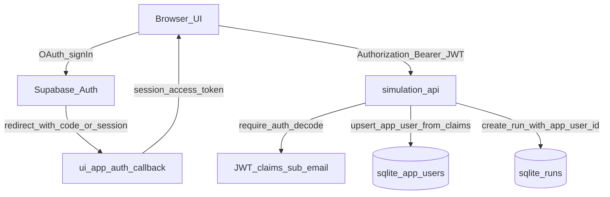

## Remember

- Exact file paths always
- Exact commands with expected output
- DRY, YAGNI, TDD, frequent commits

## Overview

Phase 2 adds **user identity persistence + activity attribution** on top of Phase 1’s “gate the app” JWT verification. Concretely: introduce an `app_users` table, add a nullable `runs.app_user_id`, and ensure each authenticated request resolves the Supabase `sub` (auth user id) to an internal app_user row (upsert + `last_seen_at`). When a run is created, persist the current internal `app_user_id` on the run.

**Assumptions (since questions were skipped):**

- DB-of-record for Phase 2 remains the existing **SQLite + Alembic** setup used in production (`docs/runbooks/PRODUCTION_DEPLOYMENT.md` and `docs/runbooks/RAILWAY_DEPLOYMENT.md`).
- The run attribution column is named `**runs.app_user_id`** ((references `app_users.id`)).
- No per-user authorization yet (Phase 3); we only record attribution.

## Happy Flow

1. **Client signs in via Supabase OAuth** and obtains an access token (already done in Phase 1). UI attaches `Authorization: Bearer <access_token>` via `ui/lib/api/simulation.ts`.
2. **FastAPI validates the JWT** using `simulation/api/dependencies/auth.py:require_auth`.
3. A new dependency (Phase 2) **upserts an internal app_user** into SQLite using JWT claims (at minimum `sub`, plus `email` and best-effort `display_name`) and updates `last_seen_at`.
  - Files: `simulation/api/dependencies/app_user.py` (new), `db/repositories/app_user_repository.py` (new), `db/adapters/sqlite/app_user_adapter.py` (new).
4. The dependency stores the resolved internal app_user on `request.state.current_app_user` (or similar) so route handlers can read it.
  - Files: `simulation/api/routes/simulation.py`.
5. On `POST /v1/simulations/run`, the route passes `current_app_user.id` into the simulation engine, and **run creation persists `runs.app_user_id`**.
  - Files: `simulation/api/routes/simulation.py`, `simulation/api/services/run_execution_service.py`, `simulation/core/engine.py`, `simulation/core/command_service.py`, `db/repositories/interfaces.py`, `db/repositories/run_repository.py`, `db/adapters/sqlite/run_adapter.py`, `simulation/core/models/runs.py`.

## Implementation Notes (concrete)

### 1) Database schema + migrations (SQLite via Alembic)

- Update SQLAlchemy schema source-of-truth:
  - `db/schema.py`
    - Add `app_users` table (new) with:
      - `id` (TEXT UUID, PK)
      - `auth_provider_id` (TEXT, unique, NOT NULL) — stores Supabase `sub`
      - `email` (TEXT, nullable or NOT NULL; pick one and be consistent with your claim parsing)
      - `display_name` (TEXT, nullable)
      - `created_at` (TEXT, NOT NULL)
      - `last_seen_at` (TEXT, NOT NULL)
    - Add `runs.app_user_id` column (TEXT, nullable) and an index on it.
- Add a migration:
  - `db/migrations/versions/<new_revision>_add_app_users_and_run_app_user_id.py`
    - `op.create_table('app_users', ...)`
    - `op.batch_alter_table('runs')` → add column `app_user_id`
    - Add indexes:
      - `app_users.auth_provider_id` unique index/constraint
      - `runs.app_user_id` non-unique index
    - Optional: create an FK constraint `runs.app_user_id -> app_users.id` (SQLite supports FKs but migrations may require `batch_alter_table`; decide based on your tolerance for migration complexity).

### 2) Persistence layer: AppUser repository + adapter

- Add a minimal model (Pydantic) for internal app users:
  - `simulation/core/models/app_user.py` (new) with `AppUser` fields aligning to the `app_users` table.
- Add repository interface:
  - `db/repositories/interfaces.py`
    - Add `AppUserRepository` with a method like `upsert_from_auth(*, auth_provider_id: str, email: str|None, display_name: str|None) -> AppUser`.
- Implement SQLite repository + adapter:
  - `db/adapters/sqlite/app_user_adapter.py` (new): direct SQL for insert/update/select by `auth_provider_id`.
  - `db/repositories/app_user_repository.py` (new): wraps adapter, handles UUID generation, timestamps, and error mapping.

### 3) API dependency: resolve/upsert current app_user on each request

- Add dependency:
  - `simulation/api/dependencies/app_user.py` (new):
    - Input: `request: Request`, `claims: dict = Depends(require_auth)`.
    - Extract:
      - `auth_provider_id = claims['sub']`
      - `email = claims.get('email')`
      - `display_name = claims.get('user_metadata', {}).get('full_name')` (best-effort; fall back to email)
    - Call `AppUserRepository.upsert_from_auth(...)`.
    - Update `request.state.current_app_user = <AppUser>`.
    - Return the app_user (optional, for endpoints that want it as a parameter).
- Wire it into the router:
  - `simulation/api/routes/simulation.py`
    - Replace router-level `dependencies=[Depends(require_auth)]` with `dependencies=[Depends(require_current_app_user)]` (where `require_current_app_user` performs auth + upsert).

### 4) Attribute run creation

- Thread `app_user_id` from request → engine → run repo:
  - `simulation/api/routes/simulation.py`: in `post_simulations_run`, read `request.state.current_app_user.id` and pass it into execution.
  - `simulation/api/services/run_execution_service.py`: accept `created_by_app_user_id: str | None` and pass into `engine.execute_run(...)`.
  - `simulation/core/engine.py`: update `execute_run(run_config, created_by_app_user_id=None)`.
  - `simulation/core/command_service.py`: update `execute_run(..., created_by_app_user_id=None)` and call `run_repo.create_run(run_config, created_by_app_user_id=...)`.
  - `db/repositories/interfaces.py`: update `RunRepository.create_run(self, config: RunConfig, created_by_app_user_id: str | None = None) -> Run`.
  - `db/repositories/run_repository.py`: persist `app_user_id` on the created `Run`.
  - `db/adapters/sqlite/run_adapter.py`: include `app_user_id` in `INSERT OR REPLACE` and map it in `_row_to_run`.
  - `simulation/core/models/runs.py`: add `app_user_id: str | None = None` to `Run`.

## Manual Verification

- **Run unit tests**:
  - `uv run pytest`
  - Expected: exit code 0.
- **Run just auth + attribution tests** (after you add them):
  - `uv run pytest tests/api/test_auth.py tests/api/test_simulation_agents.py tests/api/test_simulation_config.py`
  - Expected: all pass.
- **Create/apply migrations locally**:
  - `PYTHONPATH=. uv run python -c "from db.adapters.sqlite.sqlite import initialize_database; initialize_database(); print('migrated')"`
  - Expected: prints `migrated` and no exceptions.
- **Start backend and confirm behavior**:
  - `SUPABASE_JWT_SECRET=... PYTHONPATH=. uv run uvicorn simulation.api.main:app --reload`
  - Expected: server starts; calling protected endpoints without token returns 401.
- **Verify app_user upsert + run attribution (local)**:
  - Sign in via UI, start a simulation.
  - Inspect SQLite (choose one):
    - Python quick check:
      - `PYTHONPATH=. uv run python -c "import sqlite3, os; from db.adapters.sqlite.sqlite import get_db_path; p=get_db_path(); c=sqlite3.connect(p); c.row_factory=sqlite3.Row; print('app_users', c.execute('select count(*) as n from app_users').fetchone()['n']); print('runs_with_app_user', c.execute('select count(*) as n from runs where app_user_id is not null').fetchone()['n'])"`
    - Expected: `app_users` >= 1 and `runs_with_app_user` increases after creating a run.

## Alternative approaches

- **Store Phase 2 tables in Supabase Postgres now**: Implement `public.users`, use RLS, and upsert via PostgREST with the end-user JWT. This aligns with “Auth + DB in one place” but is a larger architectural jump than the repo’s current production posture (persistent SQLite on Railway).
- **No new user table; store `runs.auth_provider_id` only**: Smallest change, but you lose stable internal user ids and any place to track `last_seen_at`/display names cleanly.

## Assets

- Store Phase 2 notes/migration rationale in: `docs/plans/2026-02-20_auth_phase2_user_attribution_739214/`
  - Suggested: `docs/plans/2026-02-20_auth_phase2_user_attribution_739214/plan.md` with schema sketch + example JWT claim mapping.

