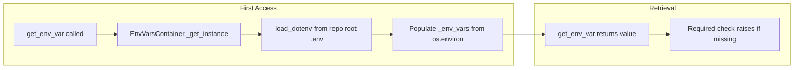

# Centralized Env Vars Loader Implementation Plan

## Remember

- Exact file paths always
- Exact commands with expected output
- DRY, YAGNI, TDD, frequent commits

---

## Overview

Introduce a single source of truth for environment variables in `lib/load_env_vars.py`. The loader will use a thread-safe singleton pattern (like [bluesky-research](https://github.com/METResearchGroup/bluesky-research/blob/main/lib/load_env_vars.py)) to load `.env` from the repo root once and expose `EnvVarsContainer.get_env_var(name, required=False)`. Supported vars: `OPENAI_API_KEY`, `BLUESKY_HANDLE`, `BLUESKY_PASSWORD`, `OPIK_WORKSPACE`. Call sites currently using `load_dotenv()` and `os.getenv()` will be migrated to use this loader.

---

## Happy Flow



1. On first `EnvVarsContainer.get_env_var(...)` call, the singleton initializes, loads `.env` from `(lib/load_env_vars.py parent / ../.env).resolve()`, and populates `_env_vars` from `os.environ`.
2. Callers ([lib/bluesky_client.py](lib/bluesky_client.py), [jobs/generate_profile_bios.py](jobs/generate_profile_bios.py), [ml_tooling/llm/providers/openai_provider.py](ml_tooling/llm/providers/openai_provider.py)) import `EnvVarsContainer` and call `get_env_var("VAR", required=True)` or `get_env_var("VAR")`.
3. Missing required vars raise `ValueError` with a clear message. Optional vars return `""` for str types.
4. No duplicate `load_dotenv()` calls; `.env` is loaded exactly once.

---

## Manual Verification

1. **Run env loader tests**

   ```bash
   uv run pytest tests/lib/test_load_env_vars.py -v
   ```
   Expected: All tests pass.

2. **Run full test suite**

   ```bash
   uv run pytest tests/ -v
   ```
   Expected: No regressions.

3. **Verify Bluesky client still works** (requires valid BLUESKY_HANDLE/BLUESKY_PASSWORD in `.env`)

   ```bash
   uv run python -c "
   from lib.bluesky_client import BlueskyClient
   c = BlueskyClient()
   print('Bluesky client initialized OK')
   "
   ```
   Expected: `Bluesky client initialized OK` (or a credential error if not configured).

4. **Verify OpenAI provider initializes**

   ```bash
   uv run python -c "
   from ml_tooling.llm.providers.openai_provider import OpenAIProvider
   p = OpenAIProvider()
   p.initialize()
   print('OpenAI provider initialized OK')
   "
   ```
   Expected: `OpenAI provider initialized OK` when OPENAI_API_KEY is set.

5. **Run pre-commit**

   ```bash
   uv run pre-commit run --all-files
   ```
   Expected: All hooks pass.
