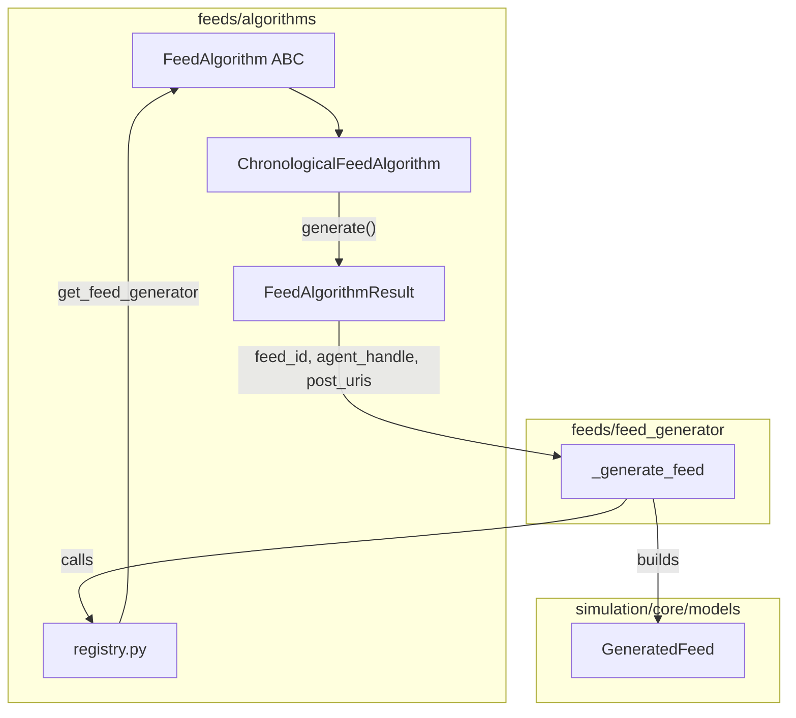

# Feed Algorithms Typing and Order Contract

## Remember

- Exact file paths always
- Exact commands with expected output
- DRY, YAGNI, TDD, frequent commits

---

## Overview

Migrate feed algorithms from returning raw `dict` to a typed `FeedAlgorithmResult` model, introduce a `FeedAlgorithm` ABC per [docs/RULES.md](docs/RULES.md) (prefer ABC to Protocol), and explicitly document that `post_uris` order is the feed display order with deterministic tie-breaking required. This aligns with RULES: "Prefer domain type aliases over Any", "Avoid using the Any type annotation", and "When a function returns a list... sort by a domain-natural key... treat ordering as part of the contract."

---

## Happy Flow

1. **Run creation** – Unchanged. `RunRequest` accepts `feed_algorithm`; validation via `feeds.algorithms.validators.validate_feed_algorithm`.
2. **Feed generation** – [feeds/feed_generator.py](feeds/feed_generator.py) calls `registry.get_feed_generator(feed_algorithm)` which returns a `FeedAlgorithm` instance. The algorithm's `generate()` returns `FeedAlgorithmResult` (not dict). `_generate_feed` constructs `GeneratedFeed` from the result's `feed_id`, `agent_handle`, `post_uris`.
3. **Order preservation** – `post_uris` in `FeedAlgorithmResult` is the feed order. `_hydrate_feed_items` and `query_service` already iterate `feed.post_uris` in order; no change to that flow.
4. **API exposure** – `GET /v1/simulations/feed-algorithms` unchanged; continues to use `get_registered_algorithms()`.

---

## Target Architecture




---

## Implementation Steps

### 1. Add FeedAlgorithmResult model

**File:** [feeds/algorithms/interfaces.py](feeds/algorithms/interfaces.py)

- Add `FeedAlgorithmResult` Pydantic model with required fields: `feed_id: str`, `agent_handle: str`, `post_uris: list[str]`.
- Add docstring: "Result of a feed ranking algorithm. post_uris is ordered: first element = top of feed. Implementations must use deterministic tie-breaking when scores/keys are equal."

---

### 2. Add FeedAlgorithm ABC

**File:** [feeds/algorithms/interfaces.py](feeds/algorithms/interfaces.py)

- Add `FeedAlgorithm` ABC with:
  - `@property` `metadata: FeedAlgorithmMetadata` (abstract)
  - `def generate(self, *, candidate_posts, agent, limit=20, **kwargs) -> FeedAlgorithmResult` (abstract)
- Remove the callable comment block.
- Docstring for `generate`: "Rank and select posts. Return post_uris in feed display order. Use deterministic tie-breaking (e.g. uri) when primary sort keys tie."

---

### 3. Migrate chronological implementation to class

**File:** [feeds/algorithms/implementations/chronological.py](feeds/algorithms/implementations/chronological.py)

- Create `ChronologicalFeedAlgorithm` class extending `FeedAlgorithm`.
- Implement `metadata` property returning existing `METADATA`.
- Implement `generate()` with existing logic; return `FeedAlgorithmResult(...)` instead of dict.
- For tie-breaking when `created_at` is equal: add secondary sort by `uri` (alphabetical) so output is deterministic.
- Keep `ALGORITHM_ID`, `MAX_POSTS_PER_FEED` as module-level constants.
- Export the class instance: `generate = ChronologicalFeedAlgorithm()` for registry compatibility during transition, or have registry store the instance directly.

---

### 4. Update registry

**File:** [feeds/algorithms/registry.py](feeds/algorithms/registry.py)

- Change `_ALGORITHM_LOOKUP` from `dict[str, tuple[Callable[..., dict], FeedAlgorithmMetadata]]` to `dict[str, FeedAlgorithm]`.
- `get_registered_algorithms()`: iterate `_ALGORITHM_LOOKUP.items()`, return `[(id, alg.metadata) for id, alg in ...]`.
- `get_feed_generator(algorithm: str) -> FeedAlgorithm`: return the `FeedAlgorithm` instance.
- Update type annotations throughout.

---

### 5. Update feed_generator to use FeedAlgorithmResult

**File:** [feeds/feed_generator.py](feeds/feed_generator.py)

- In `_generate_feed`: call `algorithm.generate(candidate_posts=..., agent=...)` (algorithm is now `FeedAlgorithm`).
- Replace `feed_dict["feed_id"]` etc. with `result.feed_id`, `result.agent_handle`, `result.post_uris`.
- No other logic changes.

---

### 6. Add order-preservation test

**File:** [tests/feeds/test_feed_generator.py](tests/feeds/test_feed_generator.py)

- In `test_generates_feed_with_chronological_algorithm` or a new test: verify that `result.post_uris` order matches expected (post3, post2, post1 for created_at desc).
- Add a test for deterministic tie-breaking: two posts with identical `created_at`; assert stable order (e.g. by uri).

---

### 7. Update runbook and exports

**File:** [docs/runbooks/HOW_TO_CREATE_NEW_FEED_RANKING_ALGORITHM.md](docs/runbooks/HOW_TO_CREATE_NEW_FEED_RANKING_ALGORITHM.md)

- Replace "return a dict" with "return FeedAlgorithmResult".
- Add "Ordering" section: "post_uris must be in feed display order. Use deterministic tie-breaking (e.g. uri) when primary sort keys tie."
- Update example implementations to use the ABC and `FeedAlgorithmResult`.
- Update "Common pitfalls" to mention ordering and tie-breaking.

**File:** [feeds/algorithms/**init**.py](feeds/algorithms/__init__.py)

- Export `FeedAlgorithmResult`, `FeedAlgorithm` from interfaces if not already re-exported.

---

## Manual Verification

- Run feed tests: `uv run pytest tests/feeds/ -v` — all pass.
- Run simulation/API tests: `uv run pytest tests/api/test_simulation_run.py tests/api/test_feed_algorithms.py -v` — all pass.
- Run full suite: `uv run pytest -v` — no regressions.
- Run pre-commit: `uv run pre-commit run --all-files` — passes.
- Start server: `uv run uvicorn simulation.api.main:app --reload`
- `curl -s http://localhost:8000/v1/simulations/feed-algorithms` — returns 200 with chronological algorithm.
- `curl -s -X POST http://localhost:8000/v1/simulations/run -H "Content-Type: application/json" -d '{"num_agents": 1, "num_turns": 1, "feed_algorithm": "chronological"}'` — returns 200.

---

## Alternative Approaches

- **Keep callables, only add FeedAlgorithmResult**: Simpler change; algorithms would remain functions returning the new type. Rejected because RULES explicitly prefer ABC for swappable implementations.
- **Return list[BlueskyFeedPost] instead of URIs**: Stronger typing but complicates persistence (GeneratedFeed stores URIs). Kept current design: algorithms return URIs, framework hydrates; focus on typing the return structure.
- **FeedAlgorithmResult in simulation.core.models.feeds**: Rejected; it is an algorithm output contract, not a persisted domain entity. Lives in feeds/algorithms/interfaces.py next to the ABC.

---

## Plan Asset Path

```
docs/plans/2026-02-20_feed_algorithms_typing_order_a1b2c3/
```

(Backend-only; no UI screenshots required.)