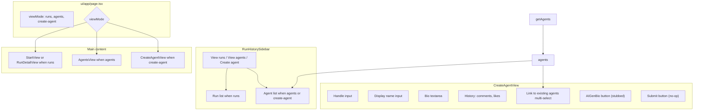

# Create New Agent Tab Implementation Plan

## Remember

- Exact file paths always
- Exact commands with expected output
- DRY, YAGNI, TDD, frequent commits
- Follow [docs/runbooks/LOCAL_DEV_AUTH.md](docs/runbooks/LOCAL_DEV_AUTH.md) and [docs/runbooks/LOCAL_DEVELOPMENT.md](docs/runbooks/LOCAL_DEVELOPMENT.md) for local dev setup (auth bypass, API startup)

---

## Overview

Add a third tab "Create agent" at the top-left of the simulation UI alongside "View runs" and "View agents". When selected, the main area shows a create-agent form where users can enter handle, display name, bio, history (comments and likes), and optionally link to existing agents. The form includes a stubbed "Create AI-generated bio" button and a no-op Submit button. This is UI-only: no API calls, no persistence. Reuses existing `getAgents()` for the "link to existing profiles" multi-select and follows the patterns established in [ConfigForm](ui/components/form/ConfigForm.tsx) and [RunHistorySidebar](ui/components/sidebars/RunHistorySidebar.tsx).

---

## Architecture




---

## Happy Flow

1. User is on simulation page (authenticated). Top-left shows "View runs" | "View agents" | "Create agent" toggle.
2. User clicks "Create agent". Sidebar switches to agent list (same as View agents; for reference and linking). Main area shows CreateAgentView form.
3. CreateAgentView receives `agents`, `agentsLoading`, `agentsError` from `useSimulationPageState` (same as AgentsView).
4. User fills handle, display name, bio; optionally adds comments/likes and selects existing agents to link.
5. User may click "Create AI-generated bio" (no-op, stubbed).
6. User clicks Submit (no-op; can `console.log` form state for debugging).
7. Form uses same design tokens (beige, accent) and layout patterns as ConfigForm.

---

## File Changes

### 1. ViewMode and Hook

- **File:** [ui/hooks/useSimulationPageState.ts](ui/hooks/useSimulationPageState.ts)
  - Extend `ViewMode` type to `'runs' | 'agents' | 'create-agent'`.
  - When `handleSetViewMode('create-agent')`, clear `selectedAgentHandle` (or leave as-is if user wants to reference selected agent). Recommend clearing for clean create flow.
  - No new handlers; `handleSetViewMode` already accepts ViewMode.

### 2. Sidebar

- **File:** [ui/components/sidebars/RunHistorySidebar.tsx](ui/components/sidebars/RunHistorySidebar.tsx)
  - Add third button "Create agent" to the toggle row.
  - When `viewMode === 'create-agent'`:
    - Header text: "Create New Agent" (instead of "Agents").
    - Render agent list (same as `viewMode === 'agents'`) for reference and for "link to existing profiles" in the form.
  - Reuse existing loading/error/empty/retry patterns per [docs/RULES.md](docs/RULES.md) Frontend Consistency.

### 3. CreateAgentView Component

- **File:** Create `ui/components/agents/CreateAgentView.tsx`
  - **Props:** `agents`, `agentsLoading`, `agentsError` (no submit handler; Submit is no-op).
  - **Form sections:**
    - Handle (text input, required)
    - Display name (text input, required)
    - Bio (textarea)
    - History: CollapsibleSection with:
      - Comments: list of `{ text: string; postUri?: string }`; Add/remove rows
      - Likes: list of post URIs; tag-style or "one per line" textarea
    - Link to existing profiles: multi-select from `agents` (handles)
    - Button "Create AI-generated bio" (onClick: stubbed, e.g. `() => {}` or `console.log('stub')`)
    - Submit button (onClick: `console.log(formState)` or no-op)
  - Follow [ConfigForm](ui/components/form/ConfigForm.tsx) layout: centered, `max-w-md` or `max-w-lg`, `space-y-6`, same input/button classes.
  - Reuse [CollapsibleSection](ui/components/details/CollapsibleSection.tsx) for History and optionally Link section.
  - Loading: when `agentsLoading`, show LoadingSpinner or disable multi-select; when `agentsError`, show error message.

### 4. Page Layout

- **File:** [ui/app/page.tsx](ui/app/page.tsx)
  - Add branch: when `viewMode === 'create-agent'`, render `CreateAgentView` with `agents`, `agentsLoading`, `agentsError`.
  - Order: `create-agent` check before `agents` check so routing is correct.

---

## Manual Verification

Follow [docs/runbooks/LOCAL_DEV_AUTH.md](docs/runbooks/LOCAL_DEV_AUTH.md) and [docs/runbooks/LOCAL_DEVELOPMENT.md](docs/runbooks/LOCAL_DEVELOPMENT.md) for auth bypass and API startup.

1. **Before screenshots**
  - Start backend per LOCAL_DEVELOPMENT.md: `PYTHONPATH=. uv run uvicorn simulation.api.main:app --reload`. Optionally use `DISABLE_AUTH=1` per LOCAL_DEV_AUTH.md.
  - Run `cd ui && npm run dev`.
  - Capture current UI: sidebar with View runs | View agents, run list, and main content. Save to `docs/plans/2026-02-23_create_agent_tab_<hash>/images/before/`.
2. **Create agent tab**
  - Click "Create agent". Sidebar shows agent list; header shows "Create New Agent".
  - Main area shows CreateAgentView form with Handle, Display name, Bio, History (comments, likes), Link to existing profiles, "Create AI-generated bio" button, Submit.
3. **Form interactions**
  - Fill handle and display name; add a comment; add a liked post URI; select an existing agent in multi-select.
  - Click "Create AI-generated bio" (nothing happens; stubbed).
  - Click Submit (no-op; optional: verify `console.log` output).
4. **Navigation**
  - Switch to "View agents", then back to "Create agent"; form state may reset (acceptable).
  - Switch to "View runs"; run list and Start New Run appear.
5. **Tests and lint**
  - `cd ui && npm run lint` (no errors).
  - `uv run pytest tests/ -v -x -q` (existing tests pass).
  - `uv run pre-commit run --all-files` (pass).
6. **After screenshots**
  - Capture new UI: Create agent tab with form visible, sidebar showing agent list. Save to `docs/plans/2026-02-23_create_agent_tab_<hash>/images/after/`.

---

## Alternative Approaches

- **Nested under View agents:** A "Create new" button within agents mode (like "Start New Run" under runs). Rejected: user requested a dedicated tab for clearer separation.
- **Separate route (e.g. /agents/create):** Rejected; toggle keeps a single-page flow consistent with View runs / View agents.
- **Profiles API for linking:** Backend has Bluesky profiles but no GET /profiles endpoint. Use existing `getAgents()` and label "Link to existing agents" for now; profiles API can be added later.

---

## Plan Asset Storage

```
docs/plans/2026-02-23_create_agent_tab_<6-digit hash>/
├── create_agent_tab.plan.md (this plan)
└── images/
    ├── before/
    │   └── (current UI screenshots)
    └── after/
        └── (new UI screenshots)
```
