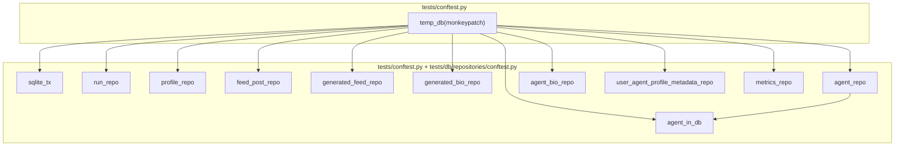

# DB Test Fixtures Consolidation Plan

## Remember

- Exact file paths always
- Exact commands with expected output
- DRY, YAGNI, TDD, frequent commits

---

## Overview

Add repository fixtures and `ensure_run_exists` to `tests/db/repositories/conftest.py`, remove all local `temp_db` definitions in favor of the root `temp_db` from `tests/conftest.py`, and refactor integration tests to use fixtures instead of in-test `create_sqlite_*_repository(transaction_provider=SqliteTransactionProvider())`. This eliminates ~80+ repeated setup lines across 10 test files.

**Status:** Complete.

**Path:** `docs/plans/2026-02-23_db_test_fixtures_consolidation_56cf5a/`

---

## Scope (Completed)

### Add / modify fixtures

| File | Change |
|------|--------|
| `tests/db/repositories/conftest.py` | Add `ensure_run_exists`, `agent_in_db`, `agent_in_db_meta` |
| `tests/conftest.py` | Add `sqlite_tx` and 9 repo fixtures (`run_repo`, `profile_repo`, etc.) |

### Remove local temp_db (use root)

| File | Action |
|------|--------|
| `tests/db/repositories/test_agent_repository_integration.py` | Removed; use root |
| `tests/db/repositories/test_agent_bio_repository_integration.py` | Removed; use root |
| `tests/db/repositories/test_user_agent_profile_metadata_repository_integration.py` | Removed; use root |
| `tests/db/adapters/sqlite/test_sqlite.py` | Removed; use root |
| `tests/jobs/test_migrate_agents_to_new_schema.py` | Removed; use root |

### Replace in-test repo creation with fixtures

| File | Fixture(s) used |
|------|-----------------|
| `tests/db/repositories/test_run_repository_integration.py` | `run_repo` |
| `tests/db/repositories/test_profile_repository_integration.py` | `profile_repo` |
| `tests/db/repositories/test_feed_post_repository_integration.py` | `feed_post_repo` |
| `tests/db/repositories/test_generated_feed_repository_integration.py` | `generated_feed_repo`, `ensure_run_exists` |
| `tests/db/repositories/test_generated_bio_repository_integration.py` | `generated_bio_repo` |
| `tests/db/repositories/test_agent_repository_integration.py` | `agent_repo` |
| `tests/db/repositories/test_agent_bio_repository_integration.py` | `agent_repo`, `agent_bio_repo`, `agent_in_db` |
| `tests/db/repositories/test_user_agent_profile_metadata_repository_integration.py` | `user_agent_profile_metadata_repo`, `agent_in_db_meta` |
| `tests/db/repositories/test_metrics_repository_integration.py` | `run_repo`, `metrics_repo` |
| `tests/jobs/test_migrate_agents_to_new_schema.py` | `profile_repo`, `generated_bio_repo`, `agent_repo`, `agent_bio_repo`, `user_agent_profile_metadata_repo` |

---

## Happy Flow

1. Test requests a fixture (e.g. `generated_feed_repo`).
2. Pytest resolves `generated_feed_repo` → depends on `temp_db` and `sqlite_tx`.
3. `temp_db` (root) runs first: creates temp file, monkeypatches `DB_PATH` and `SIM_DB_PATH`, runs `initialize_database()`.
4. `sqlite_tx` returns `SqliteTransactionProvider()`.
5. `generated_feed_repo` calls `create_sqlite_generated_feed_repository(transaction_provider=sqlite_tx)` and returns the repo.
6. Test uses `repo`; no in-test repo creation.

---

## Manual Verification

1. **Run all DB tests:** `uv run pytest tests/db/ -v` – Expected: All 327 tests pass.
2. **Run migration job test:** `uv run pytest tests/jobs/test_migrate_agents_to_new_schema.py -v` – Expected: All tests pass.
3. **Run adapters sqlite tests:** `uv run pytest tests/db/adapters/sqlite/test_sqlite.py -v` – Expected: All tests pass.
4. **Run full test suite:** `uv run pytest -v` – Expected: All tests pass (excluding pre-existing env-var failures).
5. **Linters:** `uv run ruff check tests/db tests/jobs && uv run ruff format --check tests/db tests/jobs && uv run pyright .` – Expected: No errors.

---

## Alternative Approaches

- **Per-file conftest.py:** Each test directory could have its own conftest with repo fixtures. Rejected: repo fixtures are shared across many repository tests; centralizing keeps things DRY.
- **Parametrized `agent_in_db`:** A single fixture parametrized by agent data. Rejected: adds complexity; two explicit fixtures (`agent_in_db`, `agent_in_db_meta`) are clearer.
- **Factory fixture:** A fixture returning `create_sqlite_X_repository`. Rejected: still requires one fixture per repo type; tests would call the factory, which saves little vs. a direct repo fixture.
