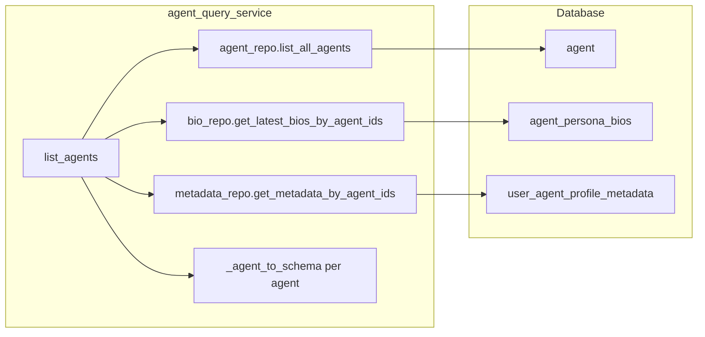

# list_agents N+1 Batch Fetch Implementation Plan

## Remember

- Exact file paths always
- Exact commands with expected output
- DRY, YAGNI, TDD, frequent commits

---

## Overview

[simulation/api/services/agent_query_service.py](simulation/api/services/agent_query_service.py) currently performs 1 + 2N DB queries for N agents: one for `list_all_agents()`, then per-agent calls to `get_latest_agent_bio()` and `get_by_agent_id()`. This plan adds batch methods to the bio and metadata repositories, refactors `list_agents()` to batch-fetch once, removes the redundant `sorted()` (since `list_all_agents()` already orders by handle), and adds comments marking extension points for caching or async batching.

---

## Happy Flow

1. Client calls `GET /v1/simulations/agents` → route delegates to `list_agents()`.
2. `list_agents()` calls `agent_repo.list_all_agents()` (1 query, ordered by handle).
3. Extract `agent_ids` from agents; call `bio_repo.get_latest_bios_by_agent_ids(agent_ids)` (1 query) and `metadata_repo.get_metadata_by_agent_ids(agent_ids)` (1 query).
4. Build `bio_map` and `metadata_map` keyed by `agent_id`.
5. For each agent, call `_agent_to_schema(agent, bio_map, metadata_map)` (no DB calls).
6. Return list in handle order (no sort needed).



---

## Implementation Steps

### 1. Add batch methods to interfaces

**File:** [db/repositories/interfaces.py](db/repositories/interfaces.py)

- Add `Iterable` to imports (already present).
- In `AgentBioRepository` (after `list_agent_bios`, around line 64):

```python
@abstractmethod
def get_latest_bios_by_agent_ids(
    self, agent_ids: Iterable[str]
) -> dict[str, AgentBio | None]:
    """Return the latest bio per agent_id for the given agent IDs.

    Keys are agent_ids; value is the latest AgentBio or None if none exists.
    Missing agent_ids are omitted; caller should treat absence as None.
    """
    raise NotImplementedError
```

- In `UserAgentProfileMetadataRepository` (after `get_by_agent_id`, around line 80):

```python
@abstractmethod
def get_metadata_by_agent_ids(
    self, agent_ids: Iterable[str]
) -> dict[str, UserAgentProfileMetadata | None]:
    """Return metadata per agent_id for the given agent IDs.

    Keys are agent_ids; value is metadata or None if none exists.
    """
    raise NotImplementedError
```

---

### 2. Add adapter interfaces

**File:** [db/adapters/base.py](db/adapters/base.py)

- In `AgentBioDatabaseAdapter` (after `read_agent_bios_by_agent_id`, around line 738):

```python
@abstractmethod
def read_latest_agent_bios_by_agent_ids(
    self, agent_ids: Iterable[str], *, conn: object
) -> dict[str, AgentBio | None]:
    """Read the latest bio per agent_id for the given agent IDs.

    Returns dict mapping agent_id -> AgentBio | None.
    """
    raise NotImplementedError
```

- In `UserAgentProfileMetadataDatabaseAdapter` (after `read_by_agent_id`, around line 763):

```python
@abstractmethod
def read_metadata_by_agent_ids(
    self, agent_ids: Iterable[str], *, conn: object
) -> dict[str, UserAgentProfileMetadata | None]:
    """Read metadata for the given agent IDs.

    Returns dict mapping agent_id -> metadata | None.
    """
    raise NotImplementedError
```

- Add `from collections.abc import Iterable` if not present.

---

### 3. Implement SQLite bio adapter

**File:** [db/adapters/sqlite/agent_bio_adapter.py](db/adapters/sqlite/agent_bio_adapter.py)

Add `read_latest_agent_bios_by_agent_ids` and extension comment.

---

### 4. Implement SQLite metadata adapter

**File:** [db/adapters/sqlite/user_agent_profile_metadata_adapter.py](db/adapters/sqlite/user_agent_profile_metadata_adapter.py)

Add `read_metadata_by_agent_ids` and extension comment.

---

### 5. Implement repository methods

**File:** [db/repositories/agent_bio_repository.py](db/repositories/agent_bio_repository.py)

Add `get_latest_bios_by_agent_ids`.

**File:** [db/repositories/user_agent_profile_metadata_repository.py](db/repositories/user_agent_profile_metadata_repository.py)

Add `get_metadata_by_agent_ids`.

---

### 6. Refactor agent_query_service

**File:** [simulation/api/services/agent_query_service.py](simulation/api/services/agent_query_service.py)

- Replace `list_agents()` body to batch-fetch bios and metadata, build maps, use `_agent_to_schema`.
- Replace `_get_single_agent` with `_agent_to_schema` using pre-fetched maps.
- Remove redundant `sorted()`.

---

## Manual Verification

1. **Run existing agent tests (must pass):**

   ```bash
   uv run pytest tests/api/test_simulation_agents.py -v
   ```

   Expected: all tests pass (especially `test_get_simulations_agents_returns_list`, `test_get_simulations_agents_ordering_deterministic`, `test_post_simulations_agents_then_get_includes_new_agent`).

2. **Run full test suite:**

   ```bash
   uv run pytest
   ```

   Expected: all tests pass.

3. **Run pre-commit:**

   ```bash
   uv run pre-commit run --all-files
   ```

   Expected: no failures.

4. **Smoke test API:**
   - Start API: `PYTHONPATH=. uv run uvicorn simulation.api.main:app --reload`
   - `curl http://localhost:8000/v1/simulations/agents` returns 200 with JSON list; agents ordered by handle.

5. **Verify behavior unchanged:**
   - POST an agent via API; GET /agents returns it with correct bio, followers, etc.

---

## Alternative Approaches

- **Single-transaction only:** Run the loop inside one transaction. Still 2N queries; does not fix N+1.
- **read_all then filter in Python:** Add `read_all_agent_bios` / `read_all_metadata` and filter by agent_ids. Works but fetches more rows than needed when tables are large; batch-by-ids is more efficient.
