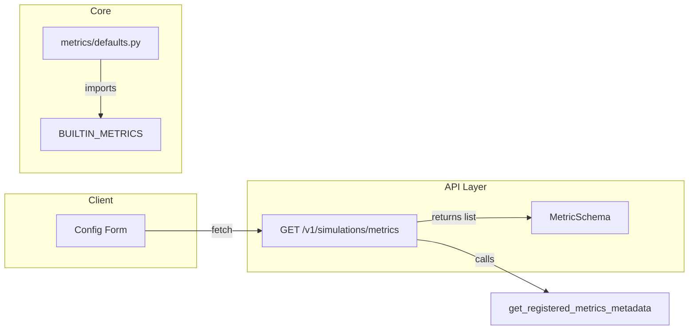

# Metrics Metadata API – Implementation Plan

## Remember

- Exact file paths always
- Exact commands with expected output
- DRY, YAGNI, TDD, frequent commits

---

## Overview

Add a read-only API endpoint `GET /v1/simulations/metrics` that returns metadata for all built-in metrics. Each metric exposes `KEY`, `DESCRIPTION`, `SCOPE`, and `AUTHOR` as class attributes; the endpoint will surface these for the UI without instantiating metric classes. This mirrors the existing feed-algorithms endpoint and is required before the UI can implement a metrics selector component.

---

## Architecture



**Data flow:** Route receives GET → calls `get_registered_metrics_metadata()` from core → maps to `MetricSchema` → returns JSON list, sorted by key for deterministic output.

---

## Happy Flow

1. Client requests `GET /v1/simulations/metrics` with auth header.
2. Route handler `get_simulation_metrics` delegates to `_execute_get_metrics` (async wrapper).
3. `_execute_get_metrics` runs `_get_metrics_list()` via `asyncio.to_thread`.
4. `_get_metrics_list` calls `get_registered_metrics_metadata()` from [simulation/core/metrics/defaults.py](simulation/core/metrics/defaults.py), maps each `(key, description, scope, author)` to `MetricSchema`, and sorts by `key`.
5. Response returns `list[MetricSchema]` with fields: `key`, `description`, `scope` (string: "turn" or "run"), `author`.
6. Built-in metrics included: `turn.actions.counts_by_type`, `turn.actions.total`, `run.actions.total_by_type`, `run.actions.total`.

---

## Implementation Steps

### 1. Add `get_registered_metrics_metadata` to core metrics

**File:** [simulation/core/metrics/defaults.py](simulation/core/metrics/defaults.py)

Add a public function returning metadata for all builtins:

```python
def get_registered_metrics_metadata() -> list[tuple[str, str, MetricScope, str]]:
    """Return (key, description, scope, author) for all builtin metrics, sorted by key."""
```

- Iterate over `BUILTIN_METRICS` and extract `KEY`, `DESCRIPTION`, `SCOPE`, `AUTHOR` from each class.
- Return list of tuples sorted by key (per RULES: deterministic ordering).

### 2. Add `MetricSchema` to API schemas

**File:** [simulation/api/schemas/simulation.py](simulation/api/schemas/simulation.py)

Add Pydantic model (no domain imports; scope as string):

```python
class MetricSchema(BaseModel):
    """API response for GET /v1/simulations/metrics."""
    key: str
    description: str
    scope: str  # "turn" | "run"
    author: str
```

Place near `FeedAlgorithmSchema` (around line 42).

### 3. Add route and execution logic

**File:** [simulation/api/routes/simulation.py](simulation/api/routes/simulation.py)

- Add constant: `SIMULATION_METRICS_ROUTE: str = "GET /v1/simulations/metrics"`.
- Add route handler `get_simulation_metrics` at `/simulations/metrics`:
  - `response_model=list[MetricSchema]`, status 200.
  - Use `log_route_completion_decorator(route=SIMULATION_METRICS_ROUTE, success_type=list)`.
  - Delegate to `_execute_get_metrics(request)`.
- Add `_get_metrics_list() -> list[MetricSchema]`:
  - Call `get_registered_metrics_metadata()` from `simulation.core.metrics.defaults`.
  - Map each tuple to `MetricSchema(key=..., description=..., scope=scope.value, author=...)`.
  - Return sorted list (already sorted from core; no extra sort needed if core returns sorted).
- Add `_execute_get_metrics(request) -> list[MetricSchema] | Response`:
  - Use `@timed(attach_attr="duration_ms", log_level=None)`.
  - `await asyncio.to_thread(_get_metrics_list)`.
  - On exception: log, return `_error_response(500, "INTERNAL_ERROR", ...)`.

Mirror the pattern used for `get_simulation_feed_algorithms` (lines 49–63, 180–205).

### 4. Add tests

**File:** `tests/api/test_metrics.py` (new)

- `test_get_metrics_returns_list`: GET returns 200 with a list of at least 4 items.
- `test_get_metrics_includes_builtins`: Each of `turn.actions.counts_by_type`, `turn.actions.total`, `run.actions.total_by_type`, `run.actions.total` is present with expected `description`, `scope`, `author`.
- `test_get_metrics_ordering_deterministic`: Result is sorted by `key`.
- `test_get_metrics_schema_shape`: Each item has `key`, `description`, `scope`, `author` as strings; `scope` in `{"turn", "run"}`.

Use `simulation_client` fixture (same as [tests/api/test_feed_algorithms.py](tests/api/test_feed_algorithms.py)). Auth required; tests should use the same auth setup as other simulation API tests.

---

## Manual Verification

1. **Run API tests:**  
   `uv run pytest tests/api/test_metrics.py -v`  
   Expected: All 4 tests pass.

2. **Run full test suite:**  
   `uv run pytest`  
   Expected: No regressions.

3. **Pre-commit:**  
   `uv run pre-commit run --all-files`  
   Expected: All hooks pass.

4. **Manual API check (optional):**  
   Start API: `PYTHONPATH=. uv run uvicorn simulation.api.main:app --reload`  
   Then: `curl -H "Authorization: Bearer <token>" http://localhost:8000/v1/simulations/metrics`  
   Expected: JSON array of metric objects with `key`, `description`, `scope`, `author`.

5. **Smoke test (if applicable):**  
   `SIMULATION_API_URL=http://localhost:8000 uv run pytest -m smoke tests/api/test_simulation_smoke.py`

---

## Alternative Approaches

- **Optional service layer:** Logic could live in `simulation.api.services.metrics_query_service`. The feed-algorithms endpoint keeps logic in the route module with a private helper. For consistency and minimal scope, we keep the same pattern; a service can be extracted later if needed.
- **Using MetricsRegistry:** The registry is built from `BUILTIN_METRICS` and used for computation. Listing metadata does not require the registry—iterating over `BUILTIN_METRICS` is simpler and avoids coupling the API to the registry's construction.

---

## Files Touched

| File | Change |
|------|--------|
| [simulation/core/metrics/defaults.py](simulation/core/metrics/defaults.py) | Add `get_registered_metrics_metadata()` |
| [simulation/api/schemas/simulation.py](simulation/api/schemas/simulation.py) | Add `MetricSchema` |
| [simulation/api/routes/simulation.py](simulation/api/routes/simulation.py) | Add route, `_get_metrics_list`, `_execute_get_metrics` |
| `tests/api/test_metrics.py` | New file: 4 tests |

---

## Built-in Metrics Reference

| Key | Scope | Description | Author |
|-----|-------|-------------|--------|
| `turn.actions.counts_by_type` | turn | Count of actions per turn, by action type. | platform |
| `turn.actions.total` | turn | Total number of actions in a turn. | platform |
| `run.actions.total_by_type` | run | Aggregated action counts across all turns, by type. | platform |
| `run.actions.total` | run | Total number of actions in the run. | platform |
