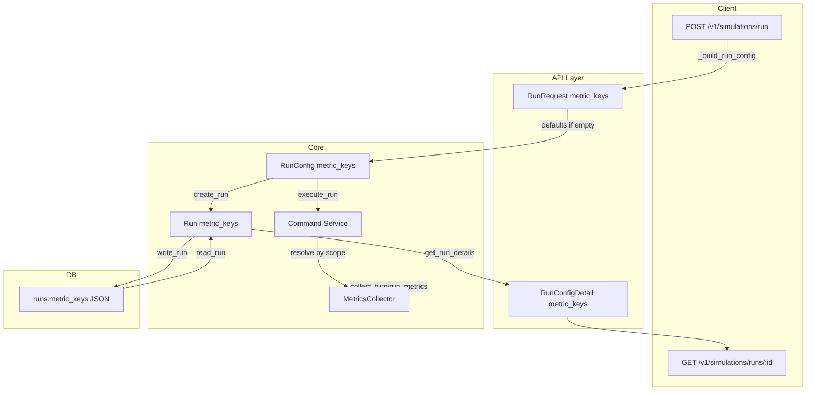

# Run Config and Execution – Per-Run Metric Selection

## Remember

- Exact file paths always
- Exact commands with expected output
- DRY, YAGNI, TDD, frequent commits

---

## Overview

Add per-run metric selection and persistence to the backend. Clients will be able to choose which metrics to track for each simulation run via optional `metric_keys` in the request body. The API persists the selection with the run and uses it when collecting turn and run metrics during execution. When `metric_keys` is omitted or empty, the system falls back to `DEFAULT_TURN_METRIC_KEYS` and `DEFAULT_RUN_METRIC_KEYS` from [simulation/core/metrics/defaults.py](simulation/core/metrics/defaults.py). This enables the UI (Part 3) to power a metrics selector.

---

## Architecture



**Data flow:** Request body includes optional `metric_keys`. API layer applies defaults (empty/None -> default keys). Core builds `RunConfig` with explicit `metric_keys`. Run repository persists `metric_keys` in runs table. Command service resolves `metric_keys` to turn/run lists by scope and passes them to `MetricsCollector`. Run details API returns `metric_keys` in config.

---

## Happy Flow

1. Client sends `POST /v1/simulations/run` with optional `metric_keys: ["turn.actions.counts_by_type", "turn.actions.total", "run.actions.total"]`.
2. `RunRequest` validates `metric_keys` against the registry; invalid keys raise validation error.
3. [run_execution_service.py](simulation/api/services/run_execution_service.py) `_build_run_config` applies defaults when `metric_keys` is None or `[]`: use `sorted(set(DEFAULT_TURN_METRIC_KEYS + DEFAULT_RUN_METRIC_KEYS))`.
4. `run_repo.create_run(config)` creates a `Run` with `metric_keys`; [run_adapter.py](db/adapters/sqlite/run_adapter.py) persists to new `metric_keys` column (JSON).
5. Command service resolves `run_config.metric_keys` to `(turn_keys, run_keys)` via `resolve_metric_keys_by_scope`; passes them to `collect_turn_metrics` and `collect_run_metrics`.
6. [collector.py](simulation/core/metrics/collector.py) uses passed keys when provided; otherwise instance defaults.
7. `get_run_details` returns `RunConfigDetail` with `metric_keys` from persisted run.
8. Ordering: sort `metric_keys` when persisting and in responses (deterministic per RULES).

---

## Implementation Steps

### 1. Metric validation and scope resolution

**[simulation/core/metrics/defaults.py](simulation/core/metrics/defaults.py)**

- Add `REGISTERED_METRIC_KEYS: frozenset[str] = frozenset(m.KEY for m in BUILTIN_METRICS)`.
- Add `resolve_metric_keys_by_scope(metric_keys: list[str]) -> tuple[list[str], list[str]]`: look up each key's `SCOPE` in `BUILTIN_METRICS`; return `(turn_keys, run_keys)` sorted. Raise `ValueError` for unknown key.

**[simulation/core/validators.py](simulation/core/validators.py)**

- Add `validate_metric_keys(metric_keys: list[str] | None) -> list[str] | None`: if None or empty, return None. Otherwise validate each key in `REGISTERED_METRIC_KEYS`; raise `ValueError` with first invalid key. Return list unchanged.

### 2. Core models

**[simulation/core/models/runs.py](simulation/core/models/runs.py)**

- Add `metric_keys: list[str] | None = None` to `RunConfig` with `@field_validator` calling `validate_metric_keys` when non-None, non-empty.
- Add `metric_keys: list[str]` to `Run` (required); validator ensures non-empty and valid. Per RULES: core stays explicit; API layer supplies defaults before constructing `RunConfig`.

### 3. API schemas

**[simulation/api/schemas/simulation.py](simulation/api/schemas/simulation.py)**

- Add `metric_keys: list[str] | None = None` to `RunRequest` with `@field_validator`.
- Add `metric_keys: list[str]` to `RunConfigDetail`.

### 4. API defaults

**[simulation/api/services/run_execution_service.py](simulation/api/services/run_execution_service.py)**

- In `_build_run_config`: when `request.metric_keys` is None or `[]`, set `metric_keys = sorted(set(DEFAULT_TURN_METRIC_KEYS + DEFAULT_RUN_METRIC_KEYS))`; otherwise use validated `request.metric_keys`. Pass `metric_keys` to `RunConfig` (never None so core receives explicit list).

### 5. Database migration

**[db/schema.py](db/schema.py)**

- Add `sa.Column("metric_keys", sa.Text(), nullable=True)` to `runs` table.

**New migration** in `db/migrations/versions/`

- Add `metric_keys` column (nullable).
- Backfill: for rows where `metric_keys IS NULL`, set to `'["turn.actions.counts_by_type","turn.actions.total","run.actions.total_by_type","run.actions.total"]'` (JSON array, sorted).
- Create via: `uv run python -m alembic -c pyproject.toml revision --autogenerate -m "add metric_keys to runs"` then edit for backfill.

### 6. Run adapter

**[db/adapters/sqlite/run_adapter.py](db/adapters/sqlite/run_adapter.py)**

- `_row_to_run`: read `metric_keys`; if NULL or empty, use default list. Parse JSON and pass to `Run`.
- `write_run`: include `metric_keys`; serialize as `json.dumps(sorted(run.metric_keys))`.

### 7. Run repository

**[db/repositories/run_repository.py](db/repositories/run_repository.py)**

- `create_run`: build `Run` with `metric_keys = config.metric_keys`; when None/empty, use `sorted(set(DEFAULT_TURN_METRIC_KEYS + DEFAULT_RUN_METRIC_KEYS))`.

### 8. MetricsCollector

**[simulation/core/metrics/collector.py](simulation/core/metrics/collector.py)**

- `collect_turn_metrics`: add `turn_metric_keys: list[str] | None = None`; use when provided, else `self._turn_metric_keys`.
- `collect_run_metrics`: add `run_metric_keys: list[str] | None = None`; same pattern.

### 9. Command service

**[simulation/core/command_service.py](simulation/core/command_service.py)**

- At start of `execute_run`: `turn_keys, run_keys = resolve_metric_keys_by_scope(run_config.metric_keys)`.
- Pass `turn_keys` into `simulate_turns` (add param) and `simulate_turn` / `_simulate_turn`; pass `turn_metric_keys=turn_keys` to `collect_turn_metrics`.
- Pass `run_metric_keys=run_keys` to `collect_run_metrics` after simulate_turns.

### 10. Run query service

**[simulation/api/services/run_query_service.py](simulation/api/services/run_query_service.py)**

- In `get_run_details`, build `RunConfigDetail` with `metric_keys=run.metric_keys`. Handle legacy: if NULL from DB, use default list.

---

## Edge Cases

- **Metric dependencies:** `_resolve_order` auto-includes dependencies; validation rejects unknown keys.
- **Empty selection:** `metric_keys=None` or `[]` -> use defaults at API boundary.
- **Determinism:** Sort `metric_keys` when persisting and returning.
- **Legacy runs:** NULL -> adapter returns default list.

---

## Manual Verification

1. **Migrations:**
   `uv run python -m alembic -c pyproject.toml upgrade head`  
   Expected: migration applies; no errors.

2. **Tests:**
   `uv run pytest`  
   Expected: all pass.

3. **Pre-commit:**
   `uv run pre-commit run --all-files`  
   Expected: all hooks pass.

4. **Custom metrics:**
   Start API, then:

```bash
curl -X POST http://localhost:8000/v1/simulations/run \
  -H "Content-Type: application/json" -H "Authorization: Bearer <token>" \
  -d '{"num_agents": 2, "num_turns": 1, "metric_keys": ["turn.actions.counts_by_type", "run.actions.total"]}'
```

   Expected: run created; details return requested keys.

5. **Defaults:**
   Same without `metric_keys`. Expected: run uses all four built-ins.

6. **Invalid key:**
   `metric_keys: ["unknown.metric"]`. Expected: 422 validation error.

7. **Smoke:**
   `SIMULATION_API_URL=http://localhost:8000 uv run pytest -m smoke tests/api/test_simulation_smoke.py`

---

## Alternative Approaches

- **Separate turn/run keys in request:** Single `metric_keys` list is simpler; scope derivation is straightforward.
- **Validation in Pydantic only:** Shared `validate_metric_keys` keeps validation centralized for CLI/future callers.
- **MetricsCollector per run:** Optional params on collect methods are lighter than building a new collector per run and preserve existing DI.

---

## Tests to Add

- API: request with/without `metric_keys`; invalid key -> 422; details return correct keys.
- Core: `resolve_metric_keys_by_scope` splits correctly; unknown key raises.
- Collector: optional `turn_metric_keys`/`run_metric_keys` override instance defaults.
- DB: write/read run with `metric_keys`; NULL handling.

---

## Files Touched

| File | Change |
|------|--------|
| [simulation/core/metrics/defaults.py](simulation/core/metrics/defaults.py) | `REGISTERED_METRIC_KEYS`, `resolve_metric_keys_by_scope` |
| [simulation/core/validators.py](simulation/core/validators.py) | `validate_metric_keys` |
| [simulation/core/models/runs.py](simulation/core/models/runs.py) | `metric_keys` on RunConfig, Run |
| [simulation/api/schemas/simulation.py](simulation/api/schemas/simulation.py) | `metric_keys` on RunRequest, RunConfigDetail |
| [simulation/api/services/run_execution_service.py](simulation/api/services/run_execution_service.py) | Defaults in `_build_run_config` |
| [simulation/api/services/run_query_service.py](simulation/api/services/run_query_service.py) | `metric_keys` in RunConfigDetail |
| [db/schema.py](db/schema.py) | `metric_keys` column |
| `db/migrations/versions/*_add_metric_keys_to_runs.py` | New migration + backfill |
| [db/adapters/sqlite/run_adapter.py](db/adapters/sqlite/run_adapter.py) | Read/write metric_keys |
| [db/repositories/run_repository.py](db/repositories/run_repository.py) | Pass metric_keys in create_run |
| [simulation/core/metrics/collector.py](simulation/core/metrics/collector.py) | Optional params on collect methods |
| [simulation/core/command_service.py](simulation/core/command_service.py) | Resolve keys, pass to collector |
