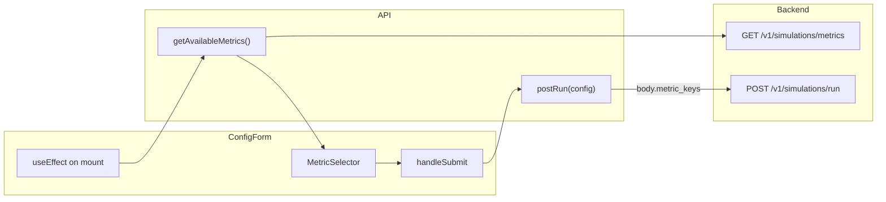

# Part 3: UI – Metrics Selector Component

## Remember

- Exact file paths always
- Exact commands with expected output
- DRY, YAGNI, TDD, frequent commits

---

## Prerequisites

- **Part 1 (PR #124):** `GET /v1/simulations/metrics` returns `list[MetricSchema]` with `key`, `display_name`, `description`, `scope`, `author`. Implemented. `display_name` is required (UI-friendly name per metric).
- **Part 2 (PR #127):** `POST /v1/simulations/run` accepts optional `metric_keys`; run details return `metric_keys`. Implemented.

---

## Architecture

**Data flow:** ConfigForm loads metrics on mount (same request-id pattern as feed algorithms). User toggles selection in MetricSelector. On submit, RunConfig includes `metricKeys`; `postRun` sends `metric_keys` in the request body. Backend applies defaults when omitted; when sent, backend validates and persists.

---

## Happy Flow

1. User opens Start New Simulation. ConfigForm mounts and calls `getAvailableMetrics()` (same pattern as [ui/components/form/ConfigForm.tsx](ui/components/form/ConfigForm.tsx) for `getFeedAlgorithms()`).
2. Metrics load; state holds `Metric[]` and `selectedMetricKeys: string[]`. Initial selection: all returned keys (matches backend default). If `defaultConfig.metricKeys` is present (e.g. from run details in Part 4), use that instead.
3. User sees a collapsible "Metrics" section. Expanded: two sub-sections "Turn-level metrics" and "Run-level metrics", each collapsible with its own grid. Each card shows **display name** (e.g. "Total actions (turn)") and **Scope: turn** or **Scope: run**; click toggles selection; hover shows tooltip (description, scope, author, key). Selected state has clear styling (border/background).
4. User may collapse the section; selection is preserved. User submits form. `handleSubmit` builds `RunConfig` with `metricKeys: selectedMetricKeys` and calls `onSubmit(config)`.
5. [ui/lib/api/simulation.ts](ui/lib/api/simulation.ts) `postRun(config)` sends `metric_keys: config.metricKeys` in the POST body (only when defined; backend accepts optional and applies defaults when absent).
6. Run is created with the chosen metrics; run details (Part 4) will show them.

---

## Implementation Steps

### 1. Before screenshots (UI)

- Start the UI dev server. Open the Start New Simulation screen. Capture 1–2 screenshots of the current config form (no metrics section). Save under `docs/plans/2026-02-24_metrics_selector_ui_9f3a2b/images/before/`.

### 2. API client and types

**File: [ui/lib/api/simulation.ts](ui/lib/api/simulation.ts)**

- Add `getAvailableMetrics()`: `GET /v1/simulations/metrics` via `fetchJson`, return type from generated schema (e.g. `components['schemas']['MetricSchema'][]`). Path: `buildApiUrl('/simulations/metrics')`.
- In `postRun`, extend the request body to include `metric_keys: config.metricKeys ?? undefined` (send only when present; backend treats omitted as default).

**File: [ui/types/index.ts](ui/types/index.ts)**

- Add `Metric` interface matching API: `{ key: string; displayName: string; description: string; scope: 'turn' | 'run'; author: string }`. `displayName` maps from API `display_name` (required).
- Extend `RunConfig`: add `metricKeys?: string[]` so form and run-detail can pass selected keys; omit when using backend default.

### 3. MetricSelector component

**New file: `ui/components/form/MetricSelector.tsx`**

- **Props:** `metrics: Metric[]`, `selectedKeys: string[]`, `onSelectionChange: (keys: string[]) => void`, optional `disabled?: boolean`.
- **Layout:** One collapsible "Metrics" section; when expanded, two sub-sections: **▾ Turn-level metrics** and **▾ Run-level metrics**, each collapsible with its own grid and "Select all" / "Clear". Metrics split by `metric.scope === 'turn'` vs `'run'`.
- **Card:** Each metric is a clickable card. Card content: **Line 1** = `metric.displayName` (UI-friendly name). **Line 2** = `Scope: <turn|run>`. Click toggles selection; selected: distinct border/background. Tooltip on hover: description, scope, author, key.
- **Backend:** Each builtin metric class defines required `DISPLAY_NAME` (e.g. "Total actions (turn)"); `MetricSchema` has required `display_name`; `get_registered_metrics_metadata()` returns `(key, display_name, description, scope, author)`.
- **Accessibility:** Keyboard toggle (Enter/Space), focus visible.
- **Styling:** Align with existing form (beige palette, accent for selected) per [docs/RULES.md](docs/RULES.md) frontend consistency.

### 4. Wire ConfigForm

**File: [ui/components/form/ConfigForm.tsx](ui/components/form/ConfigForm.tsx)**

- Add state: `metrics: Metric[]` (or use generated type), `selectedMetricKeys: string[]`, `showMetricsSection: boolean`.
- In the same `useEffect` that loads feed algorithms (or a separate effect with same request-id guard pattern per [docs/RULES.md](docs/RULES.md) "Async effects and race conditions"), call `getAvailableMetrics()`. On success, set `metrics`; if `selectedMetricKeys.length === 0` and we have no `defaultConfig.metricKeys`, set `selectedMetricKeys` to all keys (e.g. `metrics.map(m => m.key)`). If `defaultConfig.metricKeys` is present and non-empty, use it for initial `selectedMetricKeys`.
- Render `MetricSelector` below algorithm settings (or in a logical place): pass `metrics`, `selectedMetricKeys`, `onSelectionChange` that updates `selectedMetricKeys` (replace with new array on toggle).
- In `handleSubmit`, include `metricKeys: selectedMetricKeys` in the object passed to `onSubmit(...)`. When `selectedMetricKeys.length === 0` after load, either send `[]` or omit; backend Part 2 applies defaults when omitted or empty—recommend sending the list when we have metrics so payload is explicit (send `metric_keys: selectedMetricKeys` even when all selected).

### 5. Default config and fallback

**File: [ui/lib/default-config.ts](ui/lib/default-config.ts)**

- Extend `FALLBACK_DEFAULT_CONFIG` with `metricKeys: undefined` (or omit). No need to list default keys here; form will set selection from API metrics on load.

**File: [ui/lib/api/simulation.ts](ui/lib/api/simulation.ts)** (getDefaultConfig)

- If the backend default config endpoint is later extended to return `metric_keys`, map it to `metricKeys` in the returned `RunConfig`. For Part 3, the endpoint may not include it; then `defaultConfig.metricKeys` is undefined and MetricSelector initializes to "all" once metrics load.

### 6. After screenshots (UI)

- With MetricSelector implemented, run the same happy flow: open Start New Simulation, expand Metrics, select/deselect, submit. Capture 1–2 screenshots and save under `docs/plans/2026-02-24_metrics_selector_ui_9f3a2b/images/after/`.

---

## Manual Verification

1. **Lint and build**
  - `cd ui && npm run lint:all` — no errors.
  - `cd ui && npm run build` — succeeds.
2. **Unit tests (if added)**
  - If MetricSelector or form logic is unit-tested: run `cd ui && npm test` (or project test command).
3. **API and UI flow**
  - Start backend: `PYTHONPATH=. uv run uvicorn simulation.api.main:app --reload`. Ensure `GET /v1/simulations/metrics` returns 200 with a list of metrics.
  - Start UI: `cd ui && npm run dev`. Open app, go to Start New Simulation.
  - Confirm metrics section is present; expand it. Confirm "Turn-level metrics" and "Run-level metrics" sub-sections; cards show display name and "Scope: turn/run"; click toggles selection (visual feedback). Hover shows tooltip with description/scope/author.
  - Submit with all metrics selected: run starts; in network tab, POST body includes `metric_keys` array with all keys.
  - Start another run with one metric deselected: POST body includes only the selected keys. Run details (or DB) show the persisted `metric_keys`.
4. **Edge cases**
  - Metrics API failure: form still loads; metrics section can show empty or message (no crash). Submit without metric_keys or with empty list; backend applies defaults.
  - No metrics returned: selection stays empty; submit sends no metric_keys (backend defaults).
5. **Pre-commit**
  - From repo root: `uv run pre-commit run --all-files` — all hooks pass.

---

## Alternative Approaches

- **Send nothing when "use defaults":** We could omit `metric_keys` when the user never touched the selector (all selected). Chosen approach sends the current selection explicitly so the payload is clear and backend behavior is unchanged (it accepts and persists the list).
- **Checkbox list instead of cards:** Cards match the migration doc ("grid layout, ~4 cards per row") and give a clearer visual for multi-select. Checkbox list would be acceptable if the team prefers density over layout.
- **Metric type from API only:** Using the generated `MetricSchema` type in the API layer and a local alias in `types/index.ts` keeps one source of truth (OpenAPI) and avoids drift.

---

## Files Touched

| File                                                                                       | Change                                                                                           |
| ------------------------------------------------------------------------------------------ | ------------------------------------------------------------------------------------------------ |
| [simulation/core/metrics/interfaces.py](simulation/core/metrics/interfaces.py)             | Add required `DISPLAY_NAME` and `display_name` property; validate in `__init_subclass`__.        |
| [simulation/core/metrics/builtins/actions.py](simulation/core/metrics/builtins/actions.py) | Add `DISPLAY_NAME` to each builtin (e.g. "Actions by type (turn)", "Total actions (run)").       |
| [simulation/core/metrics/defaults.py](simulation/core/metrics/defaults.py)                 | `get_registered_metrics_metadata()` returns 5-tuple including `display_name`.                    |
| [simulation/api/schemas/simulation.py](simulation/api/schemas/simulation.py)               | `MetricSchema`: add required `display_name: str`.                                                |
| [simulation/api/routes/simulation.py](simulation/api/routes/simulation.py)                 | `_get_metrics_list`: unpack and pass `display_name`.                                             |
| [ui/types/index.ts](ui/types/index.ts)                                                     | Add `Metric` with `displayName`; add `metricKeys?: string[]` to `RunConfig`.                     |
| [ui/lib/api/simulation.ts](ui/lib/api/simulation.ts)                                       | `mapMetric`: map `display_name` → `displayName`; `getAvailableMetrics()`; `postRun` body.        |
| [ui/lib/default-config.ts](ui/lib/default-config.ts)                                       | Add `metricKeys: undefined` to fallback config if needed for type.                               |
| `ui/components/form/MetricSelector.tsx`                                                    | Collapsible Metrics; Turn-level / Run-level sub-sections; cards show displayName + Scope.        |
| [ui/components/form/ConfigForm.tsx](ui/components/form/ConfigForm.tsx)                     | Load metrics on mount; state for selection; render MetricSelector; include metricKeys in submit. |

---

## Plan Asset Storage

- **Directory:** `docs/plans/2026-02-24_metrics_selector_ui_9f3a2b/`
- **Before screenshots:** `docs/plans/2026-02-24_metrics_selector_ui_9f3a2b/images/before/`
- **After screenshots:** `docs/plans/2026-02-24_metrics_selector_ui_9f3a2b/images/after/`
