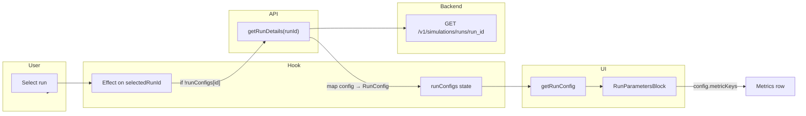

# Part 4: UI – Run Parameters Display

## Remember

- Exact file paths always
- Exact commands with expected output
- DRY, YAGNI, TDD, frequent commits

---

## Overview

Show the metrics chosen for each run in the run detail panel. After Parts 1–3, the backend returns `metric_keys` in run details ([RunConfigDetail](simulation/api/schemas/simulation.py)); the UI never calls the run-details endpoint and only has config for runs started in the current session. Part 4 adds: (1) `getRunDetails(runId)` and mapping of API `config` (including `metric_keys` → `metricKeys`) to [RunConfig](ui/types/index.ts), (2) fetching run details when a run is selected and merging that config into `runConfigs` in [useSimulationPageState.ts](ui/hooks/useSimulationPageState.ts) so [getRunConfig](ui/lib/run-selectors.ts) returns full config, and (3) rendering selected metrics in [RunParametersBlock.tsx](ui/components/details/RunParametersBlock.tsx) (chips or short list). Conventions from [docs/RULES.md](docs/RULES.md): request-id guard for async effects, thin routes (backend unchanged), absolute imports, deterministic ordering.

---

## Architecture

**Data flow:** User selects a run. If `runConfigs[selectedRunId]` is missing, an effect calls `getRunDetails(selectedRunId)`, maps `response.config` to `RunConfig` (including `metric_keys` → `metricKeys`), and updates `runConfigs`. `getRunConfig(selectedRun, runConfigs)` then returns that config. `RunParametersBlock` receives `currentRunConfig` and displays Agents, Turns, Algorithm, and Metrics (from `config.metricKeys`).

---

## Happy flow

1. User selects a run from the list. If `runConfigs[run.runId]` is already set (e.g. run just started), `currentRunConfig` already has `metricKeys`; no extra request.
2. If `runConfigs[run.runId]` is undefined, an effect in [useSimulationPageState.ts](ui/hooks/useSimulationPageState.ts) calls `getRunDetails(runId)`, gets `RunDetailsResponse` with `config.metric_keys`, maps to `RunConfig` (including `metricKeys`), and updates `runConfigs` for that `runId`. Use a request-id ref so only the latest request updates state (per [docs/RULES.md](docs/RULES.md) async effects).
3. [getRunConfig](ui/lib/run-selectors.ts) returns the full config including `metricKeys` for the selected run. Fallback object (when no saved config) includes `metricKeys: undefined` for type consistency.
4. User views run detail (summary or turn). [RunParametersBlock](ui/components/details/RunParametersBlock.tsx) receives `currentRunConfig` and shows Run Parameters: Agents, Turns, Algorithm, Algorithm Config (if any), and **Metrics** (selected keys as chips or comma-separated list).
5. When `config.metricKeys` is absent or empty (e.g. legacy run), show "Metrics: —" or "Metrics: (default)" without error.

---

## Implementation steps

### 1. Before screenshots (UI)

- Start backend and UI per [docs/runbooks/LOCAL_DEVELOPMENT.md](docs/runbooks/LOCAL_DEVELOPMENT.md). Open a run that has `metric_keys` in the API (e.g. one started after Part 2/3). Capture the current Run Parameters block (no metrics row). Save under `docs/plans/2026-02-24_run_params_display_4d5e6f/images/before/`.

### 2. Add getRunDetails and map API config to RunConfig

**File: [ui/lib/api/simulation.ts](ui/lib/api/simulation.ts)**

- Add `getRunDetails(runId: string)` calling `GET /v1/simulations/runs/{run_id}` via `fetchJson`. Use generated type `components['schemas']['RunDetailsResponse']` for the response.
- Add a mapper `mapRunDetailsConfig(apiConfig)` from API `RunConfigDetail` to UI `RunConfig`: `num_agents` → `numAgents`, `num_turns` → `numTurns`, `feed_algorithm` → `feedAlgorithm`, `metric_keys` → `metricKeys`. API run details may not expose `feed_algorithm_config`; use `null` for `feedAlgorithmConfig` if absent.
- Export `getRunDetails` returning the full response; callers use `response.config` and map with `mapRunDetailsConfig` (or have `getRunDetails` return an object that includes `config: RunConfig` so the hook only does `setRunConfigs(prev => ({ ...prev, [runId]: details.config }))`).

**File: [ui/types/index.ts](ui/types/index.ts)**  

- No change: `RunConfig` already has `metricKeys?: string[]` from Part 3.

### 3. Fetch run details when run is selected and config is missing

**File: [ui/hooks/useSimulationPageState.ts](ui/hooks/useSimulationPageState.ts)**

- Add an effect depending on `selectedRunId` (and optionally `runConfigs`). When `selectedRunId` is set and `!runConfigs[selectedRunId]`, call `getRunDetails(selectedRunId)`.
- Map `response.config` to `RunConfig` (including `metricKeys`) and call `setRunConfigs(prev => ({ ...prev, [selectedRunId]: mappedConfig }))`.
- Use a request-id ref: increment at start of effect, capture id, after await only update state if `requestId === ref.current` so out-of-order responses do not overwrite (per [docs/RULES.md](docs/RULES.md) "Async effects and race conditions").
- Create loading/error state for run-details so params block can show "Loading…" or "Could not load run config".

### 4. Fallback in getRunConfig

**File: [ui/lib/run-selectors.ts](ui/lib/run-selectors.ts)**

- In `getRunConfig`, in the fallback object when `!savedConfig`, add `metricKeys: undefined` so the type is consistent and RunParametersBlock can branch on presence of `config.metricKeys`.

### 5. Show selected metrics in RunParametersBlock

**File: [ui/components/details/RunParametersBlock.tsx](ui/components/details/RunParametersBlock.tsx)**

- After the Algorithm Config block, add a **Metrics** row. If `config.metricKeys` is missing or empty, show e.g. "Metrics: —" or "Metrics: (default)". If present, show the list: either comma-separated keys or chips (small pills per key). Use existing block styling (`text-beige-700`, same spacing). No new props; still `config: RunConfig | null`.

### 6. getDefaultConfig

**File: [ui/lib/api/simulation.ts](ui/lib/api/simulation.ts)**  

- Extend `getDefaultConfig()` so the returned `RunConfig` includes `metricKeys` when the backend default-config response includes `metric_keys`; map `metric_keys` → `metricKeys`. If the default-config API does not yet return `metric_keys`, add the mapping so it is applied when the backend adds the field (no change to backend in Part 4).

### 7. After screenshots (UI)

- With run-details fetch and RunParametersBlock updated, select a run that has `metric_keys`. Confirm Run Parameters shows a Metrics line (keys or chips). Capture 1–2 screenshots under `docs/plans/2026-02-24_run_params_display_4d5e6f/images/after/`.

---

## Manual verification

1. **Lint and build**
  - `cd ui && npm run lint:all` — no errors.
  - `cd ui && npm run build` — succeeds.
2. **Backend and UI flow**
  - Start backend: `DISABLE_AUTH=1 PYTHONPATH=. uv run uvicorn simulation.api.main:app --reload` (see [docs/runbooks/LOCAL_DEV_AUTH.md](docs/runbooks/LOCAL_DEV_AUTH.md)). Start UI: `cd ui && npm run dev` with `NEXT_PUBLIC_DISABLE_AUTH=true` in `ui/.env.local`.
  - Start a new run with the metrics selector (Part 3); select one or more metrics and submit. Select that run in the list. Confirm Run Parameters shows a Metrics line with the selected keys (or chips).
  - Select a run created before Part 2 or without `metric_keys`. Confirm Run Parameters still renders and shows "Metrics: —" or "(default)" when `metricKeys` is absent.
3. **Race condition**
  - Select run A, then quickly select run B before run A's details load. Confirm the displayed config (and metrics) match the currently selected run (B), not A.
4. **Pre-commit**
  - From repo root: `uv run pre-commit run --all-files` — all hooks pass.

---

## Alternative approaches

- **Fetch run details for every run in the list:** Would require N requests and more state; fetch-on-select keeps a single extra request when the user opens a run.
- **Display names in params block:** Would require passing `Metric[]` (e.g. from `getAvailableMetrics`) into the detail view or fetching metrics there and mapping key → display name. Part 4 ships with keys only; display names can be a follow-up.
- **Separate run-details state:** Keeping `runDetailsByRunId` only for the params block is possible; reusing `runConfigs` keeps one source of truth and allows reusing config for "edit/restart with same config" later.

---

## Files touched

| File                                                                                         | Change                                                                                                                                |
| -------------------------------------------------------------------------------------------- | ------------------------------------------------------------------------------------------------------------------------------------- |
| [ui/lib/api/simulation.ts](ui/lib/api/simulation.ts)                                         | Add `getRunDetails(runId)`, map API `RunConfigDetail` → `RunConfig`; extend `getDefaultConfig()` to map `metric_keys` → `metricKeys`. |
| [ui/hooks/useSimulationPageState.ts](ui/hooks/useSimulationPageState.ts)                     | Effect: fetch run details when `selectedRunId` set and `!runConfigs[id]`; request-id guard; add loading/error state for run-details.  |
| [ui/lib/run-selectors.ts](ui/lib/run-selectors.ts)                                           | Fallback in `getRunConfig`: include `metricKeys: undefined`.                                                                          |
| [ui/components/details/RunParametersBlock.tsx](ui/components/details/RunParametersBlock.tsx) | Add Metrics row: show `config.metricKeys` as list or chips; "—" or "(default)" when absent.                                           |
| `docs/plans/2026-02-24_run_params_display_4d5e6f/`                                           | Plan and before/after screenshots in `images/before/`, `images/after/`.                                                               |

---

## Plan asset storage

- **Directory:** `docs/plans/2026-02-24_run_params_display_4d5e6f/`
- **Before screenshots:** `docs/plans/2026-02-24_run_params_display_4d5e6f/images/before/`
- **After screenshots:** `docs/plans/2026-02-24_run_params_display_4d5e6f/images/after/`

