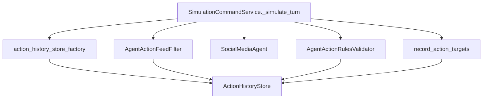

## Refactor action history + action policy (notes)

This folder tracks artifacts for the plan: `refactor_action_policy_packages_7bb6a460`.

### Goal

Split the prior “turn action guardrail” modules into two cohesive packages:

- `simulation/core/action_history/`: run-scoped action history storage + default store + recording helper
- `simulation/core/action_policy/`: candidate filtering + action invariants policy

### Flow (from plan)

