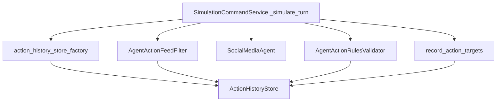

## PR Title

Migrate action guardrails into action history/policy

## Overview

We will split the current “turn action guardrail” modules into two packages: `simulation/core/action_history/` for the run-scoped history abstraction + default store + recording helper, and `simulation/core/action_policy/` for candidate filtering and action-rule validation. We’ll update wiring in `simulation/core/command_service.py` and factories, update tests/imports, and run lint/typecheck/tests to ensure no behavior changes.

## Problem / motivation

The current “turn action guardrail” code spans multiple flat modules under `simulation/core/`, mixing run-scoped action history storage with action eligibility + invariants policy. This makes dependency direction and discoverability worse than it needs to be, and increases churn when introducing alternative implementations (e.g., persisted history stores or different rule sets).

## Solution

Split the guardrail surface into two cohesive packages—`action_history` (state/storage + recording) and `action_policy` (candidate filtering + rule validation)—and update `SimulationCommandService` + factories + tests to import from the new locations.

## Happy Flow

1. `SimulationCommandService._simulate_turn` (`[simulation/core/command_service.py](simulation/core/command_service.py)`) obtains a run-scoped `ActionHistoryStore` instance from the injected factory.
2. Candidate filtering runs via `AgentActionFeedFilter.filter_candidates(...)` (move to `[simulation/core/action_policy/candidate_filter.py](simulation/core/action_policy/candidate_filter.py)`), using history checks to exclude previously acted-on targets.
3. The agent generates `likes/comments/follows` as before (no changes).
4. Rules validation runs via `AgentActionRulesValidator.validate(...)` (move to `[simulation/core/action_policy/rules_validator.py](simulation/core/action_policy/rules_validator.py)`), enforcing per-turn uniqueness and cross-turn “no repeats” via `ActionHistoryStore`.
5. Recording runs via `record_action_targets(...)` (new function in `[simulation/core/action_history/recording.py](simulation/core/action_history/recording.py)`) to write validated target ids into the store.
6. Persistence and query paths remain unchanged (DB persistence already occurs via `SimulationPersistenceService.write_turn`; query hydrates persisted actions).

## Data Flow



## Changes

- `simulation/core/action_history/`: add package for run-scoped history interfaces, default in-memory store, recording helper, and default factory exports
- `simulation/core/action_policy/`: add package for action candidate filtering and action rules validation
- `simulation/core/command_service.py`: rewire imports to `action_history`/`action_policy` and record via `record_action_targets`
- `simulation/core/factories/{command_service,engine,__init__}.py`: update DI wiring and imports to the new package locations
- `tests/simulation/core/test_{agent_action_feed_filter,agent_action_rules_validator,agent_action_history_recorder,command_service}.py`: update imports and assertions for new recording path
- `docs/plans/2026-02-25_refactor_action_history_action_policy_482917/notes.md`: plan artifacts

## Manual Verification

- Run unit tests (targeted):
  - `uv run pytest tests/simulation/core/test_agent_action_feed_filter.py -v`
  - `uv run pytest tests/simulation/core/test_agent_action_rules_validator.py -v`
  - `uv run pytest tests/simulation/core/test_agent_action_history_recorder.py -v`
  - `uv run pytest tests/simulation/core/test_command_service.py -v`
- Run full suite:
  - `uv run pytest`
- Lint/format:
  - `uv run ruff format .` (expect: no diff after second run)
  - `uv run ruff check .` (expect: exit 0)
- Typecheck:
  - `uv run pyright .` (expect: 0 errors)
- Quick sanity run (optional but useful):
  - Start API: `PYTHONPATH=. uv run uvicorn simulation.api.main:app --reload`
  - Hit health endpoint: `GET http://localhost:8000/health` returns 200.

## Target structure (optional)

```text
simulation/core/
├── action_history/
│   ├── __init__.py
│   ├── factories.py
│   ├── interfaces.py
│   ├── recording.py
│   └── stores.py
└── action_policy/
    ├── __init__.py
    ├── candidate_filter.py
    ├── interfaces.py
    └── rules_validator.py
```

