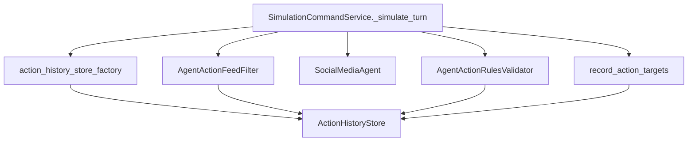

## Remember

- Exact file paths always
- Exact commands with expected output
- DRY, YAGNI, TDD, frequent commits

## Plan assets

- Create folder: `docs/plans/2026-02-25_refactor_action_history_action_policy_482917/`

## Overview

We will split the current “turn action guardrail” modules into two packages: `simulation/core/action_history/` for the run-scoped history abstraction + default store + recording helper, and `simulation/core/action_policy/` for candidate filtering and action-rule validation. We’ll update wiring in `simulation/core/command_service.py` and factories, update tests/imports, and run lint/typecheck/tests to ensure no behavior changes.

## Happy Flow

1. `SimulationCommandService._simulate_turn` (`[simulation/core/command_service.py](simulation/core/command_service.py)`) obtains a run-scoped `ActionHistoryStore` instance from the injected factory.
2. Candidate filtering runs via `AgentActionFeedFilter.filter_candidates(...)` (move to `[simulation/core/action_policy/candidate_filter.py](simulation/core/action_policy/candidate_filter.py)`), using history checks to exclude previously acted-on targets.
3. The agent generates `likes/comments/follows` as before (no changes).
4. Rules validation runs via `AgentActionRulesValidator.validate(...)` (move to `[simulation/core/action_policy/rules_validator.py](simulation/core/action_policy/rules_validator.py)`), enforcing per-turn uniqueness and cross-turn “no repeats” via `ActionHistoryStore`.
5. Recording runs via `record_action_targets(...)` (new function in `[simulation/core/action_history/recording.py](simulation/core/action_history/recording.py)`) to write validated target ids into the store.
6. Persistence and query paths remain unchanged (DB persistence already occurs via `SimulationPersistenceService.write_turn`; query hydrates persisted actions).

## Implementation notes (structure + boundaries)

- **Interfaces live next to implementations** (`docs/RULES.md`):
  - `simulation/core/action_history/interfaces.py`: `ActionHistoryStore` ABC
  - `simulation/core/action_policy/interfaces.py`: `AgentActionFeedFilter` ABC (and `ActionCandidateFeeds` dataclass can live alongside filter implementation in the same module if preferred; keep cohesive and discoverable)
- **Dependency injection preserved** (`docs/RULES.md`): keep `SimulationCommandService.__init__` receiving:
  - `action_history_store_factory: Callable[[], ActionHistoryStore]`
  - `agent_action_feed_filter: AgentActionFeedFilter`
  - `agent_action_rules_validator: AgentActionRulesValidator`
- **No shims**: update all internal imports/tests to new locations in one refactor to avoid duplicate near-equivalents (per “Consolidation over duplication”).

## Detailed steps

1. **Create packages and move code (no behavior change)**
  - Add package `simulation/core/action_history/` with:
    - `interfaces.py`: move `ActionHistoryStore` from `[simulation/core/action_history.py](simulation/core/action_history.py)`
    - `stores.py`: move `InMemoryActionHistoryStore`
    - `recording.py`: move/replace `AgentActionHistoryRecorder` with a small, keyword-only API (either keep the class name or switch to a function; pick one and update callsites/tests consistently)
    - `factories.py`: move `create_default_action_history_store_factory` from `[simulation/core/factories/action_history_store.py](simulation/core/factories/action_history_store.py)`
    - `__init__.py`: re-export the small public surface (interfaces + default store + default factory)
  - Add package `simulation/core/action_policy/` with:
    - `interfaces.py`: move `AgentActionFeedFilter` ABC (currently in `[simulation/core/agent_action_feed_filter.py](simulation/core/agent_action_feed_filter.py)`)
    - `candidate_filter.py`: move `ActionCandidateFeeds` + `HistoryAwareActionFeedFilter`
    - `rules_validator.py`: move `AgentActionRulesValidator` from `[simulation/core/agent_action_rules_validator.py](simulation/core/agent_action_rules_validator.py)`
    - `__init__.py`: re-export minimal public surface.
2. **Update core wiring imports**
  - Update imports and type references in:
    - `[simulation/core/command_service.py](simulation/core/command_service.py)`
    - `[simulation/core/factories/command_service.py](simulation/core/factories/command_service.py)`
    - `[simulation/core/factories/engine.py](simulation/core/factories/engine.py)`
    - `[simulation/core/factories/__init__.py](simulation/core/factories/__init__.py)` to re-export the action-history factory from the new location.
3. **Update tests to new import paths**
  - Update:
    - `[tests/simulation/core/test_agent_action_feed_filter.py](tests/simulation/core/test_agent_action_feed_filter.py)`
    - `[tests/simulation/core/test_agent_action_rules_validator.py](tests/simulation/core/test_agent_action_rules_validator.py)`
    - `[tests/simulation/core/test_agent_action_history_recorder.py](tests/simulation/core/test_agent_action_history_recorder.py)`
    - `[tests/simulation/core/test_command_service.py](tests/simulation/core/test_command_service.py)`
4. **Run formatting + lint + typecheck + tests**
  - Format:
    - `uv run ruff format .`
  - Lint:
    - `uv run ruff check .`
  - Typecheck:
    - `uv run pyright .`
  - Tests (targeted then full):
    - `uv run pytest tests/simulation/core/test_agent_action_feed_filter.py -v`
    - `uv run pytest tests/simulation/core/test_agent_action_rules_validator.py -v`
    - `uv run pytest tests/simulation/core/test_agent_action_history_recorder.py -v`
    - `uv run pytest tests/simulation/core/test_command_service.py -v`
    - `uv run pytest`
  - Expected: all tests pass; no ruff or pyright errors.
5. **Commits (frequent, refactor-safe)**
  - Commit 1: move/create packages + update imports (no behavior change)
  - Commit 2 (if needed): follow-up cleanup (rename symbols, tighten exports) after green tests.

## Manual Verification

- Run unit tests (targeted):
  - `uv run pytest tests/simulation/core/test_agent_action_feed_filter.py -v`
  - `uv run pytest tests/simulation/core/test_agent_action_rules_validator.py -v`
  - `uv run pytest tests/simulation/core/test_agent_action_history_recorder.py -v`
  - `uv run pytest tests/simulation/core/test_command_service.py -v`
- Run full suite:
  - `uv run pytest`
- Lint/format:
  - `uv run ruff format .` (expect: no diff after second run)
  - `uv run ruff check .` (expect: exit 0)
- Typecheck:
  - `uv run pyright .` (expect: 0 errors)
- Quick sanity run (optional but useful):
  - Start API: `PYTHONPATH=. uv run uvicorn simulation.api.main:app --reload`
  - Hit health endpoint: `GET http://localhost:8000/health` returns 200.

## Alternative approaches

- **Single package `simulation/core/turn_actions/`**: maximizes discoverability by co-locating everything, but couples “state/storage” and “policy/rules” evolution; Option A keeps those axes independent for future implementations (persisted history, alternative policy sets).
- **Keep modules in `simulation/core/` with better naming**: minimal churn but doesn’t create a clear extension boundary; harder to add alternate implementations without growing the root namespace.

