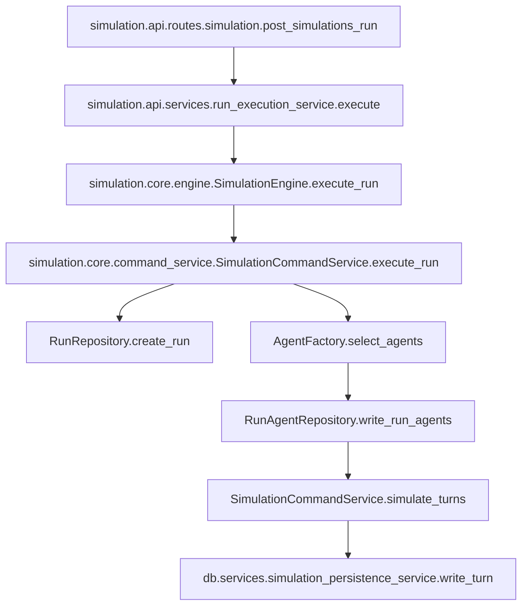

---
name: pr2_run_agents_membership
overview: "Implement PR 2 (\"Persist Actual Run Membership With `run_agents`\") by introducing a new immutable run-snapshot table `run_agents`, wiring run creation to persist the exact agents chosen for a run (plus denormalized *_at_start fields), and adding repository/adapter + tests so later snapshot tables (`run_follow_edges`, `run_posts`, etc.) have a stable anchor. This plan assumes PR #206 is already merged, so all schema changes must satisfy the SCHEMA-* persistence-scope lints and keep seed-state vs run-snapshot vs turn-event lifecycles separated."
todos:
  - id: assets-dir
    content: Decide/record plan assets directory `docs/plans/2026-03-13_pr2_run_agents_membership_812734/` for any PR notes or diagrams.
    status: pending
  - id: schema-run-agents
    content: Add `run_agents` table to `db/schema.py` with FKs + PK/UNIQUE constraints and ensure it satisfies SCHEMA-2 (non-null run_id).
    status: pending
  - id: alembic-migration
    content: Create Alembic revision under `db/migrations/versions/` to create `run_agents` (+ index) and optionally add immutability triggers.
    status: pending
  - id: ports-adapters
    content: "Add run-agents persistence ports and SQLite implementations: update `db/adapters/base.py`, `db/repositories/interfaces.py`, add `db/adapters/sqlite/run_agent_adapter.py`, add `db/repositories/run_agent_repository.py`, and add a core model `simulation/core/models/run_agents.py`."
    status: pending
  - id: wire-command-service
    content: Wire `run_agent_repo` (and seed-state repos needed to hydrate *_at_start fields) into `simulation/core/factories/engine.py`, `simulation/core/factories/command_service.py`, and persist membership in `simulation/core/command_service.py` right after agent selection.
    status: pending
  - id: agent-selection-source
    content: Update the default agent selection path (`simulation/core/factories/agent.py` and `ai/create_initial_agents.py`) to select from the seed-state agent catalog (`agent` + related tables) so `run_agents.agent_id` FKs are always satisfiable.
    status: pending
  - id: tests
    content: "Add tests: adapter unit tests + repository integration tests for `run_agents`, plus a command-service unit test asserting `run_agents` write is invoked with correct ordering and denormalized fields."
    status: pending
  - id: verification
    content: "Run verification commands: `uv run python scripts/lint_schema_conventions.py`, `uv run pytest ...`, and an Alembic upgrade smoke on a fresh DB path."
    status: pending
isProject: false
---

## Remember

- Exact file paths always
- Exact commands with expected output
- DRY, YAGNI, TDD, frequent commits

## Overview

Add a new `run_*` snapshot table, `run_agents`, to persist the *actual* participant set used for a simulation run (not just `runs.total_agents`). Populate it atomically at run creation time with deterministic `selection_order` and denormalized `*_at_start` fields sourced from seed-state (`agent`, `agent_persona_bios`, `user_agent_profile_metadata`). Treat `run_agents` as immutable after insert.

## Happy Flow

1. **Schema**: Define `run_agents` in `[db/schema.py](db/schema.py)` with `run_id` (non-null) and constraints matching the architecture contract in `[docs/architecture/seed-state-run-snapshot-turn-events.md](docs/architecture/seed-state-run-snapshot-turn-events.md)`.
2. **Migration**: Add an Alembic revision under `[db/migrations/versions/](db/migrations/versions/)` that creates the `run_agents` table with:
  - PK (`run_id`, `agent_id`)
  - UNIQUE (`run_id`, `selection_order`)
  - FK `run_id -> runs.run_id`
  - FK `agent_id -> agent.agent_id`
3. **Run creation chooses agents**: Update the run execution path (`[simulation/core/command_service.py](simulation/core/command_service.py)` + factories) so the agent selection step produces a concrete ordered list of *seed-state agents* (from `agent`_* tables), not an implicit/undocumented set.
4. **Persist membership**: Immediately after selection (and before turns execute), write `run_agents` rows for that `run_id`, with:
  - `selection_order` = 0..N-1 in the selected order
  - `*_at_start` fields copied from seed state (read once, then freeze)
  - `created_at` set to run creation timestamp
5. **Immutability by convention**: Provide no update/delete code paths for `run_agents`; DB-level constraints prevent duplicates. (Optional hardening: add SQLite triggers to forbid UPDATE/DELETE for this table.)
6. **Tests**: Add adapter/repository tests plus a command-service-level unit test proving `run_agents` is written and that its invariants hold.
7. **Contract enforcement**: Ensure `uv run python scripts/lint_schema_conventions.py` still prints OK, meaning `run_agents` satisfies SCHEMA-2 (non-null `run_id`) and no seed-state table mixes `run_id`/`turn_number`.

## Proposed `run_agents` schema (authoritative for this PR)

From `[strategy_planning/2026-03-08_data_architecture_rules/02_proposed_prs_for_migration.md](strategy_planning/2026-03-08_data_architecture_rules/02_proposed_prs_for_migration.md)`:

- `run_id` TEXT NOT NULL, FK to `runs.run_id`
- `agent_id` TEXT NOT NULL, FK to `agent.agent_id`
- `selection_order` INTEGER NOT NULL
- `handle_at_start` TEXT NOT NULL
- `display_name_at_start` TEXT NOT NULL
- `persona_bio_at_start` TEXT NOT NULL
- `followers_count_at_start` INTEGER NOT NULL
- `follows_count_at_start` INTEGER NOT NULL
- `posts_count_at_start` INTEGER NOT NULL
- `created_at` TEXT NOT NULL

Constraints:

- PRIMARY KEY (`run_id`, `agent_id`)
- UNIQUE (`run_id`, `selection_order`)

## Implementation details

### Data model + schema

- Update `[db/schema.py](db/schema.py)`
  - Add `run_agents = sa.Table("run_agents", ...)` near other run-scoped tables.
  - Ensure `run_id` is declared `nullable=False` so SCHEMA-2 passes.
  - Add FK constraints:
    - `sa.ForeignKeyConstraint(["run_id"], ["runs.run_id"], name="fk_run_agents_run_id")`
    - `sa.ForeignKeyConstraint(["agent_id"], ["agent.agent_id"], name="fk_run_agents_agent_id")`
  - Add:
    - `sa.PrimaryKeyConstraint("run_id", "agent_id", name="pk_run_agents")`
    - `sa.UniqueConstraint("run_id", "selection_order", name="uq_run_agents_run_selection_order")`
- Add migration `[db/migrations/versions/<new_revision>_add_run_agents.py](db/migrations/versions/)`
  - `op.create_table("run_agents", ...)` with the same columns/constraints.
  - Add an index for common access:
    - `op.create_index("idx_run_agents_run_id", "run_agents", ["run_id"])`

### Persistence layer (ports + adapters)

- Add new repository and adapter interfaces.
  - Update `[db/repositories/interfaces.py](db/repositories/interfaces.py)`
    - Add `RunAgentRepository` with minimal methods:
      - `write_run_agents(run_id: str, rows: list[RunAgentRow], conn: object | None = None) -> None`
      - `list_run_agents(run_id: str) -> list[RunAgentRow]`
  - Update `[db/adapters/base.py](db/adapters/base.py)`
    - Add `RunAgentDatabaseAdapter` with `write_run_agents(...)` + `read_run_agents_for_run(...)`.
- Add concrete SQLite implementation.
  - New: `[db/adapters/sqlite/run_agent_adapter.py](db/adapters/sqlite/run_agent_adapter.py)`
    - Implement:
      - `write_run_agents(...)`: `INSERT` rows; do **not** use `INSERT OR REPLACE` (immutability).
      - `read_run_agents_for_run(...)`: `SELECT ... WHERE run_id = ? ORDER BY selection_order ASC`.
  - New: `[db/repositories/run_agent_repository.py](db/repositories/run_agent_repository.py)`
    - Open a transaction when `conn` is not supplied, mirroring patterns in `[db/repositories/run_repository.py](db/repositories/run_repository.py)`.
- Add a lightweight core model for typed rows.
  - New: `[simulation/core/models/run_agents.py](simulation/core/models/run_agents.py)`
    - Pydantic model `RunAgentSnapshot` (or similar) with fields matching the table.
    - Keep it “pure” (no DB imports), consistent with repo conventions.

### Run selection + snapshot write (application wiring)

- Update the simulation engine wiring so the run execution path has access to seed-state repos needed for snapshots.
  - Update `[simulation/core/factories/engine.py](simulation/core/factories/engine.py)` to accept/create:
    - `agent_repo`, `agent_bio_repo`, `user_agent_profile_metadata_repo`, `run_agent_repo`.
  - Update `[simulation/core/factories/command_service.py](simulation/core/factories/command_service.py)` to pass these into `SimulationCommandService`.
- Update `[simulation/core/command_service.py](simulation/core/command_service.py)`
  - Extend `SimulationCommandService.__init__` to accept:
    - `agent_repo`, `agent_bio_repo`, `user_agent_profile_metadata_repo`, `run_agent_repo`.
  - In `execute_run(...)`:
    - Create run (existing behavior).
    - Select agents.
    - **Immediately snapshot membership**:
      - Resolve `agent_id` per selected handle.
      - Batch fetch bios + metadata by agent_id.
      - Build `run_agents` rows with `selection_order` and `*_at_start`.
      - Call `run_agent_repo.write_run_agents(...)`.
    - Then proceed to simulate turns.

#### Choosing which agents participate (important)

To satisfy the schema contract (`run_agents.agent_id -> agent.agent_id`), agent selection must be defined in terms of the seed-state `agent` catalog.

Recommended approach for this PR:

- Update `[simulation/core/factories/agent.py](simulation/core/factories/agent.py)` and `[ai/create_initial_agents.py](ai/create_initial_agents.py)` so the default agent factory selects from `AgentRepository.list_all_agents()` (or a deterministic page) instead of `ProfileRepository.list_profiles()`.
- Construct `SocialMediaAgent` from:
  - `agent.handle` (identity)
  - `agent_persona_bios` (bio for UI / model context)
  - `user_agent_profile_metadata` (counts)
  - `feed_posts` (posts by `author_handle`)

This aligns “the agents you can list/edit in the UI” with “the agents a run can actually use,” and guarantees `run_agents` can enforce FKs.

### Optional hardening: DB-level immutability

If we want a stronger guarantee than “no code updates it,” add SQLite triggers in the Alembic migration:

- `BEFORE UPDATE ON run_agents` -> `RAISE(ABORT, 'run_agents is immutable')`
- `BEFORE DELETE ON run_agents` -> `RAISE(ABORT, 'run_agents is immutable')`

(If added, also add a small adapter test asserting UPDATE/DELETE fails.)

### API surface (defer unless needed)

This PR can be backend-only (persist only) and not change `[simulation/api/schemas/simulation.py](simulation/api/schemas/simulation.py)`.

If you want immediate observability, add a follow-up (or small addition) later:

- `GET /v1/simulations/runs/{run_id}/agents` returning the ordered `run_agents` snapshots.

## Manual Verification

- **Schema lint passes (PR #206 gate):**

```bash
uv run python scripts/lint_schema_conventions.py
```

Expected output:

- `OK (<N> tables checked)`
- **Migrations apply cleanly to a fresh DB:**

```bash
SIM_DB_PATH=/tmp/pr2-run-agents.sqlite uv run python -m alembic -c pyproject.toml upgrade head
SIM_DB_PATH=/tmp/pr2-run-agents.sqlite uv run python -m alembic -c pyproject.toml current
```

Expected:

- `upgrade head` exits 0
- `current` prints the latest revision
- **Unit/integration tests:**

```bash
uv run pytest tests/lint/test_lint_schema_conventions.py -q
uv run pytest tests/db -q
uv run pytest tests/simulation/core -q
```

Expected:

- all pass
- **Runtime smoke (optional but recommended):** run the API and create a run, then inspect DB.

```bash
PYTHONPATH=. uv run uvicorn simulation.api.main:app --reload
```

Then:

- POST `http://localhost:8000/v1/simulations/run` with `{ "num_agents": 3, "num_turns": 1 }`
- Verify `run_agents` has 3 rows for that `run_id` and `selection_order` is 0..2.
- **Immutability check (if triggers added):** attempt an UPDATE/DELETE in SQLite and confirm it fails.

## Alternative approaches

- **Alternative A: Persist membership by handle only (no `agent_id` FK).**
  - Rejected because PR 2 explicitly anchors later snapshots to `agent_id` and wants durable membership to join against seed-state and future `run_`* tables.
- **Alternative B: Keep selecting from `bluesky_profiles` and upsert missing `agent` rows on the fly.**
  - Rejected because it makes seed-state existence depend on run execution, blurs lifecycles, and complicates correctness. It also risks mismatched handles and weakens the “seed-state is editable before runs exist” contract.
- **Alternative C: Write `run_agents` after the run finishes.**
  - Rejected because membership must reflect what the run *used*, even on failures/partial runs, and because later snapshot tables should be created at run start.

## Plan assets

Store PR planning artifacts at:

- `docs/plans/2026-03-13_pr2_run_agents_membership_812734/`
  - (No UI screenshots required for this PR; no `ui/` changes expected.)

## Mermaid (run creation + membership snapshot)


