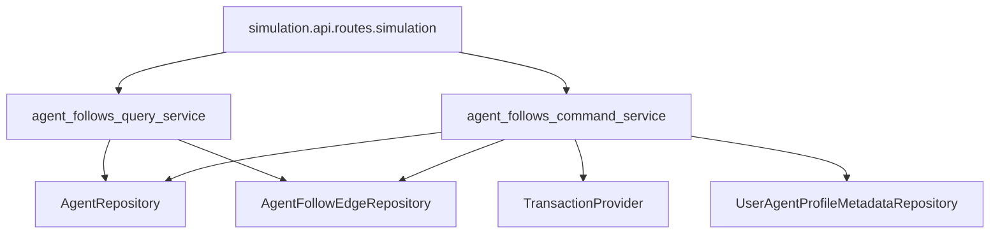

# PR 3: `agent_follow_edges`

## Asset directory

- Canonical plan asset directory: `docs/plans/2026-03-13_pr3_agent_follow_edges_593821/`

## Scope notes

- Add `agent_follow_edges` as the first true editable seed-state row table.
- Keep legacy `follows` as the immutable run-turn event log.
- Recompute `user_agent_profile_metadata.followers_count` and `.follows_count`
  transactionally from `agent_follow_edges` writes only.
- Keep initial scope internal agent-to-agent only.

## Flow

