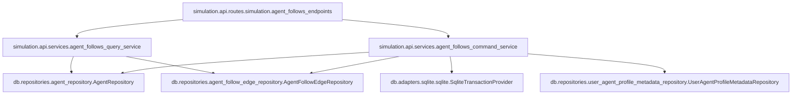

## Remember

- Exact file paths always
- Exact commands with expected output
- DRY, YAGNI, TDD, frequent commits

## Overview

This PR adds `agent_follow_edges` as the **authoritative, editable seed-state** representation of “who follows whom before a run starts”, limited to **internal agent→agent** edges. It intentionally does **not** change simulation runtime semantics yet: existing `follows` remains the append-only **turn-event log**. The PR also establishes the first concrete pattern for seed-state row-level facts and keeps `user_agent_profile_metadata.{follows_count,followers_count}` as **derived/cache** values that are updated transactionally when edges are created/deleted, without attempting any lossy reconstruction from aggregate counts.

## Happy Flow

1. **Schema**: Define `agent_follow_edges` in `[db/schema.py](db/schema.py)` as a new `agent_`* seed-state table with:
  - `agent_follow_edge_id` PK
  - `follower_agent_id` FK → `agent.agent_id`
  - `target_agent_id` FK → `agent.agent_id`
  - `created_at` (and optionally `updated_at` only if we truly support row edits beyond add/remove)
  - DB constraints: UNIQUE (`follower_agent_id`, `target_agent_id`) and an optional CHECK banning self-edges.
2. **Migration**: Add Alembic revision under `[db/migrations/versions/](db/migrations/versions/)` creating the table and indexes for common queries (by follower, by target).
3. **Persistence ports/adapters**: Add an `AgentFollowEdgeRepository` interface in `[db/repositories/interfaces.py](db/repositories/interfaces.py)` and a `SQLiteAgentFollowEdgeRepository` implementation using a new SQLite adapter in `[db/adapters/sqlite/agent_follow_edge_adapter.py](db/adapters/sqlite/agent_follow_edge_adapter.py)`.
4. **API query surface**: Add `GET /v1/simulations/agents/{handle}/follows` that:
  - resolves `{handle}` → `agent_id` via `AgentRepository.get_agent_by_handle`
  - reads edges where `follower_agent_id = agent_id` with deterministic ordering
  - returns a paginated response so the UI can render “Follows” dropdown pages.
5. **API command surface**: Add `POST /v1/simulations/agents/{handle}/follows` and `DELETE /v1/simulations/agents/{handle}/follows/{target_handle}` that:
  - enforce **internal-only** targets (target handle must be an existing agent)
  - enforce UNIQUE and self-follow ban
  - update cached counts in `user_agent_profile_metadata` for both involved agents in the same DB transaction.
6. **Local-dev realism (optional but recommended)**: Add a small deterministic seed fixture `simulation/local_dev/seed_fixtures/agent_follow_edges.json` and extend `[simulation/local_dev/seed_loader.py](simulation/local_dev/seed_loader.py)` to load it in LOCAL mode, so the UI sees real follow rows instead of relying on mocks.

## Proposed `agent_follow_edges` schema (authoritative for this PR)

From `[strategy_planning/2026-03-08_data_architecture_rules/02_proposed_prs_for_migration.md](strategy_planning/2026-03-08_data_architecture_rules/02_proposed_prs_for_migration.md)`:

- `agent_follow_edge_id` TEXT PRIMARY KEY
- `follower_agent_id` TEXT NOT NULL, FK to `agent.agent_id`
- `target_agent_id` TEXT NOT NULL, FK to `agent.agent_id`
- `created_at` TEXT NOT NULL

Constraints / indexes:

- UNIQUE (`follower_agent_id`, `target_agent_id`)
- CHECK (`follower_agent_id != target_agent_id`) (recommended)
- Indexes (recommended):
  - `idx_agent_follow_edges_follower_agent_id` on (`follower_agent_id`)
  - `idx_agent_follow_edges_target_agent_id` on (`target_agent_id`)

## Detailed implementation plan

### 1) Plan assets

- Create plan asset folder:
  - `docs/plans/2026-03-13_pr3_agent_follow_edges_593821/`
- No UI screenshots required for this PR if we keep `ui/` unchanged.

### 2) Schema: add `agent_follow_edges`

- Update `[db/schema.py](db/schema.py)`:
  - Add a new `sa.Table("agent_follow_edges", ...)` near other seed-state tables.
  - Ensure it **does not** declare `run_id` or `turn_number` so `SCHEMA-1` passes (PR #206 linter).
  - Add FK constraints to `agent.agent_id` with explicit names.
  - Add uniqueness + self-follow check constraints.

### 3) Alembic migration

- Add a new revision file:
  - `db/migrations/versions/<new_revision>_add_agent_follow_edges.py`
- In `upgrade()`:
  - `op.create_table("agent_follow_edges", ...)` with constraints
  - create indexes for follower/target lookups
- In `downgrade()`:
  - drop indexes and table

### 4) Core model

- Add a pure model for rows:
  - `simulation/core/models/agent_follow_edge.py`
  - Pydantic `BaseModel` for:
    - `agent_follow_edge_id: str`
    - `follower_agent_id: str`
    - `target_agent_id: str`
    - `created_at: str`

### 5) Persistence: ports + adapters + repositories

- Update `[db/adapters/base.py](db/adapters/base.py)`:
  - Add `AgentFollowEdgeDatabaseAdapter` interface with methods like:
    - `insert_edges(...)` (or `insert_edge(...)`)
    - `delete_edge(...)`
    - `read_edges_by_follower_agent_id(...)` (paged)
    - `count_edges_by_follower_agent_id(...)` and `count_edges_by_target_agent_id(...)` (for cache sync)
- Update `[db/repositories/interfaces.py](db/repositories/interfaces.py)`:
  - Add `AgentFollowEdgeRepository` with corresponding methods.
- Add SQLite adapter:
  - `db/adapters/sqlite/agent_follow_edge_adapter.py`
  - Use parameterized SQL (no string interpolation for values) and deterministic ordering (e.g. `ORDER BY target_agent_id, agent_follow_edge_id`).
- Add SQLite repository:
  - `db/repositories/agent_follow_edge_repository.py`
  - Provide factory: `create_sqlite_agent_follow_edge_repository(transaction_provider=...)`.

### 6) API schemas

- Update `[simulation/api/schemas/simulation.py](simulation/api/schemas/simulation.py)`:
  - Add:
    - `AgentFollowEdgeSchema`
    - `ListAgentFollowsResponse` (e.g. `{ total: int, items: list[AgentFollowEdgeSchema] }`)
    - `CreateAgentFollowRequest` (e.g. `{ target_handle: str }`)

### 7) API services + routes

- Add service modules:
  - `simulation/api/services/agent_follows_query_service.py`
  - `simulation/api/services/agent_follows_command_service.py`
- Wire routes in `[simulation/api/routes/simulation.py](simulation/api/routes/simulation.py)`:
  - `GET /v1/simulations/agents/{handle}/follows?limit=&offset=`
  - `POST /v1/simulations/agents/{handle}/follows`
  - `DELETE /v1/simulations/agents/{handle}/follows/{target_handle}`
- Wire repository into app state in `[simulation/api/main.py](simulation/api/main.py)`:
  - `app.state.agent_follow_edge_repo = create_sqlite_agent_follow_edge_repository(...)`
- Error handling:
  - Add new `Api`* error types under `simulation/api/errors.py` (or reuse existing patterns) for:
    - follower agent not found (404)
    - target agent not found (404)
    - duplicate edge (409)
    - self-follow (422)

### 8) Cache synchronization for `user_agent_profile_metadata`

- Implement “derived/cache” semantics for follows counts **only on writes** in this PR:
  - After INSERT/DELETE edge, recompute:
    - `follows_count` = COUNT(*) where `follower_agent_id = X`
    - `followers_count` = COUNT(*) where `target_agent_id = X`
  - Update `user_agent_profile_metadata` rows for both affected agent_ids in the same transaction.
- Avoid any attempt to infer edges from pre-existing counts.

### 9) Local-dev seed data (optional but recommended)

If we want LOCAL mode to showcase real follow rows:

- Add fixture:
  - `simulation/local_dev/seed_fixtures/agent_follow_edges.json`
- Extend loader:
  - `[simulation/local_dev/seed_loader.py](simulation/local_dev/seed_loader.py)`
    - include a new `SeedFixtures.agent_follow_edges` field
    - parse + write edges using the new adapter
    - either (a) adjust `simulation/local_dev/seed_fixtures/user_agent_profile_metadata.json` to match edge-derived counts, or (b) recompute and overwrite only `followers_count/follows_count` in DB after inserting edges.
- Update local seed test `[tests/local_dev/test_local_mode_seed.py](tests/local_dev/test_local_mode_seed.py)` to assert `agent_follow_edges` rows are present when fixture is added.

### 10) Tests

- Repository integration:
  - New: `tests/db/repositories/test_agent_follow_edge_repository_integration.py`
  - Cover: insert, unique constraint behavior, list paging, delete.
- API tests:
  - New: `tests/api/test_simulation_agent_follows.py`
  - Cover: list empty, create edge, duplicate (409), self-follow (422), delete edge (204), and that agent list counts (`/v1/simulations/agents`) reflect updated metadata after edge writes.
- Fixture wiring:
  - Update `[tests/conftest.py](tests/conftest.py)` to provide an `agent_follow_edge_repo` fixture.

## Manual Verification

- **Schema convention lints (PR #206 gate):**

```bash
uv run python scripts/lint_schema_conventions.py
```

Expected output:

- `OK (<N> tables checked)`
- **Migrations apply cleanly to a fresh DB:**

```bash
SIM_DB_PATH=/tmp/pr3-follow-edges.sqlite uv run python -m alembic -c pyproject.toml upgrade head
SIM_DB_PATH=/tmp/pr3-follow-edges.sqlite uv run python -m alembic -c pyproject.toml current
```

Expected:

- `upgrade head` exits 0
- `current` prints the latest revision
- **Run targeted tests:**

```bash
uv run pytest tests/lint/test_lint_schema_conventions.py -q
uv run pytest tests/db/repositories/test_agent_follow_edge_repository_integration.py -q
uv run pytest tests/api/test_simulation_agent_follows.py -q
```

Expected: all pass

- **API smoke (manual):**

```bash
PYTHONPATH=. uv run uvicorn simulation.api.main:app --reload
```

Then (with auth bypass if needed per local runbooks):

- `GET /v1/simulations/agents` → pick a handle
- `GET /v1/simulations/agents/{handle}/follows?limit=10&offset=0` → returns `{ total, items }`
- `POST /v1/simulations/agents/{handle}/follows` with `{ "target_handle": "@bob.tech" }` → returns created edge
- Re-`GET /v1/simulations/agents` → verify `following`/`followers` counts updated for involved agents
- `DELETE /v1/simulations/agents/{handle}/follows/@bob.tech` → 204

## Alternative approaches

- **Alternative A: Store edges by `handle` instead of `agent_id`.**
  - Rejected because repo conventions and the migration docs prefer `agent_id` as the relational anchor; handles are display identifiers.
- **Alternative B: Support external follow targets on day one.**
  - Rejected for PR-3 because `[strategy_planning/2026-03-08_data_architecture_rules/02_proposed_prs_for_migration.md](strategy_planning/2026-03-08_data_architecture_rules/02_proposed_prs_for_migration.md)` explicitly locks initial scope to internal-only agent→agent edges.
- **Alternative C: Keep `user_agent_profile_metadata` counts as authoritative and derive edges later.**
  - Rejected because counts are lossy and the migration rules explicitly ban fabricating row-level follows from aggregate counters.
- **Alternative D: Use SQLite triggers to maintain follow counts automatically.**
  - Not chosen initially to keep cross-table coupling and migration complexity down; can be added later if we need stronger invariants than “update counts transactionally in the application.”

## Plan assets

- Store planning artifacts at:
  - `docs/plans/2026-03-13_pr3_agent_follow_edges_593821/`
  - (No UI screenshots required if `ui/` unchanged.)

## Mermaid (seed follow edges: API → repo → cache)


