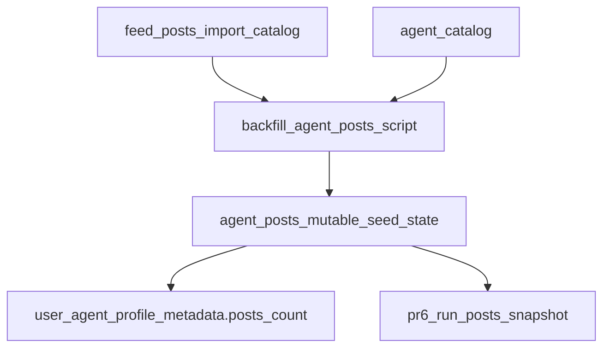

# PR 5: Agent Posts

## Remember

- Exact file paths always
- Exact commands with expected output
- DRY, YAGNI, TDD, frequent commits
- UI changes: agent captures before/after screenshots itself (no README or instructions for the user)

## Overview

Assumption for numbering: this is PR 5 from [strategy_planning/2026-03-08_data_architecture_rules/02_proposed_prs_for_migration.md](strategy_planning/2026-03-08_data_architecture_rules/02_proposed_prs_for_migration.md), consistent with the active PR 4 plan at [/Users/mark/.cursor/plans/pr4_run_follows_6ed0997f.plan.md](/Users/mark/.cursor/plans/pr4_run_follows_6ed0997f.plan.md). After `run_agents`, `agent_follow_edges`, and `run_follow_edges`, the next vertical slice is persistent seed posts: introduce mutable `agent_posts`, backfill it from canonical `feed_posts` rows that belong to internal agents, and make `user_agent_profile_metadata.posts_count` derive from those rows. Keep simulation startup and historical run reads unchanged in this PR; frozen start-of-run posts should wait for PR 6 `run_posts`.

## Happy Flow

1. [db/schema.py](db/schema.py) gains `agent_posts`, anchored by `agent_id -> agent.agent_id`, with a seed-state primary key plus import-provenance fields so the app can distinguish source-of-truth post content from upstream ingest metadata.
2. A new pure model and persistence layer under [simulation/core/models/](simulation/core/models/), [db/adapters/base.py](db/adapters/base.py), [db/adapters/sqlite/](db/adapters/sqlite/), [db/repositories/interfaces.py](db/repositories/interfaces.py), and [db/repositories/](db/repositories/) provide CRUD and batch-read/write access for seed posts without touching turn-event tables.
3. An idempotent importer at [scripts/backfill_agent_posts.py](scripts/backfill_agent_posts.py) reads canonical rows from [db/repositories/feed_post_repository.py](db/repositories/feed_post_repository.py), resolves `feed_posts.author_handle -> agent.agent_id`, and upserts only posts attributable to internal agents into `agent_posts`.
4. Post-count cache reconciliation updates [user_agent_profile_metadata](db/schema.py) from `agent_posts` row counts after imports or local seed population, preserving the rule that counts are derived summaries rather than the source of truth.
5. Local-dev seed loading in [simulation/local_dev/seed_loader.py](simulation/local_dev/seed_loader.py) reuses the same deterministic source substrate already loaded into `feed_posts` so dev/test DBs get realistic seed posts without inventing synthetic rows from aggregate counts.
6. Runtime/history boundaries stay strict in this PR: [simulation/core/factories/agent.py](simulation/core/factories/agent.py), [simulation/core/command_service.py](simulation/core/command_service.py), and run-history reads do not switch to `agent_posts` yet. PR 6 will snapshot `agent_posts` into `run_posts` and then cut behavior over safely.

## Existing Seams To Extend

- [simulation/core/factories/agent.py](simulation/core/factories/agent.py) currently loads runtime post state from `feed_post_repo.list_all_feed_posts()`. That is a useful reminder that PR 5 should not silently repoint startup behavior before `run_posts` exists.
- [simulation/local_dev/seed_loader.py](simulation/local_dev/seed_loader.py) already loads fixture-backed posts into `feed_posts`, so PR 5 should reuse that substrate instead of inventing a second import format.
- [simulation/api/services/agent_query_service.py](simulation/api/services/agent_query_service.py) already treats `user_agent_profile_metadata.posts_count` as the read-side counter, which means count reconciliation can land without adding a public posts API in this slice.

## Implementation Plan

### 1. Plan assets

- Use `docs/plans/2026-03-17_pr5_agent_posts_602418/` for notes, diagrams, or backfill verification artifacts.
- No UI screenshots are required because this PR should stay out of `ui/`.

### 2. Schema and Alembic

- Update [db/schema.py](db/schema.py) to add `agent_posts` near the other `agent_*` seed-state tables.
- Use this source-of-truth shape:
- `agent_post_id TEXT NOT NULL` primary key
- `agent_id TEXT NOT NULL` FK to `agent.agent_id`
- `body_text TEXT NOT NULL`
- `published_at TEXT NOT NULL`
- `created_at TEXT NOT NULL`
- `updated_at TEXT NOT NULL`
- Add import-provenance columns:
- `source_post_id TEXT NULL`
- `source TEXT NULL`
- `source_uri TEXT NULL`
- `imported_author_handle TEXT NULL`
- `imported_author_display_name TEXT NULL`
- `import_metadata_json TEXT NULL`
- Add constraints/indexes:
- FK `agent_id -> agent.agent_id`
- partial unique on `("source", "source_post_id")` when `source_post_id IS NOT NULL`
- index on `("agent_id", "published_at")`
- index on `("source", "source_post_id")` if needed for import lookups
- Add [db/migrations/versions/_add_agent_posts.py](db/migrations/versions/) mirroring the current SQLite-safe Alembic style already used for `run_agents`, `agent_follow_edges`, and `run_follow_edges`.
- Extend [tests/lint/test_lint_schema_conventions.py](tests/lint/test_lint_schema_conventions.py) only as needed so `agent_posts` is accepted under the existing persistence-scope lint rules.

### 3. Core model and persistence interfaces

- Add a pure model at [simulation/core/models/agent_posts.py](simulation/core/models/agent_posts.py), likely `AgentPost`, with validation for non-empty body text and stable timestamps.
- Update [db/adapters/base.py](db/adapters/base.py) with `AgentPostDatabaseAdapter`.
- Update [db/repositories/interfaces.py](db/repositories/interfaces.py) with `AgentPostRepository`.
- Add [db/adapters/sqlite/agent_post_adapter.py](db/adapters/sqlite/agent_post_adapter.py) with methods such as:
- `write_agent_posts(posts, conn=...)`
- `list_posts_by_agent_ids(agent_ids, conn=...)`
- `count_posts_by_agent_ids(agent_ids, conn=...)`
- `upsert_imported_posts(rows, conn=...)`
- Add [db/repositories/agent_post_repository.py](db/repositories/agent_post_repository.py) with the same transaction and connection pattern used by the other repositories.
- Do not wire `AgentPostRepository` into [simulation/core/factories/engine.py](simulation/core/factories/engine.py) or [simulation/api/main.py](simulation/api/main.py) yet unless an immediate non-historical read path genuinely needs it.

### 4. Idempotent backfill/import path

- Add [scripts/backfill_agent_posts.py](scripts/backfill_agent_posts.py) instead of burying non-trivial data movement inside Alembic.
- The script should:
- read `feed_posts` via [db/repositories/feed_post_repository.py](db/repositories/feed_post_repository.py)
- resolve internal authors via [db/repositories/agent_repository.py](db/repositories/agent_repository.py)
- copy only rows whose `author_handle` maps to an internal `agent.handle`
- preserve canonical provenance from `feed_posts.post_id`, `feed_posts.source`, and `feed_posts.uri`
- generate deterministic `agent_post_id` values or use a stable upsert strategy so reruns do not duplicate rows
- Keep the importer explicit about scope: imported aggregate counters belong in `import_metadata_json`, not as seeded like/comment rows.
- If the importer needs batching, add one repository/helper method for internal-author resolution rather than reading all rows into application memory without bounds.

### 5. Metadata count reconciliation

- Extend the metadata write path so [db/repositories/user_agent_profile_metadata_repository.py](db/repositories/user_agent_profile_metadata_repository.py) and its SQLite adapter can sync `posts_count` from grouped `agent_posts` counts.
- Reuse the pattern already established by the follow-edge work: row-level seed tables are authoritative, and [simulation/api/services/agent_query_service.py](simulation/api/services/agent_query_service.py) continues reading summary counts from `user_agent_profile_metadata`.
- Ensure count sync is transactionally paired with any write/import path that changes `agent_posts`.

### 6. Local-dev fixtures and seeding

- Reuse the existing fixture-backed `feed_posts` substrate loaded by [simulation/local_dev/seed_loader.py](simulation/local_dev/seed_loader.py).
- After fixture posts are written to `feed_posts`, populate `agent_posts` from those same internal-agent rows inside the local seed transaction.
- Keep the seeded rows deterministic: timestamps copied from fixture/import data should stay stable, and rerunning seed on the same fixture digest should not create duplicates or drift metadata counts.
- Do not add row-level likes/comments fixtures in this PR; those belong to later PRs once `agent_post_likes` and `agent_post_comments` exist.

### 7. Runtime and read-side boundary for this slice

- Leave [simulation/core/factories/agent.py](simulation/core/factories/agent.py) on its current `feed_posts` path for now, or at most add a comment/TODO explaining that PR 6 will swap startup to `run_posts` once snapshotting exists.
- Leave [simulation/core/command_service.py](simulation/core/command_service.py) and [simulation/api/services/run_query_service.py](simulation/api/services/run_query_service.py) unchanged with respect to posts.
- If any current-state post read surface is added in this PR, keep it clearly scoped to editable pre-run seed state and do not reuse it for historical run rendering.

### 8. Tests

- Add [tests/db/adapters/sqlite/test_agent_post_adapter.py](tests/db/adapters/sqlite/test_agent_post_adapter.py) for row parsing, upsert behavior, deterministic ordering, and duplicate-import handling.
- Add [tests/db/repositories/test_agent_post_repository_integration.py](tests/db/repositories/test_agent_post_repository_integration.py) for round-trip writes, idempotent upserts, grouped counts, and rollback behavior.
- Add a focused backfill test under [tests/scripts/](tests/scripts/) or an existing suitable test module that runs the importer twice and proves row counts do not increase on the second pass.
- Extend [tests/local_dev/test_local_mode_seed.py](tests/local_dev/test_local_mode_seed.py) so local seeding proves `agent_posts` population plus `posts_count` reconciliation.
- Extend [tests/lint/test_lint_schema_conventions.py](tests/lint/test_lint_schema_conventions.py) only if the new table shape requires coverage updates.

## Correctness Rules For PR 5

- `agent_posts` is the editable pre-run source of truth for seeded posts once rows exist there.
- Import/backfill must be idempotent; rerunning it must not create duplicates or drift counts.
- `user_agent_profile_metadata.posts_count` is derived from `agent_posts`, not the reverse.
- No seeded likes/comments may be fabricated from aggregate counters on imported posts.
- Historical run behavior must still not derive initial post state from live `agent_posts` until PR 6 snapshots that state into `run_posts`.

## Manual Verification

- Run schema lint:
- `uv run python scripts/lint_schema_conventions.py`
- Expected output: `OK (... tables checked)`.
- Apply migrations to a fresh DB:
- `SIM_DB_PATH=/tmp/pr5-agent-posts.sqlite uv run python -m alembic -c pyproject.toml upgrade head`
- `SIM_DB_PATH=/tmp/pr5-agent-posts.sqlite uv run python -m alembic -c pyproject.toml current`
- Expected output: upgrade exits 0 and `current` prints the newest revision.
- Run the importer twice against the same DB:
- `SIM_DB_PATH=/tmp/pr5-agent-posts.sqlite uv run python scripts/backfill_agent_posts.py`
- `SIM_DB_PATH=/tmp/pr5-agent-posts.sqlite uv run python scripts/backfill_agent_posts.py`
- Expected output: second run reports zero new logical imports or leaves row counts unchanged.
- Run focused tests:
- `uv run pytest tests/lint/test_lint_schema_conventions.py -q`
- `uv run pytest tests/db/adapters/sqlite/test_agent_post_adapter.py -q`
- `uv run pytest tests/db/repositories/test_agent_post_repository_integration.py -q`
- `uv run pytest tests/local_dev/test_local_mode_seed.py -q`
- Expected output: all selected tests pass.
- Manual backend/data smoke:
- Start the API if any agent read path changes: `PYTHONPATH=. uv run uvicorn simulation.api.main:app --reload`
- Run the importer on a temp DB seeded with internal agents plus `feed_posts`.
- Verify `agent_posts` contains only rows whose authors map to internal `agent.handle` values.
- Verify grouped `agent_posts` counts match `user_agent_profile_metadata.posts_count` for the same `agent_id`s.
- Edit or add an upstream `feed_posts` row for an internal agent, rerun the importer, and verify only the corresponding `agent_posts` row is inserted or updated.

## Alternative Approaches

- Pair `agent_posts` and `run_posts` into one PR.
- Rejected because PR 4 already closed the follow snapshot slice cleanly, and combining live-post modeling with run-post snapshots would make the review much broader.
- Keep using `feed_posts` as the long-term source of truth for initialized posts.
- Rejected because `feed_posts` is an ingest/import catalog, not an editable seed-state table, and it lacks the explicit boundary we want between current state and run snapshots.
- Add seeded likes/comments in the same PR as `agent_posts`.
- Rejected because post identity and idempotent import rules should land first; seeded likes/comments deserve separate PRs with their own row-level fixtures and review surface.

## Plan Assets

- Store planning artifacts at `docs/plans/2026-03-17_pr5_agent_posts_602418/`.
- No UI screenshots are required for this PR because no `ui/` change is planned.

