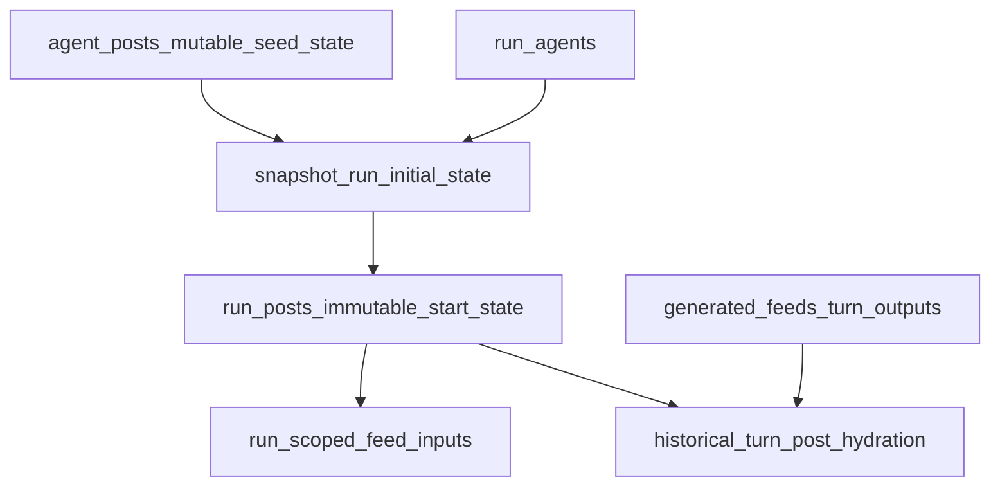

# PR 6: Run Posts Snapshot

## Remember

- Exact file paths always
- Exact commands with expected output
- DRY, YAGNI, TDD, frequent commits
- Maximum safely delegable parallelism
- Delegated tasks must be impossible to misread
- UI changes: agent captures before/after screenshots itself (no README or instructions for the user)

## Overview

Assumption for numbering: PR 6 is the next slice defined in [strategy_planning/2026-03-08_data_architecture_rules/02_proposed_prs_for_migration.md](strategy_planning/2026-03-08_data_architecture_rules/02_proposed_prs_for_migration.md), consistent with the shipped PR 5 plan at [docs/plans/2026-03-17_pr5_agent_posts_602418/plan.md](docs/plans/2026-03-17_pr5_agent_posts_602418/plan.md). The goal is to add immutable `run_posts`, snapshot current `agent_posts` into that table at run creation, and make run execution plus historical run reads consume frozen run-scoped posts instead of live `feed_posts` or mutable `agent_posts`. This is the post analogue of the `run_follow_edges` slice: once a run starts, its initial post set must never drift.

## Happy Flow

1. [db/schema.py](db/schema.py) and a new Alembic revision under [db/migrations/versions/](db/migrations/versions/) add `run_posts`, keyed by `run_post_id`, with `run_id`, provenance back to `agent_post_id`, author identity anchored to `run_agents`, denormalized `*_at_start` fields, and deterministic ordering/indexes for per-run reads.
2. A new pure model plus persistence layer under [simulation/core/models/](simulation/core/models/), [db/adapters/base.py](db/adapters/base.py), [db/adapters/sqlite/](db/adapters/sqlite/), and [db/repositories/](db/repositories/) provides batch snapshot write and run-scoped post reads without touching `feed_posts`.
3. [simulation/core/command_service.py](simulation/core/command_service.py) extends `snapshot_run_initial_state()` so `run_agents`, `run_follow_edges`, and `run_posts` are written in one transaction from the selected run members and their current `agent_posts` rows.
4. Runtime post reads stop depending on live catalog tables for a running simulation: feed candidate generation and any startup post hydration paths read frozen `run_posts` for that `run_id`, so later edits to `agent_posts` or `feed_posts` cannot alter the run’s behavior.
5. Historical run reads in [simulation/core/query_service.py](simulation/core/query_service.py) hydrate feed post IDs from `run_posts`, while turn-event tables (`generated_feeds`, `likes`, `comments`, `follows`) keep their existing meaning as immutable per-run outputs.
6. Regression tests prove snapshot isolation: create run A, change `agent_posts`, create run B, and verify run A still renders its original post set while run B reflects the new seed state.

## Current Seams To Extend

- [simulation/core/command_service.py](simulation/core/command_service.py) already snapshots `run_agents` and `run_follow_edges` together. `run_posts` should extend that same transaction boundary, not introduce a second startup write path.
- [simulation/core/factories/agent.py](simulation/core/factories/agent.py) still hydrates `SimulationAgent.posts` from `feed_post_repo.list_all_feed_posts()`, which is exactly the live-state dependency PR 6 needs to eliminate for behaviorally relevant startup posts.
- [feeds/candidate_generation.py](feeds/candidate_generation.py) and [feeds/feed_generator.py](feeds/feed_generator.py) currently resolve candidates and hydrated posts through `FeedPostRepository`; these are the main execution-time cutover points.
- [simulation/core/query_service.py](simulation/core/query_service.py) currently resolves `generated_feeds.post_ids` through `feed_post_repo.read_feed_posts_by_ids()`, so old runs can still drift if the catalog changes.
- [simulation/core/models/posts.py](simulation/core/models/posts.py) requires canonical `Post.post_id`, `source`, and `uri`, while [simulation/core/models/agent_posts.py](simulation/core/models/agent_posts.py) allows null provenance on manually authored seed posts. PR 6 must freeze a single mapping rule for converting `run_posts` rows into runnable `Post` objects.

## Interface Or Contract Freeze

Freeze these decisions before parallel work starts:

- `run_posts` is the source of truth for all start-of-run posts after snapshot creation. Run-scoped execution/history code must not read live `agent_posts` or `feed_posts` for behaviorally relevant post state.
- Recommended identifier rule: `run_post_id` is the post identifier stored in `generated_feeds.post_ids` and used by run-scoped turn actions for seeded posts. `agent_post_id` remains provenance, enforced unique within `run_id`.
- Recommended `Post` mapping rule: introduce a run-safe synthetic identity for manually authored seed posts rather than requiring upstream provenance. The least fragile approach is to extend [simulation/core/models/posts.py](simulation/core/models/posts.py) with a dedicated seed/run snapshot source (for example `seed_state`) and map each `run_posts` row to a canonical `Post` using that source plus a synthetic `uri`. Preserve upstream `source_*_at_start` and `source_uri_at_start` as denormalized provenance fields on `run_posts`, not as the runtime identity contract.
- Global catalog reads may remain on `feed_posts` where explicitly intended, but any method that is run-scoped by signature or semantics must resolve posts from `run_posts` once this PR lands.

## Serial Coordination Spine

1. Freeze the `run_posts` schema and runtime-identity contract.
  Files: [db/schema.py](db/schema.py), [simulation/core/models/posts.py](simulation/core/models/posts.py), [simulation/core/models/run_posts.py](simulation/core/models/run_posts.py), [db/repositories/interfaces.py](db/repositories/interfaces.py), [db/adapters/base.py](db/adapters/base.py).
2. Land the persistence slice first so execution/query work can depend on concrete repository methods instead of guessing.
  Files: [db/migrations/versions/](db/migrations/versions/), [db/adapters/sqlite/run_post_adapter.py](db/adapters/sqlite/run_post_adapter.py), [db/repositories/run_post_repository.py](db/repositories/run_post_repository.py).
3. After persistence contracts are stable, run execution cutover and history/query cutover can proceed in parallel.
4. Finish with shared dependency wiring and cross-slice regression verification.
  Files: [simulation/core/engine.py](simulation/core/engine.py), [simulation/core/factories/command_service.py](simulation/core/factories/command_service.py), [simulation/core/factories/query_service.py](simulation/core/factories/query_service.py), [tests/simulation/core/test_engine.py](tests/simulation/core/test_engine.py).

## Parallel Task Packets

### Task P1: `run_posts` persistence slice

Objective: Add immutable `run_posts` storage plus repository interfaces/tests that runtime and query code can depend on.

Why parallelizable: This work is isolated to schema, models, adapters, repositories, and DB-focused tests; it should not modify execution/query behavior.

Inspect:

- [db/schema.py](db/schema.py)
- [db/migrations/versions/](db/migrations/versions/)
- [simulation/core/models/run_agents.py](simulation/core/models/run_agents.py)
- [simulation/core/models/agent_posts.py](simulation/core/models/agent_posts.py)
- [db/adapters/sqlite/agent_post_adapter.py](db/adapters/sqlite/agent_post_adapter.py)
- [db/repositories/run_agent_repository.py](db/repositories/run_agent_repository.py)
- [db/repositories/run_follow_edge_repository.py](db/repositories/run_follow_edge_repository.py)

Allowed to change:

- [db/schema.py](db/schema.py)
- One new Alembic revision in [db/migrations/versions/](db/migrations/versions/)
- [simulation/core/models/run_posts.py](simulation/core/models/run_posts.py)
- [db/adapters/base.py](db/adapters/base.py)
- [db/repositories/interfaces.py](db/repositories/interfaces.py)
- [db/adapters/sqlite/run_post_adapter.py](db/adapters/sqlite/run_post_adapter.py)
- [db/adapters/sqlite/**init**.py](db/adapters/sqlite/__init__.py)
- [db/repositories/run_post_repository.py](db/repositories/run_post_repository.py)
- [db/repositories/**init**.py](db/repositories/__init__.py)
- [tests/db/repositories/test_run_post_repository_integration.py](tests/db/repositories/test_run_post_repository_integration.py)
- [tests/lint/test_lint_schema_conventions.py](tests/lint/test_lint_schema_conventions.py) if required by new conventions

Forbidden to change:

- [simulation/core/command_service.py](simulation/core/command_service.py)
- [simulation/core/query_service.py](simulation/core/query_service.py)
- [feeds/candidate_generation.py](feeds/candidate_generation.py)
- [feeds/feed_generator.py](feeds/feed_generator.py)

Preconditions:

- Serial contract freeze is complete.

Dependency tasks:

- None after contract freeze.

Required contracts and invariants:

- `run_posts` rows are immutable after insert.
- Unique constraint on `("run_id", "agent_post_id")`.
- FK from `("run_id", "author_agent_id")` to `run_agents`.
- Deterministic read order by `author_agent_id`, `published_at_start`, `run_post_id`.
- Schema preserves denormalized author/content/provenance fields needed to render history without consulting live tables.

Implementation steps:

1. Add `run_posts` to [db/schema.py](db/schema.py) near `run_agents` / `run_follow_edges`.
2. Use this initial table shape:
  `run_post_id`, `run_id`, `agent_post_id`, `author_agent_id`, `author_handle_at_start`, `author_display_name_at_start`, `body_text_at_start`, `published_at_start`, `source_post_id_at_start`, `source_at_start`, `source_uri_at_start`, `created_at`.
3. Add indexes/constraints:
  PK on `run_post_id`; unique on `("run_id", "agent_post_id")`; index on `("run_id", "author_agent_id", "published_at_start")`; FK `run_id -> runs.run_id`; composite FK `("run_id", "author_agent_id") -> run_agents`.
4. Create [simulation/core/models/run_posts.py](simulation/core/models/run_posts.py) mirroring the frozen-model style used by [simulation/core/models/run_agents.py](simulation/core/models/run_agents.py).
5. Add adapter and repository methods for `write_run_posts(run_id, rows, conn=...)` and `list_run_posts(run_id)`.
6. Add repository integration tests for round-trip writes, FK enforcement, uniqueness, deterministic ordering, and rollback on batch failure.

Verification commands:

- `uv run python scripts/lint_schema_conventions.py`
- `SIM_DB_PATH=/tmp/pr6-run-posts.sqlite uv run python -m alembic -c pyproject.toml upgrade head`
- `SIM_DB_PATH=/tmp/pr6-run-posts.sqlite uv run python -m alembic -c pyproject.toml current`
- `uv run pytest tests/db/repositories/test_run_post_repository_integration.py -q`

Expected outputs:

- Schema lint prints `OK (... tables checked)`.
- Alembic upgrade exits `0`; `current` prints the new revision.
- Repository integration test file passes with no failures.

Done when:

- `run_posts` exists at HEAD in schema and migration.
- Repository methods can write and list `RunPostSnapshot` rows.
- FK/unique/rollback behavior is covered by tests.

Coordinator review checklist:

- Confirm `run_posts` is clearly `run_`*, not mixed-lifecycle.
- Confirm no execution/query files changed.
- Confirm the composite FK ties authors to `run_agents`, not live `agent` rows alone.

### Task P2: Run-start execution cutover

Objective: Snapshot `agent_posts` at run creation and make run execution use frozen `run_posts` as its post source.

Why parallelizable: After P1 lands, this work is isolated to command/execution/feed-generation paths and can proceed without touching history/query files.

Inspect:

- [simulation/core/command_service.py](simulation/core/command_service.py)
- [simulation/core/factories/agent.py](simulation/core/factories/agent.py)
- [feeds/candidate_generation.py](feeds/candidate_generation.py)
- [feeds/feed_generator.py](feeds/feed_generator.py)
- [simulation/core/models/posts.py](simulation/core/models/posts.py)
- [tests/simulation/core/test_command_service.py](tests/simulation/core/test_command_service.py)
- [tests/feeds/test_feed_generator.py](tests/feeds/test_feed_generator.py)

Allowed to change:

- [simulation/core/command_service.py](simulation/core/command_service.py)
- [simulation/core/models/posts.py](simulation/core/models/posts.py) if needed for run-safe post identity
- [simulation/core/factories/agent.py](simulation/core/factories/agent.py)
- [feeds/candidate_generation.py](feeds/candidate_generation.py)
- [feeds/feed_generator.py](feeds/feed_generator.py)
- [tests/simulation/core/test_command_service.py](tests/simulation/core/test_command_service.py)
- [tests/feeds/test_feed_generator.py](tests/feeds/test_feed_generator.py)

Forbidden to change:

- [simulation/core/query_service.py](simulation/core/query_service.py)
- [simulation/api/services/run_query_service.py](simulation/api/services/run_query_service.py)
- [db/schema.py](db/schema.py)
- Any migration files

Preconditions:

- P1 merged and repository contract frozen.

Dependency tasks:

- P1.

Required contracts and invariants:

- `snapshot_run_initial_state()` writes `run_agents`, `run_follow_edges`, and `run_posts` in one transaction.
- Runtime candidate posts for a run come from `run_posts`, not `feed_posts`.
- Later edits to `agent_posts` after run creation cannot change already-running or historical run behavior.
- `generated_feeds.post_ids` contain the same identifier family that query/history code will hydrate from `run_posts`.

Implementation steps:

1. Add `snapshot_run_posts(...)` to [simulation/core/command_service.py](simulation/core/command_service.py), sourcing rows from `AgentPostRepository.list_posts_for_agent_ids(...)` for the selected `run_agent_snapshots`.
2. Extend `snapshot_run_initial_state()` to persist `run_posts` in the same transaction as the existing snapshot tables.
3. Define a single mapper from `RunPostSnapshot` to runtime `Post` objects, including the chosen canonical ID rule for manually authored seed posts.
4. Replace any startup/runtime post loading in [simulation/core/factories/agent.py](simulation/core/factories/agent.py) that still uses `feed_post_repo.list_all_feed_posts()` for run behavior.
5. Update [feeds/candidate_generation.py](feeds/candidate_generation.py) and [feeds/feed_generator.py](feeds/feed_generator.py) so run-scoped candidate selection and post hydration use `run_posts`.
6. Add tests covering snapshot contents, transactionality, and candidate/hydration behavior on a run with frozen posts.

Verification commands:

- `uv run pytest tests/simulation/core/test_command_service.py -q`
- `uv run pytest tests/feeds/test_feed_generator.py -q`

Expected outputs:

- Both files pass.
- New command-service assertions prove `run_post_repo.write_run_posts(...)` is called from the run-start transaction.
- Feed-generator tests prove hydration no longer depends on `feed_post_repo` for run-scoped post resolution.

Done when:

- Command service snapshots `run_posts` at run creation.
- Feed generation for a run can operate entirely from frozen `run_posts`.
- No behaviorally relevant execution path still requires live `feed_posts`.

Coordinator review checklist:

- Confirm `generated_feeds.post_ids` and the `RunPostSnapshot -> Post` mapper agree on identifier semantics.
- Confirm manual seed posts without import provenance still produce valid `Post` objects.
- Confirm no history/query files changed.

### Task P3: History/query cutover

Objective: Make historical turn/run reads hydrate post data from `run_posts` so old runs stop drifting when seed/catalog data changes.

Why parallelizable: After P1 lands, this work is isolated to query/API read paths and their tests.

Inspect:

- [simulation/core/query_service.py](simulation/core/query_service.py)
- [simulation/api/services/run_query_service.py](simulation/api/services/run_query_service.py)
- [simulation/core/engine.py](simulation/core/engine.py)
- [tests/simulation/core/test_query_service.py](tests/simulation/core/test_query_service.py)
- [tests/api/test_simulation_posts.py](tests/api/test_simulation_posts.py)

Allowed to change:

- [simulation/core/query_service.py](simulation/core/query_service.py)
- [simulation/api/services/run_query_service.py](simulation/api/services/run_query_service.py)
- [tests/simulation/core/test_query_service.py](tests/simulation/core/test_query_service.py)
- [tests/api/test_simulation_posts.py](tests/api/test_simulation_posts.py) if the read contract changes

Forbidden to change:

- [simulation/core/command_service.py](simulation/core/command_service.py)
- [feeds/candidate_generation.py](feeds/candidate_generation.py)
- [feeds/feed_generator.py](feeds/feed_generator.py)
- [db/schema.py](db/schema.py)

Preconditions:

- P1 merged and repository contract frozen.

Dependency tasks:

- P1.

Required contracts and invariants:

- `SimulationQueryService.get_turn_data()` must hydrate `generated_feeds.post_ids` from `run_posts` for a run.
- No run-history path should need `feed_post_repo.read_feed_posts_by_ids()` for seeded posts.
- API behavior stays deterministic for existing run detail endpoints.

Implementation steps:

1. Inject `RunPostRepository` into [simulation/core/query_service.py](simulation/core/query_service.py).
2. Replace `feed_post_repo.read_feed_posts_by_ids(...)` with a run-scoped `run_post_repo` read path in `get_turn_data()`.
3. Update [simulation/api/services/run_query_service.py](simulation/api/services/run_query_service.py) only where needed so run-facing endpoints do not assume all post IDs are resolvable through `feed_posts`.
4. Add tests proving a run still hydrates its original post text/author after the underlying `agent_posts` or `feed_posts` rows are changed.

Verification commands:

- `uv run pytest tests/simulation/core/test_query_service.py -q`
- `uv run pytest tests/api/test_simulation_posts.py -q`

Expected outputs:

- Both files pass.
- Query-service tests explicitly show post hydration occurs via `run_post_repo` for run-scoped reads.

Done when:

- Historical turn data resolves post payloads from `run_posts`.
- Existing run APIs remain stable.
- No run-history test requires mutable `feed_posts` state to stay unchanged.

Coordinator review checklist:

- Confirm the query path uses run-scoped lookup consistently.
- Confirm no execution files changed.
- Confirm any remaining global catalog API still has clearly non-run semantics.

## Integration Order

1. Land P1 first.
2. Land P2 and P3 after P1; keep them isolated to their allowed files.
3. Coordinator updates shared wiring only after both packets are ready:
  [simulation/core/engine.py](simulation/core/engine.py), [simulation/core/factories/command_service.py](simulation/core/factories/command_service.py), [simulation/core/factories/query_service.py](simulation/core/factories/query_service.py), [simulation/api/main.py](simulation/api/main.py), [tests/simulation/core/test_engine.py](tests/simulation/core/test_engine.py).
4. Run the full focused verification suite plus a manual two-run smoke.

## Final Verification

- `uv run python scripts/lint_schema_conventions.py`
Expected output: `OK (... tables checked)`.
- `SIM_DB_PATH=/tmp/pr6-run-posts.sqlite uv run python -m alembic -c pyproject.toml upgrade head`
Expected output: exits `0`.
- `SIM_DB_PATH=/tmp/pr6-run-posts.sqlite uv run python -m alembic -c pyproject.toml current`
Expected output: prints the new `run_posts` revision.
- `uv run pytest tests/db/repositories/test_run_post_repository_integration.py -q`
Expected output: passes.
- `uv run pytest tests/simulation/core/test_command_service.py -q`
Expected output: passes with new run-post snapshot assertions.
- `uv run pytest tests/simulation/core/test_query_service.py -q`
Expected output: passes with run-post hydration assertions.
- `uv run pytest tests/feeds/test_feed_generator.py -q`
Expected output: passes with run-scoped post-source assertions.
- `uv run pytest tests/simulation/core/test_engine.py -q`
Expected output: passes with new dependency wiring.

## Manual Verification

- Use a fresh temp DB: `SIM_DB_PATH=/tmp/pr6-run-posts.sqlite uv run python -m alembic -c pyproject.toml upgrade head`.
- Seed local data so `agent_posts` exists: follow the existing local seed workflow in [simulation/local_dev/seed_loader.py](simulation/local_dev/seed_loader.py).
- Create run A through the existing API or command path.
- Inspect `run_posts` for run A and confirm it contains only posts for agents in `run_agents`, ordered by author/time.
- Edit one seeded post in `agent_posts` or rerun the agent-post backfill with changed text for an internal agent.
- Create run B.
- Read run A turn/feed history and confirm it still shows the original post body and author snapshot.
- Read run B turn/feed history and confirm it reflects the edited seed post.
- Confirm turn-event tables (`likes`, `comments`, `follows`) still append normally and are not being reused as start-state storage.

## Alternative Approaches

- Keep `run_posts` as a pure snapshot table but leave runtime feed generation on `feed_posts` until a later PR.
Rejected because it would preserve the main correctness gap: a run’s behavior would still depend on mutable live catalog rows even after snapshotting exists.
- Reuse imported `source_post_id` as the runtime post ID everywhere.
Rejected because manually authored seed posts may have no upstream provenance; PR 6 needs a post identity rule that works for every `run_posts` row, not only imported ones.
- Pair `run_posts`, `run_post_likes`, and `run_post_comments` into one PR.
Rejected because PR 5 deliberately isolated posts first; likes/comments deserve their own review surface once post snapshot semantics are stable.

## Plan Assets

- Store planning artifacts at `docs/plans/2026-03-17_pr6_run_posts_481236/`.
- No UI screenshots are required because this PR should stay out of `ui/`.

