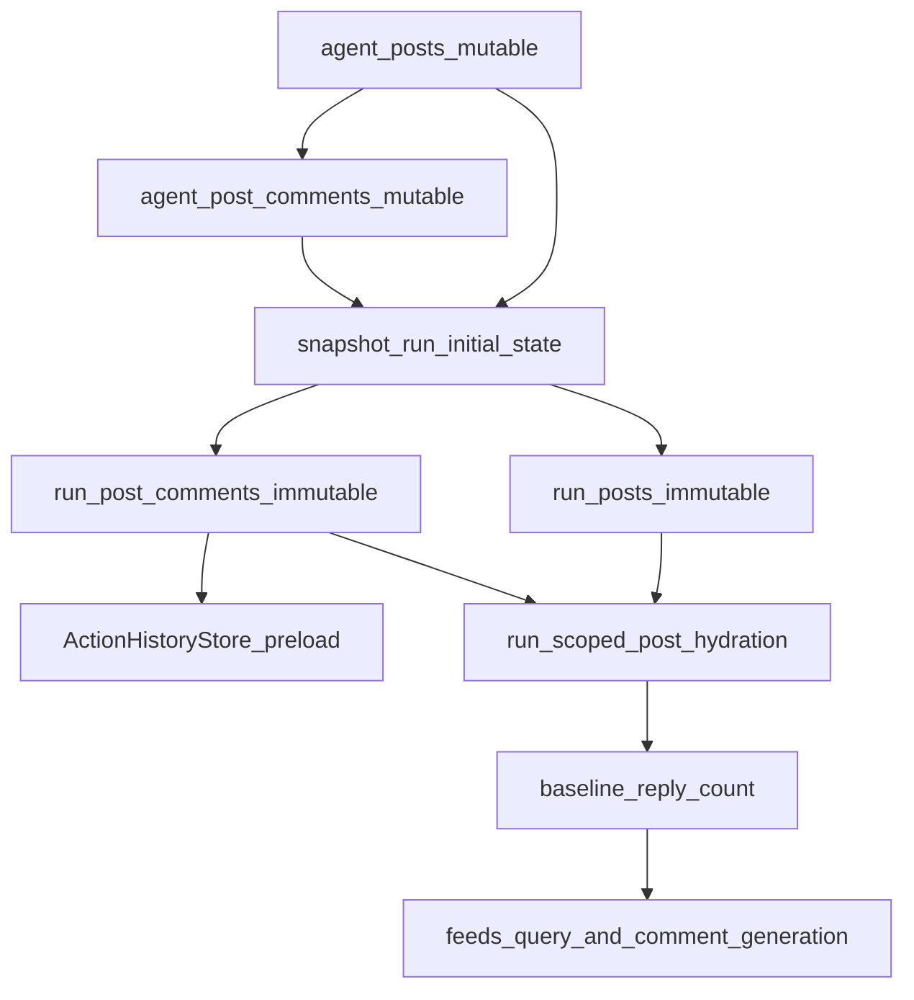

# Seeded Comment Snapshots

## Remember

- Exact file paths always
- Exact commands with expected output
- DRY, YAGNI, TDD, frequent commits
- Maximum safely delegable parallelism
- Delegated tasks must be impossible to misread
- UI changes: agent captures before/after screenshots itself (no README or instructions for the user)

## Overview

This slice extends the existing two-layer persistence model for seeded interactions from likes to comments. We will add mutable `[agent_post_comments](db/schema.py)` rows anchored to `[agent_posts](db/schema.py)`, snapshot them into immutable `[run_post_comments](db/schema.py)` during run creation inside `[simulation/core/command_service.py](simulation/core/command_service.py)`, preload comment history into `[simulation/core/action_history/stores.py](simulation/core/action_history/stores.py)` so duplicate-comment suppression works from turn 0, and update run-scoped hydration so `[Post.reply_count](simulation/core/models/posts.py)` is derived from `run_post_comments` rather than staying at zero.

## Happy Flow

1. Local-dev or test fixture data loads explicit row-level seeded comments into `[simulation/local_dev/seed_loader.py](simulation/local_dev/seed_loader.py)` and persists them into `agent_post_comments`, always anchored to existing `agent_posts` rows.
2. When a run starts, `[simulation/core/command_service.py](simulation/core/command_service.py)` snapshots selected agents into `run_agents`, selected follow edges into `run_follow_edges`, selected posts into `run_posts`, seeded likes into `run_post_likes`, and then seeded comments into `run_post_comments` inside the same transaction.
3. The seeded comment snapshot only includes rows where the commented post exists in this run's `run_posts` and the comment author exists in this run's `run_agents`.
4. Immediately after snapshotting, `[SimulationCommandService](simulation/core/command_service.py)` preloads comment history into `[ActionHistoryStore](simulation/core/action_history/interfaces.py)` so `[HistoryAwareActionFeedFilter](simulation/core/action_policy/candidate_filter.py)` and `[AgentActionRulesValidator](simulation/core/action_policy/rules_validator.py)` treat seeded comments as already-performed actions.
5. Run-scoped post hydration in `[feeds/candidate_generation.py](feeds/candidate_generation.py)`, `[feeds/feed_generator.py](feeds/feed_generator.py)`, `[simulation/core/engine.py](simulation/core/engine.py)`, and `[simulation/core/query_service.py](simulation/core/query_service.py)` reads `run_posts` plus `run_post_comments` and sets `Post.reply_count` from the snapshot counts.
6. Turn-event `[comments](db/repositories/comment_repository.py)` remain append-only outputs created during simulation turns; they do not become the source of truth for seeded comments.

## Interface Or Contract Freeze

- `agent_post_comments` must not contain `run_id` or `turn_number`; `run_post_comments` must be written only at run start and treated as immutable afterward.
- Seeded comments must come from explicit row-level inputs only. Never synthesize comment rows from aggregate `reply_count` values in imported feed data.
- `agent_post_comments.agent_post_id` must reference `agent_posts.agent_post_id`.
- `run_post_comments.run_post_id` must reference `run_posts.run_post_id` and remain scoped by `run_id`.
- Snapshot selection rule: only snapshot comments where the target post is present in this run's `run_posts` and the comment author is present in this run's `run_agents`.
- Hydration rule: any run-scoped `Post` created from `run_posts` must set `reply_count = count(run_post_comments where run_id, run_post_id)`.
- Duplicate suppression rule: seeded comments must be preloaded into action history using the same run-scoped post IDs used by runtime feeds.

## Serial Coordination Spine

1. Freeze the data contract in `[db/schema.py](db/schema.py)`, `[db/adapters/base.py](db/adapters/base.py)`, `[db/repositories/interfaces.py](db/repositories/interfaces.py)`, and `[simulation/core/models/posts.py](simulation/core/models/posts.py)`.
2. Land the persistence slice before runtime changes: Alembic revision, pure models, SQLite adapters, repositories, and DB integration tests.
3. Extend the run-start transaction in `[simulation/core/command_service.py](simulation/core/command_service.py)` to write `run_post_comments` and preload comment history.
4. Cut run-scoped hydration over in one coordinated pass across feed generation, candidate loading, engine reads, and query hydration so `reply_count` is consistent everywhere.
5. Add local-dev/test seeded-comment fixtures and schema docs regeneration only after the runtime contracts are stable.

## Parallel Task Packets

### Task P1: Persistence slice for seeded and snapshot comments

Task ID: `P1`

Objective: Add `agent_post_comments` and `run_post_comments` schema, migration, pure models, SQLite adapters/repositories, and DB integration tests.

Why parallelizable: This work is isolated to persistence and model layers and does not require feed, engine, or action-history behavior changes.

Files to inspect:

- `[db/schema.py](db/schema.py)`
- `[db/adapters/base.py](db/adapters/base.py)`
- `[db/repositories/interfaces.py](db/repositories/interfaces.py)`
- `[db/adapters/sqlite/agent_post_like_adapter.py](db/adapters/sqlite/agent_post_like_adapter.py)`
- `[db/adapters/sqlite/run_post_like_adapter.py](db/adapters/sqlite/run_post_like_adapter.py)`
- `[db/repositories/agent_post_like_repository.py](db/repositories/agent_post_like_repository.py)`
- `[db/repositories/run_post_like_repository.py](db/repositories/run_post_like_repository.py)`
- `[simulation/core/models/run_post_likes.py](simulation/core/models/run_post_likes.py)`

Files allowed to change:

- `[db/schema.py](db/schema.py)`
- One new Alembic revision under `[db/migrations/versions/](db/migrations/versions/)`
- Add `[simulation/core/models/agent_post_comments.py](simulation/core/models/agent_post_comments.py)`
- Add `[simulation/core/models/run_post_comments.py](simulation/core/models/run_post_comments.py)`
- `[db/adapters/base.py](db/adapters/base.py)`
- `[db/repositories/interfaces.py](db/repositories/interfaces.py)`
- Add `[db/adapters/sqlite/agent_post_comment_adapter.py](db/adapters/sqlite/agent_post_comment_adapter.py)`
- Add `[db/adapters/sqlite/run_post_comment_adapter.py](db/adapters/sqlite/run_post_comment_adapter.py)`
- Add `[db/repositories/agent_post_comment_repository.py](db/repositories/agent_post_comment_repository.py)`
- Add `[db/repositories/run_post_comment_repository.py](db/repositories/run_post_comment_repository.py)`
- Add `[tests/db/repositories/test_agent_post_comment_repository_integration.py](tests/db/repositories/test_agent_post_comment_repository_integration.py)`
- Add `[tests/db/repositories/test_run_post_comment_repository_integration.py](tests/db/repositories/test_run_post_comment_repository_integration.py)`

Files forbidden to change:

- `[simulation/core/command_service.py](simulation/core/command_service.py)`
- `[feeds/](feeds/)`
- `[simulation/core/query_service.py](simulation/core/query_service.py)`
- `[simulation/local_dev/seed_loader.py](simulation/local_dev/seed_loader.py)`

Preconditions:

- Interface Or Contract Freeze accepted.

Dependency tasks:

- None.

Required contracts and invariants:

- `agent_post_comments` must preserve row-level authored text and timestamps.
- Recommended indexes on `(agent_post_id, published_at)` and `(author_agent_id, published_at)`.
- `run_post_comments` must retain run-scoped author identity-at-start fields and comment payload-at-start fields.
- Recommended indexes on `(run_id, run_post_id, published_at_start)` and `(run_id, author_agent_id, published_at_start)`.
- Repository contract should support at least `write_*`, `list_comments_for_agent_post_ids`, and `count_comments_by_run_post_ids`.

Step-by-step implementation instructions:

1. Add `agent_post_comments` to `[db/schema.py](db/schema.py)` with `agent_post_comment_id`, `agent_post_id`, `author_agent_id`, `body_text`, `published_at`, `created_at`, and `updated_at`.
2. Add `run_post_comments` to `[db/schema.py](db/schema.py)` with `run_post_comment_id`, `run_id`, `run_post_id`, `author_agent_id`, `author_handle_at_start`, `author_display_name_at_start`, `body_text_at_start`, `published_at_start`, and `created_at`.
3. Create one Alembic revision under `[db/migrations/versions/](db/migrations/versions/)` to create both tables and indexes.
4. Add pure Pydantic models mirroring the existing likes snapshot model shape.
5. Add adapter and repository interfaces in `[db/adapters/base.py](db/adapters/base.py)` and `[db/repositories/interfaces.py](db/repositories/interfaces.py)`.
6. Implement SQLite adapters and repositories, including grouped counting by `run_post_id` for reply-count hydration.
7. Add integration tests covering writes, read/list behavior, grouped counts, and transaction rollback behavior.

Verification commands:

- `uv run python scripts/lint_schema_conventions.py`
- `SIM_DB_PATH=/tmp/seeded-comments.sqlite uv run python -m alembic -c pyproject.toml upgrade head`
- `SIM_DB_PATH=/tmp/seeded-comments.sqlite uv run python -m alembic -c pyproject.toml current`
- `uv run pytest tests/db/repositories/test_agent_post_comment_repository_integration.py -q`
- `uv run pytest tests/db/repositories/test_run_post_comment_repository_integration.py -q`

Expected outputs:

- Schema lint prints `OK`.
- Alembic upgrade exits `0` and `current` reports the latest revision.
- New repository tests pass.

Done when:

- Both tables exist at HEAD with the intended FKs and indexes.
- Repositories can write, list, and count seeded comments deterministically.
- Integration tests cover row payload plus grouped reply counts.

Coordinator review checklist:

- No runtime or feed files changed.
- Comment payload fields are stored only in comment tables, not duplicated into unrelated tables.

### Task P2: Run-start comment snapshotting and comment-history preload

Task ID: `P2`

Objective: Snapshot seeded comments into `run_post_comments` during run creation and preload comment history so seeded comments are treated as already-commented.

Why parallelizable: Once `P1` lands, this work is mostly isolated to `[simulation/core/command_service.py](simulation/core/command_service.py)` and dependency wiring.

Files to inspect:

- `[simulation/core/command_service.py](simulation/core/command_service.py)`
- `[simulation/core/action_history/stores.py](simulation/core/action_history/stores.py)`
- `[simulation/core/action_policy/candidate_filter.py](simulation/core/action_policy/candidate_filter.py)`
- `[simulation/core/action_policy/rules_validator.py](simulation/core/action_policy/rules_validator.py)`
- `[simulation/core/factories/engine.py](simulation/core/factories/engine.py)`
- `[simulation/core/factories/command_service.py](simulation/core/factories/command_service.py)`

Files allowed to change:

- `[simulation/core/command_service.py](simulation/core/command_service.py)`
- `[simulation/core/factories/engine.py](simulation/core/factories/engine.py)`
- `[simulation/core/factories/command_service.py](simulation/core/factories/command_service.py)`
- `[db/repositories/interfaces.py](db/repositories/interfaces.py)` only if `P1` missed a required signature
- `[tests/simulation/core/test_command_service.py](tests/simulation/core/test_command_service.py)`

Files forbidden to change:

- `[feeds/](feeds/)`
- `[simulation/core/query_service.py](simulation/core/query_service.py)`
- `[simulation/local_dev/seed_loader.py](simulation/local_dev/seed_loader.py)`

Preconditions:

- `P1` merged.

Dependency tasks:

- `P1`.

Required contracts and invariants:

- `snapshot_run_initial_state()` remains one transaction for all snapshot writes.
- Seeded comment selection must obey: commented post exists in `run_posts` and comment author exists in `run_agents`.
- `ActionHistoryStore.record_comment(run_id, agent_handle, run_post_id)` must use run-scoped post IDs.

Step-by-step implementation instructions:

1. Inject `agent_post_comment_repo` and `run_post_comment_repo` into `[SimulationCommandService](simulation/core/command_service.py)` and wire them through `[simulation/core/factories/command_service.py](simulation/core/factories/command_service.py)` and `[simulation/core/factories/engine.py](simulation/core/factories/engine.py)`.
2. Extend `snapshot_run_initial_state()` in `[simulation/core/command_service.py](simulation/core/command_service.py)` to call `snapshot_run_post_comments(...)` after `snapshot_run_post_likes(...)` using the same `run_post_snapshots`.
3. Implement `snapshot_run_post_comments(...)` using the likes implementation as the symmetry reference:

- build `agent_post_id -> run_post_id`
- read seed comments for those `agent_post_id` values
- filter to authors present in `run_agents`
- write `RunPostCommentSnapshot` rows with run-scoped author identity fields and `body_text_at_start` / `published_at_start`

1. Add `preload_comment_history_from_snapshots(...)` parallel to `preload_like_history_from_snapshots(...)` and call it immediately after seeded-like preload.
2. Add service tests proving seeded comments are snapshotted and preloaded into action history, and that out-of-run authors or posts are excluded.

Verification commands:

- `uv run pytest tests/simulation/core/test_command_service.py -q`
- `uv run pytest tests/simulation/core/test_dependencies.py -q`

Expected outputs:

- Tests pass.
- Assertions show `run_post_comments` writes happen during run creation and seeded comments appear in comment history before turn 0 actions.

Done when:

- `run_post_comments` is written in the run-start transaction.
- Seeded comments are excluded from future comment candidates for the same agent/post pair.

Coordinator review checklist:

- Snapshot selection logic exactly matches the contract freeze.
- No feed/query reply-count changes slipped into this task.

### Task P3: Run-scoped hydration and read paths use snapshot reply counts

Task ID: `P3`

Objective: Ensure run-scoped posts hydrate with baseline `reply_count` from `run_post_comments` across feeds, candidate loading, engine reads, and query hydration.

Why parallelizable: Once `P1` defines `count_comments_by_run_post_ids`, this work is isolated to read-path hydration and post mapping.

Files to inspect:

- `[simulation/core/models/posts.py](simulation/core/models/posts.py)`
- `[feeds/candidate_generation.py](feeds/candidate_generation.py)`
- `[feeds/feed_generator.py](feeds/feed_generator.py)`
- `[simulation/core/engine.py](simulation/core/engine.py)`
- `[simulation/core/query_service.py](simulation/core/query_service.py)`
- `[tests/feeds/test_feed_generator.py](tests/feeds/test_feed_generator.py)`
- `[tests/simulation/core/test_query_service.py](tests/simulation/core/test_query_service.py)`

Files allowed to change:

- `[simulation/core/models/posts.py](simulation/core/models/posts.py)`
- `[feeds/candidate_generation.py](feeds/candidate_generation.py)`
- `[feeds/feed_generator.py](feeds/feed_generator.py)`
- `[simulation/core/engine.py](simulation/core/engine.py)`
- `[simulation/core/query_service.py](simulation/core/query_service.py)`
- `[simulation/core/factories/engine.py](simulation/core/factories/engine.py)` only if an extra dependency must be passed through
- `[tests/feeds/test_feed_generator.py](tests/feeds/test_feed_generator.py)`
- `[tests/simulation/core/test_query_service.py](tests/simulation/core/test_query_service.py)`

Files forbidden to change:

- `[db/schema.py](db/schema.py)`
- `[db/migrations/versions/](db/migrations/versions/)`
- `[simulation/local_dev/seed_loader.py](simulation/local_dev/seed_loader.py)`

Preconditions:

- `P1` merged.

Dependency tasks:

- `P1`.

Required contracts and invariants:

- `Post.reply_count` for run-scoped posts must reflect `run_post_comments`, not the turn-event `comments` table and not imported aggregate `reply_count`.
- Hydration stays batched; do not introduce per-post DB queries.
- Existing like-count hydration from `run_post_likes` must remain intact.

Step-by-step implementation instructions:

1. Update `[simulation/core/models/posts.py](simulation/core/models/posts.py)` so `run_post_snapshot_to_post(...)` accepts `reply_count` alongside the existing `like_count`.
2. In `[feeds/candidate_generation.py](feeds/candidate_generation.py)`, count `run_post_comments` for all hydrated `run_post_id` values and pass the counts into `run_post_snapshot_to_post(...)`.
3. In `[feeds/feed_generator.py](feeds/feed_generator.py)`, do the same batched reply-count lookup when hydrating run-scoped posts.
4. In `[simulation/core/engine.py](simulation/core/engine.py)` and `[simulation/core/query_service.py](simulation/core/query_service.py)`, add grouped `run_post_comments` counting and pass both baseline counts into the post mapper.
5. Add tests proving seeded comments produce `reply_count > 0` for run-scoped posts before any turn-event comments exist.

Verification commands:

- `uv run pytest tests/feeds/test_feed_generator.py -q`
- `uv run pytest tests/simulation/core/test_query_service.py -q`
- `uv run pytest tests/simulation/core/test_command_service.py -q`

Expected outputs:

- Tests pass.
- At least one new test demonstrates non-zero baseline `reply_count` from `run_post_comments`.

Done when:

- Every run-scoped hydration path sets `reply_count` from snapshot counts.
- No N+1 query pattern is introduced.

Coordinator review checklist:

- Like-count hydration still works.
- Reply-count semantics are consistent across feeds, queries, and engine reads.

### Task P4: Local-dev and test fixture source for seeded comments

Task ID: `P4`

Objective: Provide an explicit row-level fixture format for seeded comments and load it into `agent_post_comments` deterministically during local seeding.

Why parallelizable: After `P1` defines the schema and repository model, this work is isolated to local-dev seeding and fixture data.

Files to inspect:

- `[simulation/local_dev/seed_loader.py](simulation/local_dev/seed_loader.py)`
- `[simulation/local_dev/seed_fixtures/](simulation/local_dev/seed_fixtures/)`
- `[db/backfills/agent_posts.py](db/backfills/agent_posts.py)`
- `[simulation/local_dev/seed_fixtures/agent_post_likes.json](simulation/local_dev/seed_fixtures/agent_post_likes.json)`

Files allowed to change:

- `[simulation/local_dev/seed_loader.py](simulation/local_dev/seed_loader.py)`
- Add `[simulation/local_dev/seed_fixtures/agent_post_comments.json](simulation/local_dev/seed_fixtures/agent_post_comments.json)`
- `[tests/conftest.py](tests/conftest.py)` only if fixture loading helpers need extension
- Add a focused seed-loader test if an appropriate existing module does not exist

Files forbidden to change:

- `[feeds/](feeds/)`
- `[simulation/core/command_service.py](simulation/core/command_service.py)`
- `[db/migrations/versions/](db/migrations/versions/)`

Preconditions:

- `P1` merged.

Dependency tasks:

- `P1`.

Required contracts and invariants:

- Seeded comments must be explicit row-level facts with author, target post, body text, and timestamp.
- Fixture loading must be deterministic and idempotent on rerun.
- Fixture resolution should reuse the same `(post_source, post_source_post_id)` lookup pattern already used for `[agent_post_likes.json](simulation/local_dev/seed_fixtures/agent_post_likes.json)`.

Step-by-step implementation instructions:

1. Add `[simulation/local_dev/seed_fixtures/agent_post_comments.json](simulation/local_dev/seed_fixtures/agent_post_comments.json)` with rows containing `author_handle`, `post_source`, `post_source_post_id`, `body_text`, and optional `published_at`, `created_at`, and `updated_at`.
2. Extend `_load_fixtures()` in `[simulation/local_dev/seed_loader.py](simulation/local_dev/seed_loader.py)` to load the new JSON array.
3. After `backfill_agent_posts_from_feed_posts(...)` in `[simulation/local_dev/seed_loader.py](simulation/local_dev/seed_loader.py)`, resolve `author_handle -> agent_id` and `(post_source, post_source_post_id) -> agent_post_id` exactly as the likes fixture flow already does.
4. Insert deterministic `AgentPostComment` rows using either explicit IDs from the fixture or a stable hash over `author_agent_id`, `agent_post_id`, `body_text`, and `published_at`.
5. Add a focused test or seed-loader assertion proving that re-running local seeding does not duplicate seeded comment rows.

Verification commands:

- `SIM_DB_PATH=/tmp/seeded-comments.sqlite uv run python -m alembic -c pyproject.toml upgrade head`
- `SIM_DB_PATH=/tmp/seeded-comments.sqlite LOCAL=1 uv run python -c "from simulation.local_dev.seed_loader import seed_local_db_if_needed; seed_local_db_if_needed(db_path='/tmp/seeded-comments.sqlite')"`
- Re-run the same seeding command and confirm stable row counts or an `already applied` log

Expected outputs:

- First run seeds comments successfully.
- Second run is idempotent and does not duplicate `agent_post_comments` rows.

Done when:

- Fixture exists and resolves deterministically into `agent_post_comments`.
- No seeded comments are synthesized from imported aggregate counters.

Coordinator review checklist:

- Local seeding changes are isolated to dev/test flows.
- Fixture shape is explicit enough to be reused in end-to-end tests.

## Integration Order

1. Merge `P1` first.
2. Merge `P2` next.
3. Merge `P3` next.
4. Merge `P4` after the runtime contracts are stable.
5. Regenerate DB schema docs after the migration lands: `uv run python scripts/generate_db_schema_docs.py --update`.

## Final Verification

- `uv run python scripts/lint_schema_conventions.py`
  - Expected: `OK`.
- `SIM_DB_PATH=/tmp/seeded-comments.sqlite uv run python -m alembic -c pyproject.toml upgrade head`
  - Expected: exits `0`.
- `uv run pytest tests/db/repositories/test_agent_post_comment_repository_integration.py -q`
  - Expected: pass.
- `uv run pytest tests/db/repositories/test_run_post_comment_repository_integration.py -q`
  - Expected: pass.
- `uv run pytest tests/simulation/core/test_command_service.py -q`
  - Expected: pass.
- `uv run pytest tests/feeds/test_feed_generator.py -q`
  - Expected: pass.
- `uv run pytest tests/simulation/core/test_query_service.py -q`
  - Expected: pass.
- `uv run python scripts/generate_db_schema_docs.py --update`
  - Expected: schema docs refresh without errors.

## Manual Verification

- Apply migrations on a fresh DB:
  - `SIM_DB_PATH=/tmp/seeded-comments.sqlite uv run python -m alembic -c pyproject.toml upgrade head`
  - Expected: exits `0`.
- Seed local fixtures:
  - `SIM_DB_PATH=/tmp/seeded-comments.sqlite LOCAL=1 uv run python -c "from simulation.local_dev.seed_loader import seed_local_db_if_needed; seed_local_db_if_needed(db_path='/tmp/seeded-comments.sqlite')"`
  - Expected: logs show seeded comments resolved successfully.
- Start the API:
  - `DISABLE_AUTH=1 PYTHONPATH=. uv run uvicorn simulation.api.main:app --reload`
  - Expected: `http://localhost:8000/health` returns healthy.
- Create a run through the existing run-creation endpoint.
- Verify snapshot isolation:
  - Confirm `run_post_comments` rows exist only for posts included in that run and only for authors included in that run.
  - Confirm run-scoped post hydration returns baseline `reply_count > 0` for posts with seeded comments before any simulation turns execute.
- Verify duplicate-comment suppression:
  - In the first simulated turn, confirm an agent who already has a seeded comment on a post does not receive that post in comment candidates and does not emit a duplicate comment for it.
- Edit seed-state comments after the run exists, create a second run, and confirm the first run's baseline reply counts and seeded comment history do not change.

## Alternative Approaches

- Store `reply_count_at_start` directly on `run_posts`: rejected because seeded comments are row-level historical facts and duplicate-comment suppression needs the actual author-to-post relationships, not just a counter.
- Reuse the turn-event `comments` table with `turn_number = 0` for seeded comments: rejected because it mixes mutable seed state with append-only turn history and violates the run-snapshot architecture.
- Ship likes and comments together: rejected because comment payload validation, fixture shape, and reply-count cutover create a larger review surface than the existing likes slice.

## Plan Assets

- Store assets at `docs/plans/2026-03-19_seeded_comments_snapshots_581420/`.
- No UI screenshots are required because this slice does not change `[ui/](ui/)`.
