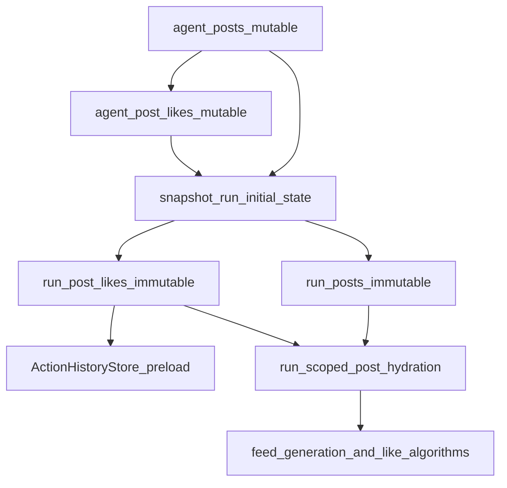

## Remember

- Exact file paths always
- Exact commands with expected output
- DRY, YAGNI, TDD, frequent commits
- Maximum safely delegable parallelism
- Delegated tasks must be impossible to misread

## Overview

We will extend the existing two-layer persistence model (mutable `agent_*` seed state, immutable `run_*` run-start snapshots, append-only per-turn action tables) to support **seeded likes**. Concretely, we’ll introduce `agent_post_likes` as the editable pre-run source of truth for “likes that already exist before a run starts”, snapshot those rows into `run_post_likes` inside the existing run-start transaction in `simulation/core/command_service.py`, and then update run-scoped post hydration so `Post.like_count` at run start reflects `run_post_likes` (so feed ranking and LLM prompts see stable social proof).

## Happy Flow

1. Schema adds `agent_post_likes` (mutable, anchored to `agent_posts`) and `run_post_likes` (immutable, anchored to `run_posts` + `run_agents`) in `db/schema.py` and an Alembic revision under `db/migrations/versions/`.
2. New pure models are added under `simulation/core/models/` for both seed and snapshot likes (`AgentPostLike`, `RunPostLikeSnapshot`) and new repository/adapters are added under `db/adapters/base.py`, `db/adapters/sqlite/`, `db/repositories/interfaces.py`, and `db/repositories/`.
3. Run start snapshots are extended in `simulation/core/command_service.py::snapshot_run_initial_state()` to write `run_post_likes` in the same transaction as `run_agents`, `run_follow_edges`, and `run_posts`, filtering to likes where both (a) the liked post exists in this run’s `run_posts` and (b) the liker is a member of this run’s `run_agents`.
4. Immediately after run creation, `SimulationCommandService` preloads like history from `run_post_likes` into `ActionHistoryStore` so duplicate-like suppression (`HistoryAwareActionFeedFilter` and `AgentActionRulesValidator`) treats seeded likes as already-done.
5. Run-scoped post hydration (feeds + query endpoints) computes baseline `Post.like_count` from `run_post_likes` so deterministic “social proof at start” works and stays frozen for historical runs.
6. Local dev/test seeding gains an explicit row-level fixture source for seeded likes (no synthesis from counters) and loads it into `agent_post_likes` after `agent_posts` is backfilled.

## Interface Or Contract Freeze

Freeze these decisions before parallel work begins:

- **Seed/snapshot separation**: `agent_post_likes` must not contain `run_id`/`turn_number`; `run_post_likes` must not contain mutable fields and must be written only at run start.
- **Row-level only**: seeded likes must come from explicit row-level inputs (fixtures or a real row-level ingest table). Do not fabricate rows from aggregate `like_count`.
- **Anchors**:
  - `agent_post_likes.agent_post_id` references `agent_posts.agent_post_id`.
  - `run_post_likes.run_post_id` references `run_posts.run_post_id` and `run_post_likes` is scoped by `run_id`.
- **Selection rule at snapshot**: only snapshot likes that target posts in `run_posts` for the run, and only from likers in `run_agents` for the run.
- **Hydration rule**: any run-scoped `Post` objects created from `run_posts` must set `like_count = count(run_post_likes where run_id, run_post_id)`.

## Serial Coordination Spine

1. Lock the schema and repository contracts for `agent_post_likes` and `run_post_likes`.
  - Files: `db/schema.py`, `db/adapters/base.py`, `db/repositories/interfaces.py`, `simulation/core/models/posts.py`.
2. Land persistence slice (DDL + adapters + repositories + integration tests) before touching execution/feed/query.
  - Files: `db/migrations/versions/`, `db/adapters/sqlite/`, `db/repositories/`, `tests/db/`.
3. Land run-start snapshot + action-history preload changes.
  - Files: `simulation/core/command_service.py`, `simulation/core/action_history/*` (only if needed).
4. Land run-scoped hydration changes for like_count in a single coordinated pass (feeds + query).
  - Files: `feeds/`, `simulation/core/query_service.py`, `simulation/core/engine.py`, `simulation/core/models/posts.py`.
5. Add local-dev/test fixture loading for seeded likes.
  - Files: `simulation/local_dev/seed_loader.py`, `simulation/local_dev/seed_fixtures/`.

## Parallel Task Packets

### Task P1: Persistence slice for seeded + snapshot likes

**Task ID**: P1

**Objective (1 sentence)**: Add `agent_post_likes` and `run_post_likes` schema + migrations + pure models + SQLite adapters/repositories + DB integration tests.

**Why parallelizable**: Isolated to persistence/model layers; does not require changing feed generation or command/query behavior.

**Files to inspect**:

- `db/schema.py`
- `db/migrations/versions/8f6c2a1b4d3e_add_run_follow_edges.py` (style reference)
- `db/migrations/versions/a1b2c3d4e5f6_add_run_posts.py` (style reference)
- `db/adapters/sqlite/run_post_adapter.py`
- `db/repositories/run_post_repository.py`
- `simulation/core/models/run_posts.py`

**Files allowed to change**:

- `db/schema.py`
- One new Alembic revision under `db/migrations/versions/`
- Add: `simulation/core/models/agent_post_likes.py`
- Add: `simulation/core/models/run_post_likes.py`
- `db/adapters/base.py`
- `db/repositories/interfaces.py`
- Add: `db/adapters/sqlite/agent_post_like_adapter.py`
- Add: `db/adapters/sqlite/run_post_like_adapter.py`
- Add: `db/repositories/agent_post_like_repository.py`
- Add: `db/repositories/run_post_like_repository.py`
- Add: `tests/db/repositories/test_agent_post_like_repository_integration.py`
- Add: `tests/db/repositories/test_run_post_like_repository_integration.py`
- Add (if needed): `tests/db/adapters/sqlite/test_run_post_like_adapter.py`

**Files forbidden to change**:

- `simulation/core/command_service.py`
- `feeds/` (all)
- `simulation/core/query_service.py`
- `simulation/local_dev/seed_loader.py`

**Preconditions**:

- Contract Freeze section decisions accepted.

**Dependencies**:

- None.

**Required contracts and invariants**:

- `agent_post_likes` unique constraint to prevent duplicates (recommend: `uq_agent_post_likes_liker_post` on `(liker_agent_id, agent_post_id)`).
- `run_post_likes` unique constraint to prevent duplicates within a run (recommend: `uq_run_post_likes_run_liker_post` on `(run_id, liker_agent_id, run_post_id)`).
- `run_post_likes` must FK to `run_posts` (by `run_post_id`) and to `run_agents` (by `(run_id, liker_agent_id)`), mirroring the `run_posts` author constraint pattern.

**Step-by-step implementation instructions**:

1. Add tables in `db/schema.py`:
  - `agent_post_likes`: columns: `agent_post_like_id TEXT PK`, `agent_post_id TEXT NOT NULL`, `liker_agent_id TEXT NOT NULL`, `created_at TEXT NOT NULL`.
  - `run_post_likes`: columns: `run_post_like_id TEXT PK`, `run_id TEXT NOT NULL`, `run_post_id TEXT NOT NULL`, `liker_agent_id TEXT NOT NULL`, `liker_handle_at_start TEXT NOT NULL`, `liker_display_name_at_start TEXT NOT NULL`, `created_at TEXT NOT NULL`.
2. Add SQLite-friendly indexes:
  - `idx_agent_post_likes_post_id` on `agent_post_id`
  - `idx_run_post_likes_run_post` on `(run_id, run_post_id)`
  - `idx_run_post_likes_run_liker` on `(run_id, liker_agent_id)`
3. Create an Alembic revision creating both tables + indexes.
4. Add pure models:
  - `simulation/core/models/agent_post_likes.py::AgentPostLike`
  - `simulation/core/models/run_post_likes.py::RunPostLikeSnapshot`
5. Add adapter/repository interfaces in `db/adapters/base.py` and `db/repositories/interfaces.py`:
  - `AgentPostLikeRepository`: `write_agent_post_likes(rows, conn=...)`, `list_likes_for_agent_post_ids(agent_post_ids, conn=...)`.
  - `RunPostLikeRepository`: `write_run_post_likes(run_id, rows, conn=...)`, `count_likes_by_run_post_ids(run_id, run_post_ids, conn=...)`.
6. Implement SQLite adapters similar to `db/adapters/sqlite/run_post_adapter.py`:
  - Use `ordered_column_names()` + `required_column_names()` and batch `executemany` inserts.
  - Implement `count_likes_by_run_post_ids` using a grouped `SELECT run_post_id, COUNT(*) ... GROUP BY run_post_id`.
7. Add repository integration tests mirroring the existing run snapshot repo tests:
  - Validate uniqueness constraints.
  - Validate grouped count behavior.
  - Validate rollback on failure inside a transaction.

**Verification commands**:

- `uv run python scripts/lint_schema_conventions.py`
- `SIM_DB_PATH=/tmp/seeded-likes.sqlite uv run python -m alembic -c pyproject.toml upgrade head`
- `SIM_DB_PATH=/tmp/seeded-likes.sqlite uv run python -m alembic -c pyproject.toml current`
- `uv run pytest tests/db/repositories/test_run_post_like_repository_integration.py -q`
- `uv run pytest tests/db/repositories/test_agent_post_like_repository_integration.py -q`

**Expected outputs**:

- Schema lint prints `OK`.
- Alembic upgrade exits `0` and `current` prints the latest revision.
- Tests pass.

**Done-when checklist**:

- Tables exist at HEAD with correct FKs and uniqueness.
- Repos can write and count snapshot likes deterministically.
- Integration tests cover duplicates and counts.

**Coordinator review checklist**:

- No runtime/query/feed/local-dev files changed.
- `run_post_likes` is clearly run-start immutable and anchored to run snapshots.

---

### Task P2: Run-start snapshotting + like-history preload

**Task ID**: P2

**Objective (1 sentence)**: Snapshot seeded likes into `run_post_likes` during run creation and preload like history into `ActionHistoryStore` so seeded likes are treated as already-liked.

**Why parallelizable**: Depends only on P1’s repository contracts; isolated primarily to `simulation/core/command_service.py`.

**Files to inspect**:

- `simulation/core/command_service.py` (existing `snapshot_run_posts()` and `preload_follow_history_from_snapshots()`)
- `simulation/core/action_history/stores.py`
- `simulation/core/action_policy/candidate_filter.py`

**Files allowed to change**:

- `simulation/core/command_service.py`
- `simulation/core/factories/command_service.py`
- `simulation/core/factories/engine.py`
- `db/repositories/interfaces.py` (only if P1 missed a needed method signature)

**Files forbidden to change**:

- `feeds/` (all)
- `simulation/core/query_service.py`
- `simulation/core/models/posts.py`
- `simulation/local_dev/seed_loader.py`

**Preconditions**:

- P1 merged.

**Dependencies**:

- P1.

**Required contracts and invariants**:

- `snapshot_run_initial_state()` remains **one transaction** for all snapshot writes.
- Snapshot selection must obey: liked post ∈ `run_posts` for this run AND liker ∈ `run_agents`.
- `ActionHistoryStore` records likes using the same `post_id` namespace used in runtime feeds (for run-scoped posts, that is `run_post_id`).

**Step-by-step implementation instructions**:

1. Add new injected repos to `SimulationCommandService.__init__` in `simulation/core/command_service.py`:
  - `agent_post_like_repo` (seed)
  - `run_post_like_repo` (snapshot)
2. Update `simulation/core/factories/command_service.py` and `simulation/core/factories/engine.py` to construct and wire these repositories.
3. Update `snapshot_run_initial_state()` to:
  - capture the `RunPostSnapshot` list returned from `snapshot_run_posts()` (currently ignored)
  - call `snapshot_run_post_likes(run=..., run_agent_snapshots=..., run_post_snapshots=..., conn=...)`
4. Implement `snapshot_run_post_likes(...)`:
  - Build `agent_post_id -> run_post_id` mapping from `run_post_snapshots`.
  - Read seed likes from `agent_post_like_repo.list_likes_for_agent_post_ids(list(agent_post_id_keys), conn=conn)`.
  - Filter out likes where `liker_agent_id` not in selected agent IDs.
  - Populate `RunPostLikeSnapshot` rows with:
    - `run_post_like_id=str(uuid4())`
    - `run_id`, `run_post_id`
    - `liker_agent_id` plus `liker_handle_at_start` / `liker_display_name_at_start` from `run_agent_snapshots`
    - `created_at=run.created_at` (or seed row timestamp, but choose one and keep consistent)
  - Write via `run_post_like_repo.write_run_post_likes(run.run_id, rows, conn=conn)`.
5. Add `preload_like_history_from_snapshots(...)` (parallel to follow preload) and call it right after snapshots, alongside `preload_follow_history_from_snapshots(...)`:
  - For each snapshot: resolve `liker_agent_id -> handle_at_start` and do `action_history_store.record_like(run_id, liker_handle, run_post_id)`.

**Verification commands**:

- `uv run pytest tests/simulation/core/test_command_service.py -q`
- `uv run pytest tests/simulation/core/test_engine.py -q`

**Expected outputs**:

- Tests pass.
- New assertions show run-start snapshot writes include `run_post_likes` and preload records seeded likes in the history store.

**Done-when checklist**:

- `run_post_likes` is written during the run-start transaction.
- Seeded likes affect duplicate-like suppression immediately.

**Coordinator review checklist**:

- No feed-generation/query hydration logic changed here.
- Snapshot selection filtering matches contract freeze.

---

### Task P3: Run-scoped post hydration uses snapshot like counts

**Task ID**: P3

**Objective (1 sentence)**: Ensure posts hydrated from `run_posts` have correct baseline `like_count` from `run_post_likes` in feed generation, candidate loading, and turn query hydration.

**Why parallelizable**: Can proceed independently once P1 defines `count_likes_by_run_post_ids`; it is isolated to feed/query hydration and `Post` mapping functions.

**Files to inspect**:

- `simulation/core/models/posts.py` (`run_post_snapshot_to_post`)
- `feeds/candidate_generation.py`
- `feeds/feed_generator.py`
- `simulation/core/query_service.py`
- `simulation/core/engine.py`

**Files allowed to change**:

- `simulation/core/models/posts.py`
- `feeds/candidate_generation.py`
- `feeds/feed_generator.py`
- `feeds/feed_generator_adapter.py`
- `feeds/interfaces.py` (only if the interface signature needs to carry a new dependency)
- `simulation/core/query_service.py`
- `simulation/core/engine.py`
- `simulation/core/factories/command_service.py` (to pass the new repo into feed generator adapter)

**Files forbidden to change**:

- `db/schema.py`
- `db/migrations/versions/`
- `simulation/local_dev/seed_loader.py`

**Preconditions**:

- P1 merged.

**Dependencies**:

- P1.

**Required contracts and invariants**:

- `Post.like_count` for run-scoped posts reflects run-start snapshot likes (not the turn-event `likes` table).
- Hydration remains batched (no per-post DB queries).

**Step-by-step implementation instructions**:

1. Add a stable extension point for counts in `simulation/core/models/posts.py`:
  - Option A (preferred): change `run_post_snapshot_to_post(snapshot: RunPostSnapshot, *, like_count: int = 0) -> Post` and update all call sites.
  - Option B: add `run_post_snapshot_to_post_with_counts(...)` and migrate call sites used for run-scoped hydration.
2. Add `RunPostLikeRepository` dependency to feed generation:
  - Update `feeds/feed_generator_adapter.py` to accept `run_post_like_repo` and pass into `feeds/feed_generator.generate_feeds(...)`.
  - Update `feeds/feed_generator.py`:
    - In `_load_hydrated_posts(...)`, call `run_post_like_repo.count_likes_by_run_post_ids(run_id, all_post_ids)`.
    - Set `Post.like_count` when mapping each snapshot.
  - Update `feeds/candidate_generation.py` similarly for `list_run_posts(run_id)` hydration.
3. Update query hydration in `simulation/core/query_service.py::get_turn_data()`:
  - After `run_post_repo.read_run_posts_by_ids(...)`, call `run_post_like_repo.count_likes_by_run_post_ids(run_id, post_ids_list)`.
  - Use counts when mapping snapshots to `Post` objects.
4. Update `simulation/core/engine.py::read_posts_for_run()` similarly.
5. Add/extend tests (prefer existing test modules) to assert that posts returned by feed generation and query hydration include non-zero `like_count` when `run_post_likes` exists.

**Verification commands**:

- `uv run pytest tests/feeds/test_feed_generator.py -q`
- `uv run pytest tests/simulation/core/test_query_service.py -q`

**Expected outputs**:

- Tests pass.
- At least one new test demonstrates `like_count > 0` for a run-scoped post when seeded likes were snapshotted.

**Done-when checklist**:

- All run-scoped hydration paths set baseline like_count from `run_post_likes`.
- No N+1 DB queries introduced.

**Coordinator review checklist**:

- Mapping function(s) keep backward compatibility or all call sites updated consistently.
- Feed ranking and like-generation prompts now see correct baseline social proof.

---

### Task P4: Local-dev/test fixture source for seeded likes

**Task ID**: P4

**Objective (1 sentence)**: Provide an explicit row-level fixture format for seeded likes and load it into `agent_post_likes` deterministically during local seeding.

**Why parallelizable**: Can be developed after P1 defines schema/model; isolated to local-dev seeding and fixture data.

**Files to inspect**:

- `simulation/local_dev/seed_loader.py`
- `simulation/local_dev/seed_fixtures/` (existing JSON fixtures)
- `db/backfills/agent_posts.py` (to understand how `agent_posts` rows are derived)

**Files allowed to change**:

- `simulation/local_dev/seed_loader.py`
- Add: `simulation/local_dev/seed_fixtures/agent_post_likes.json`
- Add: `db/adapters/sqlite/agent_post_like_adapter.py` usage in seed loader (no schema changes)

**Files forbidden to change**:

- `feeds/` (all)
- `simulation/core/command_service.py`
- `db/migrations/versions/`

**Preconditions**:

- P1 merged.

**Dependencies**:

- P1.

**Required contracts and invariants**:

- Seeded likes must be row-level facts, not derived from counters.
- Fixture loading must be deterministic and not duplicate rows on rerun.

**Step-by-step implementation instructions**:

1. Define `agent_post_likes.json` fixture rows in terms that can be resolved deterministically after `agent_posts` backfill. Recommended fixture shape:
  - `liker_handle` (maps to `agent.agent_id`)
  - `post_source` + `post_source_post_id` (maps to `agent_posts.(source, source_post_id)`)
  - optional `created_at`
2. In `simulation/local_dev/seed_loader.py`:
  - Load this fixture file (as `_read_json_list(...)`).
  - After `backfill_agent_posts_from_feed_posts(...)` completes, resolve each fixture row to:
    - `liker_agent_id` via handle lookup
    - `agent_post_id` via lookup in `agent_posts` by `(source, source_post_id)`
  - Insert into `agent_post_likes` using the SQLite adapter with an idempotent strategy (either deterministic `agent_post_like_id` or `INSERT OR IGNORE` under a unique constraint).
3. Add/extend a local-dev seed test (or a focused unit test around the loader) to confirm rerunning seeding does not duplicate `agent_post_likes` rows.

**Verification commands**:

- `SIM_DB_PATH=/tmp/seeded-likes.sqlite uv run python -m alembic -c pyproject.toml upgrade head`
- `SIM_DB_PATH=/tmp/seeded-likes.sqlite LOCAL=1 uv run python -c "from simulation.local_dev.seed_loader import seed_local_db_if_needed; seed_local_db_if_needed(db_path='/tmp/seeded-likes.sqlite')"`
- Re-run the same command and confirm no duplicates (via logs or a tiny assertion test).

**Expected outputs**:

- Second seeding run reports “already applied” or results in stable row counts.

**Done-when checklist**:

- Fixture exists and loads deterministically into `agent_post_likes`.
- No synthesized likes from counters.

**Coordinator review checklist**:

- Seed loader changes are strictly local-dev; production code paths remain unaffected.

## Integration Order

1. Merge P1 (persistence) first.
2. Merge P2 (run-start snapshot + preload) next.
3. Merge P3 (hydration + like_count baseline) next.
4. Merge P4 (local fixtures) last.

## Final Verification

- `uv run python scripts/lint_schema_conventions.py`
  - Expected: `OK`.
- `SIM_DB_PATH=/tmp/seeded-likes.sqlite uv run python -m alembic -c pyproject.toml upgrade head`
  - Expected: exits `0`.
- `uv run pytest tests/db/repositories/test_run_post_like_repository_integration.py -q`
  - Expected: pass.
- `uv run pytest tests/simulation/core/test_command_service.py -q`
  - Expected: pass.
- `uv run pytest tests/feeds/test_feed_generator.py -q`
  - Expected: pass.
- `uv run pytest tests/simulation/core/test_query_service.py -q`
  - Expected: pass.

## Manual Verification

- Apply migrations on a fresh DB:
  - `SIM_DB_PATH=/tmp/seeded-likes.sqlite uv run python -m alembic -c pyproject.toml upgrade head`
  - Expected: exits `0`.
- Seed local fixtures (no UI involved):
  - `SIM_DB_PATH=/tmp/seeded-likes.sqlite LOCAL=1 uv run python -c "from simulation.local_dev.seed_loader import seed_local_db_if_needed; seed_local_db_if_needed(db_path='/tmp/seeded-likes.sqlite')"`
  - Expected: logs show seeding success.
- Create a run (existing API path):
  - Start server: `DISABLE_AUTH=1 PYTHONPATH=. uv run uvicorn simulation.api.main:app --reload`
  - Create run via `POST /v1/simulations/run` (any standard request).
- Verify snapshot isolation:
  - Confirm `run_post_likes` rows exist for the run and only reference `run_posts.run_post_id` values for that run.
  - Confirm `Post.like_count` is non-zero for posts that have seeded likes when fetched via the run-scoped posts endpoint (`GET /v1/simulations/posts?run_id=...&post_ids=...`).
  - Confirm duplicate-like suppression works: in a subsequent turn, an agent who already seeded-liked a post should not have that post in `HistoryAwareActionFeedFilter`’s `like_candidates`.

## Alternative approaches

- **Store `like_count_at_start` directly on `run_posts`**: rejected because counts are derived/denormalized; we need row-level likes for faithful replay and for future comment/like identity needs.
- **Reuse the turn-event `likes` table with `turn_number=0` as “seeded likes”**: rejected because it mixes lifecycles (seed vs turn events) and violates the architecture contract described in `docs/architecture/run-snapshots.md`.

## Plan Assets

- Store assets at `docs/plans/2026-03-19_seeded_likes_snapshots_739204/`.
- No UI screenshots required because this plan does not change `ui/`.

