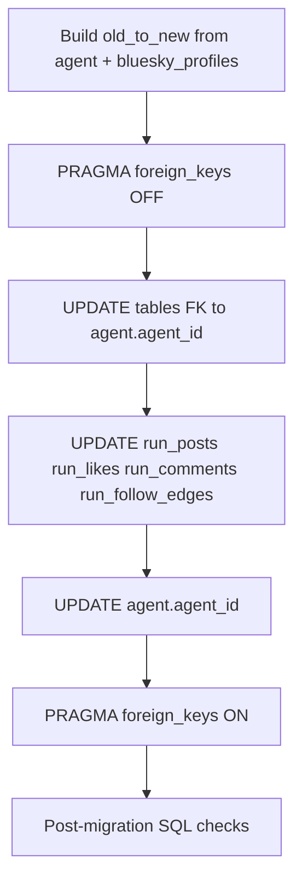

# Persisted agent primary-key and FK rewrite

## Remember

- Exact file paths always
- Exact commands with expected output
- DRY, YAGNI, TDD, frequent commits
- Maximum safely delegable parallelism
- Delegated tasks must be impossible to misread
- No `ui/` changes in this unit; no browser before/after screenshots

---

## Context (already landed)

- Canonical helpers and `Agent` guardrails: [`lib/agent_id.py`](lib/agent_id.py), [`simulation/core/models/agent.py`](simulation/core/models/agent.py).
- Creation-path normalization (new writes + seed fixtures): [`simulation/api/services/agent_command_service.py`](simulation/api/services/agent_command_service.py), [`jobs/migrate_agents_to_new_schema.py`](jobs/migrate_agents_to_new_schema.py), [`simulation/local_dev/seed_fixtures/`](simulation/local_dev/seed_fixtures/).

This unit **only** rewrites **existing** SQLite rows so every FK to `agent.agent_id` uses the same canonical 16-char hex IDs. Current Alembic head to extend: **`b2c4d6e8f0a1`** ([`db/migrations/versions/b2c4d6e8f0a1_add_agent_post_comments_and_run_post_comments.py`](db/migrations/versions/b2c4d6e8f0a1_add_agent_post_comments_and_run_post_comments.py)).

---

## Interface or contract freeze

- **Frozen algorithm:** `new_id = canonical_agent_id(stable_source)` from [`lib/agent_id.py`](lib/agent_id.py) only (same implementation as runtime).
- **Frozen precedence for `stable_source` per agent row** (align with [strategy proposal](strategy_planning/2026-03-20_agent_id_migration/proposal.md)):
  1. Bluesky DID when joinable: `LEFT JOIN bluesky_profiles AS bp ON bp.handle = agent.handle` then use `bp.did` when non-null/non-empty.
  2. Else `agent.handle` (trimmed).
  3. Else `agent.agent_id` (legacy UUID / DID / `agent_*` string).
- **Frozen scope — columns to rewrite:** Every value that is an FK to `agent.agent_id` per [`db/schema.py`](db/schema.py):
  - `agent.agent_id` (PK)
  - `agent_persona_bios.agent_id`
  - `user_agent_profile_metadata.agent_id`
  - `agent_follow_edges.follower_agent_id`, `target_agent_id`
  - `agent_posts.agent_id`
  - `agent_post_likes.liker_agent_id`
  - `agent_post_comments.author_agent_id`
  - `run_agents.agent_id` (part of PK and FK to `agent`)
  - `run_posts.author_agent_id` (FK to `run_agents`)
  - `run_post_likes.liker_agent_id`
  - `run_post_comments.author_agent_id`
  - `run_follow_edges.follower_agent_id`, `target_agent_id`
- **Explicit non-goals (this unit):** No edits under [`simulation/`](simulation/) (runtime), [`jobs/`](jobs/) (except if a test harness needs a fixture), or [`ui/`](ui/). No schema column renames (`Follow.user_id`, `likes.agent_handle`, etc.)—those belong to the later “action/feed model semantics” work described in the strategy doc. **Handle-keyed** tables [`likes`](db/schema.py), [`comments`](db/schema.py), [`follows`](db/schema.py), and handle-PK [`generated_feeds`](db/schema.py) are **not** FK-bound to `agent.agent_id`; treat them as **out of scope** here unless you explicitly expand scope with coordinated runtime changes (otherwise you risk breaking validators that still compare handles).

---

## Happy Flow

1. **Build map:** For each row in `agent`, compute `stable_source` with the precedence above; `new_id = canonical_agent_id(stable_source)`. Fail fast if two different `old_agent_id` values map to the same `new_id` (collision) or if any `new_id` fails [`is_canonical_agent_id`](lib/agent_id.py).
2. **Optional fast path:** If `is_canonical_agent_id(old_agent_id)` and `old_agent_id == canonical_agent_id(stable_source)` for that row, skip rewriting that row’s dependents (keeps upgrades cheap for DBs already normalized by creation paths).
3. **Apply rewrites (SQLite):** In one migration revision, use `PRAGMA foreign_keys=OFF` (or equivalent connection execution) for the upgrade body, then UPDATE tables in an order that respects composite FKs: children of `agent` and `run_agents` before final `agent` PK swap—see dependency sketch below.
4. **Align declarative schema:** Update [`db/schema.py`](db/schema.py) only if the migration changes constraints/indexes/names (ideally **none** for a pure data migration); run [`scripts/generate_db_schema_docs.py`](scripts/generate_db_schema_docs.py) per [db/migrations/README](db/migrations/README).
5. **Verify:** New test seeds a temp DB with legacy IDs, runs `upgrade`, asserts FK columns match canonical regex and referential integrity; CI/local run full pytest + docs check.

---

## Serial coordination spine

1. **Lock mapping rules** (precedence + collision policy) and document them in the migration module docstring.
2. **Implement migration** in a new file under [`db/migrations/versions/`](db/migrations/versions/) with `down_revision = "b2c4d6e8f0a1"`.
3. **Add automated test(s)** that prove upgrade on synthetic legacy data (see [tests/conftest.py](tests/conftest.py) patterns for temp DB / `SIM_DB_PATH`).
4. **Regenerate schema docs** so `docs/db/...` matches head (`--update`, then `--check`).
5. **Integration:** `uv run pytest`, `uv run python -m alembic -c pyproject.toml upgrade head` against a scratch file.

---

## Parallel task packets

### Packet A — `map-stable-source` (pure logic + tests)

- **Objective:** Extract `stable_source_for_agent_row` + collision checks into a small testable module under `scripts/migrations/`; unit-test precedence and collisions without SQLite.
- **Parallelizable:** Yes — no migration file yet.
- **Inspect:** [`lib/agent_id.py`](lib/agent_id.py), [`db/schema.py`](db/schema.py) `agent` + `bluesky_profiles`.
- **Allowed:** `scripts/migrations/` helpers + `tests/` only.
- **Forbidden:** [`db/migrations/versions/`](db/migrations/versions/) until interface frozen.
- **Verification:** `uv run pytest tests/scripts/migrations/test_agent_id_migration.py -v`
- **Done when:** Deterministic tests cover DID vs handle vs legacy fallback and collision detection.

### Packet B — `alembic-data-migration`

- **Objective:** Implement `upgrade()`/`downgrade()` that applies the map to all in-scope columns; `downgrade()` either raises `NotImplementedError` with rationale or reverses only when safely possible (preferred: one-way data migration).
- **Parallelizable:** After Packet A’s function signatures exist.
- **Inspect:** Existing revision style e.g. [`db/migrations/versions/a1b2c3d4e5f6_add_run_posts.py`](db/migrations/versions/a1b2c3d4e5f6_add_run_posts.py); [`db/migrations/env.py`](db/migrations/env.py).
- **Allowed:** New file under [`db/migrations/versions/`](db/migrations/versions/).
- **Forbidden:** Runtime services under [`simulation/`](simulation/).
- **Verification:** `SIM_DB_PATH=/tmp/test.sqlite uv run python -m alembic -c pyproject.toml upgrade head` (expected: success); `alembic current` shows new revision.
- **Done when:** Upgrade runs on empty and populated DBs; post-upgrade SQL asserts no non-canonical `agent_id` in listed tables.

### Packet C — `schema-docs-sync`

- **Objective:** If `db/schema.py` needs no diff, only regenerate [`docs/db/`](docs/db/) snapshots; if migration adds checks/triggers, mirror in [`db/schema.py`](db/schema.py).
- **Parallelizable:** After Packet B lands.
- **Verification:** `uv run python scripts/generate_db_schema_docs.py --check` (expected: pass).

---

## Integration order

1. Packet A (mapping helpers + unit tests).
2. Packet B (Alembic migration importing helpers).
3. Add integration test file (e.g. `tests/db/test_agent_id_pk_migration.py`) that builds pre-image DB at `b2c4d6e8f0a1`, inserts legacy `agent` + one child row, upgrades to head, asserts canonical IDs.
4. Packet C (schema docs).
5. Full `uv run pytest` + `uv run ruff check db` + `uv run pyright db` (scoped).

---

## Manual verification

- `uv run pytest tests/db/test_agent_id_pk_migration.py -v` — passes (expected: all tests green).
- `uv run pytest` — full suite passes (expected: no regressions).
- `SIM_DB_PATH=/tmp/migrate.sqlite uv run python -m alembic -c pyproject.toml upgrade head` — exits 0; `sqlite3 /tmp/migrate.sqlite "PRAGMA foreign_key_check;"` — empty result.
- Spot SQL (adjust table list as implemented): `SELECT agent_id FROM agent WHERE agent_id NOT GLOB '[0-9a-f][0-9a-f][0-9a-f][0-9a-f][0-9a-f][0-9a-f][0-9a-f][0-9a-f][0-9a-f][0-9a-f][0-9a-f][0-9a-f][0-9a-f][0-9a-f][0-9a-f][0-9a-f]';` — zero rows.
- `uv run python scripts/generate_db_schema_docs.py --check` — passes.
- `uv run python -m alembic -c pyproject.toml current` on dev DB — shows new revision id.

---

## Alternative approaches

- **Chosen:** One data-only Alembic revision + `PRAGMA foreign_keys=OFF` batch updates — matches SQLite reality and avoids multi-table rebuild unless constraints force it.
- **Not chosen:** Relying on ORM or “delete and reinsert” agents — higher risk and slower than deterministic UPDATE map.
- **Deferred:** Rewriting `likes`/`comments`/`follows`/`generated_feeds` handle fields to canonical IDs in the same revision — requires coordinated runtime/query changes; keep out unless explicitly scheduling a joint release.

---

## Plan asset storage

Implementation notes and optional ID mapping scratchpad:

`docs/plans/2026-03-20_agent_id_fk_primary_key_migration_847291/`

This `plan.md` includes YAML front matter (`description`, `tags`) per [AGENTS.md](../../AGENTS.md); run `uv run python scripts/check_docs_metadata.py docs/plans/2026-03-20_agent_id_fk_primary_key_migration_847291/plan.md` before merge.

---

## Risks

- **Hash collisions:** Must abort upgrade with a clear error listing colliding `old_agent_id` pairs.
- **Missing DID join:** Precedence must still yield stable IDs for agents without `bluesky_profiles` rows.
- **Composite FK order:** Mistimed UPDATEs on `run_agents` vs `run_posts` can corrupt data even with FKs off—encode table order in comments and tests.
- **Downgrade:** One-way migration is acceptable; document restore-from-backup policy.
