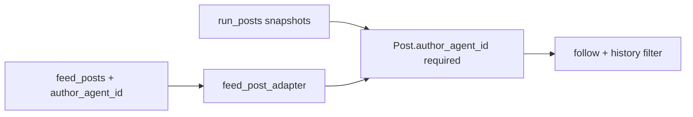

# Require `Post.author_agent_id`, remove handle fallback, clarify naming

## Remember

- Exact file paths always
- Exact commands with expected output
- DRY, YAGNI, TDD, frequent commits
- Maximum safely delegable parallelism
- Delegated tasks must be impossible to misread
- No `ui/` changes; screenshot steps do not apply

## Happy Flow

1. `**feed_posts` rows** gain a non-null `**author_agent_id`** (FK to `[agent.agent_id](db/schema.py)`) via Alembic migration: add column, **backfill** by joining `feed_posts.author_handle` → `agent.handle`, then enforce `NOT NULL` (with an explicit policy for orphan rows—see risks).
2. `**[db/adapters/sqlite/feed_post_adapter.py](db/adapters/sqlite/feed_post_adapter.py)`** `_row_to_feed_post` and `_serialize_post_row` (and any insert/update paths) read/write `author_agent_id` so hydrated `[Post](simulation/core/models/posts.py)` always includes it.
3. **Run-scoped posts** already map through `[run_post_snapshot_to_post](simulation/core/models/posts.py)` with `author_agent_id=snapshot.author_agent_id`; once `[Post.author_agent_id](simulation/core/models/posts.py)` is required, add a **validator** that rejects empty strings—keep validation minimal (non-empty `str`) unless you standardize id format repo-wide.
4. **Post author identity for algorithms** is `**post.author_agent_id` only**: remove handle hashing for authors. Either **delete** `[derive_target_agent_id](simulation/core/action_generators/follow/utils.py)` and read `post.author_agent_id` at call sites, or make that helper a one-line accessor with a name that reflects reality (e.g. require `author_agent_id` and document it as “no derivation”). Same for `[_follow_target_key_for_history](simulation/core/action_policy/candidate_filter.py)`—delegate to one helper or inline `post.author_agent_id` so there is a single rule.
5. `**[feeds/candidate_generation.py](feeds/candidate_generation.py)`** `filter_candidate_posts`: exclude self-authored posts by `**post.author_agent_id != agent.agent_id`** (no handle comparison for identity).
6. `**[tests/factories/posts.py](tests/factories/posts.py)**` defaults `author_agent_id` when omitted (e.g. `canonical_agent_id(author_handle_value)` from `[lib/agent_id.py](lib/agent_id.py)` **only as a test default** when constructing fake posts—not as runtime author resolution).
7. **Terminology cleanup** (see packet below): replace variables like `canonical_author` / `best_by_canonical` with names centered on `**author_agent_id`**; update comments/docstrings that say “canonical actor” or “canonical agent” in the scope of this change to say `**agent_id`** / `**author_agent_id**` as appropriate.
8. **Docs**: retire or rename `[docs/architecture/canonical-author.md](docs/architecture/canonical-author.md)` (e.g. `post-author-agent-id.md`) so the architecture doc describes `**author_agent_id`** as the post author key, not “canonical author.” Update `[docs/README.md](docs/README.md)` link if present.

## Terminology and naming (completion requirement)

**Goal:** Avoid ambiguous “canonical actor / canonical agent / canonical author” language in application code for **identity**. Use `**agent_id`** (runtime actor, history store, `SimulationAgent`) and `**author_agent_id`** (post author field) in names and comments.

**In scope for this PR (search and fix as you touch files):**

- `[simulation/core/action_history/stores.py](simulation/core/action_history/stores.py)`: docstring “canonical actor” → e.g. “actor `agent_id`”.
- `[simulation/core/action_generators/follow/algorithms/naive_llm/algorithm.py](simulation/core/action_generators/follow/algorithms/naive_llm/algorithm.py)`: rename `canonical_author`, `best_by_canonical` → e.g. `author_agent_id_key`, `best_post_by_author_agent_id`.
- `[simulation/core/action_generators/follow/algorithms/random_simple.py](simulation/core/action_generators/follow/algorithms/random_simple.py)`: docstrings mentioning “canonical author” → “author `agent_id`” / per-post `author_agent_id`.
- Repository/adapter **docstrings** in files this PR edits (e.g. `[db/repositories/generated_feed_repository.py](db/repositories/generated_feed_repository.py)`, `[db/adapters/sqlite/generated_feed_adapter.py](db/adapters/sqlite/generated_feed_adapter.py)`, `[db/adapters/base.py](db/adapters/base.py)`): replace “Canonical agent id” with **“Agent id”** in parameter descriptions when those files are touched for related reasons—or sweep in `terminology_cleanup` if limited to comment-only diffs.

**Explicit non-goals (unless you expand scope):**

- Do **not** rename the **functions** `[canonical_agent_id](lib/agent_id.py)` / `[is_canonical_agent_id](lib/agent_id.py)` or rewrite all call sites in one go—they remain the deterministic ID helpers for tests and other flows. This plan only requires **post author** logic to stop “deriving” identity from handle and to stop using “canonical actor” phrasing for that concept.
- Do **not** rename unrelated “canonical” terms that mean something else (e.g. `[canonical_post_id](simulation/core/models/posts.py)`, “canonical post_id” in API docs).

**Done-when checks (terminology):**

- `rg -i "canonical (actor|agent)\\b" simulation feeds db` (and tests touched) returns **no** matches in **comments/docstrings/strings** that refer to **people/agents**—allow matches only inside historical `docs/plans/` if you choose not to edit old plans.
- Variable names `canonical_author`, `best_by_canonical` (in follow generators) are **gone** or renamed per above.

## Data Flow

## Serial coordination spine

1. **Schema + backfill** for `feed_posts` (migration + `[db/schema.py](db/schema.py)`) before strict `Post` model.
2. **Contract freeze**: `Post.author_agent_id: str` required; author identity for algorithms = `**post.author_agent_id`** only (no `canonical_agent_id(author_handle)` for author).
3. `**terminology_cleanup`** in the same integration window as follow/history touchpoints so reviews see one consistent story.
4. **Parallel** factory sweep and test fixes after the factory default exists.
5. **Docs** rename + README link + full verification.

## Interface or contract freeze

- `**Post`**: `author_agent_id` is `**str`**, required; never omit in constructors.
- **Author resolution**: no `canonical_agent_id(author_handle)` for **post author**; `**post.author_agent_id`** is the only source.
- **Remove** the `is_canonical_agent_id(post.author_agent_id)` gate for “whether to trust the field”—if the DB stores `agent.agent_id` (including non–16-hex legacy shapes), **trust `author_agent_id`** as the FK value.

## Parallel task packets

### Packet `feed_posts_schema_adapter`

- **Objective**: Add and populate `feed_posts.author_agent_id`; update SQLite adapter and writers.
- **Inspect**: `[db/schema.py](db/schema.py)` (`feed_posts` table), `[db/adapters/sqlite/feed_post_adapter.py](db/adapters/sqlite/feed_post_adapter.py)`, grep for `feed_posts` / `INSERT` / loaders: `[jobs/load_initial_bluesky_profiles.py](jobs/load_initial_bluesky_profiles.py)`, `[db/backfills/agent_posts.py](db/backfills/agent_posts.py)`, tests under `[tests/db/adapters/sqlite/test_feed_post_adapter.py](tests/db/adapters/sqlite/test_feed_post_adapter.py)` and `[tests/db/repositories/test_feed_post_repository.py](tests/db/repositories/test_feed_post_repository.py)`.
- **Change**: New migration under `[db/migrations/versions/](db/migrations/versions/)`; `[db/schema.py](db/schema.py)`; adapter serialize/deserialize; any job that inserts feed posts must supply `author_agent_id` (from joined `agent` or explicit column).
- **Forbidden**: Changing unrelated tables; skipping backfill strategy.
- **Preconditions**: Decide orphan policy: rows whose `author_handle` has no `agent` row—**delete**, **manual fix**, or **block migration** with a checklist query (document in migration or runbook note).
- **Verification**: `uv run pytest tests/db/adapters/sqlite/test_feed_post_adapter.py tests/db/repositories/test_feed_post_repository.py tests/db/repositories/test_feed_post_repository_integration.py -q` (adjust to what exists); expect exit `0`.

### Packet `post_model_resolution`

- **Objective**: Require `author_agent_id` on `Post`; use it as the only post-author identity in follow + feed filter paths.
- **Inspect**: `[simulation/core/models/posts.py](simulation/core/models/posts.py)`, `[simulation/core/action_generators/follow/utils.py](simulation/core/action_generators/follow/utils.py)`, `[simulation/core/action_policy/candidate_filter.py](simulation/core/action_policy/candidate_filter.py)`, `[feeds/candidate_generation.py](feeds/candidate_generation.py)`.
- **Change**: Pydantic field required + validators if needed; collapse or rename `derive_target_agent_id`; simplify `_follow_target_key_for_history`; `filter_candidate_posts` compares `author_agent_id` to `agent.agent_id`; remove unused imports on this path.
- **Forbidden**: `[simulation/core/services/query_service.py](simulation/core/services/query_service.py)` unless a failing test proves a hard dependency—keep scope tight.
- **Depends on**: `feed_posts_schema_adapter` completed so adapters always populate `author_agent_id`.
- **Verification**: `uv run pytest tests/simulation/core/test_random_simple_follow_policy.py tests/simulation/core/test_naive_llm_action_generators.py tests/feeds/test_feed_generator.py tests/simulation/core/test_agent_action_feed_filter.py -q`; expect exit `0`.

### Packet `terminology_cleanup`

- **Objective**: Remove “canonical actor / canonical agent / canonical author” phrasing and misleading variable names in **simulation + feeds + touched db** code; use `**agent_id`** / `**author_agent_id`** consistently.
- **Inspect**: grep results for `canonical`, `canonical_author`, `best_by_canonical` under `[simulation/](simulation/)`, `[feeds/](feeds/)`, and any `[db/](db/)` files edited by this PR.
- **Change**: Rename locals and dicts in follow algorithms; fix docstrings in `[simulation/core/action_history/stores.py](simulation/core/action_history/stores.py)`; optional comment-only pass on generated-feed adapters/repos if in scope.
- **Forbidden**: Renaming `lib/agent_id.py` public function names without a dedicated follow-up; editing unrelated `canonical_post_id` semantics.
- **Depends on**: `post_model_resolution` (same branch—avoid merge conflicts on same lines).
- **Verification**: `rg -n "canonical_author|best_by_canonical" simulation feeds` → empty; `rg -ni "canonical (actor|agent)" simulation feeds` → empty (excluding intentional `canonical_agent_id` **symbol** references if you keep the import name).

### Packet `factories_and_tests`

- **Objective**: Default or require `author_agent_id` in `[PostFactory](tests/factories/posts.py)`; fix tests and any manual `Post(` constructions.
- **Inspect**: `[tests/factories/posts.py](tests/factories/posts.py)`, grep `Post(` / `PostFactory.create` across `[tests/](tests/)`.
- **Change**: Factory computes default `author_agent_id` when not passed; update tests that relied on handle-only semantics (including `[tests/feeds/test_feed_generator.py](tests/feeds/test_feed_generator.py)` if it uses placeholder ids).
- **Forbidden**: Production logic in `simulation/` except test helpers—keep changes in `tests/` unless fixing a real bug exposed by stricter `Post`.
- **Depends on**: `post_model_resolution` (or land immediately after model change in same integration window).
- **Verification**: `uv run pytest tests/ -q` (or staged: `tests/simulation/` + `tests/feeds/` + `tests/api/` first); expect exit `0`.

### Packet `docs_post_author`

- **Objective**: Replace `[docs/architecture/canonical-author.md](docs/architecture/canonical-author.md)` with a doc that describes `**author_agent_id`** (consider **rename** file to e.g. `docs/architecture/post-author-agent-id.md` and add redirect note in old path if you must preserve links).
- **Change**: Document: required `Post.author_agent_id`; no handle-derived author identity; pointer to `feed_posts` migration; keep `lib/agent_id` mention only for **test defaults** / non-post flows, not post-author resolution.
- **Verification**: If `[docs/README.md](docs/README.md)` lists architecture docs, update the link. Run `uv run python scripts/check_docs_metadata.py` only if your doc policy requires metadata for `docs/architecture/` (repo default: metadata for `docs/runbooks/` and `docs/plans/` per [AGENTS.md](AGENTS.md)).

## Integration order

1. `feed_posts_schema_adapter` (migration + adapter + writers).
2. `post_model_resolution` + `terminology_cleanup` (same branch, coordinated).
3. `docs_post_author` (can parallelize once behavior is settled).
4. `factories_and_tests` (large sweep; may merge in chunks: factory first, then pytest subsets).

## Final verification

- `uv run pytest tests/simulation/core/ tests/feeds/ tests/db/ tests/api/ -q` — exit `0`
- `uv run ruff check .` and `uv run pyright .` — per [docs/runbooks/PRE_COMMIT_AND_LINTING.md](docs/runbooks/PRE_COMMIT_AND_LINTING.md) / CI expectations
- Grep: no `canonical_agent_id(post.author_handle)` in author-resolution paths; no `Post(` without `author_agent_id` in non-test code (tests use factory defaults)
- Terminology: see **Done-when checks (terminology)** above

## Manual verification

- After migration on a dev DB copy: `SELECT COUNT(*) FROM feed_posts WHERE author_agent_id IS NULL` → `0`
- `uv run pytest tests/feeds/test_feed_generator.py tests/simulation/core/test_random_simple_follow_policy.py -q` — all pass
- `uv run pre-commit run --all-files` (or CI-equivalent) — clean

## Plan asset path

Save supporting notes or data-audit SQL in:

`docs/plans/2026-03-21_require_post_author_agent_id_482931/`

(optional `notes.md` for orphan-row policy and backfill queries—no user-facing README required for screenshots.)

## Alternative approaches

- **Lookup-only, no `feed_posts` column**: resolve `author_agent_id` in the adapter via `JOIN agent ON handle` at read time without persisting the column—**rejected**: repeated joins, ambiguous when handle missing in `agent`, and harder to enforce invariants than a stored FK.
- **Keep optional `Post.author_agent_id` + warn**: **rejected**; contradicts the goal of eliminating handle-derived author identity.
- **Rename `canonical_agent_id()` in `lib/agent_id.py`**: possible follow-up; **out of scope** for this plan unless you explicitly widen scope.

## Risks / follow-ups

- **Orphan `feed_posts`**: backfill must define behavior when no agent matches handle.
- **Tests using `did:plc:` strings**: still valid as `agent_id` values if your `agent` table uses them; post author resolution uses `**author_agent_id` as stored**, not hex validation.
- **E2E / jobs**: any path that fabricates `Post` without DB must set `author_agent_id` explicitly.
