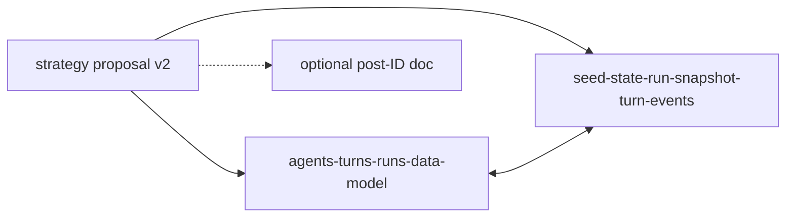

# Contract freeze: turn-table refactor v2 (docs-only slice)

## Remember

- Exact file paths always
- Exact commands with expected output
- DRY, YAGNI, TDD, frequent commits
- Maximum safely delegable parallelism
- Delegated tasks must be impossible to misread
- UI changes: not in scope for this slice (no `ui/**` changes; screenshot workflow from planning rules does not apply)

## Happy flow

1. A reader opens [strategy_planning/2026-03-22_v2_refactor_turn_tables/proposal.md](strategy_planning/2026-03-22_v2_refactor_turn_tables/proposal.md) and finds an explicit **frozen contract** subsection: parent `turns` row, renamed `turn`_* tables, atomic turn writes, shared feed-visible post ID namespace (`run_post_id` / `turn_post_id`), approved `turn_posts` v1 column set, and a clear statement on whether authored-post **generation** is deferred or scheduled for a later implementation slice.
2. [docs/architecture/agents-turns-runs-data-model.md](docs/architecture/agents-turns-runs-data-model.md) stops describing legacy table names as the steady-state target: it explains `Turn`* as tables that will be children of `turns(run_id, turn_number)` and points forward to the hard cutover described in the strategy doc (without contradicting current `db/schema.py`—call out “current vs target” where the code has not moved yet).
3. [docs/architecture/seed-state-run-snapshot-turn-events.md](docs/architecture/seed-state-run-snapshot-turn-events.md) aligns scope definitions with the same target: `turns` as canonical parent, `turn_generated_feeds` / `turn_likes` / `turn_comments` / `turn_follows` naming, `turn_metrics` parented on `turns`, and the post-ID namespace rules consistent with the proposal’s “Architectural Calls To Freeze.”
4. Optionally, if the post-ID contract needs a dedicated home, add **one** new file under `docs/architecture/` (allowed by the milestone) and cross-link from the two existing architecture docs and the strategy proposal.
5. Verification: docs metadata script passes on every touched `.md`; optional `uv run pre-commit run docs-metadata --all-files` if staged paths hook differs.

## Interface or contract freeze (must appear verbatim in docs)

Freeze these decisions (from the milestone in the strategy proposal); wording can vary but meaning must not drift:

- Canonical `agent_id`, `target_agent_id`, and `author_agent_id` are **immutable** for this epic; no handle-shaped persistence keys on new paths.
- `turns` replaces `turn_metadata` as the **canonical parent**; every per-turn history table references `turns(run_id, turn_number)`.
- `generated_feeds` becomes `turn_generated_feeds`; `likes` / `comments` / `follows` become `turn_likes` / `turn_comments` / `turn_follows` (hard cutover story).
- Turn persistence becomes **atomic** (single transaction for parent row + metrics + feeds + actions + `turn_posts` when present).
- `turn_generated_feeds.post_ids`, `turn_likes.post_id`, and `turn_comments.post_id` share one feed-visible ID namespace; distinguish `run_post_id` vs `turn_post_id` in application resolution (no polymorphic FK).
- `turn_posts` v1 columns as listed in the proposal (including mandatory `author_agent_id`).
- **Explicit product decision:** state whether `TurnAction.POST` / authored-post generation is **deferred** or **in scope** for a later slice; if deferred, record non-goals so later work does not sprawl.

## Serial coordination spine

1. **Decision pass:** Record the `TurnAction.POST` / authored-post generation choice in [strategy_planning/2026-03-22_v2_refactor_turn_tables/proposal.md](strategy_planning/2026-03-22_v2_refactor_turn_tables/proposal.md) (and mirror one line in architecture docs for discoverability).
2. **Front matter compliance:** Any edited Markdown under the verification paths must include valid YAML front matter with `description` and `tags` (validator in [scripts/check_docs_metadata.py](scripts/check_docs_metadata.py)). Today, [docs/architecture/agents-turns-runs-data-model.md](docs/architecture/agents-turns-runs-data-model.md) and [docs/architecture/seed-state-run-snapshot-turn-events.md](docs/architecture/seed-state-run-snapshot-turn-events.md) start without `---` blocks; [strategy_planning/2026-03-22_v2_refactor_turn_tables/proposal.md](strategy_planning/2026-03-22_v2_refactor_turn_tables/proposal.md) uses `name`/`overview` but the script requires `**description`** and `**tags`**. Plan work to add/extend front matter on each touched file so verification passes.
3. **Terminology sweep:** Update architecture docs for consistent naming and a short “current schema vs target schema” note where legacy names still exist in code.
4. **Integration:** Single read-through for internal consistency + run metadata check (below).

## Parallel task packets

| ID            | Objective                                                                                                                                                                                                                                                                                               | Parallelizable because                                         | Allowed to change                   | Forbidden                                     |
| ------------- | ------------------------------------------------------------------------------------------------------------------------------------------------------------------------------------------------------------------------------------------------------------------------------------------------------- | -------------------------------------------------------------- | ----------------------------------- | --------------------------------------------- |
| P1            | Refresh [docs/architecture/agents-turns-runs-data-model.md](docs/architecture/agents-turns-runs-data-model.md): Turn section, remove/replace stale TODO about `turn_*` nomenclature with target-state narrative + link to strategy doc                                                                  | Single file                                                    | That file only                      | `db/`**, `simulation/`**, `ui/**`, other docs |
| P2            | Refresh [docs/architecture/seed-state-run-snapshot-turn-events.md](docs/architecture/seed-state-run-snapshot-turn-events.md): turn-event naming, parent FK story, legacy list vs target list                                                                                                            | Single file                                                    | That file only                      | Same forbiddens                               |
| P3            | Edit [strategy_planning/2026-03-22_v2_refactor_turn_tables/proposal.md](strategy_planning/2026-03-22_v2_refactor_turn_tables/proposal.md): frozen contracts subsection, non-goals, POST decision; fix front matter to include `description` + `tags` (retain `name`/`overview` if useful as extra keys) | Single file                                                    | That file only                      | Same forbiddens                               |
| P4 (optional) | Add `docs/architecture/turn-feed-post-id-contract.md` (or similar) documenting `run_post_id` vs `turn_post_id` resolution expectations                                                                                                                                                                  | New file only; no edits to P1–P3 files until content is agreed | New file under `docs/architecture/` | Same forbiddens                               |

**Preconditions:** P1–P3 can run in parallel after the decision in the serial spine (POST scope) is written in the strategy doc first, **or** P3 runs first with the decision, then P1/P2 align—simplest is **P3 first**, then P1/P2 in parallel.

**Coordinator review:** Same terms for `turns`, `turn`_* tables, and post IDs across all files; no accidental claim that production schema already matches target unless qualified.

## Integration order

1. Merge decision + front matter on [strategy_planning/2026-03-22_v2_refactor_turn_tables/proposal.md](strategy_planning/2026-03-22_v2_refactor_turn_tables/proposal.md).
2. Update the two architecture docs (and optional new doc) to match.
3. Run verification commands below.

## Alternative approaches

- **Broader doc pass:** Run metadata fix across all of `docs/architecture/`—rejected for this slice: milestone **forbids** editing files outside the allowlist; only add front matter to files you actually change.
- **Skip `check_docs_metadata.py`:** Rejected; [AGENTS.md](AGENTS.md) and the strategy milestone both expect metadata validation for changed docs.
- **Implement schema in the same slice:** Rejected; explicit forbidden set includes `db/schema.py` and migrations.

## Manual verification

- `uv run python scripts/check_docs_metadata.py docs/architecture/agents-turns-runs-data-model.md docs/architecture/seed-state-run-snapshot-turn-events.md strategy_planning/2026-03-22_v2_refactor_turn_tables/proposal.md`
  - **Expected:** `Docs metadata validation succeeded.`
  - If optional new architecture file is added, append its path to the command.
- Spot-check: open the three (or four) files and confirm frozen bullets and POST decision are present and consistent.
- Confirm **no** changes under `db/`, `simulation/`, `feeds/`, `ui/` (`git status` / diff review).

## Plan asset storage

When this plan is executed (outside plan mode), save working notes or screenshots of doc diffs under:

`docs/plans/2026-03-22_freeze_turn_table_v2_contracts_847291/`

(Adjust the six-digit suffix if the repo already uses that folder name; keep the date + descriptor pattern.)

## Specificity notes

- **Do not** reference external GitHub pull request numbers in the updated docs unless you are retaining historical citations already in the strategy doc; prefer “completed agent-ID migration” and pointers to in-repo proposals.
- **Cite** [strategy_planning/2026-03-22_v2_refactor_turn_tables/proposal.md](strategy_planning/2026-03-22_v2_refactor_turn_tables/proposal.md) as the normative v2 umbrella for downstream implementation slices.

## Final verification (this slice)

- Frozen contracts and non-goals are readable without reading runtime code.
- Architecture docs and strategy doc agree on table naming and parent `turns` story.
- `check_docs_metadata.py` passes on all touched paths.
- Forbidden paths remain untouched.
