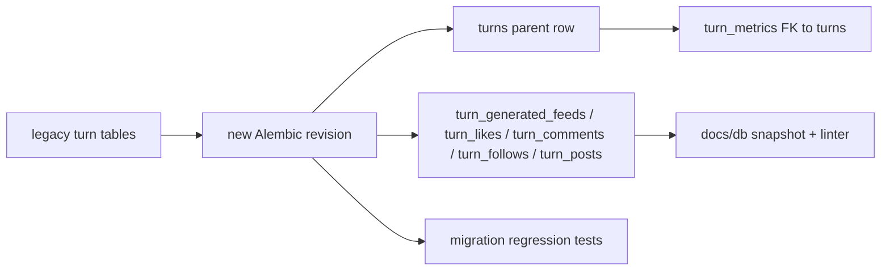

# Turn Table Schema Spine

## Remember

- Exact file paths always
- Exact commands with expected output
- DRY, YAGNI, TDD, frequent commits
- Maximum safely delegable parallelism
- Delegated tasks must be impossible to misread
- UI changes: not in scope for this slice, so screenshot capture does not apply

## Overview

This slice implements the next step from [strategy_planning/2026-03-22_v2_refactor_turn_tables/proposal.md](strategy_planning/2026-03-22_v2_refactor_turn_tables/proposal.md): land the irreversible schema foundation for the turn-table v2 architecture that was already frozen in docs. The work is intentionally limited to DDL, data migration, schema-linter alignment, schema-doc refresh, and migration-focused tests so later runtime/query changes can build on a stable `turns` + `turn_*` head schema without mixing in transaction-boundary or read-path behavior changes.

## Happy Flow

1. `[db/schema.py](db/schema.py)` stops defining `turn_metadata`, `generated_feeds`, `likes`, `comments`, and `follows`, and instead defines `turns`, `turn_metrics`, `turn_generated_feeds`, `turn_likes`, `turn_comments`, `turn_follows`, and `turn_posts`, with every per-turn table carrying `run_id` and `turn_number` and referencing `turns(run_id, turn_number)`.
2. A new Alembic revision under `[db/migrations/versions/](db/migrations/versions/)` upgrades an existing SQLite file by creating the new tables, copying legacy rows forward, preserving canonical `agent_id` / `target_agent_id` / `author_agent_id` foreign-key semantics, and dropping the legacy turn-event tables.
3. `turn_posts` exists structurally at head but remains a foundation-only table in this slice: the migration does not invent synthetic rows, and runtime/query code continues unchanged until later slices add mixed post resolution and write-path usage.
4. `[scripts/lint_schema_conventions.py](scripts/lint_schema_conventions.py)`, `[tests/lint/test_lint_schema_conventions.py](tests/lint/test_lint_schema_conventions.py)`, `[docs/db/LATEST.txt](docs/db/LATEST.txt)`, and the latest generated schema snapshot under `[docs/db/](docs/db/)` are updated so repo head documents and enforces the new steady-state schema.
5. Focused migration tests under `[tests/db/](tests/db/)` prove that representative legacy turn rows upgrade cleanly into the new schema, composite turn FKs are valid, and a fresh database at head only exposes the new table family.

## Interface or Contract Freeze

- Use [strategy_planning/2026-03-22_v2_refactor_turn_tables/proposal.md](strategy_planning/2026-03-22_v2_refactor_turn_tables/proposal.md) and [docs/plans/2026-03-22_freeze_turn_table_v2_contracts_847291/plan.md](docs/plans/2026-03-22_freeze_turn_table_v2_contracts_847291/plan.md) as the normative inputs for this slice.
- Preserve canonical persisted identities exactly as already frozen: `agent_id`, `target_agent_id`, and `author_agent_id` remain the only persistence keys for actor identity in the new tables.
- Treat `turns(run_id, turn_number)` as the canonical parent for all per-turn artifacts, including `turn_metrics`.
- Preserve existing action/feed row semantics while renaming tables; do not use this slice for opportunistic runtime-shape changes, query changes, API changes, or feed-generation changes.
- Create `turn_posts` in schema, but do not backfill synthetic rows and do not add mixed post-resolution behavior yet.
- Prefer create/copy/drop over pure rename so final constraint names, indexes, and composite FKs are intentional.
- Keep downgrade policy aligned with current repo migration style; if the new revision is intentionally upgrade-only, state that explicitly in the revision docstring/comments.

## Serial Coordination Spine

1. Confirm the target head shape from [strategy_planning/2026-03-22_v2_refactor_turn_tables/proposal.md](strategy_planning/2026-03-22_v2_refactor_turn_tables/proposal.md), the latest schema snapshot pointed to by `[docs/db/LATEST.txt](docs/db/LATEST.txt)`, and the current head revision in `[db/migrations/versions/d4f8a1c3e5b7_action_feed_id_semantics.py](db/migrations/versions/d4f8a1c3e5b7_action_feed_id_semantics.py)`.
2. Implement the schema and migration spine first in `[db/schema.py](db/schema.py)` plus one or more new revisions in `[db/migrations/versions/](db/migrations/versions/)`. No downstream packet starts until the final table names, PKs, FKs, and revision IDs are stable.
3. After the schema patch is stable, run the test packet and the linter/docs packet in parallel because they touch separate files.
4. Integrate the resulting test changes, schema-doc snapshot, and linter updates; then run the full targeted verification set from the proposal.

## Parallel Task Packets

### P1. Schema and Alembic spine

- Task ID: `P1-schema-spine`
- Objective: Replace the legacy turn-event tables at head with the `turns` + `turn_*` table family and author the migration that copies legacy data forward.
- Why this is parallelizable: This packet owns the schema and migration files outright; other packets can safely wait until its revision IDs and target DDL settle.
- Exact files to inspect: `[db/schema.py](db/schema.py)`, `[db/migrations/versions/](db/migrations/versions/)`, `[db/migrations/README](db/migrations/README)`, `[docs/db/LATEST.txt](docs/db/LATEST.txt)`, `[db/migrations/versions/d4f8a1c3e5b7_action_feed_id_semantics.py](db/migrations/versions/d4f8a1c3e5b7_action_feed_id_semantics.py)`
- Exact files allowed to change: `[db/schema.py](db/schema.py)`, one or more new files under `[db/migrations/versions/](db/migrations/versions/)`
- Exact files forbidden to change: `[simulation/core/services/query_service.py](simulation/core/services/query_service.py)`, `[simulation/api/services/run_query_service.py](simulation/api/services/run_query_service.py)`, `[feeds/feed_generator.py](feeds/feed_generator.py)`, `[simulation/core/services/command_service.py](simulation/core/services/command_service.py)`, `ui/**`
- Preconditions: The frozen contracts in the proposal and the completed docs-only freeze are accepted as final for this slice.
- Dependency tasks: None.
- Required contracts and invariants: Keep canonical actor FKs; add composite parent FKs to `turns`; leave `turn_posts` empty; do not add compatibility reads/writes; do not alter logical query/API contracts.
- Step-by-step implementation instructions: 1. Replace `turn_metadata` with `turns` in `[db/schema.py](db/schema.py)`, keeping `run_id` + `turn_number` as the PK and making `turn_metrics` reference `turns(run_id, turn_number)`. 2. Add `turn_generated_feeds`, `turn_likes`, `turn_comments`, `turn_follows`, and `turn_posts` with columns/constraints that preserve current row meaning while moving to the new naming family. 3. Remove the legacy head-state table definitions from `[db/schema.py](db/schema.py)`. 4. Create a new Alembic revision after the current head that creates the new tables, copies rows from `turn_metadata`, `generated_feeds`, `likes`, `comments`, and `follows`, recreates indexes/constraints intentionally, and drops the legacy tables. 5. Validate that every migrated per-turn table now references `turns(run_id, turn_number)` and that `turn_posts` is created but left empty.
- Exact verification commands: `SIM_DB_PATH=/tmp/turn_tables_v2.sqlite uv run python -m alembic -c pyproject.toml upgrade head`
- Expected outputs from verification: Alembic exits 0 and the target SQLite file reaches the new head revision without migration errors.
- Done-when checklist: `db/schema.py` contains only the new head-state turn table family; a new Alembic revision exists; legacy turn-event data is migrated forward; downgrade policy is explicitly documented in the revision docstring/comments.
- Coordinator review checklist: Check PK names, FK names, and unique/index names for intentionality; verify no legacy table definition remains in `db/schema.py`; verify `turn_metrics` now points to `turns`, not just `runs`.

### P2. Migration regression coverage

- Task ID: `P2-migration-tests`
- Objective: Add focused tests that prove legacy turn data upgrades into the new schema correctly and that fresh head-state databases expose only the new turn table family.
- Why this is parallelizable: Once P1 settles the revision IDs and final table names, migration tests can be written independently without touching schema or docs files.
- Exact files to inspect: `[tests/db/test_agent_id_pk_migration.py](tests/db/test_agent_id_pk_migration.py)`, `[tests/scripts/migrations/test_agent_id_migration.py](tests/scripts/migrations/test_agent_id_migration.py)`, the new revision file(s) under `[db/migrations/versions/](db/migrations/versions/)`
- Exact files allowed to change: a new test file at `[tests/db/test_turn_table_v2_schema_migration.py](tests/db/test_turn_table_v2_schema_migration.py)`; optionally one new helper test file under `[tests/scripts/migrations/](tests/scripts/migrations/)` only if reusable migration helper code is extracted first
- Exact files forbidden to change: `[db/schema.py](db/schema.py)`, runtime/query/API files, `ui/**`
- Preconditions: P1 is complete enough that the new revision ID and final table names are stable.
- Dependency tasks: `P1-schema-spine`
- Required contracts and invariants: Representative migrated rows must preserve canonical IDs; every per-turn child row must resolve against a `turns` parent; `turn_posts` stays empty after upgrading legacy data.
- Step-by-step implementation instructions: 1. Create a temporary SQLite database at the revision immediately before the new schema-spine revision. 2. Seed representative rows into `turn_metadata`, `turn_metrics`, `generated_feeds`, `likes`, `comments`, and `follows`. 3. Upgrade to head and assert the new tables contain the migrated rows with matching logical values. 4. Assert the composite parent relationship to `turns(run_id, turn_number)` is valid with `PRAGMA foreign_key_check`. 5. Assert `turn_posts` exists and is empty after migration. 6. Add a second test that initializes a fresh head-state database and confirms only the new turn table family appears in the schema.
- Exact verification commands: `uv run pytest tests/db/test_turn_table_v2_schema_migration.py -q`; `uv run pytest tests/db -k "turn or migration" -q`
- Expected outputs from verification: Both commands pass; the targeted file proves upgrade behavior and the broader selector catches any related regressions.
- Done-when checklist: New migration coverage exists; it fails before the schema change and passes after; migrated rows, FK integrity, and empty `turn_posts` are all asserted explicitly.
- Coordinator review checklist: Ensure tests are not asserting incidental SQLite row order; ensure the pre-upgrade seed data covers at least one row from each migrated legacy table; ensure the tests do not rely on runtime services.

### P3. Schema linter and schema-doc closeout for the new head state

- Task ID: `P3-linter-docs`
- Objective: Align the mechanically enforced head-state schema documentation with the new turn table family.
- Why this is parallelizable: After P1 defines the final head schema, linter expectations and generated docs can be updated independently of migration regression tests.
- Exact files to inspect: `[scripts/lint_schema_conventions.py](scripts/lint_schema_conventions.py)`, `[tests/lint/test_lint_schema_conventions.py](tests/lint/test_lint_schema_conventions.py)`, `[docs/db/LATEST.txt](docs/db/LATEST.txt)`, the current latest schema-doc folder under `[docs/db/](docs/db/)`
- Exact files allowed to change: `[scripts/lint_schema_conventions.py](scripts/lint_schema_conventions.py)`, `[tests/lint/test_lint_schema_conventions.py](tests/lint/test_lint_schema_conventions.py)`, generated files under `[docs/db/](docs/db/)`, `[docs/db/LATEST.txt](docs/db/LATEST.txt)`
- Exact files forbidden to change: runtime/query/API files, proposal docs outside `docs/db`, `ui/**`
- Preconditions: P1 is complete and the head-state schema is final enough to snapshot.
- Dependency tasks: `P1-schema-spine`
- Required contracts and invariants: Repo head should no longer treat the legacy turn-event names as the intended steady state; schema docs must match the actual Alembic head schema exactly.
- Step-by-step implementation instructions: 1. Update `[scripts/lint_schema_conventions.py](scripts/lint_schema_conventions.py)` so the head-state schema no longer depends on legacy turn-event names being accepted as baseline. 2. Update `[tests/lint/test_lint_schema_conventions.py](tests/lint/test_lint_schema_conventions.py)` to reflect the new steady state and preserve negative coverage for malformed `turn_*` tables. 3. Run `uv run python scripts/generate_db_schema_docs.py --update` to create the next schema-doc snapshot and refresh `[docs/db/LATEST.txt](docs/db/LATEST.txt)`. 4. Verify the committed snapshot matches head with `--check`.
- Exact verification commands: `uv run pytest tests/lint/test_lint_schema_conventions.py -q`; `uv run python scripts/generate_db_schema_docs.py --check`
- Expected outputs from verification: Lint tests pass; schema-doc check passes with the newly generated latest snapshot.
- Done-when checklist: Linter accepts repo head; generated docs are refreshed; `docs/db/LATEST.txt` points at the new snapshot; no legacy turn-event names are encoded as the intended head-state baseline.
- Coordinator review checklist: Confirm the snapshot came from the new Alembic head, not a stale DB file; confirm `docs/db/LATEST.txt` points to the same folder that contains `schema.snapshot.json` and `schema.md`.

## Integration Order

1. Execute `P1-schema-spine` first and settle the final head DDL plus revision IDs.
2. Execute `P2-migration-tests` and `P3-linter-docs` in parallel against the same P1 branch state.
3. Re-run the broad targeted verification set after integrating both packets.
4. Only after this slice is green should later work change feed writes, repositories, query hydration, or authored-post behavior.

## Alternative Approaches

- Pure table renames were rejected because the proposal explicitly wants intentional end-state constraints and composite parent FKs, which are easier to reason about with create/copy/drop.
- Bundling transaction-boundary fixes into this slice was rejected because `[feeds/feed_generator.py](feeds/feed_generator.py)` and `[simulation/core/services/command_service.py](simulation/core/services/command_service.py)` would meaningfully expand the blast radius.
- Deferring `turn_posts` schema until mixed post resolution was rejected because the proposal wants the structural table in place now, but without synthetic backfill or runtime usage yet.

## Manual Verification

- Run `SIM_DB_PATH=/tmp/turn_tables_v2.sqlite uv run python -m alembic -c pyproject.toml upgrade head` and expect exit 0.
- Run `uv run pytest tests/db/test_turn_table_v2_schema_migration.py -q` and expect the focused migration regression file to pass.
- Run `uv run pytest tests/db -k "turn or migration" -q` and expect targeted DB migration coverage to pass.
- Run `uv run pytest tests/lint/test_lint_schema_conventions.py -q` and expect schema-linter tests to pass.
- Run `uv run python scripts/generate_db_schema_docs.py --check` and expect the schema snapshot check to pass.
- Run `rg "\b(turn_metadata|generated_feeds|likes|comments|follows)\b" db/schema.py scripts/lint_schema_conventions.py tests/db tests/lint docs/db` and expect any remaining matches to be limited to migration history, test fixtures that intentionally seed pre-upgrade state, or explicit before/after schema docs.

## Final Verification

- `[db/schema.py](db/schema.py)` defines `turns`, `turn_metrics`, `turn_generated_feeds`, `turn_likes`, `turn_comments`, `turn_follows`, and `turn_posts`.
- Every per-turn table references `turns(run_id, turn_number)`.
- The upgrade path migrates representative legacy data forward without FK violations.
- `turn_posts` exists and is explicitly foundation-only in this slice.
- `[scripts/lint_schema_conventions.py](scripts/lint_schema_conventions.py)` and `[docs/db/](docs/db/)` describe the same head-state schema as Alembic.
- No files under `[simulation/core/services/query_service.py](simulation/core/services/query_service.py)`, `[simulation/api/services/run_query_service.py](simulation/api/services/run_query_service.py)`, `[feeds/feed_generator.py](feeds/feed_generator.py)`, `[simulation/core/services/command_service.py](simulation/core/services/command_service.py)`, or `ui/**` are touched.

## Plan Asset Storage

Store verification notes and any migration scratch artifacts for this slice under `docs/plans/2026-03-22_turn_table_schema_spine_847292/`.
