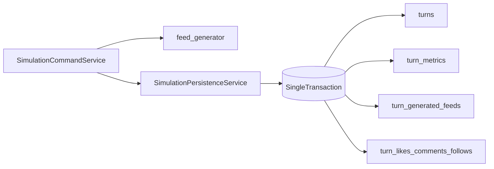

# Atomic Turn Write Bundle Plan

## Remember

- Exact file paths always
- Exact commands with expected output
- DRY, YAGNI, TDD, frequent commits
- Maximum safely delegable parallelism
- Delegated tasks must be impossible to misread
- UI changes: none in scope (no screenshot workflow needed)

## Overview

This slice implements the atomic turn-write boundary defined in [strategy_planning/2026-03-22_v2_refactor_turn_tables/proposal.md](strategy_planning/2026-03-22_v2_refactor_turn_tables/proposal.md). The goal is to stop partial per-turn writes by moving feed/action persistence under one transaction-owned service path, while keeping read/query behavior and response contracts unchanged.

## Happy Flow

1. `simulation/core/services/command_service.py` runs a turn and produces in-memory turn artifacts (metrics, generated feeds, and actions).
2. `feeds/feed_generator.py` remains generation-focused and returns models/data only; it does not perform DB commits.
3. `db/services/simulation_persistence_service.py` accepts one turn-write bundle and opens a single transaction.
4. Within that transaction, persistence runs in fixed order: `turns` parent metadata, then `turn_metrics`, then `turn_generated_feeds`, then action tables (`turn_likes`/`turn_comments`/`turn_follows`), and `turn_posts` only if supplied.
5. Any exception aborts the transaction; no partial rows remain for that turn.
6. Existing query-facing behavior remains stable because this slice only changes write boundaries and repository orchestration.

## Interface or Contract Freeze

- Keep canonical ID semantics unchanged (`agent_id`, `target_agent_id`, `author_agent_id`) across models/repositories.
- Do not change `simulation/core/services/query_service.py` or `simulation/api/services/run_query_service.py` in this slice.
- Keep `SimulationCommandService._simulate_turn(...)` return shape unchanged.
- Preserve dependency-injection boundaries: orchestration in services, table IO in repositories/adapters.
- Write ordering invariant inside transaction: parent `turns` must exist before any per-turn child rows.

## Serial Coordination Spine

1. Confirm and document the single turn-write contract in `db/services/simulation_persistence_service.py` (method signature + ordering + rollback semantics).
2. Refactor call chain so `feeds/feed_generator.py` does not own write side effects.
3. Wire `simulation/core/services/command_service.py` to pass one complete turn payload into the persistence service.
4. Add/update transactional regression test proving mid-write failure leaves no partial rows.
5. Run targeted tests and ensure no behavior regressions in command-service turn execution.

## Parallel Task Packets

### Task A: Feed generation purity

- Objective: Remove DB-side effects from `feeds/feed_generator.py` while keeping output models unchanged.
- Why parallelizable: Isolated logic boundary; no repository implementation edits required.
- Files to inspect: `feeds/feed_generator.py`, `tests/feeds/test_feed_generator.py`.
- Files allowed to change: same files only.
- Files forbidden: `db/adapters/**`, `db/repositories/**`, `simulation/api/**`, `ui/**`.
- Preconditions: Interface freeze accepted.
- Dependencies: none.
- Required invariants: generated feed content/order unchanged for existing tests.
- Implementation steps:
  - Remove any direct repository/adapter writes from feed generation path.
  - Ensure function outputs carry everything needed downstream for persistence.
  - Update unit tests to assert generation-only behavior.
- Verification commands:
  - `uv run pytest tests/feeds/test_feed_generator.py -q`
- Expected output: tests pass; no feed-generator path performs DB writes.
- Done when:
  - Feed generator has no commit/write side effect path.
  - Existing generation assertions pass.
- Coordinator checklist:
  - No hidden persistence via helper imports.
  - No interface churn beyond needed payload outputs.

### Task B: Atomic persistence orchestration

- Objective: Implement a single transaction turn-write bundle in `db/services/simulation_persistence_service.py` and related repository interface wiring.
- Why parallelizable: Service/repository contract work can be done independently from feed-generation internals if payload shape is frozen.
- Files to inspect:
  - `db/services/simulation_persistence_service.py`
  - `db/repositories/interfaces.py`
  - `db/repositories/generated_feed_repository.py`
  - `db/adapters/sqlite/generated_feed_adapter.py`
- Files allowed to change: files above plus tightly coupled repository tests under `tests/db/repositories/`.
- Files forbidden: `simulation/core/services/query_service.py`, `simulation/api/services/run_query_service.py`, `ui/**`.
- Preconditions: parent `turns` schema and `turn_*` spine already landed.
- Dependencies: Interface freeze accepted.
- Required invariants:
  - Parent row persists first.
  - Child tables only written inside same transaction.
  - Failure in any child write rolls back parent and prior child writes.
- Implementation steps:
  - Define/extend one explicit persistence method for full turn bundle.
  - Enforce deterministic write ordering and shared transaction context.
  - Ensure adapter/repository methods participate in caller-owned transaction and do not commit independently.
- Verification commands:
  - `uv run pytest tests/db/repositories/test_generated_feed_repository_integration.py -q`
  - `uv run pytest tests/db/repositories/test_action_repositories_integration.py -q`
- Expected output: all pass with transaction-owned writes.
- Done when:
  - No per-turn child row can be persisted outside the bundle path.
  - Rollback behavior is enforced by tests.
- Coordinator checklist:
  - No implicit commits left in repository/adapter methods.
  - Dependency injection boundaries remain intact.

### Task C: Command-service integration and rollback proof

- Objective: Route turn execution through the new atomic persistence path and add a focused rollback regression test.
- Why parallelizable: Depends only on finalized bundle contract; isolated from adapter SQL details.
- Files to inspect:
  - `simulation/core/services/command_service.py`
  - `tests/simulation/core/test_command_service.py`
  - relevant integration tests in `tests/db/repositories/`
- Files allowed to change: files above.
- Files forbidden: `simulation/core/services/query_service.py`, `simulation/api/services/run_query_service.py`, `ui/**`.
- Preconditions: Task B contract merged.
- Dependencies: Task B.
- Required invariants:
  - `_simulate_turn(...)` externally visible return shape stays stable.
  - Mid-write exception leaves zero persisted rows for that turn across involved tables.
- Implementation steps:
  - Replace split calls with single bundle write invocation.
  - Inject controlled failure in a test double/fixture at a mid-write boundary.
  - Assert full rollback across `turns`, `turn_metrics`, `turn_generated_feeds`, and action rows for the target turn.
- Verification commands:
  - `uv run pytest tests/simulation/core/test_command_service.py -q`
  - `uv run pytest tests/db/repositories/test_generated_feed_repository_integration.py -q`
- Expected output: tests pass; rollback regression reliably guards partial-write regressions.
- Done when:
  - Command service uses one persistence entrypoint for turn writes.
  - Regression test fails without transaction semantics and passes with them.
- Coordinator checklist:
  - No behavior drift in non-failure execution path.
  - Rollback test is deterministic and not timing-based.

## Integration Order

1. Complete Task A and freeze generation payload shape.
2. Complete Task B and freeze atomic persistence API.
3. Complete Task C integration and rollback regression.
4. Run end-to-end targeted suite across feeds, command service, and repositories.

## Manual Verification

- Run focused feed-generator tests:
  - `uv run pytest tests/feeds/test_feed_generator.py -q`
  - Expected: pass; generation-only semantics preserved.
- Run persistence/repository turn-write tests:
  - `uv run pytest tests/db/repositories/test_generated_feed_repository_integration.py tests/db/repositories/test_action_repositories_integration.py -q`
  - Expected: pass; no partial writes.
- Run command-service tests:
  - `uv run pytest tests/simulation/core/test_command_service.py -q`
  - Expected: pass; turn execution behavior unchanged.
- Run combined smoke for this slice:
  - `uv run pytest tests/feeds/test_feed_generator.py tests/simulation/core/test_command_service.py tests/db/repositories/test_generated_feed_repository_integration.py -q`
  - Expected: pass.

## Alternative Approaches

- Keep current split write path and rely on cleanup/reconciliation jobs: rejected because it preserves data-integrity risk and hides transactional defects.
- Add DB triggers to synthesize missing parent/child consistency: rejected because business ordering and rollback semantics belong in application transaction orchestration.
- Broad repository API redesign: rejected for this slice; smallest-safe interface change is preferred to minimize blast radius.

## Specific Files in Scope

- `feeds/feed_generator.py`
- `db/services/simulation_persistence_service.py`
- `simulation/core/services/command_service.py`
- `db/repositories/interfaces.py`
- `db/repositories/generated_feed_repository.py`
- `db/adapters/sqlite/generated_feed_adapter.py`
- related tests under `tests/feeds/`, `tests/simulation/core/`, `tests/db/repositories/`

## Final Verification

- Atomicity enforced: no feed/action child rows exist without corresponding turn parent row for the same write attempt.
- Mid-write failure leaves no partial rows for that turn.
- Query/API read paths are untouched and stable.
- Canonical ID contracts remain unchanged.
- Targeted test suite passes for feeds, command service, and repository integrations.

## Plan Asset Storage

Use: `docs/plans/2026-03-23_atomic_turn_write_bundle_847293/` for notes and verification artifacts tied to this slice.
