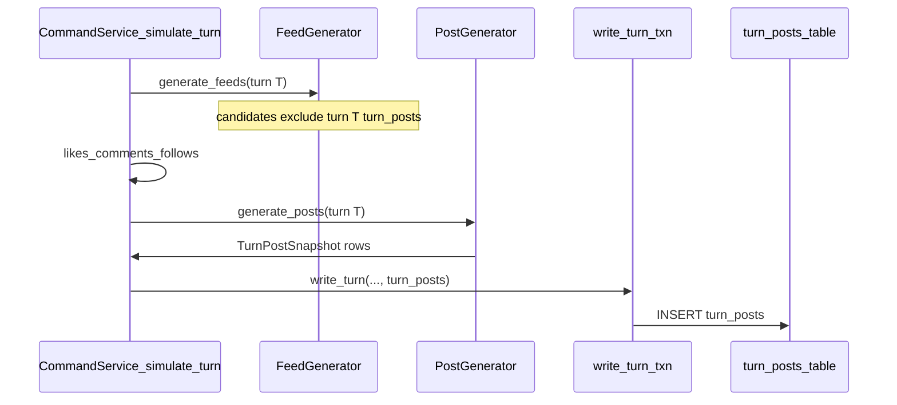

# Authored posts during turns (subsequent-turn feed visibility)

## Remember

- Exact file paths always
- Exact commands with expected output
- DRY, YAGNI, TDD, frequent commits
- Maximum safely delegable parallelism
- Delegated tasks must be impossible to misread
- UI: this slice targets **backend** (`simulation/`, `feeds/`, `db/`, `tests/`). Do **not** touch `[ui/](ui/)` unless a compile break forces a minimal TypeScript enum sync—if `ui/` changes, follow screenshot rules in [ai_tools/agents/task_instructions/rules/PLANNING_RULES.md](ai_tools/agents/task_instructions/rules/PLANNING_RULES.md).

## Overview

Turn-authored posts are stored in `[turn_posts](db/schema.py)` and must participate in **turn execution** (not only hydration). **Per author, at most `MAX_AUTHORED_POSTS_PER_TURN = 5` snapshots per turn** (single module-level constant for now); enforce after generation and in validation before persistence. The product rule is **authored posts appear only in subsequent turns**: a post written in turn `T` may appear in `turn_generated_feeds` for turn `T+k` where `k >= 1`, never in turn `T`'s feed. Structurally, `[SimulationCommandService._simulate_turn](simulation/core/services/command_service.py)` already runs `[feed_generator.generate_feeds](feeds/feed_generator.py)` **before** like/comment/follow generation, so same-turn feed inclusion requires an explicit injection we will **not** add. The implementation completes the loop by (1) adding `TurnAction.POST` and post generation after existing actions, (2) extending `[SimulationPersistenceService.write_turn](db/services/simulation_persistence_service.py)` to insert `turn_posts` in the same transaction, (3) extending feed candidate loading to union **run snapshot posts** with `**turn_posts` rows where `turn_number <` current turn**, and (4) extending query/API so authored posts appear in turn payloads (metadata counts, optional per-agent action list, and stable serialization).

Save plan assets under: `[docs/plans/2026-03-23_authored_posts_subsequent_turns_847293/](docs/plans/2026-03-23_authored_posts_subsequent_turns_847293/)` (add `plan.md` with YAML front matter per repo doc conventions; run `uv run python scripts/check_docs_metadata.py` on that path).

## Happy flow

1. **Turn `T` execution** — `[_simulate_turn](simulation/core/services/command_service.py)` calls feed generation (candidates exclude `turn_posts` from turn `T` because they do not exist yet), then generates like/comment/follow actions as today, then **generates authored posts** (new) producing `[TurnPostSnapshot](simulation/core/models/turn_posts.py)` rows with `turn_number=T`.
2. **Atomic persistence** — `[write_turn](db/services/simulation_persistence_service.py)` commits `turns` + metrics + feeds + likes/comments/follows + `**turn_posts` inserts** in one transaction (same ordering spine as the strategy doc’s transactional bundle).
3. **Turn `T+1` feed generation** — `[load_candidate_posts](feeds/candidate_generation.py)` (or a dedicated helper it calls) builds candidates from `run_posts` **plus** `turn_posts` with `turn_number <= T` (equivalently `< T+1`), then applies existing “seen” / self-author filters so agents do not re-see their own posts incorrectly.
4. **Read path** — `[get_turn_data](simulation/core/services/query_service.py)` continues to hydrate feed/action `post_id`s via `[hydrate_feed_visible_posts_for_run](simulation/core/utils/feed_visible_post_hydration.py)`; additionally loads **authored posts for the turn** from `turn_posts` to populate `[TurnData.actions](simulation/core/models/turns.py)` (new union member) and fixes the early-return condition so a turn with **only** authored posts (no likes/comments/follows) is still returned.
5. **API** — `[run_query_service](simulation/api/services/run_query_service.py)` maps the new action variant through `[AgentActionSchema](simulation/api/schemas/simulation.py)` (`type=TurnAction.POST`, `post_id=<turn_post_id>`), and run summaries include `post` counts in `total_actions` via existing JSON keyed by `[TurnAction.value](simulation/core/models/actions.py)`.

## Design notes (normative)

- **Per-author post cap:** Define a single constant `MAX_AUTHORED_POSTS_PER_TURN = 5` next to post-generation entry points (e.g. top of `[simulation/core/agent_actions.py](simulation/core/agent_actions.py)` or the new `action_generators/post/` package—one home, imported where validation runs). Each `(run_id, turn_number, author_agent_id)` may produce **at most** that many `TurnPostSnapshot` rows for persistence. Truncate or reject in the generator/validator; add tests for cap and for “under cap” behavior.
- **Engagement targets turn posts via existing tables:** Do **not** add `turn_post_likes` (or similar). The feed-visible ID namespace already requires `turn_likes.post_id` and `turn_comments.post_id` to accept `**turn_post_id`** values; resolution uses the same mixed `run_posts` + `turn_posts` hydration as feeds (`[turn-feed-post-id-contract.md](docs/architecture/turn-feed-post-id-contract.md)`). Future work on **aggregate like/reply counts on hydrated `Post` cards** for turn-authored posts is separate from storing like/comment **actions** in `turn_likes` / `turn_comments`.

## Interface or contract freeze

- **Visibility rule (normative):** For feed candidate selection at turn `N`, eligible `turn_posts` are those with `turn_number < N`. Document in `[docs/architecture/turn-feed-post-id-contract.md](docs/architecture/turn-feed-post-id-contract.md)` (update the “Non-goals” / deferred-generation language) and in the new plan folder.
- **ID rule:** `turn_post_id` remains the feed-visible ID; `[turn_post_snapshot_to_post](simulation/core/models/posts.py)` stays authoritative for API `Post` shape.
- **Ordering:** Keep `[SimulationPersistenceService.write_turn](db/services/simulation_persistence_service.py)` ordering aligned with PR3’s bundle: parent `turns` row before children; add `turn_posts` after feeds/actions tables or as required by FKs in `[db/schema.py](db/schema.py)` (`turn_posts` references `turns`).
- **Read compatibility:** Adding `[TurnAction.POST](simulation/core/models/actions.py)` changes enum membership; normalize `total_actions` JSON reads so **missing** `post` keys in older rows default to `0` (see `[_parse_total_actions_from_row](db/adapters/sqlite/run_adapter.py)` / `TurnMetadata` expectations).

## Serial coordination spine

1. Land **repository write API** + SQLite insert path + tests (blocks persistence).
2. Extend `**write_turn`** + DI factories to pass `turn_post_repo` into persistence (blocks command path).
3. Extend **feed candidate loading** with `TurnPostRepository.list_*` (or equivalent) **before** enabling generation in command service, so integration tests can assert turn `T+1` sees turn `T` posts.
4. Add `**TurnAction.POST`**, generation module, command-service integration, validator/history extensions as needed.
5. Extend **query + API** + fix `get_turn_data` empty-turn logic.
6. **Docs + verification** artifacts in the plan folder.

## Parallel task packets

Parallelism is limited by shared hot files (`command_service.py`, `simulation_persistence_service.py`). Safe parallel tracks:

| ID               | Objective                                                                                                                                                                                                                                                                                             | Inspect                                                                                                                         | May change                                                                                                                     | Forbidden                                               | Verify                                                                            |
| ---------------- | ----------------------------------------------------------------------------------------------------------------------------------------------------------------------------------------------------------------------------------------------------------------------------------------------------- | ------------------------------------------------------------------------------------------------------------------------------- | ------------------------------------------------------------------------------------------------------------------------------ | ------------------------------------------------------- | --------------------------------------------------------------------------------- |
| **P1-DB**        | Add `write_turn_posts` + `list_turn_posts_for_run_before_turn` (names flexible) on `[TurnPostRepository](db/repositories/interfaces.py)`, `[SQLiteTurnPostAdapter](db/adapters/sqlite/turn_post_adapter.py)`, `[SQLiteTurnPostRepository](db/repositories/turn_post_repository.py)`                   | `[db/schema.py](db/schema.py)` `turn_posts` columns                                                                             | `db/adapters/base.py` if `TurnPostDatabaseAdapter` needs abstract `write_*`; repo/adapter/tests under `tests/db/repositories/` | `simulation/core/services/command_service.py` initially | `uv run pytest tests/db/repositories/test_turn_post_repository_integration.py -q` |
| **P2-Persist**   | Thread writes through `[SimulationPersistenceService.write_turn](db/services/simulation_persistence_service.py)` + `[create_simulation_persistence_service](db/services/simulation_persistence_service.py)`                                                                                           | P1 interfaces                                                                                                                   | `db/services/simulation_persistence_service.py`, caller factories wiring persistence                                           | feeds                                                   | targeted persistence tests or extend existing integration tests                   |
| **P3-Feeds**     | Merge prior `turn_posts` into `[load_posts](feeds/candidate_generation.py)` / `[load_candidate_posts](feeds/candidate_generation.py)`; plumb `turn_post_repo` + `turn_number` through `[feeds/feed_generator.py](feeds/feed_generator.py)` `generate_feeds`                                           | `[feeds/feed_generator.py](feeds/feed_generator.py)`, `[simulation/core/factories](simulation/core/factories/)` for feed wiring | `feeds/`**, factory that constructs feed generator                                                                             | command service until P4                                | `uv run pytest tests/ -k feed -q` (tighten to touched tests in implementation)    |
| **P4-DomainAPI** | Add `TurnAction.POST`; extend `[TurnData.actions](simulation/core/models/turns.py)` union; add `GeneratedPost` (mirror `[GeneratedLike](simulation/core/models/generated/like.py)`) if needed; extend `[run_query_service._generated_action_to_schema](simulation/api/services/run_query_service.py)` | `[simulation/api/schemas/simulation.py](simulation/api/schemas/simulation.py)`                                                  | `simulation/core/models/`**, `simulation/api/`**                                                                               | `ui/**` unless unavoidable                              | `uv run pytest tests/api -k run_query -q`                                         |

**P5-Command (serial after P1–P3 interfaces exist):** Update `[_simulate_turn](simulation/core/services/command_service.py)` to call `generate_posts` (new `[simulation/core/agent_actions.py](simulation/core/agent_actions.py)` + `[simulation/core/action_generators/](simulation/core/action_generators/)` registry pattern), increment `total_actions[TurnAction.POST]` by the **persisted** post count (after cap), validate (extend `[AgentActionRulesValidator](simulation/core/action_policy/rules_validator.py)` — duplicate `turn_post_id` within a turn, `**<= MAX_AUTHORED_POSTS_PER_TURN` per author**), and pass snapshots into `write_turn`. **Precondition:** P2 + P3 done.

**P6-Query (serial after P4 models):** Extend `[get_turn_data](simulation/core/services/query_service.py)` to merge `turn_posts` rows for `(run_id, turn_number)` into actions; extend `_action_sort_key`; include `turn_post_id`s in hydration union; adjust `if not feeds and not like_rows...` guard.

## Integration order

1. P1 → P2 → P3 (P3 can start after P1’s read/list API is sketched; **do not** merge command until P3 candidate logic is test-covered).
2. P4 domain/API types early enough to avoid churn in P6.
3. P5 command integration once P2+P3+P4 are ready.
4. P6 query alignment + end-to-end tests (`tests/simulation/core`, `tests/api`).
5. Update architecture doc + plan `verification.md`.

## Alternative approaches

- **Same-turn visibility:** Would require reordering feed generation after post authoring or injecting IDs into `GeneratedFeed` mid-turn—more invasive and contradicts your requirement. **Rejected.**
- **LLM-authored posts first:** Possible later; v1 should use a **simple deterministic generator** (similar spirit to `[simulation/core/action_generators/like/algorithms/random_simple.py](simulation/core/action_generators/like/algorithms/random_simple.py)`) to keep tests fast and dependencies minimal. **Chosen: heuristic/simple first.**

## Manual verification

- `uv run pytest tests/simulation/core -k "post or turn" -q` — pass (adjust `-k` if too broad/narrow after implementation).
- `uv run pytest tests/api -k "turn or run_query" -q` — pass.
- `uv run pytest tests/db/repositories/test_turn_post_repository_integration.py -q` — pass.
- `uv run ruff check .` and `uv run pyright .` on touched paths (or full repo if preferred).
- `uv run python scripts/check_docs_metadata.py docs/plans/2026-03-23_authored_posts_subsequent_turns_847293/` — pass.
- **Behavioral check:** multi-turn simulation test: turn `T` creates at least one `turn_post_id`; assert turn `T` feed `post_ids` does **not** contain it; turn `T+1` candidate set or persisted feed **does** (per chosen test harness).
- **Cap check:** test that an author cannot persist more than `MAX_AUTHORED_POSTS_PER_TURN` (5) posts in a single turn (generator output capped or validator rejection).

## Areas for improvement / clarification (optional follow-ups)

- **UI:** If the frontend switches on `TurnAction` exhaustively, a separate UI PR may be needed to display `post` actions; backend-only scope avoids screenshots.
- **Card-level counts for turn posts:** If product needs non-zero `like_count` / `reply_count` on hydrated `Post` for `turn_post_id`, that may require query-side aggregation from `turn_likes` / `turn_comments`—out of scope unless pulled into this slice explicitly.

## Final verification

- All new tests green; no regression in mixed hydration tests (`[tests/simulation/core/test_feed_visible_post_hydration.py](tests/simulation/core/test_feed_visible_post_hydration.py)`).
- Architecture doc no longer states authored-post generation is deferred without pointing to this behavior.
