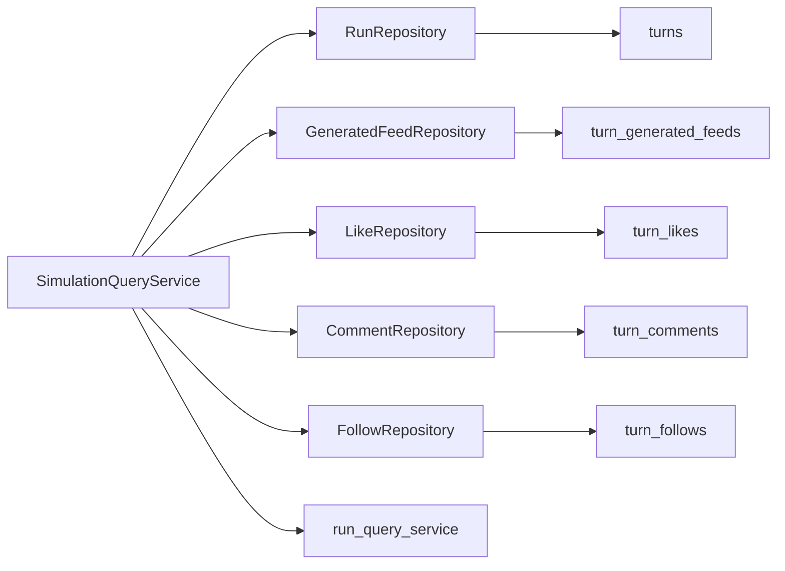

# Turn repository read-path cutover

## Remember

- Exact file paths always
- Exact commands with expected output
- DRY, YAGNI, TDD, frequent commits
- Maximum safely delegable parallelism
- Delegated tasks must be impossible to misread
- UI changes: not in scope (no before/after screenshots)

## Overview

This slice assumes the new turn-table schema and the atomic turn-write bundle are already present at head. Most SQLite adapters already read and write `turns`, `turn_generated_feeds`, `turn_likes`, `turn_comments`, and `turn_follows`, so this must **not** be planned as a broad SQL rename pass. Treat it as a repository/query consistency cutover: remove remaining legacy semantics from runtime repository surfaces, preserve canonical-`agent_id` query/API contracts, harden targeted tests around the new table family, and explicitly **defer** `turn_posts` mixed-ID resolution to a following slice.

## Happy Flow

1. `simulation/core/services/query_service.py` loads turn feeds from `db/repositories/generated_feed_repository.py` and turn actions from `db/repositories/like_repository.py`, `db/repositories/comment_repository.py`, and `db/repositories/follow_repository.py`. Those repositories delegate to adapters that hit `turn_generated_feeds`, `turn_likes`, `turn_comments`, and `turn_follows`.
2. `RunRepository` provides `TurnMetadata` through `db/adapters/sqlite/run_adapter.py`, backed by the `turns` table. Prefer keeping `get_turn_metadata()` / `list_turn_metadata()` / `write_turn_metadata()` names stable unless a concrete bug forces a rename.
3. `SimulationQueryService.get_turn_data()` in `simulation/core/services/query_service.py` returns `TurnData` keyed by canonical `agent_id`, with hydrated posts and action payloads logically unchanged for callers.
4. API serialization in `simulation/api/services/run_query_service.py` exposes the same ID-keyed turn payloads; table-source changes are internal only.
5. Tests under `tests/db/repositories/`, `tests/simulation/core/`, and `tests/api/` prove live runtime code depends on the new turn tables for this slice and behavior did not regress.



## Interface or contract freeze

- `TurnData.feeds`, `TurnData.feed_records`, and `TurnData.actions` remain keyed by canonical `agent_id`, not handles.
- `simulation/api/services/run_query_service.py` continues to serialize the same logical turn payloads; table-source changes are internal only.
- This slice does **not** add `turn_posts`, mixed `run_post_id` / `turn_post_id` resolution, or authored-post generation behavior.
- Prefer the smallest safe public interface change. Repository/service method names such as `get_turn_metadata()` and `write_turn_metadata()` may stay even though they read/write `turns`; avoid churn unless a misleading name causes real correctness or maintenance problems.
- Live runtime code in `db/` repositories/adapters and `simulation/core/services/query_service.py` must not depend on legacy table names (`turn_metadata`, `generated_feeds`, `likes`, `comments`, `follows`) after this slice, except migration/history-only code explicitly out of runtime scope.

## Serial coordination spine

1. Audit real head state before editing: confirm `db/adapters/sqlite/generated_feed_adapter.py`, `db/adapters/sqlite/like_adapter.py`, `db/adapters/sqlite/comment_adapter.py`, `db/adapters/sqlite/follow_adapter.py`, and `db/adapters/sqlite/run_adapter.py` already use the new tables. Avoid redundant rename work.
2. Freeze the minimal-churn decision for repository/service surface names around `TurnMetadata` and `turns`.
3. Land runtime consistency updates in repositories/models/query service only where legacy semantics still leak.
4. Land targeted tests proving unchanged behavior.
5. Run final grep and focused pytest pass.

## Parallel task packets

### Packet R1 — `R1-repo-surface-cleanup`

**Objective:** Align repository interfaces, wrappers, and closely related model/docstring semantics with the new `turns` / `turn_*` steady state without unnecessary public API churn.

**Why parallelizable:** Stays inside repository wrappers, interfaces, and related turn/action model documentation; does not change query orchestration logic.

**Exact files to inspect:**

- `db/repositories/interfaces.py`
- `db/repositories/generated_feed_repository.py`
- `db/repositories/like_repository.py`
- `db/repositories/comment_repository.py`
- `db/repositories/follow_repository.py`
- `simulation/core/models/turns.py`
- `simulation/core/models/persisted_actions.py`

**Exact files allowed to change:**

- The files listed immediately above
- Repository-focused tests only if required to reflect clarified contracts:
  - `tests/db/repositories/test_generated_feed_repository.py`
  - `tests/db/repositories/test_generated_feed_repository_integration.py`
  - `tests/db/repositories/test_action_repositories_integration.py`
  - `tests/db/repositories/test_run_repository.py`
  - `tests/db/repositories/test_run_repository_integration.py`

**Exact files forbidden to change:**

- `feeds/feed_generator.py`
- `simulation/core/models/actions.py`
- `simulation/core/services/query_service.py`
- `ui/`
- Any migration file under `db/migrations/versions/`

**Preconditions:** Serial step 1 completed; team agrees this slice is not a schema rewrite.

**Dependency tasks:** Depends only on `freeze-scope`.

**Required contracts and invariants:**

- Keep canonical ID semantics exactly as-is.
- Do not rename public methods unless the legacy name is actively misleading enough to justify downstream churn.
- Clarify in docstrings/comments that persisted action rows are turn-scoped runtime history, not seed-state facts.

**Step-by-step implementation instructions:**

1. Review repository interface docstrings and method comments for wording that implies legacy table names or ambiguous persistence scope.
2. Update docstrings/types/comments in repository wrappers and related models so they describe `turns` / `turn_*` reality accurately.
3. If a method name looks legacy but callers are widespread, prefer documenting the `turns` backing table rather than renaming in this slice.
4. Tighten repository tests only where they must assert the clarified contract.

**Exact verification commands:**

```bash
uv run pytest tests/db/repositories/test_generated_feed_repository.py tests/db/repositories/test_generated_feed_repository_integration.py tests/db/repositories/test_action_repositories_integration.py tests/db/repositories/test_run_repository.py tests/db/repositories/test_run_repository_integration.py -q
```

**Expected outputs from verification:** All targeted repository tests pass; no test needs legacy table names to explain current runtime behavior.

**Done-when checklist:**

- Repository interfaces and wrappers describe the new turn-table steady state.
- `TurnMetadata` comments/docs clearly map to the `turns` table.
- No unnecessary public API rename churn was introduced.

**Coordinator review checklist:**

- Any retained legacy method name has an explicit justification.
- No repository docstring promises behavior that belongs to the future `turn_posts` slice.

### Packet R2 — `R2-query-read-path-stabilization`

**Objective:** Verify and, only where necessary, tighten query/read-path code so turn data stays logically unchanged while sourcing rows from the new turn tables.

**Why parallelizable:** Confined to read-path orchestration and API/query tests; does not edit repository wrappers if contract freeze is understood.

**Exact files to inspect:**

- `simulation/core/services/query_service.py`
- `simulation/api/services/run_query_service.py`
- `db/adapters/sqlite/run_adapter.py`
- `tests/simulation/core/test_query_service.py`
- `tests/api/test_run_query_service.py`
- `tests/api/test_simulation_run.py`

**Exact files allowed to change:**

- The files listed immediately above
- `simulation/core/models/turns.py` only if the read-path contract needs a clarifying type/doc update

**Exact files forbidden to change:**

- `feeds/feed_generator.py`
- Any `turn_posts` repository/adapter/model file added in a later slice
- `ui/`
- Any migration file under `db/migrations/versions/`

**Preconditions:** Serial step 2 completed; minimal-churn decision on repository method names is frozen.

**Dependency tasks:** Depends on `freeze-scope`; can run in parallel with R1 as long as no shared file ownership is introduced (coordinate `simulation/core/models/turns.py`).

**Required contracts and invariants:**

- `TurnData` remains keyed by canonical `agent_id`.
- API turn payloads remain structurally unchanged.
- This slice does not begin mixed `run_post_id` / `turn_post_id` resolution work.
- Any remaining legacy name references in runtime code must be comments/docstrings only if unavoidable; live SQL/runtime semantics must point at the new turn tables.

**Step-by-step implementation instructions:**

1. Review `simulation/core/services/query_service.py` for stale comments, naming, or assumptions that contradict the new turn-table steady state.
2. Confirm `get_turn_data()` reads feeds/actions through repositories backed by `turn_*` tables and that `TurnData` assembly stays canonical-ID keyed.
3. Update query/API tests to make the table-source cutover explicit through behavior, not brittle implementation mocking.
4. Avoid adding `turn_posts` branches, mixed-ID helpers, or broader resolver work; note those as follow-on work.

**Exact verification commands:**

```bash
uv run pytest tests/simulation/core/test_query_service.py tests/api/test_run_query_service.py tests/api/test_simulation_run.py -q
```

**Expected outputs from verification:** All targeted query/API tests pass; canonical `agent_id` keys remain intact across `TurnData` and serialized API responses.

**Done-when checklist:**

- Query/read-path code has no stale legacy semantics that misdescribe the live turn-table source.
- API tests still prove unchanged logical output.
- No `turn_posts` or mixed-ID resolver work leaked into this slice.

**Coordinator review checklist:**

- The diff is stabilization, not a hidden feature addition.
- Query behavior remains the same from callers’ perspective.

## Integration order

1. Complete serial audit and freeze minimal-churn rule.
2. Run R1 and R2 in parallel (avoid simultaneous edits to `simulation/core/models/turns.py` without coordination).
3. Reconcile `simulation/core/models/turns.py` if both packets touched it; otherwise keep file ownership disjoint.
4. Run combined verification suite.
5. Final grep for live runtime legacy table-name references.

## Alternative approaches

- **Broad public rename of repository/service methods now:** Rejected — churn without behavior change; head already stores turn metadata in `turns` correctly.
- **Treat as no-op because adapters already use `turn_*`:** Rejected — repository semantics, read-path expectations, and tests need an explicit stabilization pass for reviewability and regression resistance.
- **Pull `turn_posts` mixed-ID support into this slice:** Rejected — combines two behaviorally meaningful changes; proposal keeps them separate.

## Manual verification

See `verification.md` in this folder for a copy-paste checklist. Summary:

- Repository tests (command in R1) — expected: all pass.
- Query/API tests (command in R2) — expected: all pass.
- Grep for legacy runtime references:

```bash
rg "\b(turn_metadata|generated_feeds|likes|comments|follows)\b" db/repositories db/adapters/sqlite simulation/core/services tests/db/repositories tests/simulation/core tests/api
```

Expected: remaining hits are intentional method/model names, migration-history tests, or comments documenting old-to-new mapping; no live SQL on legacy tables.

- Optional:

```bash
uv run pytest tests/db/adapters/sqlite/test_run_adapter.py -q
```

Expected: pass.

## Final verification

- Runtime repository wrappers and query code align with `turns` plus `turn_*` tables.
- `TurnData` and API turn payloads remain keyed by canonical `agent_id`.
- No accidental `turn_posts` or mixed-ID resolver work was added.
- Targeted repository, query, and API tests pass.
- Remaining legacy-name references in touched runtime areas are intentionally retained public names or clearly non-runtime historical references.

## Plan asset storage

All notes and verification artifacts for this slice: `docs/plans/2026-03-23_turn_repository_read_path_cutover_431286/`.

## Areas for improvement or clarification

- Proposal text saying “replace all live SQL references” can overstate remaining work; adapters at head already target `turn_*` — stay grounded in actual head state.
- `db/adapters/sqlite/turn_parent.py` may have a stale module docstring (pre-atomic feeds); cleanup only if it blocks tests or creates confusion in touched files.
- `simulation/core/services/query_service.py` still hydrates post IDs through `run_posts` only — intentional deferment for the next slice, not scope creep here.
