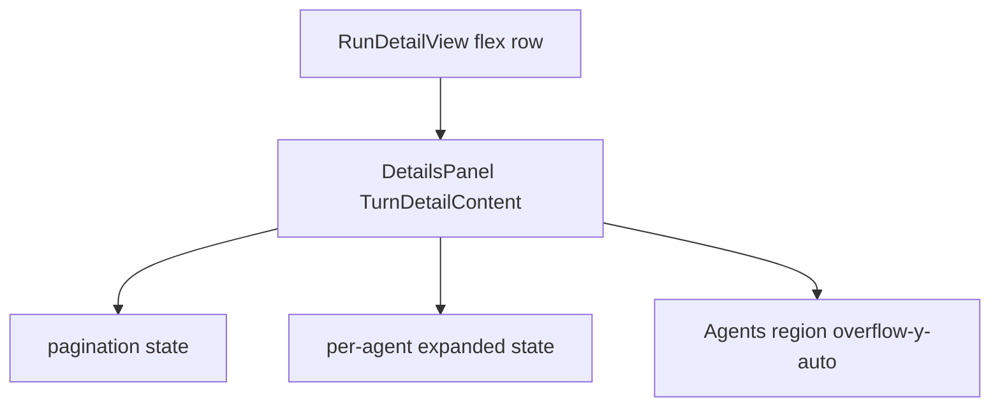

# Turn detail: agents scroll, pagination, collapsible cards

## Remember

- Exact file paths always
- Exact commands with expected output
- DRY, YAGNI, TDD, frequent commits
- Maximum safely delegable parallelism
- Delegated tasks must be impossible to misread
- UI changes: implementer captures before/after screenshots (no README asking the user to do it)

## Overview

On the run detail screen (`[ui/components/run-detail/RunDetailView.tsx](ui/components/run-detail/RunDetailView.tsx)` + `[ui/components/details/DetailsPanel.tsx](ui/components/details/DetailsPanel.tsx)`), the agents list for a selected turn is rendered in `TurnDetailContent`. The list is inside a `flex-1 overflow-y-auto` region, but a parent flex item lacks `min-h-0`, so the flex item grows with content and the browser never establishes an inner scroll (common CSS flex pitfall). We will add `min-h-0` on the appropriate wrapper so the agents region can scroll. Separately, we will paginate `participatingAgents` in the client (no API change), wrap each agent in an outer collapsible that is **closed by default**, and change the header from `Agent {agent.name}` to `{agent.name}` only. Visual language can mirror `[ui/components/details/CollapsibleSection.tsx](ui/components/details/CollapsibleSection.tsx)` (button row + chevron).

## Happy Flow

1. User selects a run and a turn (not Summary) in `[TurnHistorySidebar](ui/components/sidebars/TurnHistorySidebar.tsx)`.
2. `[DetailsPanel](ui/components/details/DetailsPanel.tsx)` loads posts, computes `participatingAgents` via `getParticipatingAgents`, and renders `TurnDetailContent`.
3. **Layout:** The middle+right column (`RunDetailView`) gives the details column a bounded height (`min-h-0`), so the agents pane’s `overflow-y-auto` can scroll when content exceeds the viewport.
4. **Pagination:** `participatingAgents` is sliced to the current page (e.g. constant `PAGE_SIZE` in `DetailsPanel.tsx`). Footer controls advance pages; page index resets when `currentTurn` (or derived agent list) changes.
5. **Collapse:** Each row shows a clickable header (name + optional handle line + chevron). Click toggles expansion; when collapsed, `AgentDetail` is not rendered (or not mounted). When expanded, existing `[AgentDetail](ui/components/details/AgentDetail.tsx)` behavior (inner accordions) stays as-is.
6. **Copy:** Header text is `agent.name` only—no `Agent`  prefix.

## Serial Coordination Spine

1. Create plan asset directory `docs/plans/2026-03-24_turn_agents_scroll_pagination_d2028c/` with `images/before/` and `images/after/`.
2. **First implementation todo:** Capture baseline UI (happy path: run + turn with multiple agents) into `images/before/` using the browser tool (localhost dev server as in `[docs/runbooks/LOCAL_DEVELOPMENT.md](docs/runbooks/LOCAL_DEVELOPMENT.md)`).
3. Implement layout + UI changes (two files; see parallel packets).
4. Run UI lint from repo: `cd ui && npm run lint:all` (expected: clean exit).
5. **Last implementation todo:** Capture updated UI into `images/after/` (same happy path).

## Interface or Contract Freeze

- No backend or OpenAPI changes.
- `AgentDetail` props unchanged unless you intentionally add optional props (prefer keeping `AgentDetail` unchanged and controlling visibility from the parent).

## Parallel Task Packets

### Packet A — Flex chain scroll fix (file isolation)

| Field                 | Content                                                                                                                                                                                                                                               |
| --------------------- | ----------------------------------------------------------------------------------------------------------------------------------------------------------------------------------------------------------------------------------------------------- |
| **Task ID**           | `A-min-h-0-details-column`                                                                                                                                                                                                                            |
| **Objective**         | Ensure the details column can shrink in the flex row so inner `overflow-y-auto` scrolls.                                                                                                                                                              |
| **Parallelizable**    | Touches only `[ui/components/run-detail/RunDetailView.tsx](ui/components/run-detail/RunDetailView.tsx)`; no overlap with Packet B files.                                                                                                              |
| **Inspect**           | `[ui/components/layout/SimulationLayout.tsx](ui/components/layout/SimulationLayout.tsx)` (`h-screen`), `[RunDetailView.tsx](ui/components/run-detail/RunDetailView.tsx)`, `[DetailsPanel.tsx](ui/components/details/DetailsPanel.tsx)` lines 217–225. |
| **Allowed to change** | `[RunDetailView.tsx](ui/components/run-detail/RunDetailView.tsx)` only.                                                                                                                                                                               |
| **Forbidden**         | `[DetailsPanel.tsx](ui/components/details/DetailsPanel.tsx)`, sidebars.                                                                                                                                                                               |
| **Steps**             | Wrap `<DetailsPanel />` in a container with `className` including `flex-1 min-h-0 min-w-0 flex flex-col` (exact classes may be tuned; `min-h-0` is mandatory). Optionally add `min-h-0` to the flex row container if needed after verification.       |
| **Verify**            | Manual: many agents or zoom page until list overflows; wheel/trackpad scrolls agents list.                                                                                                                                                            |
| **Done when**         | Agents list scrolls without pagination when page size is large.                                                                                                                                                                                       |

### Packet B — Pagination + collapsible + title (file isolation)

| Field                 | Content                                                                                                                                                                                                                                                                                                                                                                                                                                                                                                                                                                                                                                                                                                                                                     |
| --------------------- | ----------------------------------------------------------------------------------------------------------------------------------------------------------------------------------------------------------------------------------------------------------------------------------------------------------------------------------------------------------------------------------------------------------------------------------------------------------------------------------------------------------------------------------------------------------------------------------------------------------------------------------------------------------------------------------------------------------------------------------------------------------- |
| **Task ID**           | `B-details-panel-agents-ux`                                                                                                                                                                                                                                                                                                                                                                                                                                                                                                                                                                                                                                                                                                                                 |
| **Objective**         | Paginate participating agents, collapse each agent by default, show display name only in header.                                                                                                                                                                                                                                                                                                                                                                                                                                                                                                                                                                                                                                                            |
| **Parallelizable**    | Touches only `[ui/components/details/DetailsPanel.tsx](ui/components/details/DetailsPanel.tsx)`; Packet A is independent file-wise.                                                                                                                                                                                                                                                                                                                                                                                                                                                                                                                                                                                                                         |
| **Inspect**           | `TurnDetailContent` in `[DetailsPanel.tsx](ui/components/details/DetailsPanel.tsx)` (approx. lines 128–256), `[CollapsibleSection.tsx](ui/components/details/CollapsibleSection.tsx)` for interaction pattern.                                                                                                                                                                                                                                                                                                                                                                                                                                                                                                                                              |
| **Allowed to change** | `[DetailsPanel.tsx](ui/components/details/DetailsPanel.tsx)` only.                                                                                                                                                                                                                                                                                                                                                                                                                                                                                                                                                                                                                                                                                          |
| **Forbidden**         | `[AgentDetail.tsx](ui/components/details/AgentDetail.tsx)` unless a minimal optional prop is strictly needed (prefer parent conditional render).                                                                                                                                                                                                                                                                                                                                                                                                                                                                                                                                                                                                            |
| **Steps**             | (1) Add `PAGE_SIZE` constant (e.g. 5 or 10—pick one, document in code). (2) `useState` for page index; `useEffect` reset page when `currentTurn` identity changes (dependency: `currentTurn` or stable turn id if available). (3) `useMemo` slice `participatingAgents` for current page; clamp page if agent count shrinks. (4) Replace per-agent outer `
` with header `<button>` (or `<button>` + layout) toggling expanded state in `useState` keyed by `agent.handle` (reset map on turn change in same `useEffect`). (5) Render `<AgentDetail ... />` only when expanded. (6) Replace `Agent {agent.name}` with `{agent.name}`. (7) Add pagination footer: Previous/Next (disabled at ends), label e.g. “Page i of n” and “Showing a–b of total”. |
| **Verify**            | Manual: with more than `PAGE_SIZE` agents, pagination appears; collapsed by default; expand shows feed/metadata; header shows `Alice Chen` not `Agent Alice Chen`.                                                                                                                                                                                                                                                                                                                                                                                                                                                                                                                                                                                          |
| **Done when**         | All behaviors match Manual Verification checklist.                                                                                                                                                                                                                                                                                                                                                                                                                                                                                                                                                                                                                                                                                                          |

## Integration Order

1. Land Packet A and B (order arbitrary; merge after both pass local lint).
2. Manual verification on combined branch (scroll + pagination + collapse).

## Alternative approaches

- **Scroll only (no pagination):** Fixing `min-h-0` alone may restore scrolling; you asked for pagination as well for long lists—client-side paging reduces DOM weight and matches the “Load more” pattern used in `[RunHistorySidebar](ui/components/sidebars/RunHistorySidebar.tsx)` conceptually.
- **Virtualization (e.g. `react-window`):** Heavier dependency; unnecessary unless agent counts become very large. Pagination + conditional render of `AgentDetail` is simpler and matches the request.
- `**Agent`  prefix elsewhere:** `[AgentsView.tsx](ui/components/agents/AgentsView.tsx)` line 107 still says `Agent {agent.name}`; out of scope for turn view unless you want wording consistency in a follow-up.

## Manual Verification

- `cd ui && npm run lint:all` — completes with no errors.
- API + UI dev servers per `[docs/runbooks/LOCAL_DEVELOPMENT.md](docs/runbooks/LOCAL_DEVELOPMENT.md)` (backend with auth bypass if needed per `[docs/runbooks/LOCAL_DEV_AUTH.md](docs/runbooks/LOCAL_DEV_AUTH.md)`).
- Open app, select a run, select a turn with multiple participating agents.
- **Scroll:** Agents section scrolls when content exceeds viewport (after layout fix).
- **Pagination:** If agents count > `PAGE_SIZE`, footer shows multiple pages; Prev/Next work; counts correct.
- **Collapse:** Each agent row is collapsed initially; click expands and shows `AgentDetail`; click again collapses.
- **Title:** Headers show `Alice Chen`, not `Agent Alice Chen`.
- Baseline screenshot exists in `docs/plans/2026-03-24_turn_agents_scroll_pagination_d2028c/images/before/`.
- Updated screenshot exists in `docs/plans/2026-03-24_turn_agents_scroll_pagination_d2028c/images/after/`.

## Specificity

| Item                         | Location                                                                                                        |
| ---------------------------- | --------------------------------------------------------------------------------------------------------------- |
| Primary layout fix           | `[ui/components/run-detail/RunDetailView.tsx](ui/components/run-detail/RunDetailView.tsx)`                      |
| Pagination, collapse, rename | `[ui/components/details/DetailsPanel.tsx](ui/components/details/DetailsPanel.tsx)` — `TurnDetailContent`        |
| Existing inner sections      | `[ui/components/details/AgentDetail.tsx](ui/components/details/AgentDetail.tsx)` — unchanged unless unavoidable |
| Plan assets                  | `docs/plans/2026-03-24_turn_agents_scroll_pagination_d2028c/images/before/` and `.../after/`                    |

## Final Verification

- Lint clean; manual checklist above; before/after screenshots present in plan folder; no user-facing doc added unless you separately request it.
