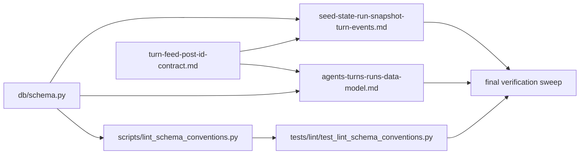

# Turn-table steady-state closeout

_Source: copied from `.cursor/plans/turn-table_steady-state_closeout_4c10302b.plan.md`._

## Remember

- Exact file paths always
- Exact commands with expected output
- DRY, YAGNI, TDD, frequent commits
- Maximum safely delegable parallelism
- Delegated tasks must be impossible to misread
- UI changes: not in scope for this slice; do not touch `ui/**`

## Overview

This slice is a cleanup-and-enforcement pass after the schema cutover, transactional turn writes, mixed post hydration, and authored-post generation work are in place. The goal is to make the repository reject the old legacy turn-event naming as an acceptable steady state, while updating the architecture docs so they describe the current model accurately: `turns` is the canonical parent, the `turn_*` table family is live, `turn_posts` is part of the turn history model, and authored posts become feed-visible only starting in the next turn.

## Happy Flow

1. The schema linter in [scripts/lint_schema_conventions.py](scripts/lint_schema_conventions.py) loads [db/schema.py](db/schema.py) and validates the live table family against the steady-state rules: `agent_*` tables remain seed-state only, `run_*` tables remain run-scoped, and `turns` plus every `turn_*` table require non-null `run_id` and `turn_number` where appropriate.
2. The linter tests in [tests/lint/test_lint_schema_conventions.py](tests/lint/test_lint_schema_conventions.py) ratchet the repo forward by failing if a legacy turn-event baseline is reintroduced or if the current schema drifts away from the steady-state contract.
3. The architecture docs in [docs/architecture/agents-turns-runs-data-model.md](docs/architecture/agents-turns-runs-data-model.md) and [docs/architecture/seed-state-run-snapshot-turn-events.md](docs/architecture/seed-state-run-snapshot-turn-events.md) describe `turns`, `turn_generated_feeds`, `turn_likes`, `turn_comments`, `turn_follows`, `turn_metrics`, and `turn_posts` as current reality rather than future migration targets.
4. The mixed post-ID contract in [docs/architecture/turn-feed-post-id-contract.md](docs/architecture/turn-feed-post-id-contract.md) remains aligned with the authored-post behavior that has already landed: `TurnAction.POST` persists `turn_posts`, and those posts become eligible for feeds only when `turn_number < current_turn_number`.
5. Final verification proves there is no live SQL or live documentation dependency on the legacy steady state outside explicitly historical locations such as archived plans, migration history, or before/after explanations.

## Interface Or Contract Freeze

- This slice does not add new simulation behavior. It documents and enforces the steady state that already exists after the authored-post subsequent-turn slice lands.
- `turns` is the canonical turn parent. The steady-state turn history family is `turn_generated_feeds`, `turn_likes`, `turn_comments`, `turn_follows`, `turn_metrics`, and `turn_posts`.
- Authored posts are no longer described as deferred in architecture docs. The current product rule is explicit: a post created in turn `T` may appear in feeds only in turn `T+1` or later.
- Historical references to legacy names are still allowed only in migration-oriented material, archived plans/proposals, or explicit before/after explanations. Live architecture docs and enforcement tools must not treat the legacy names as current truth.
- Ground this slice in head reality, not stale proposal wording. The current linter does not expose a `LEGACY_TURN_EVENT_TABLES` constant, so the implementation should tighten the actual lint behavior in [scripts/lint_schema_conventions.py](scripts/lint_schema_conventions.py) rather than chasing that exact symbol name.
- Avoid broad runtime rename churn unless verification exposes a real correctness issue. This slice should prefer lint/doc/test enforcement over gratuitous method or model renames.

## Serial Coordination Spine

1. Audit the current head state in [scripts/lint_schema_conventions.py](scripts/lint_schema_conventions.py), [tests/lint/test_lint_schema_conventions.py](tests/lint/test_lint_schema_conventions.py), [docs/architecture/agents-turns-runs-data-model.md](docs/architecture/agents-turns-runs-data-model.md), [docs/architecture/seed-state-run-snapshot-turn-events.md](docs/architecture/seed-state-run-snapshot-turn-events.md), and [docs/architecture/turn-feed-post-id-contract.md](docs/architecture/turn-feed-post-id-contract.md). Freeze the rule that authored posts are current behavior and remain subsequent-turn visible only.
2. Decide the verification shape before editing: prefer one search for runtime SQL/table-name references and one search for doc references, rather than a single noisy grep that also catches method identifiers like `write_turn_metadata`.
3. Land the linter/test ratchet.
4. Land the architecture/doc reconciliation.
5. Run the final verification suite and record any intentionally historical residual hits.

## Parallel Task Packets

### Packet L1: Schema-lint ratchet

Objective: tighten lint/test enforcement so the repo no longer accepts the legacy turn-event naming as a valid current-state baseline.

Why parallelizable: confined to the linter and its tests; does not require editing architecture docs or runtime services.

Files to inspect:

- [scripts/lint_schema_conventions.py](scripts/lint_schema_conventions.py)
- [tests/lint/test_lint_schema_conventions.py](tests/lint/test_lint_schema_conventions.py)
- [db/schema.py](db/schema.py)

Files allowed to change:

- [scripts/lint_schema_conventions.py](scripts/lint_schema_conventions.py)
- [tests/lint/test_lint_schema_conventions.py](tests/lint/test_lint_schema_conventions.py)

Files forbidden to change:

- `db/services/**`
- `simulation/**`
- `feeds/**`
- `ui/**`

Preconditions:

- The authored-post subsequent-turn behavior is assumed landed and available in head.
- The coordinator has frozen the verification strategy so this packet does not try to solve docs cleanup inside the tests.

Dependencies:

- Depends only on the serial audit/freeze step.

Required contracts and invariants:

- The live repo schema in [db/schema.py](db/schema.py) must remain accepted by the linter.
- `turns` and every `turn_*` table continue to be governed as turn-scoped history.
- Do not add enforcement that accidentally rejects valid seed-state legacy tables still intentionally grandfathered in `LEGACY_SEED_STATE_TABLES`.

Implementation instructions:

1. Review how [scripts/lint_schema_conventions.py](scripts/lint_schema_conventions.py) currently distinguishes governed tables from non-governed tables.
2. Tighten the linter so the steady-state rule is explicit and future regressions to legacy turn-event table names are not silently treated as acceptable current state.
3. Add focused tests that prove the linter accepts the current repo schema and rejects a metadata fixture that reintroduces legacy turn-event table names or mis-scoped turn tables.
4. Keep the change narrow: this packet is about enforcement semantics, not about renaming runtime code.

Verification commands:

- `uv run pytest tests/lint/test_lint_schema_conventions.py -q`

Expected output:

- All lint tests pass.
- The new negative test fails when legacy turn-event table names are modeled as current-state turn history.

Done when:

- The linter enforces the steady-state turn-table family rather than tolerating transitional naming.
- Tests cover both acceptance of current head schema and rejection of legacy turn-event regressions.

Coordinator review checklist:

- No runtime behavior was changed under the guise of lint cleanup.
- The ratchet is grounded in actual `db/schema.py` behavior, not outdated proposal wording.

### Packet D1: Architecture steady-state rewrite

Objective: rewrite the two high-signal architecture docs so they describe the current turn-table model and authored-post behavior accurately.

Why parallelizable: limited to architecture docs; does not overlap with the linter packet.

Files to inspect:

- [docs/architecture/agents-turns-runs-data-model.md](docs/architecture/agents-turns-runs-data-model.md)
- [docs/architecture/seed-state-run-snapshot-turn-events.md](docs/architecture/seed-state-run-snapshot-turn-events.md)
- [docs/architecture/turn-feed-post-id-contract.md](docs/architecture/turn-feed-post-id-contract.md)
- [strategy_planning/2026-03-22_v2_refactor_turn_tables/proposal.md](strategy_planning/2026-03-22_v2_refactor_turn_tables/proposal.md)
- [db/schema.py](db/schema.py)

Files allowed to change:

- [docs/architecture/agents-turns-runs-data-model.md](docs/architecture/agents-turns-runs-data-model.md)
- [docs/architecture/seed-state-run-snapshot-turn-events.md](docs/architecture/seed-state-run-snapshot-turn-events.md)

Files forbidden to change:

- `scripts/**`
- `db/**`
- `simulation/**`
- `ui/**`

Preconditions:

- The coordinator has frozen that authored posts are current behavior and subsequent-turn visible only.

Dependencies:

- Depends only on the serial audit/freeze step.

Required contracts and invariants:

- Remove language that says authored posts are deferred in these docs.
- Describe `turns` and the full `turn_*` family as present reality, not a future migration target.
- Preserve historical context only where it adds explicit before/after explanation.

Implementation instructions:

1. In [docs/architecture/agents-turns-runs-data-model.md](docs/architecture/agents-turns-runs-data-model.md), replace transitional wording about legacy turn-event names with present-tense descriptions of the live steady state.
2. In [docs/architecture/seed-state-run-snapshot-turn-events.md](docs/architecture/seed-state-run-snapshot-turn-events.md), rewrite the “current schema” framing so turn events are documented in steady-state names first, with any historical naming kept clearly secondary.
3. Align both docs with [docs/architecture/turn-feed-post-id-contract.md](docs/architecture/turn-feed-post-id-contract.md) on the authored-post rule: `turn_posts` persist during turn execution, but feed candidacy starts only on later turns.
4. Keep front matter intact and rerun metadata validation if any markdown file is touched.

Verification commands:

- `uv run python scripts/check_docs_metadata.py docs/architecture/agents-turns-runs-data-model.md docs/architecture/seed-state-run-snapshot-turn-events.md`
- `rg "TurnAction.POST|deferred|turn_metadata|generated_feeds|likes|comments|follows" docs/architecture/agents-turns-runs-data-model.md docs/architecture/seed-state-run-snapshot-turn-events.md docs/architecture/turn-feed-post-id-contract.md`

Expected output:

- Metadata check succeeds.
- Remaining legacy-name references in the two rewritten architecture docs are only explicit historical explanations, if any.
- No lingering statement says authored-post generation is deferred.

Done when:

- The two architecture docs describe the live steady state accurately.
- The authored-post subsequent-turn visibility rule is explicit and consistent across architecture docs.

Coordinator review checklist:

- The docs now match [db/schema.py](db/schema.py) and the landed authored-post behavior.
- Historical context, if retained, is clearly marked as historical rather than normative.

### Packet D2: Verification contract and residual-reference sweep

Objective: tighten the final verification story so closeout reviewers can distinguish legitimate historical references from live steady-state regressions.

Why parallelizable: works on verification/docs surfaces only; can proceed once the serial verification shape is frozen.

Files to inspect:

- [strategy_planning/2026-03-22_v2_refactor_turn_tables/proposal.md](strategy_planning/2026-03-22_v2_refactor_turn_tables/proposal.md)
- [docs/architecture/turn-feed-post-id-contract.md](docs/architecture/turn-feed-post-id-contract.md)
- [scripts/generate_db_schema_docs.py](scripts/generate_db_schema_docs.py)
- Targeted `rg` results under `db/`, `simulation/`, `tests/`, `docs/`, and `scripts/`

Files allowed to change:

- [docs/architecture/turn-feed-post-id-contract.md](docs/architecture/turn-feed-post-id-contract.md) if reconciliation is needed
- The new plan assets under `docs/plans/2026-03-24_turn_table_steady_state_closeout_584731/`
- Proposal/doc verification notes only if a touched planning doc must explicitly distinguish historical versus normative references

Files forbidden to change:

- `db/schema.py`
- `simulation/**`
- `feeds/**`
- `ui/**`

Preconditions:

- The serial verification shape has been frozen.
- D1 owns the two major architecture docs and must not be overlapped here.

Dependencies:

- Depends on the serial audit/freeze step.
- Should reconcile with D1 before final merge if `turn-feed-post-id-contract.md` needs wording updates.

Required contracts and invariants:

- Do not reopen authored-post feature design.
- Verification must be specific enough to be low-noise and repeatable.
- Generated schema-doc verification should remain check-only; no doc regeneration belongs in this slice unless an actual mismatch is discovered.

Implementation instructions:

1. Define two explicit verification searches: one for runtime/table-name references in live code paths, and one for docs/tests where historical references may still exist intentionally.
2. Review [docs/architecture/turn-feed-post-id-contract.md](docs/architecture/turn-feed-post-id-contract.md) for consistency with the two rewritten architecture docs; edit only if wording drift remains.
3. Add a `verification.md` artifact under `docs/plans/2026-03-24_turn_table_steady_state_closeout_584731/` that records the exact commands, allowed residual-hit categories, and expected outputs for reviewers.
4. If useful, include [strategy_planning/2026-03-22_v2_refactor_turn_tables/proposal.md](strategy_planning/2026-03-22_v2_refactor_turn_tables/proposal.md) in the verification notes as historical context, but do not rewrite broad planning content unless it creates real confusion.

Verification commands:

- `rg "\b(turn_metadata|generated_feeds|likes|comments|follows)\b" db/adapters db/repositories db/services simulation/api simulation/core scripts`
- `rg "\b(turn_metadata|generated_feeds|likes|comments|follows)\b" docs/architecture docs/plans tests/lint`
- `uv run python scripts/generate_db_schema_docs.py --check`

Expected output:

- Runtime-path grep returns no live legacy table-name dependencies, or only explicitly approved compatibility shims documented in the verification artifact.
- Docs/tests grep returns only historical or explanatory references that are intentionally retained.
- Schema-doc check passes.

Done when:

- Reviewers have a low-noise, copy-paste verification checklist.
- Residual legacy-name references are categorized instead of hand-waved.

Coordinator review checklist:

- Verification commands test the actual closeout goal rather than incidental method identifiers.
- Any retained reference has a documented reason.

## Integration Order

1. Complete the serial audit and freeze the verification shape.
2. Run L1 and D1 in parallel.
3. Run D2 once L1 and D1 have established the final enforcement and documentation wording; allow only the minimal reconciliation edit to [docs/architecture/turn-feed-post-id-contract.md](docs/architecture/turn-feed-post-id-contract.md) if needed.
4. Reconcile all verification commands into a single closeout `verification.md` artifact.
5. Run the full verification suite and confirm no new runtime cleanup is required.

## Alternative Approaches

- Rename every lingering `turn_metadata`-style method or variable in runtime code now. Rejected for this slice because it adds broad churn without changing steady-state behavior; enforce table/documentation truth first.
- Keep the proposal’s single broad grep exactly as written. Rejected because it is too noisy against current method identifiers and obscures the real goal; split runtime versus historical/reference searches instead.
- Skip doc reconciliation because behavior already works. Rejected because the two architecture docs still describe authored posts as deferred and still frame the turn-table family as transitional.

## Manual Verification

- `uv run pytest tests/lint/test_lint_schema_conventions.py -q`
  - Expected: pass.
- `uv run python scripts/check_docs_metadata.py docs/architecture/agents-turns-runs-data-model.md docs/architecture/seed-state-run-snapshot-turn-events.md docs/architecture/turn-feed-post-id-contract.md docs/plans/2026-03-24_turn_table_steady_state_closeout_584731/`
  - Expected: `Docs metadata validation succeeded.`
- `rg "\b(turn_metadata|generated_feeds|likes|comments|follows)\b" db/adapters db/repositories db/services simulation/api simulation/core scripts`
  - Expected: no live table-name references that describe the legacy steady state.
- `rg "\b(turn_metadata|generated_feeds|likes|comments|follows)\b" docs/architecture docs/plans tests/lint`
  - Expected: hits are only historical explanations, archived planning material, or intentional test fixtures.
- `uv run python scripts/generate_db_schema_docs.py --check`
  - Expected: schema docs already match migrations/schema.
- `uv run ruff check .`
  - Expected: pass.

## Final Verification

- The linter and its tests ratchet the repo toward the steady-state turn-table family.
- The two architecture docs no longer say authored-post generation is deferred.
- The authored-post rule remains explicit: posts authored in turn `T` are eligible for feeds only in turn `T+1` or later.
- Reviewers have a concise verification artifact under `docs/plans/2026-03-24_turn_table_steady_state_closeout_584731/`.
- Any remaining legacy-name references are clearly historical, explanatory, or fixture-only.

## Areas For Improvement Or Clarification

- The proposal text says to remove legacy entries from `LEGACY_TURN_EVENT_TABLES`, but current head does not expose that constant. Implement the intent against the real linter structure rather than forcing an outdated symbol-level edit.
- The proposal’s original grep mixes runtime, tests, and docs, which will create false positives from identifiers and historical material. The safer closeout is a split verification strategy with explicit residual-hit categories.
- If the frontend later renders `TurnAction.POST` more richly, that should be a separate UI slice; this closeout should remain backend/docs/lint-only.

## Plan Asset Storage

Use `docs/plans/2026-03-24_turn_table_steady_state_closeout_584731/` for `plan.md`, `verification.md`, and any notes captured during execution. No screenshot workflow is needed because `ui/**` is out of scope.
