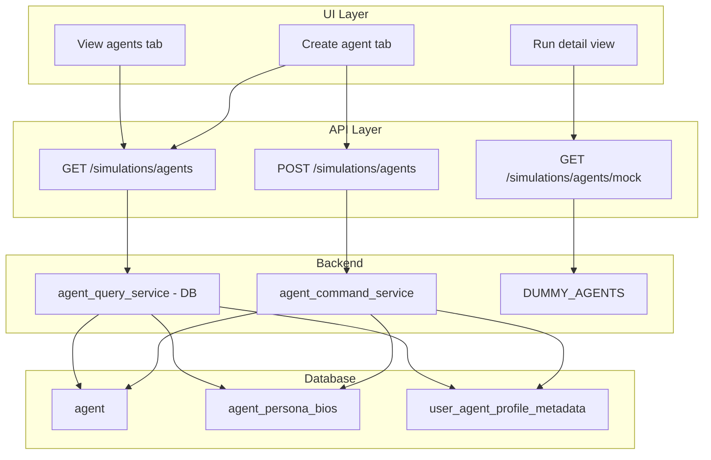

# Agents Backend and View Integration

## Remember

- Exact file paths always
- Exact commands with expected output
- DRY, YAGNI, TDD, frequent commits

---

## Scope

**In scope:**

- Create agents via API and persist to DB (agent, agent_persona_bios, user_agent_profile_metadata)
- List agents from real DB for View agents tab and Create agent form
- Atomic multi-table writes (transaction support)
- Server-side handle normalization
- `generated_bio` = empty string for user-created agents
- Preserve mock runs: run detail continues to use mock agents via dedicated endpoint

**Out of scope / fast-follows:**

- `comments`, `likedPostUris`, `linkedAgentHandles` — document for future implementation
- Runs migration to real data
- AI-generated bio

---

## Data Flow




---

## Happy Flow

1. User opens app; `useSimulationPageState` fetches `agents` from `GET /v1/simulations/agents` (real DB) and `runAgents` from `GET /v1/simulations/agents/mock` (dummy).
2. View agents tab and Create agent form use `agents` (real).
3. Run detail view uses `runAgents` (mock) via `getRunAgents(selectedRun, mockAgents)`.
4. User fills Create agent form (handle, display name, bio) and submits.
5. Frontend calls `POST /v1/simulations/agents` with `handle`, `display_name`, `bio`.
6. Backend normalizes handle, checks uniqueness, writes agent + bio + metadata in one transaction, returns `AgentSchema`.
7. Frontend refreshes `agents` and switches to View agents with new handle selected.

---

## Implementation Steps

### 1. Add transaction support to agent adapters

Extend base and SQLite adapters so writes can participate in a shared transaction.

- **File:** [db/adapters/base.py](db/adapters/base.py)  
  - `AgentDatabaseAdapter.write_agent(agent, conn=None)`
  - `AgentBioDatabaseAdapter.write_agent_bio(bio, conn=None)`
  - `UserAgentProfileMetadataDatabaseAdapter.write_user_agent_profile_metadata(metadata, conn=None)`
- **Files:** [db/adapters/sqlite/agent_adapter.py](db/adapters/sqlite/agent_adapter.py), [db/adapters/sqlite/agent_bio_adapter.py](db/adapters/sqlite/agent_bio_adapter.py), [db/adapters/sqlite/user_agent_profile_metadata_adapter.py](db/adapters/sqlite/user_agent_profile_metadata_adapter.py)  
  - When `conn` is provided: use it, do not commit. When `conn` is `None`: use `get_connection()`, commit, close (current behavior).
- **Files:** [db/repositories/agent_repository.py](db/repositories/agent_repository.py), [db/repositories/agent_bio_repository.py](db/repositories/agent_bio_repository.py), [db/repositories/user_agent_profile_metadata_repository.py](db/repositories/user_agent_profile_metadata_repository.py)  
  - Pass `conn` from repository methods to adapter writes. Add optional `conn` to `create_or_update_agent`, `create_agent_bio`, `create_or_update_metadata` when applicable.

### 2. Add handle normalization utility

- **File:** Create `simulation/core/handle_utils.py` (or add to `lib/`)  
  - `normalize_handle(raw: str) -> str`: strip whitespace, ensure `@` prefix (add if missing), lowercase. Empty after normalization raises `ValueError`.

### 3. Add CreateAgentRequest schema

- **File:** [simulation/api/schemas/simulation.py](simulation/api/schemas/simulation.py)  
  - `CreateAgentRequest`: `handle: str`, `display_name: str`, `bio: str = ""`  
  - Validators: non-empty `handle`, `display_name`; optional `bio`.

### 4. Replace dummy list with DB-backed query service

- **File:** [simulation/api/services/agent_query_service.py](simulation/api/services/agent_query_service.py)  
  - Add `list_agents()` that uses `AgentRepository`, `AgentBioRepository`, `UserAgentProfileMetadataRepository`.  
  - For each agent: get latest bio, metadata; map to `AgentSchema` (handle, name=display_name, bio=persona_bio, generated_bio="", followers, following, posts_count).  
  - Sort by handle.  
  - Keep `list_agents_dummy()` for mock endpoint only (do not remove yet).

### 5. Add agent command service with atomic create

- **File:** Create [simulation/api/services/agent_command_service.py](simulation/api/services/agent_command_service.py)  
  - `create_agent(req: CreateAgentRequest) -> AgentSchema`  
  - Normalize handle via `normalize_handle`.  
  - Check `get_agent_by_handle(normalized_handle)`; if exists, raise domain error (e.g. `HandleAlreadyExistsError`).  
  - Use `SqliteTransactionProvider().run_transaction()`; inside transaction:  
    - Create `Agent` (agent_id=uuid4, persona_source=USER_GENERATED, display_name, handle=normalized, timestamps)  
    - Create `AgentBio` (persona_bio_source=USER_PROVIDED, persona_bio=bio or "")  
    - Create `UserAgentProfileMetadata` (followers_count=0, follows_count=0, posts_count=0)
  - Map created domain objects to `AgentSchema` and return.

### 6. Add POST route and mock GET route

- **File:** [simulation/api/routes/simulation.py](simulation/api/routes/simulation.py)  
  - Add `POST /simulations/agents` with `CreateAgentRequest` body, `AgentSchema` response.  
  - Delegate to `agent_command_service.create_agent`, map `HandleAlreadyExistsError` to 409, validation to 422.  
  - Add `GET /simulations/agents/mock`: returns `list_agents_dummy()` for run-detail use.

### 7. Update GET /simulations/agents to use real DB

- **File:** [simulation/api/routes/simulation.py](simulation/api/routes/simulation.py)  
  - Change `_execute_get_simulation_agents` to call `list_agents()` (DB) instead of `list_agents_dummy()`.

### 8. Frontend: add postAgent and getMockAgents

- **File:** [ui/lib/api/simulation.ts](ui/lib/api/simulation.ts)  
  - `postAgent(body: { handle: string; display_name: string; bio?: string }) => Promise<Agent>`  
  - `getMockAgents(): Promise<Agent[]>` — fetches `GET /v1/simulations/agents/mock`, maps to `Agent[]`.

### 9. Frontend: split agents vs runAgents sources

- **File:** [ui/hooks/useSimulationPageState.ts](ui/hooks/useSimulationPageState.ts)  
  - Add `mockAgents`, `mockAgentsLoading`, `mockAgentsError`, fetch via `getMockAgents` (e.g. when `viewMode === 'runs'` or on mount).  
  - `runAgents = getRunAgents(selectedRun, mockAgents)` (no longer uses `agents`).  
  - Keep `agents` from `getAgents()` for View agents and Create agent form.

### 10. Create agent form: wire submit

- **File:** [ui/components/agents/CreateAgentView.tsx](ui/components/agents/CreateAgentView.tsx)  
  - Accept `onSubmit: (payload: { handle: string; displayName: string; bio: string }) => Promise<void>`.  
  - On submit: call `onSubmit({ handle, displayName, bio })`, show loading/error.  
  - Do not send `comments`, `likedPostUris`, `linkedAgentHandles` (UI can keep form fields but they are ignored for now).
- **File:** [ui/app/page.tsx](ui/app/page.tsx)  
  - Add `handleCreateAgent` that calls `postAgent`, refreshes `agents`, sets `selectedAgentHandle` to new handle, switches `viewMode` to `'agents'`.  
  - Pass `handleCreateAgent` to `CreateAgentView`.

### 11. Tests

- **File:** [tests/api/test_simulation_agents.py](tests/api/test_simulation_agents.py)  
  - Update list tests: use `temp_db`; no assertions on exact count (DB may be empty).  
  - Add POST tests: success returns 200/201 with AgentSchema; duplicate handle returns 409; validation failures return 422.  
  - Add GET /agents/mock: returns DUMMY_AGENTS shape.  
  - Integration: POST agent, then GET /agents includes it.

### 12. Fast-follow notes

Add a short note in code or docs for future work:

- Accept and persist `comments` (list of `{ text, postUri }`)
- Accept and persist `likedPostUris`
- Accept and persist `linkedAgentHandles` (agent-agent relationships)

---

## Manual Verification

1. **Tests:**
  - `uv run pytest tests/api/test_simulation_agents.py tests/db/repositories/test_agent_repository_integration.py -v`  
  - Expected: all pass.
2. **API:**
  - Start: `PYTHONPATH=. uv run uvicorn simulation.api.main:app --reload`  
  - `curl -s http://localhost:8000/v1/simulations/agents` — returns DB agents (possibly empty).  
  - `curl -s http://localhost:8000/v1/simulations/agents/mock` — returns 8 dummy agents.  
  - `curl -s -X POST http://localhost:8000/v1/simulations/agents -H 'Content-Type: application/json' -d '{"handle":"new.user.bsky.social","display_name":"New User","bio":"Hello"}'` — returns created agent.  
  - Re-fetch GET /agents — new agent appears.
3. **UI:**
  - `cd ui && npm run dev`  
  - View agents: shows real agents.  
  - Create agent: fill form, submit; switches to View agents with new agent selected.  
  - Run detail: select a run; run agents still show mock data (dummy handles).
4. **Quality:**
  - `uv run pre-commit run --all-files`  
  - `uv run ruff check .`  
  - `uv run pyright .`

---

## Plan Asset Storage

```
docs/plans/2026-02-23_agents_backend_view_integration_<6-digit hash>/
```

(No before/after screenshots required per create-implementation-plan skill unless UI changes warrant them; this plan focuses on backend + integration.)

---

## Alternative Approaches

- **Single agents source for runs:** Rejected; run detail needs mock agents to match dummy turn handles; separating mock endpoint keeps runs flow isolated.
- **Persist history fields now:** Rejected; requires schema and migration; deferred to fast-follow.
- **Client-side handle normalization:** Rejected; user requested server-side enforcement.
