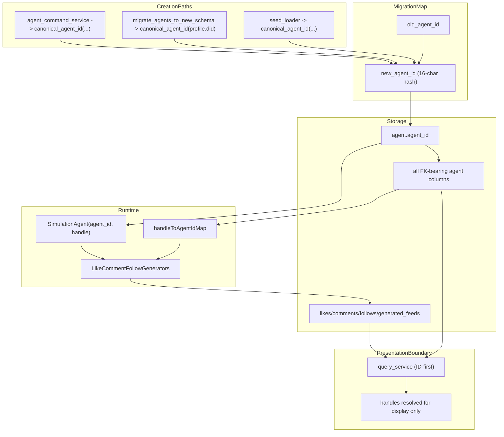

# Canonical Agent ID And Action Key Plan

<!-- markdownlint-disable MD007 MD024 MD029 MD032 -->

## Remember

- Exact file paths always
- Exact commands with expected output
- DRY, YAGNI, TDD, frequent commits
- UI changes: agent captures before/after screenshots itself (no README or instructions for the user)

---

## Overview

This is a repo-wide identity normalization change, not just an action-table cleanup. Today `agent_id` is not canonical across creation paths: API-created agents use raw UUID hex in [simulation/api/services/agent_command_service.py](simulation/api/services/agent_command_service.py), the migration job uses raw DIDs in [jobs/migrate_agents_to_new_schema.py](jobs/migrate_agents_to_new_schema.py), and local-dev fixtures/loaders use precomputed legacy IDs in [simulation/local_dev/seed_loader.py](simulation/local_dev/seed_loader.py). The target state is one canonical `agent_id` representation everywhere, one canonical helper for generating it, one full migration that rewrites the FK graph, and one runtime invariant: only canonical IDs are used for storage, uniqueness, joins, and action semantics.

---

## Canonical Representation

### Canonical format

- `agent_id` must be exactly 16 lowercase hex characters.
- Example: `0f3a91c4d8e27b6a`
- Disallowed in canonical storage:
  - raw DIDs like `did:plc:...`
  - raw UUID hex strings
  - prefixed IDs like `agent_0240dc0d4a4c7e73`
  - handles like `alice.bsky.social`

### Canonical helper

Add a single helper module at [lib/agent_id.py](lib/agent_id.py) with:

- `canonical_agent_id(source: str | None = None) -> str`
- `is_canonical_agent_id(value: str) -> bool`

Required behavior:

- If `source` is provided:
  - trim whitespace
  - hash deterministically
  - return the first 16 lowercase hex chars
- If `source` is omitted:
  - generate internal entropy
  - hash it
  - return the first 16 lowercase hex chars

Recommended implementation:

- `hashlib.sha256(normalized_source.encode()).hexdigest()[:16]`

Important decision:

- For migration and stable normalization, callers should pass a meaningful source string.
- For one-off creation where no stable upstream identifier exists, callers may omit the source and persist the generated canonical result.

---

## Global Invariants

- Every persisted `agent.agent_id` matches `^[0-9a-f]{16}$`.
- Every FK or semantic agent reference that points to an agent also matches `^[0-9a-f]{16}$`.
- No field named `agent_id` contains a handle, DID, UUID hex, or `agent_*` legacy string.
- `Follow` actor and follow target are both canonical IDs.
- `agent_handle`, `handle_at_start`, and similar handle fields are display/logging only.
- Internal runtime maps may temporarily use handles for display lookup, but not as durable identity keys.

---

## Repo-Wide Identity Sources To Normalize

### API-created agents

Current path:

- [simulation/api/services/agent_command_service.py](simulation/api/services/agent_command_service.py)
- `_generate_agent_id()` returns `uuid.uuid4().hex`

Target:

- `_generate_agent_id()` delegates to [lib/agent_id.py](lib/agent_id.py)
- persisted value is canonical 16-char hex

### Migration job from profiles

Current path:

- [jobs/migrate_agents_to_new_schema.py](jobs/migrate_agents_to_new_schema.py)
- `profile.did` is currently stored directly as `agent_id`

Target:

- use `canonical_agent_id(profile.did)`
- bio and metadata rows use the same canonical ID

### Local dev seed loader and fixtures

Current path:

- [simulation/local_dev/seed_loader.py](simulation/local_dev/seed_loader.py)
- fixture JSON carries legacy `agent_id` strings directly

Target:

- fixture values are canonicalized
- loader validates or normalizes to canonical IDs

---

## FK Graph Impact

Changing canonical `agent.agent_id` affects more than actions. Review and migrate every table that stores or keys by agent identity:

- `agent`
- `agent_persona_bios`
- `user_agent_profile_metadata`
- `agent_follow_edges`
- `agent_posts`
- `agent_post_likes`
- `agent_post_comments`
- `run_agents`
- `run_posts`
- `run_post_likes`
- `run_post_comments`
- `run_follow_edges`
- `likes`
- `comments`
- `follows`
- `generated_feeds`

This list should be treated as the minimum required blast radius, not a suggestion.

---

## Happy Flow

1. A canonical helper creates a 16-char hex ID from a source string or internal entropy.
2. All agent creation paths call the helper before constructing `Agent`.
3. A DB migration computes `old_agent_id -> new_agent_id` once and rewrites every dependent table.
4. Runtime hydration creates `SimulationAgent(agent_id=<canonical>, handle=<display>)`.
5. Turn execution, action history, and validators use canonical actor IDs.
6. Follow generation resolves `post.author_handle -> target_agent_id` using run-scoped mappings.
7. SQLite adapters persist canonical IDs in all action and feed tables.
8. Query/API resolve handles only at the presentation boundary.

---

## Phase 0: Canonical Contract

### Objective

Define one canonical representation and one helper API before touching persistence or runtime code.

### Files To Change

- [lib/agent_id.py](lib/agent_id.py)
- [simulation/core/models/agent.py](simulation/core/models/agent.py)
- tests for the helper under `tests/`

### Files To Avoid Unless Required

- [db/schema.py](db/schema.py)
- any migration file under [db/migrations/versions/](db/migrations/versions/)
- action/feed runtime code

### Invariants To Maintain

- Do not change any persisted IDs yet.
- Do not silently break current fixtures or DB reads before migration exists.
- Keep helper deterministic when a source string is provided.

### Concrete Steps

1. Add the helper in [lib/agent_id.py](lib/agent_id.py).
2. Add `is_canonical_agent_id()` format validation.
3. Decide whether [simulation/core/models/agent.py](simulation/core/models/agent.py) hard-rejects non-canonical IDs immediately or supports a temporary compatibility mode during migration rollout.
4. Add unit tests for:
  - deterministic hash from the same input
  - different inputs producing different outputs
  - omitted source still producing canonical format
  - regex validation

### Risks To Monitor

- Over-eager validation could break existing tests/fixtures before migration support is in place.
- Poor helper design could make API-created IDs unstable or non-deterministic where determinism is expected.

### Done When

- `canonical_agent_id()` exists in [lib/agent_id.py](lib/agent_id.py)
- `is_canonical_agent_id()` exists and is tested
- canonical format is documented in code comments/tests
- there is one obvious import path for all future agent ID generation

---

## Phase 1: Normalize All Agent Creation Paths

### Objective

Ensure every code path that creates or imports agents uses the canonical helper.

### Files To Change

- [simulation/api/services/agent_command_service.py](simulation/api/services/agent_command_service.py)
- [jobs/migrate_agents_to_new_schema.py](jobs/migrate_agents_to_new_schema.py)
- [simulation/local_dev/seed_loader.py](simulation/local_dev/seed_loader.py)
- fixture JSON or fixture-generation scripts used by local dev

### Files To Avoid Unless Required

- action generators
- query service
- adapters for likes/comments/follows/generated_feeds

### Invariants To Maintain

- API-created agents must not persist raw UUID hex anymore.
- migration job must not persist raw DIDs anymore.
- local dev must not keep loading legacy IDs silently.

### Concrete Steps

1. Replace `_generate_agent_id()` in [simulation/api/services/agent_command_service.py](simulation/api/services/agent_command_service.py) with the helper.
2. Update [jobs/migrate_agents_to_new_schema.py](jobs/migrate_agents_to_new_schema.py) to derive IDs from `profile.did`.
3. Update [simulation/local_dev/seed_loader.py](simulation/local_dev/seed_loader.py) to validate or normalize loaded IDs.
4. Rewrite fixture agent IDs to canonical values if fixture files are committed inputs.
5. Search for all direct `agent_id=` constructions and remove bypasses to the helper where applicable.

### Risks To Monitor

- Handle-based hashing can create identity drift if handles are mutable.
- Fixture rewrites can invalidate tests expecting old literal IDs.
- API creation path changes can break assumptions in tests or UI payload snapshots.

### Done When

- API creation path uses canonical helper
- profile migration job uses canonical helper
- local dev seed path produces canonical IDs only
- no remaining direct agent-creation path emits UUID hex, DID, or legacy `agent_*` IDs

---

## Phase 2: Repo-Wide Primary Key Migration

### Objective

Rewrite the entire persisted agent FK graph from old IDs to canonical hashed IDs.

### Files To Change

- new migration file under [db/migrations/versions/](db/migrations/versions/)
- [db/schema.py](db/schema.py)

### Files To Avoid Unless Required

- runtime business logic
- UI code under `ui/`
- unrelated DB tables with no agent identity references

### Invariants To Maintain

- Migration must be internally consistent across every dependent table.
- There must be exactly one `old_agent_id -> new_agent_id` mapping applied everywhere.
- No partial rewrite where parent rows move but child rows keep old IDs.

### Concrete Steps

1. Build a mapping source inside the migration:
  - `old_agent_id`
  - stable input used for hashing
  - `new_agent_id`
2. Decide precedence for stable inputs:
  - DID if available
  - otherwise stable upstream identifier
  - otherwise handle
  - otherwise old `agent_id`
3. Rewrite `agent.agent_id`.
4. Rewrite all dependent FK tables listed in the FK graph section.
5. Rebuild PK/FK/unique/index constraints as required by SQLite batch migration.
6. Update [db/schema.py](db/schema.py) to match the migrated head exactly.
7. Add migration-time validation or fail-fast checks for unmapped IDs.

### Risks To Monitor

- SQLite batch migration may require table rebuilds for multiple tables.
- Unique conflicts can appear if two old IDs hash to the same 16-char result.
- Failing to rewrite one child table will leave latent referential drift.
- Migration ordering mistakes can temporarily violate constraints.

### Done When

- fresh upgrade to head succeeds
- migrated DB contains only canonical IDs in agent-key columns
- all FK-bearing tables have been explicitly handled
- [db/schema.py](db/schema.py) matches migration head

---

## Phase 3: Action And Feed Schema Semantics

### Objective

Make action and feed models/schema explicitly ID-first.

### Files To Change

- [db/schema.py](db/schema.py)
- [simulation/core/models/actions.py](simulation/core/models/actions.py)
- [simulation/core/models/persisted_actions.py](simulation/core/models/persisted_actions.py)
- [simulation/core/models/feeds.py](simulation/core/models/feeds.py)
- [simulation/core/models/agents.py](simulation/core/models/agents.py)

### Files To Avoid Unless Required

- API service layer
- query service

### Invariants To Maintain

- `Follow.user_id` should not keep ambiguous handle semantics.
- persisted models must make canonical actor/target IDs obvious from field names.
- handle fields may remain only as optional display fields.

### Concrete Steps

1. Rename `Follow.user_id` to `Follow.target_agent_id` unless a temporary compatibility alias is unavoidable.
2. Add required `agent_id` to persisted like/comment/follow rows.
3. Add required `target_agent_id` to persisted follow rows.
4. Add required `agent_id` to `GeneratedFeed`.
5. Update `SimulationAgent.get_feed(...)` to populate canonical `agent_id`.

### Risks To Monitor

- Ambiguous compatibility shims can prolong semantic confusion.
- Type name changes can cause broad test churn.

### Done When

- action/feed models make canonical ID semantics explicit
- no model field named `agent_id` or `target_agent_id` can legally hold a handle
- follow target semantics are explicit in the type layer

---

## Phase 4: Runtime Generation, History, And Validation

### Objective

Move runtime turn execution from handle-key semantics to canonical ID semantics.

### Files To Change

- [simulation/core/action_generators/interfaces.py](simulation/core/action_generators/interfaces.py)
- [simulation/core/action_generators/like/algorithms/random_simple.py](simulation/core/action_generators/like/algorithms/random_simple.py)
- [simulation/core/action_generators/like/algorithms/naive_llm/algorithm.py](simulation/core/action_generators/like/algorithms/naive_llm/algorithm.py)
- [simulation/core/action_generators/comment/algorithms/random_simple.py](simulation/core/action_generators/comment/algorithms/random_simple.py)
- [simulation/core/action_generators/comment/algorithms/naive_llm/algorithm.py](simulation/core/action_generators/comment/algorithms/naive_llm/algorithm.py)
- [simulation/core/action_generators/follow/algorithms/random_simple.py](simulation/core/action_generators/follow/algorithms/random_simple.py)
- [simulation/core/action_generators/follow/algorithms/naive_llm/algorithm.py](simulation/core/action_generators/follow/algorithms/naive_llm/algorithm.py)
- [simulation/core/agent_actions.py](simulation/core/agent_actions.py)
- [simulation/core/action_history/interfaces.py](simulation/core/action_history/interfaces.py)
- [simulation/core/action_history/stores.py](simulation/core/action_history/stores.py)
- [simulation/core/action_history/recording.py](simulation/core/action_history/recording.py)
- [simulation/core/action_policy/candidate_filter.py](simulation/core/action_policy/candidate_filter.py)
- [simulation/core/action_policy/rules_validator.py](simulation/core/action_policy/rules_validator.py)
- [simulation/core/services/command_service.py](simulation/core/services/command_service.py)

### Files To Avoid Unless Required

- migration files already finalized in Phase 2
- API schema layer

### Invariants To Maintain

- Actor IDs in generated actions must be canonical IDs only.
- Follow targets must be canonical IDs only.
- Handles may still be passed for prompt text/logging, but not as key inputs.

### Concrete Steps

1. Change generator signatures to accept actor `agent_id`.
2. Update like/comment generators to populate canonical `agent_id`.
3. Add run-scoped `handle -> agent_id` mapping for follow generation.
4. Update follow generators to output `target_agent_id`.
5. Move action-history keys from handle to canonical actor ID.
6. Move duplicate-suppression checks for follows to `(agent_id, target_agent_id)`.
7. Update command service seeded-history loading to record canonical IDs.

### Risks To Monitor

- Follow generation may encounter handles not present in run mappings.
- Runtime may still rely on handle-keyed dictionaries in subtle places.
- Tests may hide regressions by using the same string for handle and ID in mocks.

### Done When

- generated likes/comments/follows use canonical actor IDs
- generated follows use canonical target IDs
- action history and duplicate rules are ID-based
- runtime no longer depends on handles as durable action keys

---

## Phase 5: Persistence Adapters And Repositories

### Objective

Make adapter/repository code align with canonical runtime semantics and canonical schema semantics.

### Files To Change

- [db/adapters/sqlite/like_adapter.py](db/adapters/sqlite/like_adapter.py)
- [db/adapters/sqlite/comment_adapter.py](db/adapters/sqlite/comment_adapter.py)
- [db/adapters/sqlite/follow_adapter.py](db/adapters/sqlite/follow_adapter.py)
- [db/adapters/sqlite/generated_feed_adapter.py](db/adapters/sqlite/generated_feed_adapter.py)
- [db/repositories/generated_feed_repository.py](db/repositories/generated_feed_repository.py)
- [db/repositories/like_repository.py](db/repositories/like_repository.py)
- [db/repositories/comment_repository.py](db/repositories/comment_repository.py)
- [db/repositories/follow_repository.py](db/repositories/follow_repository.py)

### Files To Avoid Unless Required

- unrelated repositories like app user or metrics repos

### Invariants To Maintain

- no adapter may map runtime `agent_id` into a DB `agent_handle` key column
- no feed lookup should require `agent_handle` as its persisted key
- follow persistence must use `target_agent_id`

### Concrete Steps

1. Update action adapters to read/write canonical `agent_id`.
2. Update follow adapter to read/write canonical `target_agent_id`.
3. Update generated feed adapter/repository lookup semantics from handle to `agent_id`.
4. Update ordering/select clauses and row-hydration logic to new columns.

### Risks To Monitor

- repository signatures may drift out of sync with calling code
- query ordering/index use may accidentally still reference removed handle-key columns

### Done When

- adapters and repositories persist canonical IDs only for key semantics
- follow persistence uses `target_agent_id`
- generated feed persistence/lookup is keyed by `agent_id`

---

## Phase 6: Hydration, Query, And API Boundary

### Objective

Keep internal semantics ID-first while preserving display ergonomics at the API boundary.

### Files To Change

- [simulation/core/utils/turn_data_hydration.py](simulation/core/utils/turn_data_hydration.py)
- [simulation/core/services/query_service.py](simulation/core/services/query_service.py)
- [simulation/api/services/run_query_service.py](simulation/api/services/run_query_service.py)
- [simulation/api/schemas/simulation.py](simulation/api/schemas/simulation.py)

### Files To Avoid Unless Required

- UI code under `ui/`
- unrelated API endpoints

### Invariants To Maintain

- internal query structures must be keyed by canonical IDs
- any handle-keyed API shape must be a presentation-only conversion
- hydration must never populate ID fields from handle columns

### Concrete Steps

1. Update hydration to read canonical actor/target ID columns.
2. Update query service to key action/feed maps by `agent_id`.
3. If backward compatibility is needed, map `agent_id -> handle` at the final API serialization layer only.
4. Ensure follow target display names/handles are resolved separately from stored IDs when needed.

### Risks To Monitor

- API payload compatibility can break existing consumers
- mixed ID/handle keying can remain hidden if conversion happens too early

### Done When

- hydration is ID-first
- query service is ID-first
- handle-based display shaping happens only at the outer boundary

---

## Phase 7: Fixtures, Tests, And Verification

### Objective

Prove the canonicalization is complete and prevent regressions.

### Files To Change

- [tests/simulation/core/test_command_service.py](tests/simulation/core/test_command_service.py)
- [tests/simulation/core/test_query_service.py](tests/simulation/core/test_query_service.py)
- [tests/feeds/test_feed_generator.py](tests/feeds/test_feed_generator.py)
- tests under [tests/db/repositories/](tests/db/repositories/)
- tests for [lib/agent_id.py](lib/agent_id.py)
- local-dev fixture JSON that contains agent IDs
- optional verification script if needed

### Files To Avoid Unless Required

- unrelated tests with no agent identity assumptions

### Invariants To Maintain

- tests should assert canonical shape explicitly
- tests should not rely on old literal IDs
- verification should inspect both primary agent rows and dependent tables

### Concrete Steps

1. Add helper tests for determinism, format, and uniqueness expectations.
2. Update service/repository tests to use canonical IDs only.
3. Add migration verification tests for `old_agent_id -> new_agent_id`.
4. Add end-to-end tests covering:
  - API-created agent
  - migrated profile-based agent
  - local-dev seeded agent
  - action persistence
  - follow target resolution
  - generated feed lookup
5. Add verification logic that checks agent-key columns for canonical regex conformance.

### Risks To Monitor

- tests may accidentally keep passing due to mocks that bypass real persistence
- verification may miss one table if scope is incomplete

### Done When

- helper tests pass
- creation-path tests pass
- migration tests pass
- action/feed/query tests pass
- verification proves no non-canonical IDs remain

---

## Tables And Columns To Verify Explicitly After Implementation

- `agent.agent_id`
- `agent_persona_bios.agent_id`
- `user_agent_profile_metadata.agent_id`
- `agent_follow_edges.follower_agent_id`
- `agent_follow_edges.target_agent_id`
- `agent_posts.agent_id`
- `agent_post_likes.liker_agent_id`
- `agent_post_comments.author_agent_id`
- `run_agents.agent_id`
- `run_posts.author_agent_id`
- `run_post_likes.liker_agent_id`
- `run_post_comments.author_agent_id`
- `run_follow_edges.follower_agent_id`
- `run_follow_edges.target_agent_id`
- `likes.agent_id`
- `comments.agent_id`
- `follows.agent_id`
- `follows.target_agent_id`
- `generated_feeds.agent_id`

Every value in these columns should match `^[0-9a-f]{16}$`.

---

## Files To Leave Alone Unless A Concrete Need Emerges

- `ui/`
- unrelated metrics code
- unrelated app-user/auth code
- external MCP configs
- docs outside schema docs and any plan/docs directly needed for this work

If any of these need changes, the reason should be explicit in the implementation notes.

---

## Manual Verification

- Run helper and creation-path tests:
  - `uv run pytest tests -k "agent_id or agent_command_service or seed_loader or migrate_agents_to_new_schema" -v`
  - Expected: helper and creation-path tests pass.
- Run repository and runtime tests:
  - `uv run pytest tests/db/repositories/ tests/simulation/core/test_command_service.py tests/simulation/core/test_query_service.py tests/feeds/test_feed_generator.py -v`
  - Expected: persistence and runtime tests pass.
- Run migration against an isolated DB:
  - `SIM_DB_PATH=/tmp/test_agent_id_semantics.sqlite uv run python -m alembic -c pyproject.toml upgrade head`
  - Expected: migration completes without errors.
- Verify canonical format in all key columns:
  - Run a verification script or SQL checks across every column listed in the verification section.
  - Expected: every value matches `^[0-9a-f]{16}$`.
- Verify no legacy formats remain:
  - Search the migrated DB for `did:%`, `agent_%`, long UUID-hex IDs, and handle-like values in agent-key columns.
  - Expected: zero matches.
- Validate schema docs sync:
  - `uv run python scripts/generate_db_schema_docs.py --update`
  - `uv run python scripts/generate_db_schema_docs.py --check`
  - Expected: `--check` passes after update.
- Run quality gates:
  - `uv run pre-commit run --all-files`
  - `uv run pyright .`
  - Expected: no new failures.

---

## Alternative Approaches

- Chosen: canonical 16-char hashed IDs everywhere, with a single helper and a full FK rewrite.
  - Pros: one representation, easy verification, strong invariants.
  - Cons: larger migration blast radius.
- Only fix action tables:
  - Rejected because root entity identity would remain inconsistent.
- Keep multiple valid agent ID formats:
  - Rejected because it weakens correctness and verification.

---

## Strict Execution Order

1. Phase 0: helper and canonical contract
2. Phase 1: all creation paths
3. Phase 2: full FK-graph migration
4. Phase 3: action/feed model semantics
5. Phase 4: runtime generation/history/validation
6. Phase 5: adapters/repositories
7. Phase 6: hydration/query/API boundary
8. Phase 7: fixtures/tests/verification
9. schema docs update/check

Do not start later phases before the earlier phase’s “Done when” checks are true.

---

## Data Flow Diagram

