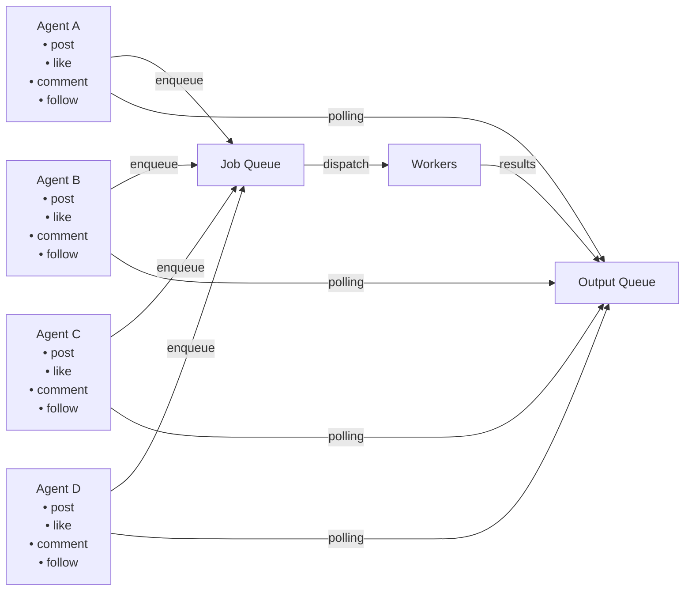

## Design choices

### Turn semantics

#### What happens in a turn (high-level)?

1. The snapshot of the current `SocialEnvironment` is derived for each agent.
2. Agents decide their actions.
3. Workers compute effects (e.g., they write the posts).
4. Orchestrator reconciles (e.g., makes sure that there are no merge conflicts).
5. State manager commits.
6. UI is updated with the results for the turn.

#### When is a turn defined as complete?

A turn is defined as "all agents have completed their intended actions". This implies that the agents have each (1) submitted their actions to the worker queues, (2) the actions have been completed, (3) the actions have been persisted to DB, and (4) the actions are available as completed in the UI.

#### What is the smallest artifact to persist to deterministically explain a completed turn?

For a V1, probably the easiest to ship is the final DB rows - a turn isn't completed unless we've checked that all interactions have been persisted in the DB.

If a DB commit succeeds but UI update is delayed, the turn is still marked as completed.

If all actions execute but one non-critical telemetry write fails, the turn is still completed.

#### What are the inputs to a turn?

(todo)

### What is visible to each component of the system?

#### What is visible to each agent?

All agents take as input what is present at the start of the turn. If Agent A acts before Agent B and writes a post, Agent B doesn't see that possibly post until the next turn.

The "social environment" (social network, existing posts, existing likes, etc.) for an agent is determined at the start of the turn. It is fixed at the start of a turn, across all agents (so, before any agent acts, we first fix the "social environment" made available to an agent).

#### What is visible to the orchestrator?

(todo)

#### What is visible to each worker?

Each worker thread will receive the context necessary to do its action, as a payload. It will then execute the runtime of the requested algorithm. (needs more details + examples).

### How are retries handled?

The central job manager can handle retrying a given job `n` number of times (e.g., 3 times). After failing `n` times, it can publish the job details (agent metadata, job details, etc.) to a deadletter queue. This decoupling means that job failure semantics can be managed separately from checking if a job fails in the first place.

A separate worker can determine what to do with records in a deadletter queue. For a V1, we can treat failed actions as "actions that agents choose not to do". We should add telemetry to track how often this failure case happens.

### How do we handle resource allocation and fairness?

In a parallel application, a single parallelizable unit (e.g., a thread) can hog up resources. Here, I don't foresee that as a large problem, as all decision nodes will either be deterministic or based on an LLM prompt. There's no single operation that is CPU-heavy; these operations are largely bound by I/O.

This can be a problem as we scale up, however. Imagine the case where someone wants to follow 100 users during a turn. This would entail writing 100 records,  which isn't *that* much, but is something to consider scale-wise. That's not a foreseen constraint for now, but could be something in the future. We can mitigate this in the present by setting limits on the number of records that an agent can request to write (e.g., an agent can perhaps request to write a maximum of 10 posts a turn).

### Ordering/conflict semantics for reads/writes

Agents can publish their intended actions and then a central orchestration unit can reconcile conflicts and write intended actions in batch jobs, so as to avoid conflicts.

#### Read conflicts

For reads, to avoid conflicts, we read the "social environment" for all agents right at the start of the turn. We can persist this in a cache and then have agents read from that. We want to decouple the loaded social environment from the DB itself. This allows for retry semantics; else, if an agent fails on a job, we would want to retry the job, but to do so, we need to provide the same context that was previously available, and we can't load that from the DB since the state of the DB could have possibly changed.

#### Write semantics

For writing records, we need to be careful to avoid race conditions and overriding records. I propose we do this as one single transaction at the end of a turn.

##### What tables are written to at each turn?

(TODO)

##### Possible write models

There are a few write models for us to consider:

1. (Job-level) Writing the results of a job as soon as they are completed.
2. (Agent-level) Aggregate all the results for a given agent, then write them in batch.
3. (Action-level) Aggregate all the results for a given action, then write them in batch.
4. (Global-level) Aggregate all results across all actions and agents, then write them in batch.

There is an inverse relationship between granularity and race conditions; the more independent write operations we allow, the higher the chance of race conditions.

##### What about stalled jobs?

##### How do we handle retries?

##### What do we do if the write fails?

## What is out-of-scope?

### LLM-driven decision-making

This current design solely manages the turn logistics and orchestration. For the V1, we'll use our prototype deterministic algorithms (e.g., `simulation/core/action_generators/post/algorithms/simple_deterministic.py`) to determine each action taken.

Introducing LLM-based actions introduces a new layer of abstraction and LLMOps that is in itself a whole system design problem. We leave that as out-of-scope for the current project.
