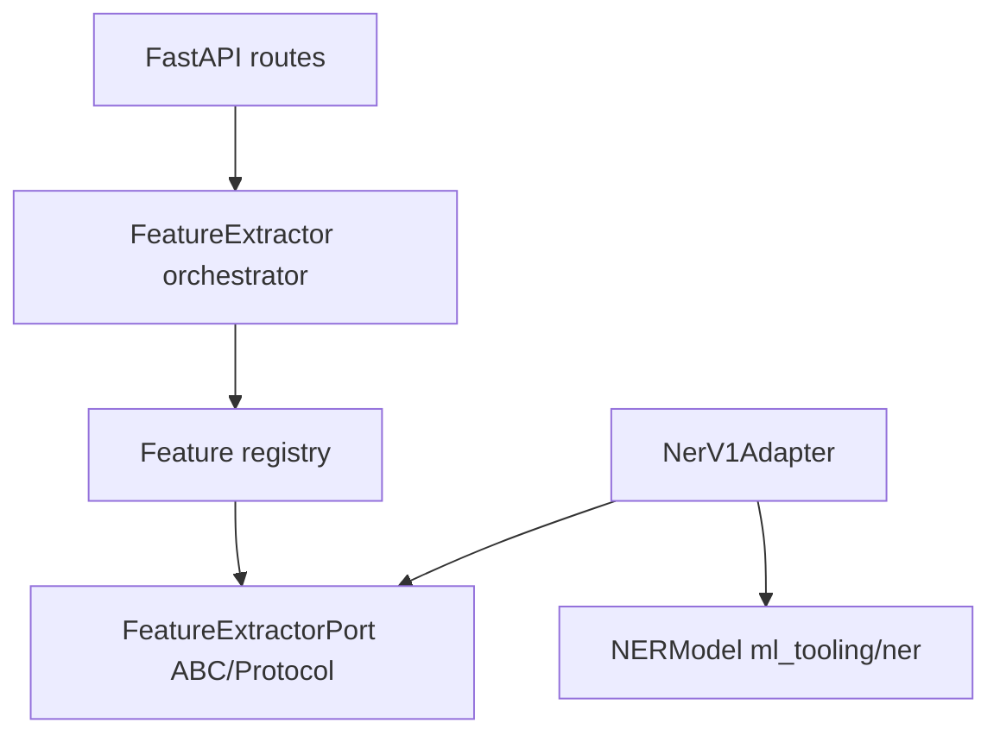

# V2 ML / feature-extraction API — architecture draft

Working draft: **FeatureExtractor** design, **API wiring**, and **file layout** for the standalone feature-extraction service. Grounded in [FEATURE_EXTRACTION_API_PRD.md](../2026-03-13_feature_extraction_api/FEATURE_EXTRACTION_API_PRD.md) and the initial health slice under `ml_tooling/api/`.

Notes (mine):

- Will we load all the models in memory in the server, at all times? That seems pretty heavy...

## What we are optimizing for

- Stable HTTP contract (`POST /v1/extract`, versioned feature keys, batch-first).
- Thin FastAPI routes, dependency injection, clear boundaries.
- Per-feature isolation for timings, errors, and observability (nested spans per feature).
- **Low coupling**: HTTP and orchestration do not import `transformers` / HuggingFace; `ml_tooling/ner` (and similar) do not import FastAPI or route schemas.

## Layering (dependencies point inward)

1. **HTTP** (`ml_tooling/api/routes/…`) — Pydantic request/response, limits, `request_id`; calls one application service.
2. **Orchestration** — `FeatureExtractor` (or `ExtractionService`): given a batch and `feature_keys`, run registered extractors, merge `features` + `timing_ms`, enforce per-feature timeouts and partial failure policy.
3. **Feature port** — a small **protocol or ABC** each feature implements: inputs (text, language, metadata, options) and outputs as DTOs or dicts aligned with the public JSON shape.
4. **Adapters** — e.g. `NerV1Extractor` calls `NERModel` (or a future spaCy backend) and maps to `ner.v1` payload + `extractor_id`.



**Registry:** `dict[str, FeatureExtractorPort]` (or lazy factory) keyed by `ner.v1`, etc. Unknown keys → `404` when `fail_on_unknown_feature` (per PRD).

**FastAPI wiring:** build the registry at startup (or lazy-load heavy models); inject via `Depends()` or `app.state`.

## Port shape (keep it narrow)

- **Input:** per-item `(text, language, metadata, options)` — not the raw HTTP body type, so unit tests do not need FastAPI.
- **Output:** `(payload: dict, extractor_id: str)` or a small dataclass; orchestrator places into `results[].features[feature_key]` and records timing.

Only the **adapter** imports HuggingFace / `pipeline`. The orchestrator never imports `ml_tooling.ner.classifier` directly.

## Connecting to `ml_tooling/ner`

- **`NERModel`** (`extract_entities`, `extract_entities_batch`) returns **`EntitySpan`** (text, label, score, timestamp).
- **PRD gap:** `ner.v1` expects **`start` / `end` as Unicode codepoint offsets**. The adapter layer (or a small extension inside `ml_tooling/ner`) must own offset policy: tokenizer/word indices from the pipeline, deterministic string alignment, or a different backend — without leaking that detail into routes or the generic orchestrator.
- **Tests:** inject a fake `NerCallable` / `NERModel` so tests do not load weights on every run.

## Orchestration: in-process vs HTTP per feature

| Approach | Pros | Cons |
|----------|------|------|
| **In-process** (adapters call `NERModel` directly) | Lowest latency; shared batching later; simple nested tracing. | Heavier deploy image; one bad model can affect the process; scaling couples features. |
| **HTTP-outbound per feature** | Hard isolation, independent scale/version/deploy; matches PRD “swappable interface”. | Extra latency and ops; internal auth/timeouts; more moving parts early. |

**Recommendation:** Start **in-process** behind the port + registry; inject factories so implementations can later swap to HTTP clients without changing routes or orchestrator.

**Reconsider:** If NER/embeddings need different hardware, release cadence, or scaling, move that feature to an HTTP-backed adapter while keeping the same port and `feature_key`.

## Critical notes

- A **registry dict + ABC** is enough until many third-party extractors appear; avoid a heavy plugin system until needed.
- **Determinism + Unicode offsets** for NER should be specified and covered with golden tests once offsets exist.

## Recommended file structure (Option A)

Keeps HTTP separate from orchestration and adapters; matches repo pattern of ports next to implementations (e.g. `feeds/interfaces.py`).

```text
ml_tooling/
  api/                              # HTTP surface only
    __init__.py
    main.py                         # FastAPI app, lifespan, router includes
    dependencies.py                 # Depends() factories: registry, orchestrator
    routes/
      __init__.py
      health.py                     # GET /health
      extract.py                    # POST /v1/extract, POST /v1/extract/{feature_key}
      features.py                   # GET /v1/features (later)
      metrics.py                    # GET /metrics (later, if not middleware)
    schemas/
      __init__.py
      extract.py                    # Pydantic: ExtractRequest, ExtractResponse, ...

  feature_extraction/               # no FastAPI imports
    __init__.py
    interfaces.py                   # ABC/Protocol: FeatureExtractorPort, shared types
    registry.py                     # build_registry(), FeatureRegistry
    orchestrator.py                 # FeatureExtractor (batch + feature_keys + timings)
    errors.py                       # UnknownFeatureKey, extraction error mapping
    adapters/
      __init__.py
      ner_v1.py                     # NerV1Adapter → NERModel → ner.v1 JSON
      # sentiment_v1.py, ... later

  ner/                              # existing; optional offset helpers
    classifier.py
    models.py
    ...
```

**Import rule:** `ml_tooling.ner` must not import `ml_tooling.api` or route modules.

## Alternative (Option B — flatter under `api/`)

Smaller tree, higher risk of coupling if extractors import FastAPI types.

```text
ml_tooling/api/
  main.py
  services/
    extractor.py                    # orchestrator
    registry.py
  extractors/
    base.py                         # protocol
    ner_v1.py
  schemas/
    extract.py
  routes/
    extract.py
```

## Tests (mirror layout)

```text
tests/
  ml_tooling/
    api/
      test_health.py
      test_extract.py               # TestClient
    feature_extraction/
      test_orchestrator.py          # fake ports, no HTTP
      test_registry.py
      adapters/
        test_ner_v1.py
```

## Deployment note

Health-only Docker image can stay slim; when NER (or torch) is required, extend `Dockerfile.feature-extraction` or use install extras — the **package layout** above stays the same.

## Implementation sequence (PRD-aligned)

1. Pydantic models for `POST /v1/extract` in `ml_tooling/api/schemas/`.
2. `FeatureExtractorPort`, `FeatureRegistry`, `FeatureExtractor` orchestrator in `ml_tooling/feature_extraction/` (no ML framework imports).
3. `NerV1Adapter` implementing the port, calling `NERModel` with test doubles in unit tests.
4. Route: validate → orchestrator → response mapping.
5. Later: JSON Schema registry and `GET /v1/features` driven from the same registry metadata.
